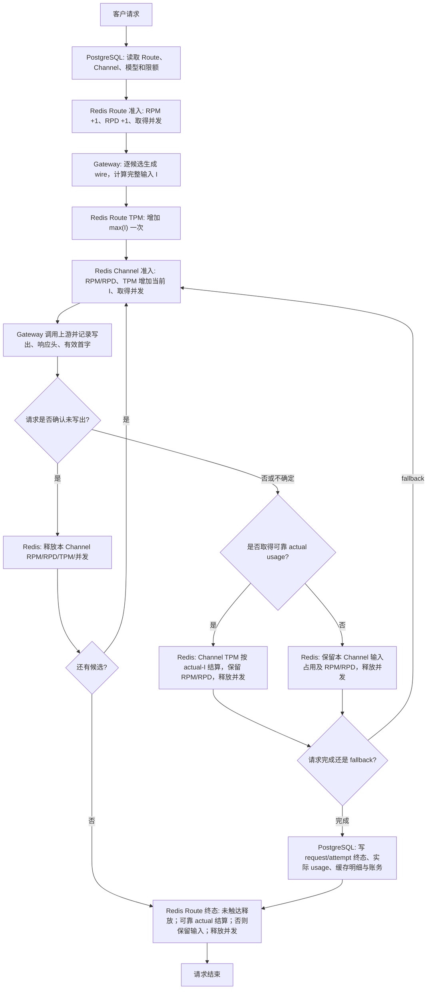

# 请求准入计量与 Redis Lua 可维护性改造计划

## 状态

- 状态：方案已确认，等待按本文实施与合并验收
- 创建日期：2026-07-28
- 最后更新：2026-07-29
- 涉及仓库：`unio-gateway`、`unio-admin`、`unio-blueprint`
- 改造完成条件：代码、隔离测试与 Blueprint 同步完成后删除本临时计划

本计划把两项必须同时落地的工作合并为一次改造：

1. 将 Route/Channel TPM 从“输入加输出预算”改为“完整输入先占用、可靠实际总量再结算”的软 TPM。
2. 将 `breakerstore` 中的 Go 长字符串 Lua 外置为独立 `.lua` 文件，并保持当前 Redis 原子执行边界不变。

RPD、RPM、fallback 交互证据和并发规则沿用上一阶段已经确认的口径。Lua 迁移与 TPM 协议变更同时进行，避免先机械迁移旧脚本，随后再重写同一批脚本。

## 最终决策

### 指标口径

- Route RPM：入口准入通过的请求数，一次客户请求只计一次，fallback 不重复计。
- Channel RPM：可能已经消耗上游请求额度的 attempt 数；确认请求未写出时释放，已写出、收到响应或结果不确定时保留。
- Route RPD：入口准入通过的请求数，按冻结的 UTC 日记录。
- Channel RPD：有上游交互证据的 attempt 数；确认请求未写出时释放。
- Route TPM：一次逻辑请求先按所有可用候选中最大的完整输入估算取得一次，拿到可靠实际 usage 后结算差额。
- Channel TPM：每个真实候选 attempt 先按自己的完整输入估算取得，拿到该 attempt 的可靠实际 usage 后结算差额。
- Route 并发：覆盖完整 handler 生命周期。
- Channel 并发：只覆盖一个候选 attempt 生命周期。
- Route 与 Channel 是两个独立资源层，RPM、RPD、TPM、并发都不要求 Route 严格等于 Channel 求和。
- Route RPM/RPD 在入口准入阶段就已记入；TPM 依赖候选计划（需先 tokenize），是入口之后的第二道资源闸门。因此一个通过 RPM/RPD 闸门、其后被 Route TPM `limited` 拒绝（429）的请求，**不回滚** RPM/RPD 计数——该请求确实占用了准入评估资源。RPM/RPD 保持在前也是对昂贵 tokenization 的一层保护。

### TPM 新协议

- 完整输入估算记为 `I`，包括准备发送给上游的全部输入 Token，不因后续 cache read/cache write 结果而减少。
- 客户显式提供输出上限时，按协议校验并原样转发；该值不加入 Redis TPM 初始占用。
- 客户省略输出上限时，不合成默认值，不使用模型 `max_output_tokens` 参与 Redis TPM，也不向 OpenAI Chat Completions/Responses 上游注入人为输出上限。
- Route 初始占用为所有候选 `I` 的最大值；Channel 初始占用为当前候选自己的 `I`。
- 成功取得可靠 usage 后，以 `actual_total - input_estimate` 调整原分钟桶，使该请求或 attempt 在桶内最终等于实际总 Token。
- `actual_total` 包含未缓存输入、cache read、各类 cache write 和实际总输出，每个 Token 只计算一次；reasoning 是输出分解项，不重复相加。
- 确认没有向上游写出请求时释放输入占用；已写出、已经收到响应或结果不确定但没有可靠 usage 时保留输入占用。
- 这是软 TPM：运行中请求只体现输入，输出在完成后才进入桶，因此高并发下最终桶值可以超过限额；RPM、并发和余额预授权共同限制这段风险。
- PostgreSQL 继续记录实际 usage、缓存明细和账务结果。Redis TPM 使用同一份可靠 usage 做限流结算，但不作为客户账单事实来源。

### Lua 第一阶段

- 将 Lua 从 Go 反引号字符串迁移到独立 `.lua` 文件。
- 使用 Go 标准库 `go:embed` 将脚本编译进二进制，不增加运行时文件依赖。
- 继续使用 `go-redis` 的 `redis.NewScript`、SHA 缓存和 `EVALSHA` 失败后的既有回退行为。
- 继续使用 Redis Lua 保证原子检查与原子写入，不引入本地 Lua VM、脚本构建 DSL、Redis Functions 或新的运行时框架。
- Go 继续负责 typed key/argument builder、结果解码、错误映射和领域校验。
- 先迁移 request admission 与 attempt permit 脚本，再机械迁移 breaker、runtime control、integrity 和 origin fence 脚本。

### 开发环境切换

- 当前是开发环境，直接替换 Request/Attempt TPM 字段、方法参数和 Redis key 语义。
- 不做新旧协议版本化 key、不做兼容读取、不支持新旧 writer 混跑。
- 不迁移旧 TPM/RPD Redis 数据；重新创建开发环境后从新请求开始记录。
- 本次不实现 Redis 整体丢失后的 PostgreSQL 当日 RPD 重建。开发阶段保持既有 fail-closed 行为；生产发布前另开恢复设计。

## 代码事实

### PostgreSQL

PostgreSQL 是持久化事实来源，保存以下内容：

- Route、Channel、模型及其限额配置；
- request/attempt 终态；
- 实际 usage 的未缓存输入、缓存读取、不同 TTL 的缓存写入、总输出和 reasoning 分解；
- 账务授权、结算与恢复记录。

`internal/core/usage/Facts` 已将输入拆成互斥明细，并明确 `ReasoningOutputTokens` 是 `OutputTokensTotal` 的分解项，不可重复相加。

### Redis

Redis 是实时准入与运行态来源，保存以下内容：

- `(route, user, minute)` 的 Route RPM/TPM 桶；
- `(route, user, UTC day)` 的 Route RPD 桶；
- `(route, user)` 的 Route 并发租约；
- `(channel, minute)` 的 Channel RPM/TPM 桶；
- `(channel, UTC day)` 的 Channel 全局 RPD 桶；
- `(route, channel, UTC day)` 的 Channel attempt 归因桶；
- `(channel)` 的 Channel 并发、breaker 与运行态控制；
- request token 和 attempt permit 的冻结身份、桶 key、状态与终态幂等信息。

Redis TPM 表达“本分钟已占用的输入估算和已完成请求的实际总量”，不保存客户账单，也不替代 PostgreSQL usage。

### 当前 TPM 实现待替换点

当前工作树已经实现过一版完整预算协议，代码事实包括：

- `CandidateTokenBudget` 保存 `InputEstimate`、`OutputBudget`、`ReservedTotal`；
- Route 与 Channel 以 `input + output budget` 增加 Redis TPM 桶；
- request/attempt Finish 根据权威或本地 actual 调整桶，并释放未使用部分；
- `billableTPMTokens` 当前排除 cache read，不符合本计划的实际总 Token 公式；
- 缺省输出上限来自 `AUTHORIZATION_MAX_OUTPUT_TOKENS_FALLBACK`，默认 `4096`。

这些都是本次要直接替换的旧协议，不作为最终验收口径。

### 当前 Lua 维护成本

`internal/platform/breakerstore` 当前 Lua 分布在：

- `lua.go`
- `requestadmission_lua.go`
- `control_payload_lua.go`
- `runtimecontrol_lua.go`
- `originfence_lua.go`
- `integrity_lua.go`
- `instance_lua.go`
- `permission_recheck.go` 中的内联脚本

其中七个 `*_lua.go`/`lua.go` 文件合计约 `3100` 行，`lua.go` 单文件约 `1320` 行。公共 helper 通过 Go 字符串拼接到操作脚本，脚本边界、语法高亮、静态检查和 Redis 单脚本测试都比较困难。

## TPM 目标公式

### 1. 完整输入估算

对每个可用候选单独生成最终上游 wire，并估算：

```text
I_candidate = 该候选最终发送 wire 的全部输入 Token
```

必须逐候选计算，因为候选可能使用不同的：

- `adapter_key`；
- `upstream_model`；
- Chat Completions、Responses、Responses-to-Chat 或 Anthropic Messages 映射；
- 字段清理、system/messages/tools 编码和 tokenizer。

缓存读写是上游处理后的 usage 结果，请求进入时尚不能确定。Redis TPM 的 `I_candidate` 因此包含全部输入，不减 cache read，也不在输入之外额外加 cache read/cache write。

### 2. 输出上限与风险预算

输出上限不再承担 Redis TPM 预占职责：

- 客户显式提供时，协议 DTO 负责合法性校验，adapter 原样映射到对应上游字段；本次不借 TPM 改造偷偷收紧客户值。
- 客户省略时，OpenAI Chat Completions/Responses/Compact 不合成 `1024`、`4096` 或模型 `max_output_tokens`，也不向上游注入这些值。
- Anthropic Messages 等本身要求输出上限的协议继续遵守其公开请求契约；协议必填值不能被 Redis TPM 当作输出预占。
- 余额预授权和平台成本敞口可以保留独立的保守输出估算，但该估算只服务金额风控，不写 Redis TPM，也不能修改真实上游请求。
- 模型 `max_output_tokens` 继续作为能力元数据与显式客户值校验依据，不再代表“客户省略时一定会生成这么多”。

这一拆分避免两类错误：用 `1024`/`4096` 注入上游会截断真实输出，用 `128K` 模型上限预占又会让 TPM 在请求进入时虚高。

### 3. 候选、Route 与 Channel 初始占用

```text
Route initial TPM = max(I_candidate for all available candidates)
Channel initial TPM = I_current_candidate
```

Route 取候选池最大输入的原因是 fallback 可能命中任意候选，而不同 adapter 的最终 wire 输入量可能不同。Route 只取得一次，不因 fallback 重复增加；Channel 仍按每个真实 attempt 独立记录。

### 4. 实际 usage 与结算

PostgreSQL 与 Redis TPM 共享同一套实际总 Token 分解，但职责不同：PostgreSQL 保存审计和账务事实，Redis 只调整原分钟桶。

```text
actual_input =
    uncached_input
  + cache_read_input
  + cache_write_5m_input
  + cache_write_30m_input
  + cache_write_1h_input

actual_total = actual_input + output_tokens_total
```

约束：

- 每个输入 Token 只能归入一个输入明细，不能再额外加一个包含这些明细的 `input_tokens_total`。
- `output_tokens_total` 已包含 reasoning；`reasoning_output_tokens` 只做分解，不再次相加。
- cache read/write 影响计价类别，但不会改变 Redis TPM 的完整输入估算。
- billing 继续按各分类价格计算，本次不改变客户扣费公式。
- Route 有可靠的最终逻辑请求 usage 时，按 `actual_total - route_input_estimate` 只结算一次。
- Channel 有可靠的 attempt usage 时，按 `actual_total - channel_input_estimate` 独立结算。
- 差额可以为正或负；Lua 必须保证减量不把桶写成负数。
- 没有可靠 usage 时不得用猜测的输出补账；确认未触达则释放输入，已触达或不确定则保留输入。
- 若页面需要“实际总 Token”，由 PostgreSQL usage 明细按上式计算，不把 Redis 桶当单请求账单。

## 一个请求进入时 TPM 如何变化

假设当前分钟 Route TPM 已用 `20,000`，Channel A 已用 `10,000`，客户是否提供 `max_tokens` 都不改变初始 TPM：

```text
候选 A: I=600
候选 B: I=9,500
Route initial TPM = max(600, 9,500) = 9,500
```

请求路径：

1. 候选计划完成后，Route 分钟桶从 `20,000` 增加到 `29,500`。
2. 尝试 Channel A 时，A 的分钟桶从 `10,000` 增加到 `10,600`。
3. A 成功并返回可靠 actual `input=600, output=400` 后，A 追加 `400`，变为 `11,000`。
4. Route 以同一实际总量 `1,000` 结算，相对初始 `9,500` 释放 `8,500`，Route 桶从 `29,500` 回落到 `21,000`。
5. PostgreSQL 记录实际 `1,000` 及缓存明细；Redis 中本请求最终也占 `1,000`，但 Redis 仍不是账务事实来源。

这解释了新的变化：请求进入时只增加完整输入估算，不会因省略输出上限瞬间增加 `128K`；可靠 usage 到达后才增加实际输出，并修正输入估算误差。

同一分钟内多个请求并存时：

```text
TPM bucket = 仍在运行请求的输入估算 + 已完成请求的实际总量 + 已触达但无可靠 usage 请求的输入估算
```

对单个请求，结算只写入 `actual_total - input_estimate`，不会把输入估算和 actual 再相加。对整个分钟桶，在途输入和已完成 actual 会同时存在。因为在途输出尚未计入，这个桶是软限制，不承诺并发请求绝不事后超额。

## fallback 与终态规则

### 上游交互证据

不能按“网络错误”字符串决定释放。attempt 使用结构化事实：

```text
request_write_state = not_started | completed | uncertain
response_headers_received = true | false
first_token_eligible = true | false
```

其中：

- `completed` 表示 Go HTTP 客户端确认请求已经写完；
- `uncertain` 表示无法证明请求未写出；
- `response_headers_received` 表示已经收到任意 HTTP 响应，包括 4xx/429/5xx；
- `first_token_eligible` 只表示协议认可的有效首字，不包括 ping、usage 或 finish 控制帧。

继续使用 Go 标准库 `net/http/httptrace` 获取请求写出事实，不读取或保存请求正文。

### 资源收口矩阵

| attempt 事实 | Channel RPM | Channel RPD | Channel TPM | Channel 并发 | fallback |
| --- | --- | --- | --- | --- | --- |
| 本地编码、建请求失败 | 释放 | 释放 | 释放 `I` | 释放 | 可以 |
| DNS/连接/TLS 失败，确认未写出 | 释放 | 释放 | 释放 `I` | 释放 | 可以 |
| 请求已写完，等待响应超时或结果不确定 | 保留 | 保留 | 无可靠 usage 时保留 `I` | 释放 | 可以 |
| 收到任意 HTTP 响应头 | 保留 | 保留 | 有可靠 usage 则结算 actual，否则保留 `I` | 释放 | 按协议决定 |
| 收到有效首字并正常完成 | 保留 | 保留 | 结算为可靠 actual；缺失时保留 `I` | attempt 结束释放 | 不再 fallback |

Route TPM 终态规则：

- 最终逻辑请求取得可靠 actual：按 `actual_total - route_input_estimate` 结算一次。
- 所有候选都确认未写出：释放一次 Route 输入占用。
- 任一候选已经写出、收到响应或结果不确定，但最终没有可靠 actual：保留一次 Route 输入占用。
- fallback 不再次取得 Route 输入，也不把多个 Channel 的输入或 actual 累加到 Route。

典型 fallback：

```text
A 确认未写出，B 成功：
Route 结算为 B 的可靠 actual；A 释放输入；B 结算为自己的可靠 actual。

A 已写出但失败，B 成功：
Route 结算为最终逻辑请求的可靠 actual；A 无可靠 usage 时保留输入；B 结算为自己的可靠 actual。

A、B 都确认未写出：
Route 释放输入；A、B 都释放输入；Route RPM/RPD 入口记录仍保留。
```

## RPD P0 与其余指标

### Channel RPD 日桶 TTL

当前问题是 Channel RPD key 虽按 UTC 日编号命名，过去却复用了普通 `bucket_ttl_ms`，可能约数分钟后提前过期。最终规则：

- Request RPD、Channel 全局 RPD、Route-Channel attempt 归因桶都使用独立日 TTL。
- TTL 至少到冻结 UTC 日的次日零点，再加终态与恢复缓冲。
- 跨 UTC 零点的长请求继续写入请求进入时冻结的日桶。
- 原始日桶意外丢失时不得静默从零放行，走既有 runtime fault/fail-closed 路径。
- `0=不限` 仍记录实际入口/attempt 事实。

该 P0 修复已在当前工作树落地，本次合并验收必须继续保留相关测试，Lua 外置化不得改变 TTL 参数或 fail-closed 行为。

### Route 顶部与 Channel 行

- Route 顶部继续聚合该 Route 下所有 `(route, user)` 桶。
- Channel 行展示当前 Route 的 attempt 归因；Channel 全局 RPD/TPM/并发仍用于真实容量和调度。
- shared Channel 可能包含其他 Route 的消耗，不能用当前页面 Channel 行求和替代 Route 顶部。
- Admin 保留 RPM、RPD、TPM、并发短名称，通过 tooltip 解释各自口径。

## 完整基础设施链路



图中的职责边界：

- PostgreSQL 保存配置和最终可审计事实。
- Redis 在请求执行过程中做限额判断、占用、保留或释放。
- Gateway 连接两者，负责候选计划、协议转换、交互证据和终态编排。
- Lua 只保证一次 Redis 操作内“先完整校验、再完整写入”，不承担 tokenization、HTTP 判断或账务计算。

## Redis TPM 协议设计

### Request token

移除旧 limiter 字段：

```text
reserve_input_estimate
reserve_output_budget
reserved_tpm_amount
quota_tpm_actual
quota_tpm_usage_source
```

替换为：

```text
tpm_input_estimate
tpm_actual_total
tpm_bucket
tpm_state = none | held | settled | retained | released | limited
tpm_terminal_reason = actual | not_reached | reached_without_usage | uncertain | empty
```

### Attempt permit

冻结字段：

```text
tpm_input_estimate
tpm_actual_total
tpm_bucket
tpm_state = held | settled | retained | released
request_write_state
response_headers_received
first_token_eligible
rpd_day_bucket
```

Redis 只冻结结算所需的 `input_estimate` 与最终 `actual_total`，不复制 cache 明细、reasoning 分解或 billing source；完整 usage 仍沿 PostgreSQL settlement 链路持久化。

### 原子操作

`AcquireRequestAdmission`：

- 原子检查并增加 Route RPM/RPD；
- 取得 Route 并发；
- 冻结 Route、User、UTC 日、有效限额和完整性 epoch；
- 此时尚未生成候选计划，不操作 TPM。

`ReserveRequestTPMInput`：

- 接收候选池最大的 `input_estimate`；
- 候选计划定稿时把该值冻结到 session；任何 transient store 错误的重试都原样重发，避免误判 `conflict`；
- 原子检查 `(route, user, minute)` 剩余 TPM 并增加 `input_estimate`；
- 同 request 同参数重试返回原结果，不重复增加；参数不同返回 `conflict`，由 Go 侧按 runtime fault 处理并 fail closed，不得换参数重试；
- 有限额度不足时返回稳定 `limited`，不得部分写入；`limited` 不回滚已记的 Route RPM/RPD（见「指标口径」）。

`AcquireAttempt`：

- 原子检查 Channel RPM/RPD/TPM/并发；
- Channel TPM 增加当前候选 `input_estimate`；
- 冻结原始分钟桶、日桶和 request token 身份；
- denial 不写任何资源。

`FinishAttempt`/`AbortAttempt`：

- 确认未写出时，原子释放 Channel RPM/RPD/输入占用与并发（release 走带下限 decrement，桶缺失幂等 no-op，见「分钟桶 TTL」）；
- 有可靠 actual 时，按 `actual_total - input_estimate` 调整 Channel TPM，保留 RPM/RPD，只释放并发；
- 已写出、收到响应或不确定且无可靠 actual 时，保留 RPM/RPD/输入占用，只释放并发；
- 继续维护 breaker outcome、TTFT 和 Route-Channel RPD 归因；
- first-terminal-wins，重复 Finish/Abort 不得重复释放或保留；
- actual 只能来自 Go 已验证的可靠 `usage.Facts`；重复终态不得再次结算。

`FinishRequestAdmission`：

- 有可靠最终逻辑请求 actual 时，按 `actual_total - input_estimate` 结算一次 Route TPM；
- 无可靠 actual 时，根据聚合后的 attempt 交互证据保留或释放一次 Route 输入占用（释放走带下限 decrement，桶缺失幂等 no-op）；
- 保留 Route 入口 RPM/RPD（含仅通过 RPM/RPD 但被 TPM `limited` 拒绝的请求，不回滚）；
- 释放 Route 并发；
- 不接收 cache/reasoning 明细或账务 source，只接收 Go 计算并验证后的可选 `actual_total`；
- first-terminal-wins。

### 分钟桶 TTL

- Route TPM 使用 `ReserveRequestTPMInput` 时冻结的分钟桶。
- Channel TPM 使用每次 `AcquireAttempt` 时冻结的分钟桶。
- 跨分钟请求仍归入最初取得占用的桶，不迁移到结束分钟。
- 释放或结算采用「读 token/permit 上的 `tpm_state` 判幂等 → 桶存在则按差额调整且减量带下限 0 → 桶已过期缺失则不重建旧分钟桶，幂等 no-op 成功」。first-terminal-wins 由 `tpm_state` 保证，不依赖分钟桶存活。
- 区分两类「桶/键缺失」：需要读取冻结权威状态（token/permit hash 本身、epoch、有效限额）时缺失，是数据异常信号 → 返回稳定 runtime fault 并 fail closed；仅在终态调整计数桶时桶已自然过期 → 幂等 no-op，不 fail closed，也不重建旧分钟桶。
- release/settlement decrement 必须带下限，桶值绝不写出负数。
- settlement 增量在完成后直接加入原桶，不再做第二次准入判断；结果已经产生，不能事后拒绝，因此允许桶超过限额并由后续请求看到。
- 保留（retain）不触碰桶，等其随 `bucket_ttl_ms` 自然过期即可，天然不依赖桶存活。

## Lua 目标结构

建议目录：

```text
internal/platform/breakerstore/
  scripts.go
  script_manifest.go
  lua/
    helpers/
      redis_instance.lua
      authoritative_control.lua
      attempt_permit_guard.lua
      common.lua
    request/
      acquire.lua
      reserve_tpm.lua
      renew.lua
      finish.lua
    attempt/
      acquire.lua
      finish.lua
      abort.lua
      renew.lua
      snapshot.lua
      snapshot_many.lua
    runtime/
      ...
    integrity/
      ...
    origin/
      ...
    permission/
      ...
```

实际文件名可按当前操作名机械对应，但必须满足“一项 Redis 操作一个主脚本、公共代码只放 helper”。

### embed 与脚本组装

`scripts.go` 使用标准库：

```go
//go:embed lua
var luaFiles embed.FS
```

`script_manifest.go` 维护显式 manifest：

```text
request.reserve_tpm = [helpers/redis_instance.lua, request/reserve_tpm.lua]
attempt.acquire     = [helpers/redis_instance.lua, helpers/authoritative_control.lua, attempt/acquire.lua]
attempt.finish      = [helpers/authoritative_control.lua, helpers/attempt_permit_guard.lua, attempt/finish.lua]
```

要求：

- helper 顺序由 manifest 显式声明，禁止扫描目录后按文件系统顺序拼接。
- 每段前加入固定 source marker，Redis 报错时能定位来源文件。
- 进程初始化时读取并组装全部脚本；缺文件、空主脚本、重复脚本名直接 panic，避免带残缺脚本启动。
- `Store` 仍持有 `*redis.Script`，只把构造输入从 Go 常量改为 manifest 产出的字符串。
- 不在运行时访问磁盘；`.lua` 文件已经被编译进二进制。

### Go 与 Lua 边界

Go 负责：

- key 构造；
- 参数类型、范围、枚举和 fingerprint 校验；
- `KEYS`/`ARGV` 顺序；
- Redis reply 解码与稳定 failure 映射；
- tokenization、输出上限解析、HTTP 交互证据和 PostgreSQL settlement。

Lua 负责：

- Redis key 类型和冻结身份复核；
- 限额检查；
- 同一操作的完整原子写入；
- 幂等与 first-terminal-wins；
- malformed key、stale epoch 和 runtime fault 下零部分写入。

不得通过 Lua 拼接业务 JSON、解析上游协议或计算 actual usage。

### 注释与文档要求

- Go 注释要解释非直觉决策：为什么初始 TPM 只含输入、为什么客户省略输出上限时不能注入模型上限、为什么完成后的正差额允许桶超过限额。
- Lua 注释只说明 `KEYS`/`ARGV` 契约、原子性边界、幂等和 fail-closed 原因；不要逐行翻译代码。
- 字段和方法名必须区分 `input_estimate`、`actual_total` 与仅用于金额风控的 output estimate，禁止继续用含糊的 `budget` 同时代表三者。
- 生产行为改变时同步更新 Gateway 注释、Admin tooltip、Blueprint 三份正式文档和本计划清单；正式文档只能描述已经由代码和测试验证的事实。
- 流程与公式测试名称直接表达业务结果，失败信息必须带 request/attempt 层级和 expected/actual，方便后续维护 Lua 协议。

### 开源工具

第一阶段只引入开发期工具，不增加 Gateway 运行时依赖：

- `luacheck`：静态检查 Lua；配置 Redis 脚本全局变量 `redis`、`KEYS`、`ARGV`。
- `stylua --check`：统一格式；若现有脚本首次格式化产生过大噪声，可先只对新 `.lua` 文件启用，再单独做机械格式化提交。
- Redis `SCRIPT LOAD`：在隔离 Redis 上编译每个组装后的最终脚本，捕获 helper 拼接后的语法错误。

`luacheck`/`stylua` 必须固定版本并进入开发或 CI 检查；它们不参与生产进程启动。

## Gateway 改造范围

### 候选计划与输出参数

预计修改：

- `internal/service/gateway/lifecycle/candidates.go`
- `internal/service/gateway/lifecycle/authorization.go`
- `internal/service/gateway/lifecycle/cost_exposure.go`
- OpenAI Chat Completions、Responses、Responses Compact、Anthropic Messages 的 request mapper
- `internal/platform/config/config.go`
- `internal/bootstrap/gateway.go`、`internal/bootstrap/gateway_server.go`

工作项：

- 将 `CandidateTokenBudget` 收敛为 Redis TPM 只需要的 `InputEstimate`；名称可改为 `CandidateInputEstimate`，避免继续暗示包含输出预算。
- `ConservativeTPMTokens` 改为候选完整输入估算的最大值，并重命名为能表达输入语义的名称。
- 删除 limiter 中 `input + output`、`max(input, output)` 和模型上限兜底。
- 客户显式提供的输出参数继续按各协议原样映射；省略时删除 OpenAI Chat/Responses/Compact mapper 的候选预算注入路径。
- Anthropic 原生请求继续遵守 `max_tokens` 必填契约；跨协议桥接若必须合成必填值，应单独记录协议理由，不能把该值传回 Redis TPM。
- authorization 预授权和成本敞口继续使用独立的保守输出估算。本次保持既有账务安全边界，但变量、注释和测试必须明确其不参与 TPM、不注入上游。
- 搜索 `DefaultAuthorizationMaxCompletionTokens`、`MaxOutputTokensFallback`、`OutputBudget` 和各 mapper 注入点，确认不存在从风控估算回流到 TPM 或上游 request 的路径。

### Request admission session

预计修改：

- `internal/service/gateway/requestadmission/session.go`
- `internal/app/gatewayapi/middleware/request_admission.go`

工作项：

- 将 `ReserveBudgetIfPresent` 改为只取得 Route 最大输入估算。
- session 聚合“是否存在已写出/响应/不确定 attempt”事实。
- Finalize 提交可靠 `actual_total`，或在没有可靠 usage 时提交 `retain input`/`release input` 决策。
- 收敛 `PublishAuthoritativeUsage`、`PublishLocalUsage`、`PublishInputFallback`：只有满足 `usage.Facts` 完整性约束的可靠 usage 能结算 Redis TPM；其余 publication 继续服务 PostgreSQL settlement/recovery，不得凭局部输出猜测实际总量。
- renewer 和错误映射保持现有所有权边界。

### Attempt 生命周期

预计修改：

- `internal/service/gateway/lifecycle/attempt_permit.go`
- `internal/service/gateway/lifecycle/attempt_runner.go`
- `internal/service/gateway/lifecycle/attempt_runner_stream.go`
- 各协议 adapter/service 的交互证据接线

工作项：

- Acquire 只传入当前候选 `I`。
- Finish/Abort 传入结构化请求写出、响应头和首字事实。
- Finish 在可靠 actual 存在时传入由互斥 usage 明细计算出的 `actual_total`；不存在时仅按交互证据保留或释放输入。
- 本地流式输出计量继续服务 PostgreSQL partial usage；除非能够形成完整可靠 actual，否则不修改 Redis TPM。
- fallback 前必须先幂等收口当前 permit，再取得下一候选 permit。

### BreakerStore 与 Lua

预计修改：

- `internal/platform/breakerstore/requestadmission.go`
- `internal/platform/breakerstore/types.go`
- `internal/platform/breakerstore/validation.go`
- `internal/platform/breakerstore/store.go`
- 当前所有 `*_lua.go`、`lua.go` 和 `permission_recheck.go` 内联脚本
- 新增 `internal/platform/breakerstore/lua/**`

工作项：

- 先按“输入取得、actual 差额结算”的新 TPM 字段重写 request/attempt Redis 协议。
- 同一阶段把这批核心脚本移入 `.lua`，避免保留新的 Go 长字符串。
- 保持所有 key 类型检查、epoch/revision fence、幂等和 fail-closed 规则。
- 核心脚本稳定后，机械迁移剩余 runtime/breaker/integrity/origin/permission 脚本。
- 删除已迁移的 Go Lua 常量，仓库不得同时保留两份脚本源码。

## Admin 展示

- Route TPM tooltip：该线路所有用户当前分钟的 TPM 占用；运行中请求先记候选池最大完整输入，完成且有可靠 usage 后结算为实际总 Token。
- Channel TPM tooltip：该 Channel 跨 Route 的上游 attempt TPM 占用；每个 attempt 先记自己的完整输入，有可靠 usage 后结算为实际总 Token。
- RPD tooltip：Route 统计入口请求，Channel 统计有上游交互证据的 attempt；两侧不做严格求和。
- RPM tooltip：Route 是入口请求，Channel 是可能已消耗上游额度的 attempt。
- 并发 tooltip：Route 覆盖请求生命周期，Channel 覆盖单次 attempt。
- 页面需要明确这是“运行中输入 + 已完成 actual + 已触达无 usage 的输入保留”，不能把 Redis TPM 描述成纯实际账单或硬输出预占。
- Channel 全局容量与当前 Route 归因保持分开，排序仍使用 Channel 全局 remaining。

## 分阶段实施

### 阶段 0：已完成基础

- [x] Route RPD 记录入口请求，Channel RPD 按上游交互证据保留或释放。
- [x] Channel RPD 使用完整 UTC 日 TTL，不再复用分钟桶 TTL。
- [x] Route-Channel attempt RPD 归因与 Channel 全局容量分开。
- [x] 非流式和流式已能记录请求写出、响应头和有效首字事实。
- [x] Admin 已区分 Route 入口、Channel attempt 和全局容量，不增加严格求和断言。

以上完成项必须重新回归；Lua 外置化和 TPM 协议替换不得造成行为倒退。

### 阶段 1：TPM 新协议与核心 Lua 外置

- [ ] 先补充新 TPM 公式、保留/释放和字段冲突测试，使旧实现先红。
- [ ] 拆开客户输出参数、Redis TPM 与金额风险预算；省略输出参数时不得由模型上限或默认值污染 TPM/上游 request。
- [ ] 将 Route 初始公式改为候选 `input_estimate` 最大值，Channel 初始公式改为当前候选 `input_estimate`。
- [ ] 替换 request token/attempt permit 字段与 Go typed input/result。
- [ ] 重写 Request Reserve、Attempt Acquire/Finish/Abort、Request Finish 的 Redis 语义。
- [ ] 同步将 request/attempt helper 与主脚本迁入 `.lua` 并通过 manifest 组装。
- [ ] 以可靠 `actual_total - input_estimate` 重写 Redis TPM 结算；保留未触达释放和已触达无 usage 保留。
- [ ] 保留 PostgreSQL usage、缓存明细、partial usage 与 billing settlement。
- [ ] 更新 Admin TPM tooltip。
- [ ] 更新关键 Go/Lua 注释，并同步 Blueprint 的软 TPM 公式、fallback 终态和风险边界。

阶段 1 完成后已经满足本次产品需求，可以独立验收。

### 阶段 2：剩余 Lua 机械迁移

- [ ] 迁移 breaker acquire/finish/abort/renew/snapshot/cooldown/permission 脚本。
- [ ] 迁移 runtime control、integrity、Redis instance 和 origin fence 脚本。
- [ ] 清理 `permission_recheck.go` 中剩余内联 Lua。
- [ ] 删除旧 `lua.go` 与所有 `*_lua.go` 中的 Lua 字符串，仅保留 Go loader/manifest。
- [ ] 全量执行静态检查、`SCRIPT LOAD` 和 real-Redis contract tests。

阶段 2 只改善维护方式，不修改 Redis key、ARGV/KEYS 顺序、reply code 或业务行为；如果机械迁移发现现有 bug，单独补测试和修复，不混在无行为变更的迁移中。

### 阶段 3：文档收口

- [ ] 按最终代码、Schema 和测试事实更新 Blueprint：
  - `docs/products/gateway/features/admission-control.md`
  - `docs/products/gateway/decisions/adr-0007-atomic-admission-control.md`
  - `docs/products/gateway/features/request-lifecycle.md`
- [ ] 运行 Blueprint 校验。
- [ ] 删除本临时计划。

## 测试计划

### TPM 公式

- [ ] 无论客户显式输出上限、缺省输出上限或模型上限为 `128K`，Redis 初始 TPM 都只等于完整输入估算。
- [ ] 客户显式输出参数经协议校验后原样映射，不因 TPM 改造被替换或收紧。
- [ ] OpenAI Chat/Responses/Compact 客户省略输出参数时不合成、不注入默认值或模型上限。
- [ ] authorization/成本敞口的保守输出估算不进入 Redis TPM，也不修改上游 request。
- [ ] 候选池 Route 初始占用取各候选输入估算最大值；Channel 取当前候选输入估算。
- [ ] reliable actual 小于、等于、大于 input estimate 时，差额分别正确减少、不变、增加。
- [ ] actual 输入包含 uncached、cache read、各 cache write 且互斥，actual 总量再加 output total 一次。
- [ ] 整数溢出、负值和非法请求在写 Redis 前稳定失败。

### Redis 生命周期

- [ ] Request Reserve 同参数重试幂等；异参数返回 conflict 且 Go 侧按 runtime fault fail closed（不换参数重试）。
- [ ] Route TPM `limited` 拒绝的请求不回滚已记的 Route RPM/RPD。
- [ ] Attempt Acquire denial 对 RPM/RPD/TPM/并发零部分写入。
- [ ] 成功请求完成后 Route/Channel 按可靠 actual 调整，重复 Finish 不重复结算。
- [ ] actual 小于输入估算时释放差额；actual 大于输入估算时追加差额。
- [ ] 确认未写出时 Route/Channel 输入占用正确释放且桶不为负数。
- [ ] release 时分钟桶已过期缺失走幂等 no-op（不 fail closed）；生命周期超过 `bucket_ttl_ms` 后仍能正确收口。
- [ ] 需读取的 token/permit hash 或 epoch 缺失时 fail closed，与「桶缺失 no-op」区分开。
- [ ] 结果不确定、收到 429/5xx/4xx 且无可靠 usage 时保留 Channel 输入；有可靠 usage 时结算 actual。
- [ ] fallback A 未写出、B 成功：Route 结算 B 的可靠 actual，A 释放输入，B 结算 actual。
- [ ] fallback A 已写出失败、B 成功：Route 结算最终可靠 actual，A 无 usage 保留输入，B 结算 actual。
- [ ] 所有候选未写出：Route TPM 释放，Route RPM/RPD 保留，Channel 资源全部释放。
- [ ] 并发请求初始输入超过 Route/Channel TPM 时仍原子拒绝；完成后的 actual 追加允许桶事后超过限额，后续请求能够看到并被拒绝。
- [ ] 跨分钟长流仍在冻结桶终态收口，桶 TTL 足够完成释放。
- [ ] malformed key、stale epoch、pending revision、store fault 均 fail closed 且零部分写入。
- [ ] Finish/Abort first-terminal-wins，重试不重复释放。

### usage 与缓存

- [ ] Redis input estimate 包含完整输入，不因 cache read 减少。
- [ ] PostgreSQL actual total 包含 uncached、cache read、各 cache write 和 output 各一次。
- [ ] reasoning 不在 output total 之外重复相加。
- [ ] OpenAI/Anthropic cache 字段映射继续满足 `usage.Facts` 状态约束。
- [ ] partial stream 或缺可靠 upstream usage 不用不完整输出猜测 actual；未触达释放输入，已触达保留输入，并仍按现有可信度写 PostgreSQL usage/recovery。
- [ ] billing 金额与改造前相同，不把 Redis charge 当实际扣费 Token。

### Lua 文件与 loader

- [ ] manifest 中每个脚本名唯一、每个文件存在、每个主脚本非空。
- [ ] helper 拼接顺序固定，组装结果在重复运行间一致。
- [ ] 所有最终脚本通过 `luacheck` 与 `stylua --check`。
- [ ] 所有组装脚本能在隔离 Redis 上 `SCRIPT LOAD`。
- [ ] `redis.NewScript` 的 SHA 与最终组装内容一致。
- [ ] 模拟 `NOSCRIPT` 后仍可通过 go-redis 既有路径执行。
- [ ] 外置前后的非 TPM 脚本 contract test reply 完全一致。
- [ ] 源码搜索不再出现大段 `redis.NewScript(\`` 或 `const luaX = \``。

### RPD、RPM、并发回归

- [ ] Channel RPD 静默超过旧短 TTL 后仍存在并继续限额。
- [ ] 接近 UTC 零点与跨日长流使用冻结日桶。
- [ ] shared Channel 全局容量合并、Route-Channel 归因分离。
- [ ] 请求写出/响应头/首字证据继续正确决定 Channel RPM/RPD 保留或释放。
- [ ] Route/Channel 并发取得、续租、终态释放行为不变。
- [ ] Admin 不增加 Route 与 Channel 严格求和断言。

### 隔离要求与验证命令

测试不得连接或清理用户现有 PostgreSQL/Redis。real-Redis 测试使用临时容器或独立 namespace，结束后只清理由本次测试创建的资源。

```bash
cd /Users/chenhao/Project/unio/unio-gateway

luacheck internal/platform/breakerstore/lua
stylua --check internal/platform/breakerstore/lua

go test ./internal/platform/breakerstore/...
go test ./internal/service/gateway/requestadmission/...
go test ./internal/service/gateway/lifecycle/...
go test ./internal/service/gateway/openai/...
go test ./internal/service/gateway/anthropic/...
go test ./internal/service/admin/routeruntime/...
go test ./internal/app/adminapi/route/...
go test ./...
go vet ./...
go build ./cmd/...

cd /Users/chenhao/Project/unio/unio-admin
npm test -- RouteRuntimeSection
npm run lint
npm run build
```

## 验收标准

- 所有协议都按候选最终 wire 估算完整输入，输出上限不参与 Redis TPM 初始占用。
- 客户省略输出上限时不使用模型上限/固定默认预占 TPM，也不向 OpenAI Chat/Responses/Compact 上游注入人为上限；reasoning 输出不会被本次改造截断。
- Route 初始 TPM 使用候选最大输入，Channel 初始 TPM 使用当前候选输入；可靠 actual 到达后按差额结算。
- 未触达上游释放输入；已触达但无可靠 usage 保留输入；不使用局部输出猜测 actual。
- fallback 的 Route 输入只取得一次并按最终逻辑请求 actual 结算，Channel 按每个真实 attempt 独立释放、保留或结算。
- PostgreSQL usage 完整记录 uncached/cache read/cache write/output，缓存和 reasoning 不重复计数。
- Redis TPM 与客户账务职责分离，虽共享可靠 usage，总额与 billing 回归结果均正确。
- Channel RPD 日桶 P0 修复保持有效，RPM/RPD/并发与交互证据行为无回退。
- Request/Attempt 核心 Lua 已全部外置，阶段 2 完成后 `breakerstore` 不再保留大段内联 Lua。
- Lua loader、静态检查、`SCRIPT LOAD`、isolated real-Redis contract tests 和 Go 全量测试通过。
- Admin tooltip 能准确解释“运行中输入、已完成 actual、无 usage 输入保留”的软 TPM 口径。
- 开发环境直接切换成功，不包含旧协议兼容分支或版本化 key。

## 非目标

- 不修改 RPM、RPD 和并发的已确认业务口径。
- 不要求 Route 指标等于 Channel 求和。
- 不把失败 attempt 一律释放；是否释放取决于请求写出、响应头和首字证据。
- 不把 Redis TPM charge 当作客户实际用量或账单。
- 不修改各 cache 类别的计价倍率。
- 不在第一阶段引入 Redis Functions、本地 Lua VM、Lua ORM/DSL 或新的运行时服务。
- 不在开发环境实现旧 Redis 数据迁移、双写、兼容读取或滚动发布。
- 不在本次实现 Redis 整体丢失后的 PostgreSQL 当日 RPD 重建。

## 参考依据

- OpenAI Rate limits：公开文档说明其平台可能按 `max(max_tokens, estimated input tokens)` 估算；本计划不照搬该硬预占公式，因为 Unio 常见客户省略输出上限且模型能力上限可达 `128K`。
  - <https://developers.openai.com/api/docs/guides/rate-limits>
- OpenAI Prompt caching：cached tokens 是输入 usage 的组成部分，不是输入之外再增加的一份 Token。
  - <https://developers.openai.com/api/docs/guides/prompt-caching>
- OpenAI Responses API：`max_output_tokens` 是响应可生成 Token 的上限。
  - <https://developers.openai.com/api/reference/resources/responses/methods/create>
- 当前实现事实：`internal/service/gateway/lifecycle/candidates.go`、`internal/core/usage/facts.go`、`internal/platform/breakerstore/requestadmission_lua.go`、`internal/platform/breakerstore/lua.go`。
