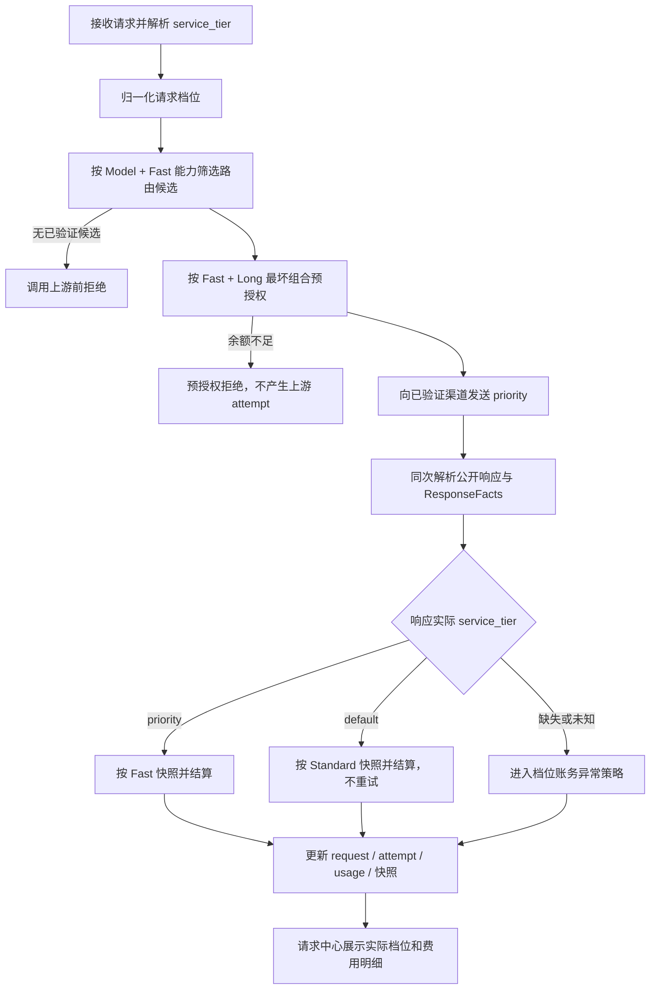

# OpenAI Fast 档位接入计划

> 状态：设计方案，待决策、待实现
>
> 更新时间：2026-08-15
>
> 权威边界：本文是改造期间的临时计划，不代表当前系统已经支持 Fast 计费。实现、迁移和测试全部完成后，
> 再按最终代码事实更新 Unio Blueprint，并删除本计划。

## 1. 背景与当前缺口

OpenAI Fast 通过请求中的 `service_tier` 表达加速意图，并通过同一次响应中的
`service_tier` 返回实际处理档位。上游可能接受 Fast 请求，但因容量或 ramp rate 实际按
Standard 处理，此时响应会返回 `default`，不能仅凭请求参数或上游后台的“Fast 请求”标记收取
Fast 溢价。

当前代码已经能接收和透传部分 OpenAI `service_tier` 字段，但尚未形成完整闭环：

- 请求参数尚未转化为明确的 Fast 路由约束和预授权价格上界。
- 路由候选尚无 `Channel + Model` 维度的 Fast 能力验证。
- adapter 的协议无关 `ResponseFacts` 尚未携带实际档位，settlement 无法按实际档位结算。
- `model_prices`、渠道成本、价格快照、成本快照和 settlement recovery 尚未保存 Fast 倍率事实。
- `request_records` 和请求中心尚未区分请求档位与实际档位。
- Admin 的费用列目前已有 `Long` 徽章，新增 `Fast` 后需要统一布局，不能覆盖费用数字或互相冲突。

## 2. 目标与非目标

### 2.1 目标

1. Fast 请求只进入已验证具备 Fast 能力的渠道候选池。
2. 预授权按请求可能产生的最高金额冻结，最终结算严格服从响应实际档位。
3. Fast 客户售价倍率归属模型基准价格；Provider Fast 成本倍率单独管理，并允许渠道覆盖。
4. 同时保存请求档位、实际档位、客户倍率和 Provider 成本倍率，保证历史账单可审计、可复算。
5. 在模型价格配置中展示根据 OpenAI 官方定价换算的参考倍率，由运营人员确认后写入。
6. 请求中心列表和费用明细能清楚展示实际 Fast、降级以及 Fast 与 Long 同时生效的情况。
7. 流式、非流式和 settlement recovery 使用同一套档位事实，不从公开响应或日志反向推断。

### 2.2 非目标

- 本阶段不根据延迟、TPS 或上游后台标签推断实际 Fast。
- 本阶段不通过运行时远程请求 OpenAI 定价页面自动改价。
- 本阶段不让 Fast 请求静默路由到未验证 Fast 的渠道。
- 本阶段不因上游返回 `default` 自动重试其他渠道；该响应已经是一次成功的 Standard 交付。
- 本阶段不把计划中的行为写入 Blueprint，Blueprint 只在改造完成后更新。

## 3. 术语与事实来源

| 名称 | 含义 | 来源 |
| --- | --- | --- |
| 请求档位 | 客户希望使用的档位，用于校验、路由和预授权 | 客户请求 `service_tier` |
| 上游发送档位 | Gateway 实际发送给某次 attempt 的原始值 | attempt 请求事实 |
| 实际档位 | 上游对本次成功响应实际采用的档位 | 同一次上游响应的 `service_tier` |
| Standard | 普通档位；OpenAI 响应原始值通常为 `default` | 实际档位归一化 |
| Fast | 加速档位；当前 OpenAI 响应原始值通常为 `priority` | 实际档位归一化 |
| 客户 Fast 倍率 | 在模型基准售价之上计算客户价格的倍率 | 模型价格配置 |
| Provider Fast 成本倍率 | 在该渠道 Standard 成本之上估算实际 Fast 成本的倍率 | Channel + Model 配置 |

必须同时保留归一化值和必要的上游原始值。归一化值驱动业务，原始值只用于审计和兼容性排查。

## 4. 已确认决策

### 4.1 实际响应是最终计费档位的唯一事实

- 响应实际为 `priority`：按 Fast 结算。
- 响应实际为 `default`：按 Standard 结算。
- 请求中的 `priority` / `fast` 只表达 Fast 意图，用于路由和预授权，不能直接决定最终扣费。
- 上游后台把请求标成 Fast，不覆盖同一次 API 响应返回的实际档位。
- 缺失或未知实际档位时，不能直接收取 Fast 溢价，必须进入明确的异常策略。

### 4.2 Fast 倍率属于模型基准价格

- Fast 倍率按模型独立配置，不能全局写死为 `2`。
- 客户售价先取 `model_prices` 的模型基准价格，再应用线路倍率、实际服务档位倍率和长上下文倍率。
- Standard 档位倍率固定为 `1`。
- Fast 与 Long 是两个独立维度，可以同时生效，两个事实都必须进入快照。

### 4.3 客户售价和 Provider 成本分离

- 客户 Fast 倍率决定对客户的售价，不等同于上游对平台的 Fast 成本倍率。
- Provider Fast 成本倍率按 `Channel + Model` 管理，渠道可以覆盖默认值。
- 毛利校验必须基于实际档位下的客户售价与 Provider 成本，不能只校验 Standard 基准价。

### 4.4 渠道能力必须经过实际响应验证

- 渠道 Fast 能力按 `Channel + Model` 记录，不能只标记 Provider 全局支持。
- 仅“请求未报错”不能证明支持 Fast；至少需要实际响应返回一次 `priority`。
- Fast 请求只进入已验证 Fast 的候选渠道。
- 无已验证候选时在调用上游前失败，不允许用 Standard 渠道兜底。

### 4.5 OpenAI 自身降级不重试

Fast 请求成功返回 `default` 时：

1. 向客户正常交付响应。
2. 不进行渠道 fallback 或重试，避免重复生成和重复上游成本。
3. 最终按 Standard 客户售价和 Standard Provider 成本结算。
4. 保存 `requested=Fast, actual=Standard` 的降级事实并计入监控。

### 4.6 官方定价参考倍率只辅助配置

- Admin 配置模型价格时展示根据 OpenAI Standard/Fast 官方单价换算的参考倍率、来源和核对日期。
- 参考倍率只用于填充，不自动保存、不自动覆盖人工值。
- 运行时只读取已经持久化并生效的倍率，不依赖 OpenAI 文档可用性。
- 官方定价变化时走人工审核和价格窗口变更，历史快照不受影响。

### 4.7 请求中心展示实际档位

- 请求详情的费用明细展示请求档位、实际档位和结算倍率。
- 请求列表费用列对实际 Fast 请求显示 `Fast` 徽章。
- `Fast` 与已有 `Long` 使用两个独立徽章，固定顺序为 `Fast`、`Long`，不合并成一个徽章。
- 两个徽章可以同时出现，不能覆盖费用数字、互相叠加或只靠颜色表达含义。

## 5. 目标请求链路



### 5.1 接入与归一化

协议层负责校验客户值并构造内部请求档位，不让任意字符串直接进入计费逻辑。建议内部使用
`standard` / `fast` 两个稳定枚举，同时保存 OpenAI 原始值 `default` / `priority`。

需要明确处理以下输入：

- 未传 `service_tier`
- `default`
- `auto`
- `priority`
- `fast`
- 未知值

具体兼容策略见待决策 D-01。

### 5.2 路由

请求档位为 Fast 时，在生成保守候选池之前增加硬约束：

- 模型存在生效的 Fast 客户售价倍率。
- `Channel + Model` Fast 能力状态为 verified。
- Provider Fast 成本倍率已经按最终策略解析，且毛利约束成立。
- 渠道和模型原有 enabled、协议能力、breaker、并发、Sticky 等条件继续生效。

Fast 能力过滤是普通路由条件的一部分。Sticky 命中未验证 Fast 的渠道时必须放弃该 Sticky 候选，并在
`routing_decision_traces` 记录稳定排除原因，例如 `fast_tier_unverified` 或
`fast_tier_unsupported`。

### 5.3 预授权

预授权按请求档位计算上界，因为此时还没有实际响应档位：

- Standard 请求：沿用 Standard 价格。
- Fast 请求：使用 Fast 客户售价倍率。
- Fast 和 Long 都可能生效时，冻结金额必须覆盖二者同时生效的组合。
- 多候选继续取预计金额最高者，避免 fallback 后冻结不足。
- 实际响应降级为 Standard 时，settlement 捕获 Standard 实际费用并释放冻结差额。

Fast 不改变现有正余额预检、reservation 幂等和“上游调用前完成冻结”的边界。

### 5.4 上游调用与响应事实

- 每个 Fast attempt 显式向支持的 OpenAI 上游发送 `service_tier=priority`。
- 非流式响应从顶层 `service_tier` 产生实际档位事实。
- 流式 Responses 从最终 `response.completed` 中的 response 对象产生实际档位事实。
- 若 Chat Completions 纳入首期，则从非流式响应或流式 chunk 的顶层字段产生事实，并验证跨 chunk 一致性。
- 公开响应和 `ResponseFacts` 必须来自同一次解析；settlement 不重新解析响应正文，也不从日志取值。
- 对外响应保留上游实际 `service_tier`，让客户能看到本次是否被 OpenAI 降级。

### 5.5 结算公式

对每个 token 价格分项 `i`：

```text
客户结算单价[i]
  = 模型基准售价[i]
  × 线路倍率
  × 实际档位客户倍率
  × 长上下文倍率[i]

Provider 结算成本单价[i]
  = 已解析的 Standard 渠道成本[i]
  × 实际档位 Provider 成本倍率
  × 长上下文倍率[i]
```

其中：

- 实际档位为 Standard 时，两个档位倍率均为 `1`。
- 实际档位为 Fast 时，使用本次路由锁定并进入快照的客户倍率与渠道成本倍率。
- 长上下文未触发时其倍率为 `1`；触发时沿用当前输入/输出分项倍率。
- 金额计算仍使用最终可靠 usage；档位不改变 token 统计口径。

### 5.6 结算恢复

settlement recovery job 必须保存或能确定性读取以下事实：

- 请求档位、实际归一化档位和上游原始档位。
- 本次锁定的模型 Fast 客户倍率记录 ID 与倍率值。
- 本次锁定的 Channel + Model Provider Fast 成本倍率记录 ID 与倍率值。
- Fast、Long 是否实际生效。
- 原有价格、成本、线路倍率、渠道倍率和充值倍率 pin。

恢复任务不得按“当前最新倍率”重算历史请求。重复恢复必须满足现有幂等约束，不重复扣费或重复记
Provider 成本。

## 6. 数据与 API 设计建议

### 6.1 推荐物理模型

为了后续支持更多服务档位，推荐把档位倍率作为模型价格窗口的子记录，而不是直接向
`model_prices` 增加一个只能表达 Fast 的固定列：

```text
model_price_tier_multipliers
  model_price_id
  service_tier             # fast
  customer_multiplier
  recommendation_value     # 可选，仅作配置提示
  recommendation_source
  recommendation_checked_at

channel_model_service_tiers
  channel_id
  model_id
  service_tier             # fast
  capability_status        # unverified / verified / disabled / unsupported
  provider_cost_multiplier
  verified_at
  verification_evidence    # 脱敏摘要，不存凭据和响应正文
```

这仍符合“Fast 倍率位于模型基准价格层”：客户倍率绑定具体 `model_prices` 生效窗口，改倍率创建新窗口，
历史记录继续引用旧行。若首期选择最小改造，也可给 `model_prices` 增加 `fast_multiplier`，但后续新增档位时
需要再次迁移。物理模型选择见待决策 D-02。

### 6.2 请求与 attempt 事实

建议新增或等价表达：

- `request_records.requested_service_tier`：逻辑请求的归一化请求档位。
- `request_records.actual_service_tier`：最终成功 attempt 的归一化实际档位。
- `request_attempts.requested_service_tier`：该次上游 transport 发送的归一化档位。
- `request_attempts.upstream_service_tier`：该次成功响应返回的原始值。

列表读取 `request_records.actual_service_tier`，attempt 明细保留上游证据。失败 attempt 没有可靠响应档位时
保持 `NULL`，不能用请求档位补写。

### 6.3 账务快照

建议新增或等价表达：

- `price_snapshots.service_tier`
- `price_snapshots.service_tier_multiplier`
- `price_snapshots.service_tier_multiplier_id`
- `cost_snapshots.service_tier`
- `cost_snapshots.service_tier_multiplier`
- `cost_snapshots.service_tier_multiplier_id`

快照保存的是最终实际档位及结算使用的倍率，不是请求意图。请求意图保存在 request/attempt 事实中。

### 6.4 Admin API

模型价格配置 API 需要返回和接受：

- Fast 是否可售。
- 当前客户 Fast 倍率。
- 官方定价参考倍率、来源和核对日期。

Channel + Model 配置 API 需要返回和接受：

- Fast 能力状态。
- Provider Fast 成本倍率及其最终解析来源。
- 最近验证时间和脱敏验证结果。

请求列表与详情 API 需要返回：

- `requested_service_tier`
- `actual_service_tier`
- `upstream_service_tier`（仅 attempt 详情）
- `service_tier_multiplier`
- `provider_service_tier_multiplier`
- `service_tier_downgraded`

历史请求字段为 `NULL` 时，Admin 显示 `—`，不得推断为 Standard 或 Fast。

## 7. 官方定价参考倍率

截至 2026-08-15，根据 OpenAI 公布的 Standard/Fast 单价换算的参考倍率示例：

| 模型 | 官方定价换算 Fast 倍率 |
| --- | ---: |
| `gpt-5.6-sol` | `2.0` |
| `gpt-5.5` | `2.5` |
| `gpt-5-mini` | `1.8` |
| `gpt-4.1` | `1.75` |
| `gpt-4o` | `1.7` |

来源：

- [OpenAI Fast mode](https://developers.openai.com/api/docs/guides/fast-mode)
- [OpenAI API pricing - Fast](https://developers.openai.com/api/docs/pricing?latest-pricing=fast)

该表是 Unio 根据官方定价生成的配置参考，不是 OpenAI 的承诺值，也不是运行时默认值。实现前和每次
新增模型时必须重新核对官方页面；若官方价无法
用单一倍率准确表达，应停止使用倍率推导，为该模型改用独立档位价格向量。

## 8. Admin 配置体验

### 8.1 模型基准价格

在模型价格配置中增加独立的“Fast 档位”区域：

- 开关：是否允许销售 Fast。
- 输入：客户 Fast 倍率。
- 提示：官方定价参考 `×N`、核对日期和来源链接。
- 操作：“填入 Fast 参考倍率”，只填表单，不自动提交。
- 保存前展示 Standard 与 Fast 的输入、输出价格预览。
- 修改倍率按新的价格生效窗口保存，不回写历史快照。

现有界面已有“按官方倍率填入”缓存价格的功能。Fast 操作必须使用完整文案“填入 Fast 参考倍率”，
避免用户把缓存倍率和服务档位倍率混为一谈。

### 8.2 渠道模型能力

在 Channel + Model 配置中增加：

- Fast 能力状态及状态说明。
- “验证 Fast”操作和最近验证时间。
- Provider Fast 成本倍率，可显示推荐值和最终生效值。
- 未验证或成本倍率不完整时，明确提示该渠道不会进入 Fast 路由池。

验证操作只发送最小无敏感内容的测试请求，不保存 API key、完整 prompt 或响应正文。

## 9. 请求中心展示

### 9.1 费用列

费用列建议使用以下固定结构：

```text
$0.01234  [Fast] [Long]
```

- 只对实际档位为 Fast 的请求显示 `Fast` 徽章。
- `Fast` 排在 `Long` 前面；两者均为独立、不可压缩的 15px 高小徽章。
- 费用数字和徽章组使用单行 `inline-flex`，设置稳定间距和足够的列最小宽度。
- 空间不足时由请求表横向滚动，不允许徽章覆盖金额，也不把两个徽章合并。
- `Fast` 使用与 `Long` 琥珀色明显不同的色系，并提供 `title`、`aria-label` 和足够对比度。
- 历史请求档位未知时不显示 Fast 徽章。

### 9.2 费用悬浮明细和请求详情

“费用明细”标题右侧按同一顺序展示 `Fast`、`Long`。明细新增“服务档位”信息：

- 请求档位
- 实际档位
- 是否发生 `Fast -> Standard` 降级
- 客户 Fast 倍率
- Provider Fast 成本倍率

用户价格区展示：

```text
模型基准价 × 线路倍率 × Fast 倍率 × Long 倍率 = 本次客户单价
```

渠道成本区展示：

```text
Standard 成本 × Provider Fast 成本倍率 × Long 倍率 = 本次渠道成本单价
```

只有实际 Fast 才在最终计算式应用 Fast 倍率。请求 Fast、实际 Standard 时，列表默认不显示 Fast 成功
徽章，详情显示 `Fast -> Standard`，具体降级视觉见待决策 D-07。

## 10. 渠道验证与运行时治理

### 10.1 验证规则

最小验证流程：

1. 绕过普通路由，定向到待验证的 Channel + Model。
2. 发送最小非流式 Responses 请求，显式设置 `service_tier=priority`。
3. 请求必须成功完成，且响应实际 `service_tier=priority`。
4. 保存验证时间、模型、协议、响应档位和脱敏 request id 摘要。
5. 只有满足验证标准后才能改为 verified。

响应为 `default` 只能证明请求被接受，不能证明该渠道实际交付 Fast。是否要求多次验证和有效期见待决策
D-05。

### 10.2 运行时退化

- verified 渠道偶发返回 `default` 时，按 Standard 成功结算并增加降级计数，不自动禁用渠道。
- 持续高降级率触发告警，达到阈值后是否自动转为 unverified 由后续运行策略决定。
- Provider 返回未知档位时触发账务异常告警，不能静默按 Fast 收费。
- 保留全局 Fast kill switch 和 Channel + Model 禁用开关，关闭后只影响新请求。

## 11. 错误与可观测性

### 11.1 建议公开错误

- 模型未配置 Fast 售价或明确不支持 Fast：`400 invalid_request_error`。
- 模型支持 Fast，但当前没有满足能力、成本、breaker 或并发约束的渠道：`503` 可重试错误。
- 未知 `service_tier`：`400 invalid_request_error`，错误参数指向 `service_tier`。
- 预授权不足：沿用现有余额不足错误，不创建上游 attempt。

公开错误码最终命名见待决策 D-06，响应中不得暴露渠道密钥或上游原始错误正文。

### 11.2 结构化日志字段

建议补充：

- `requested_service_tier`
- `actual_service_tier`
- `upstream_service_tier`
- `service_tier_downgraded`
- `service_tier_multiplier`
- `provider_service_tier_multiplier`
- `fast_capability_status`

### 11.3 指标和告警

至少覆盖：

- Fast 请求数、实际 Fast 数、降级为 Standard 数和降级率。
- 因无 Fast 候选拒绝的请求数。
- 缺失或未知实际档位的账务异常数。
- Fast 客户收入、Provider 成本和毛利，按模型与渠道聚合。
- 渠道验证成功、失败和最近验证时间。

首期先补指标和日志，监控面板与告警展示可分阶段实施，但账务异常日志必须在上线前具备。

## 12. 影响范围

| 范围 | 是否涉及 | 说明 |
| --- | --- | --- |
| Gateway API | 是 | 参数归一化、路由、透传、响应事实、错误语义 |
| Gateway Billing | 是 | 预授权、settlement、价格/成本快照、毛利校验 |
| Gateway Worker | 是 | settlement recovery 需要携带并复用档位事实 |
| PostgreSQL / sqlc | 是 | 配置、request/attempt 事实和账务快照迁移 |
| Admin API | 是 | 模型/渠道配置、请求列表和详情字段 |
| Admin Web | 是 | Fast 配置、能力验证、徽章和费用明细 |
| Website | 首期否 | 除非同时公开 Fast 产品说明和定价 |
| Blueprint | 完成后 | 只按最终实现更新，不在本阶段提前写入 |

因此这不是仅修改 Gateway 单个处理函数的改造。实际发布至少涉及数据库迁移、Gateway/Worker 和 Admin；
可以分阶段开发，但不能在结算快照未闭环时对客户开放 Fast。

## 13. 实施阶段

### 阶段 0：决策与测试渠道

- 确认第 15 节中的阻塞决策。
- 准备至少一个可定向验证的 OpenAI Fast 测试渠道和测试模型。
- 重新核对官方定价参考倍率和上游实际返回值。

### 阶段 1：Schema 与配置面

- 增加模型档位倍率、渠道模型档位能力与成本倍率。
- 增加 request、attempt、价格快照、成本快照和 recovery 字段。
- 更新 sqlc、Admin API、模型价格和渠道配置界面。
- 补充 Fast 档位的数据库毛利约束或等价 service 校验。

### 阶段 2：请求、路由和响应事实

- 完成协议值归一化与公开错误。
- 将 Fast 能力纳入候选过滤、Sticky 和 routing trace。
- 完成流式/非流式上游发送和实际档位提取。
- 将实际档位加入不可变 `ResponseFacts`。

### 阶段 3：预授权、结算和恢复

- 预授权覆盖 Fast 与 Long 的最坏组合。
- settlement 按实际档位应用客户与 Provider 倍率。
- 快照、ledger、Provider ledger 和 recovery 保持同一档位事实。
- 覆盖降级、缺失档位、fallback、幂等和改价竞态。

### 阶段 4：请求中心与灰度

- 上线列表徽章、费用明细、降级展示和筛选所需字段。
- 先对指定模型、指定渠道灰度，核对响应档位、客户扣费、Provider 成本和上游账单。
- 降级率、异常率和毛利符合预期后再扩大模型和渠道。

### 阶段 5：文档归档

- 按最终代码、Schema、API 和测试更新 Blueprint。
- 删除本临时计划，实施过程由 Git 历史保留。

## 14. 验收标准

1. Fast 非流式 Responses 实际返回 `priority` 时，按 Fast 客户/Provider 倍率结算并显示 `Fast`。
2. Fast 流式 Responses 的最终事实与非流式一致，不因中间 event 缺字段丢失档位。
3. Fast 请求实际返回 `default` 时不重试，按 Standard 结算，详情显示降级。
4. Fast 请求不能进入未验证渠道；无候选时 `request_attempts=0`，routing trace 有稳定排除原因。
5. 预授权覆盖 Fast + Long 同时生效，实际 Standard 或未触发 Long 时正确释放差额。
6. Fast + Long 同时生效时，费用列按 `Fast`、`Long` 顺序显示，桌面与窄视口均无重叠。
7. 修改模型或渠道倍率后，历史请求仍按旧快照复算，recovery 不读取新倍率。
8. 缺失/未知实际档位不会收取 Fast 溢价，并按最终决策进入可观测异常路径。
9. 客户扣费、Provider 成本和上游账单抽样一致；Fast 毛利守卫可阻止明显负毛利配置。
10. 历史无档位数据的请求中心展示为未知，不误标 Standard 或 Fast。

测试至少覆盖 Gateway 单元/集成测试、数据库约束和恢复测试、Admin 组件测试，以及流式 Responses 的真实
渠道灰度验证。涉及 UI 的 `Fast + Long` 组合需做桌面和窄视口截图检查。

## 15. 待决策项

以下项目在本文中保持未决，不应由实现代码自行猜测。标记“阻塞”的项目应在进入对应实施阶段前确认。

| ID | 决策 | 建议方案 | 阻塞范围 |
| --- | --- | --- | --- |
| D-01 | 客户输入值如何归一化 | 接受 `priority` 和 `fast` 为 Fast；未传、`default`、`auto` 统一为 Standard，并向上游显式发送 `default`，避免受上游 Project 默认档位影响；未知值返回 400 | 请求契约、路由 |
| D-02 | 模型 Fast 倍率使用固定列还是子表 | 使用 `model_price_tier_multipliers` 子表，仍绑定 `model_prices` 价格窗口，为后续其他档位保留扩展性 | Schema |
| D-03 | 实际档位缺失或未知时如何结算 | 不收客户 Fast 溢价；请求进入档位账务异常。需要确认 Provider 成本是先按 Fast 上界暂记，还是挂起普通 settlement 等人工/恢复处理 | 账务，必须确认 |
| D-04 | Provider Fast 成本倍率缺省策略 | 不直接继承客户售价倍率；Admin 可预填官方定价参考值，但 Channel + Model 必须显式确认成本倍率后才能 verified | 渠道配置、毛利 |
| D-05 | 渠道能力验证强度 | 首期至少一次实际 `priority` 才 verified，记录时间；先不设自动过期，用持续降级率告警，后续再决定定期复检 | 渠道上线 |
| D-06 | 无 Fast 能力时的公开错误码 | 模型不支持/未配置返回 400；模型已支持但运行时无合格 Fast 渠道返回 503；增加稳定内部原因码 | API 契约 |
| D-07 | 请求 Fast 但实际 Standard 的列表展示 | 列表不显示 Fast 成功徽章；费用明细显示 `Fast -> Standard` 和“上游降级”，避免把请求意图误当实际交付 | Admin 展示 |
| D-08 | 首期模型范围 | 先只开放 `gpt-5.6-sol`，单模型灰度验证后再按官方支持列表扩展 | 发布范围，必须确认 |
| D-09 | 首期协议范围 | 先完成 Codex 核心链路所需的流式/非流式 Responses；Chat Completions 在同一 Schema 上后续接入 | 开发范围，必须确认 |
| D-10 | 官方定价参考倍率如何更新 | 由版本化内置参考表或模型目录同步流程维护，记录来源和日期；只提示、不自动覆盖、不运行时联网 | Admin 配置 |

## 16. 实施前需要用户提供或确认

开始写代码前需要：

1. 确认 D-03、D-08、D-09 三项账务和首期范围决策；其他项目如无异议可按建议方案执行。
2. 指定首期测试渠道、模型和可接受的最小真实请求费用；凭据继续使用现有安全配置，不写入文档或日志。
3. 确认首期 `gpt-5.6-sol` 的客户 Fast 倍率，以及测试渠道对应的 Provider Fast 成本倍率。
4. 确认是否允许灰度期间只对指定 Route/API Key 开放 Fast；建议先做定向灰度，不直接全量开放。
5. 在真实渠道验证后提供一份脱敏上游账单或用量记录，用于核对 Provider 成本倍率和实际扣费。

在这些输入确认前，可以完成 Schema/API 设计评审，但不应启用生产 Fast 路由或对客户收取 Fast 溢价。
