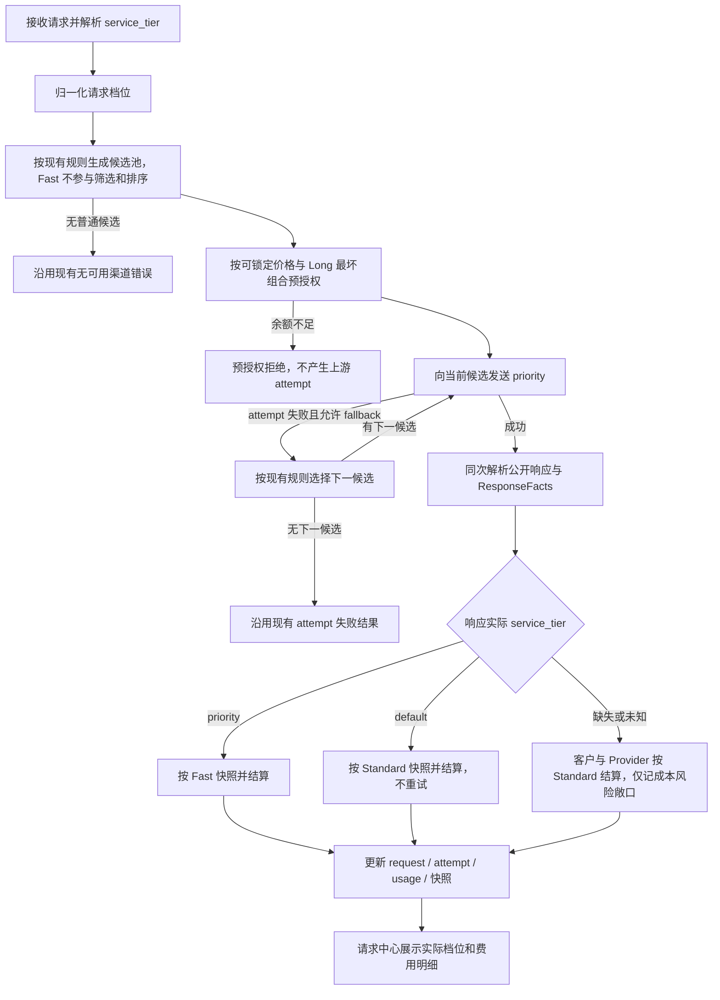

# OpenAI Fast 档位接入计划

> 状态：本地实现与自动化验证已完成，待真实渠道验证和文档归档
>
> 更新时间：2026-08-16
>
> 权威边界：本文是改造期间的临时计划，不代表当前系统已经支持 Fast 计费。实现、迁移和测试全部完成后，
> 再按最终代码事实更新 Unio Blueprint，并删除本计划。

## 0. 实施进度（2026-08-16）

已完成：

- Gateway 已完成请求档位归一化、OpenAI `priority` 透传、Responses 与 Chat Completions 的流式/非流式
  响应档位提取，以及 request/attempt 审计事实落库。
- Fast 不参与候选、排序、Sticky、breaker、并发和 fallback；成功返回 `default` 时按 Standard 正常结算，
  不重试其他渠道。
- 已增加 Standard/Fast 独立模型售价和渠道绝对成本子记录、预授权上界、价格/成本快照、settlement、
  recovery 和 Provider 成本风险敞口幂等记录。缺失、未知或 Fast 精确配置不完整时按 Standard 正常结算。
- Admin API 和 Admin Web 已完成模型 Fast 售价、渠道 Fast 成本、Standard/Fast 成本换算、请求列表/详情、
  降级事实和快照来源展示。Fast 是可折叠价格区，不是请求开关。
- 已增加服务档位结构化结算日志和 `unio_gateway_service_tier_total` Prometheus 计数；风险敞口金额保存在
  `provider_service_tier_cost_risks`，不进入 Provider ledger。
- 已按 2026-08-16 可访问的 OpenAI 官方 Fast mode 表核对并内置 18 个 Flagship 文本/推理模型的短上下文
  精确参考价；GPT-5.6 的 Cache writes 映射到现有 OpenAI 30m 缓存写入分项。
- Gateway `go test ./...` 已通过；Admin 类型检查、Lint、29 个测试文件共 109 个测试和生产构建已通过。
  模型价格、渠道成本、成本换算和请求降级详情已完成桌面与 `390x844` 窄视口检查。

尚未完成，不得据此发布或归档：

- 尚未使用至少两个真实 OpenAI 渠道验证 A 不可用/失败后选择 B、`priority`/`default` 实际响应、客户扣费、
  Provider 成本和上游账单一致性。
- 监控面板和告警规则尚未建立；当前已有结构化日志、基础 Prometheus 计数和可查询的风险敞口事实。
- 尚未更新 Unio Blueprint、删除本临时计划，也未执行任何远程发布。

## 1. 背景与当前缺口

OpenAI Fast 通过请求中的 `service_tier` 表达加速意图，并通过同一次响应中的
`service_tier` 返回实际处理档位。上游可能接受 Fast 请求，但因容量或 ramp rate 实际按
Standard 处理，此时响应会返回 `default`，不能仅凭请求参数收取 Fast 溢价。

改造前代码已经能接收和透传部分 OpenAI `service_tier` 字段，但尚未形成完整闭环：

- 请求参数尚未转化为明确的上游发送事实和预授权价格上界。
- adapter 的协议无关 `ResponseFacts` 尚未携带实际档位，settlement 无法按实际档位结算。
- `model_prices`、渠道成本、价格快照、成本快照和 settlement recovery 尚未保存 Standard/Fast
  独立价格向量及本次选中的档位事实。
- `request_records` 和请求中心尚未区分请求档位与实际档位。
- Admin 的费用列目前已有 `Long` 徽章，新增 `Fast` 后需要统一布局，不能覆盖费用数字或互相冲突。

## 2. 目标与非目标

### 2.1 目标

1. Fast 不改变现有候选池、排序、Sticky 和 fallback；每次成功响应的实际档位只影响最终结算。
2. 预授权按请求前可锁定价格的最高金额冻结；Fast 价格缺失时使用 Standard 预授权且不拒绝请求。响应档位可识别且价格
   可用时按实际档位结算，否则按 Standard 结算并单独记录 Provider 成本风险敞口。
3. Standard 和 Fast 均使用模型基准价格中的独立精确单价向量，不用单一 Fast 倍率推导价格。
4. Provider 成本按实际档位选择同档位基准价，再复用现有渠道价格倍率、充值倍率或档位绝对成本覆盖；
   不新增 Provider Fast 标量倍率。
5. 同时保存请求档位、实际档位、结算档位、解析来源、选中的价格向量和成本来源，保证历史账单
   可审计、可复算。
6. 在模型价格配置中展示 OpenAI 官方 Standard/Fast 精确单价、来源和核对日期，由运营人员确认后写入。
7. 请求中心列表和费用明细能清楚展示实际 Fast、降级以及 Fast 与 Long 同时生效的情况。
8. 流式、非流式和 settlement recovery 使用同一套档位事实，不从公开响应或日志反向推断。

### 2.2 非目标

- 本阶段不根据延迟或 TPS 推断实际 Fast。
- 本阶段不通过运行时远程请求 OpenAI 定价页面自动改价。
- 本阶段不因上游返回 `default` 自动重试其他渠道；该响应已经是一次成功的 Standard 交付。
- 本阶段不把计划中的行为写入 Blueprint，Blueprint 只在改造完成后更新。

## 3. 术语与事实来源

| 名称 | 含义 | 来源 |
| --- | --- | --- |
| 请求档位 | 客户希望使用的档位，用于校验、上游发送和预授权 | 客户请求 `service_tier` |
| 上游发送档位 | Gateway 实际发送给某次 attempt 的原始值 | attempt 请求事实 |
| 实际档位 | 上游对本次成功响应实际采用的档位 | 同一次上游响应的 `service_tier` |
| 结算档位 | 客户售价和 Provider 成本实际选择价格向量的档位；响应缺失或未知时回落为 Standard | 实际档位或回落策略 |
| Standard | 普通档位；OpenAI 响应原始值通常为 `default` | 实际档位归一化 |
| Fast | 加速档位；当前 OpenAI 响应原始值通常为 `priority` | 实际档位归一化 |
| Standard 基准价向量 | Standard 的未缓存输入、缓存输入、输出等精确单价 | 模型价格窗口 |
| Fast 基准价向量 | Fast 的同组精确单价；不由单一倍率运行时推导 | 模型价格窗口的 Fast 子记录 |

必须同时保留归一化值和必要的上游原始值。归一化值驱动业务，原始值只用于审计和兼容性排查。

### 3.1 OpenAI 原始值与 Gateway 首期映射

`Fast mode` 和 `Standard processing` 是 OpenAI 对处理模式的名称；`fast`、`priority`、`default` 和
`auto` 是请求或响应中 `service_tier` 的小写原始值。`standard` 不是本阶段接受的 OpenAI 请求值，
只作为 Gateway 内部归一化枚举使用。

首期客户请求、上游发送和成功响应按下表处理：

| 客户请求中的 `service_tier` | Gateway 请求档位 | Gateway 向 OpenAI 发送 | OpenAI 成功响应可能返回 | 响应归一化与结算 |
| --- | --- | --- | --- | --- |
| 未传 | `standard` | `default` | `default` | Standard |
| `auto` | `standard` | `default` | `default` | Standard |
| `default` | `standard` | `default` | `default` | Standard |
| `fast` | `fast` | `priority` | `priority` 或 `default` | `priority` 为 Fast；`default` 为 Standard |
| `priority` | `fast` | `priority` | `priority` 或 `default` | `priority` 为 Fast；`default` 为 Standard |
| `standard`、其他值或大小写不符 | 不接受 | 不调用上游 | 无 | 返回 400，参数指向 `service_tier` |

需要特别区分：

- OpenAI 官方语义中，`auto` 或未传会跟随 Project Service Tier，不天然等于 Standard。Gateway 将它们
  归一化为 Standard 并显式发送 `default`，是为了隔离上游 Project 配置的产品决策。
- `fast` 是当前 Fast 请求值，`priority` 是兼容值；两者表达同一 Fast 意图，不是两个计费档位。
- 首期模型 `gpt-5.6-sol` 实际使用 Fast 时，响应返回 `priority`，即使客户请求传入的是 `fast`。
- Fast 请求也可能因 OpenAI ramp rate 降级而成功返回 `default`。此时已经完成一次 Standard 交付，
  不重试并按 Standard 结算。
- settlement 优先根据同一次成功响应的原始值归一化实际档位，不能把请求中的 `fast` 或 `priority`
  复制为实际档位。响应缺失或返回首期未识别值时，客户售价和 Provider 成本都按 Standard 结算，
  只单独记录可能少记的 Provider Fast 增量成本风险敞口。

## 4. 已确认决策

### 4.1 实际响应决定档位，缺失或未知时回落 Standard 结算

- 响应实际为 `priority`：按 Fast 结算。
- 响应实际为 `default`：按 Standard 结算。
- 请求中的 `priority` / `fast` 只表达 Fast 意图，用于上游发送和预授权，不能直接决定最终扣费。
- 响应缺失或返回首期未识别值：实际档位保持未知，但客户和 Provider 的结算档位都回落为 Standard，
  两侧均选择 Standard 价格向量，请求正常完成且不重试。
- 该回落不创建 `ledger_billing_exceptions`，也不挂起 settlement 或 recovery。Standard Provider 成本正常
  写入成本快照和 Provider ledger。
- 只记录 Provider 成本风险敞口：金额为同一可靠 usage 下“Fast Provider 估算成本 - 已入账 Standard
  Provider 成本”的非负差额。该金额不进入成本快照或 Provider ledger，不影响余额和已结算毛利。
- 必须保留响应原始值以及“缺失回落”或“未知值回落”的解析来源，不能伪造上游返回了 `default`。
- 响应已明确为 `priority` 但本次请求前没有可锁定的 Fast 精确价格时，也不能在上游已成功后使请求失败；
  客户与 Provider 都按 Standard 价格结算，解析来源记为 `standard_fallback_fast_price_missing`，并记录价格配置风险敞口。

### 4.2 Fast 使用独立基准价格向量

- Standard 使用现有 `model_prices` 基准价向量；Fast 在同一价格窗口下保存独立的精确单价向量。
- Fast 至少明确未缓存输入、缓存输入和输出单价；其他分项按现有模型价格向量的适用性保存。
- 不保存、不截断也不在运行时使用单一 Fast 倍率推导各分项价格。
- 同一价格窗口没有 Fast 价格子记录，只表示“Fast 精确价格未配置”，不表示模型、渠道或请求禁用 Fast。
- Fast 价格是结算配置，不是请求准入条件；客户请求 Fast 时，无论是否存在 Fast 价格都按原候选路由调用上游。
- 客户售价先按结算档位选择 Standard 或 Fast 基准价向量，再应用线路倍率和长上下文倍率。
- Fast 与 Long 是两个独立维度，可以同时生效，两个事实都必须进入快照。

### 4.3 Provider 成本复用档位基准价与现有渠道因子

- 倍率派生路径先按结算档位选择 Standard 或 Fast 模型基准价向量，再应用现有渠道价格倍率与充值倍率。
- 绝对成本覆盖路径若对 Fast 有不同成本，保存 Fast 精确成本向量；不得把 Standard 绝对成本直接当成 Fast 成本。
- Fast 成本是结算事实，不是候选或请求准入条件；缺失时不得跳过渠道、重排候选或拒绝请求。
- 不新增 Provider Fast 标量倍率；毛利校验直接比较实际档位下的精确客户售价与 Provider 成本。

### 4.4 Fast 不参与路由候选和 fallback 决策

- Fast 请求使用与同模型 Standard 请求相同的候选池、排序、Sticky、breaker、并发和 fallback 规则。
- Standard 请求保持现有行为；Fast 只额外影响上游发送值、预授权上界、响应档位事实和最终结算。
- 不维护或检查 `Channel + Model` Fast verified 状态，也不因 Fast 价格或成本来源对候选做增删或重排。
- 候选 A 不可用时可以选择候选 B；A 的 attempt 发生现有可 fallback 错误时，也可以按原规则继续尝试 B。
- 每个 Fast attempt 都发送 Fast 请求值。某个 attempt 成功返回 `priority` 时按 Fast 结算；成功返回
  `default` 时按 Standard 结算并停止 fallback。
- 只有普通路由本身找不到候选时才沿用现有无可用渠道错误，不增加“无 Fast 能力候选”错误。

### 4.5 OpenAI 自身降级不重试

Fast 请求成功返回 `default` 时：

1. 向客户正常交付响应。
2. 不进行渠道 fallback 或重试，避免重复生成和重复上游成本。
3. 最终按 Standard 客户售价和 Standard Provider 成本结算。
4. 保存 `requested=Fast, actual=Standard` 的降级事实并计入监控。

### 4.6 官方精确单价只辅助配置

- 首期在代码中维护版本化的 OpenAI Standard/Fast 官方参考价格表，覆盖 OpenAI 官方 Fast 价格表中的全部模型，
  保存逐分项精确单价、官方来源和核对日期。
- 参考表是 Admin 填表数据，不是运行时计费常量；计费逻辑不得直接读取或硬编码官方参考价。
- Admin 显示官方参考后，由管理员手动选择填入、核对、修改并提交；不自动保存、不自动覆盖已配置价格。
- 运行时只读取已经持久化并生效的价格向量，不依赖 OpenAI 文档可用性。
- 官方定价变化时先更新版本化参考表，再由管理员人工审核并创建新价格窗口；既有配置和历史快照不自动受影响。

### 4.7 请求中心展示实际档位

- 请求详情的费用明细展示请求档位、实际档位和本次结算选中的价格向量。
- 请求列表费用列对实际 Fast 请求显示 `Fast` 徽章。
- 请求 Fast 但实际返回 Standard 时，列表不显示 `Fast` 成功徽章，详情显示 `Fast -> Standard` 和“上游降级”。
- `Fast` 与已有 `Long` 使用两个独立徽章，固定顺序为 `Fast`、`Long`，不合并成一个徽章。
- 两个徽章可以同时出现，不能覆盖费用数字、互相叠加或只靠颜色表达含义。

## 5. 目标请求链路



### 5.1 接入与归一化

协议层按 3.1 的映射校验客户值并构造内部请求档位，不让任意字符串直接进入计费逻辑。内部使用
`standard` / `fast` 两个稳定枚举，同时保存必要的客户原始值、实际发送值以及响应原始值。

本阶段只接受未传、`auto`、`default`、`fast` 和 `priority`；值区分大小写。`standard` 虽然是内部
枚举，但不是公开请求值。其他 OpenAI 档位和值不因上游可能支持而自动进入本阶段契约，均按不支持的
`service_tier` 返回 400。该映射已确认。

### 5.2 路由

Fast 价格是否存在不做请求接入校验，也不做候选过滤。路由层不得根据请求档位改变候选集合、排序或 fallback：

- Standard 请求不增加任何 Fast 相关逻辑，保持当前路由与结算行为。
- 继续只应用现有 enabled、协议能力、breaker、并发、Sticky 等普通条件。
- Sticky 候选不会因为请求 Fast 而失效。
- 候选 A 当前不可用时可以选择 B；A attempt 发生现有可 fallback 错误时可以继续尝试 B。
- 不读取 Fast capability/verified 状态，不增加 `fast_tier_unverified`、`fast_tier_unsupported` 等排除原因。
- 不得因 Fast 价格或成本缺失跳过、重排某个正常候选，也不得因此在调用上游前返回 400。

成功响应是 fallback 的停止边界。`priority` 和 `default` 都表示本次 attempt 已成功交付，前者在 Fast 价格可用时按 Fast
结算，价格缺失时按 4.1 回落 Standard；后者始终按 Standard 结算。两者都不能为了追求 Fast 再尝试下一个候选。

### 5.3 预授权

预授权按请求档位计算请求前可确定的上界，因为此时还没有实际响应档位：

- Standard 请求：沿用 Standard 价格。
- Fast 请求：使用已持久化的 Fast 基准价格向量。
- Fast 请求但 Fast 价格未配置：使用 Standard 价格预授权，不拒绝请求。
- Fast 和 Long 都可能生效时，冻结金额必须覆盖二者同时生效的组合。
- 多候选继续取预计金额最高者，避免 fallback 后冻结不足。
- 实际响应降级为 Standard 时，settlement 捕获 Standard 实际费用并释放冻结差额。

Fast 不改变现有正余额预检、reservation 幂等和“上游调用前完成冻结”的边界。

### 5.4 上游调用与响应事实

- 每个 Fast attempt 显式向支持的 OpenAI 上游发送 `service_tier=priority`。
- Responses 和 Chat Completions 均纳入首期，两个协议的流式与非流式请求使用相同档位、路由与结算语义。
- 非流式响应从顶层 `service_tier` 产生实际档位事实。
- 流式 Responses 从最终 `response.completed` 中的 response 对象产生实际档位事实。
- 流式 Chat Completions 从 chunk 的顶层字段产生事实，并验证跨 chunk 一致性。
- 公开响应和 `ResponseFacts` 必须来自同一次解析；settlement 不重新解析响应正文，也不从日志取值。
- 对外响应保留上游实际 `service_tier`，让客户能看到本次是否被 OpenAI 降级。
- `ResponseFacts` 同时携带可空的实际档位、结算档位和解析来源。响应档位缺失或未知时，实际档位保持
  未知，结算档位为 Standard，解析来源分别标记为缺失回落或未知值回落。响应实际为 Fast 但价格未配置时，实际档位仍为 Fast，
  结算档位为 Standard，解析来源标记为价格缺失回落。

### 5.5 结算公式

对每个 token 价格分项 `i`：

```text
客户结算单价[i]
  = 结算档位的模型基准售价[i]
  × 线路倍率
  × 长上下文倍率[i]

倍率派生 Provider 结算成本单价[i]
  = 结算档位的模型基准售价[i]
  × 渠道价格倍率
  × 充值倍率
  × 长上下文倍率[i]

绝对覆盖 Provider 结算成本单价[i]
  = 结算档位的渠道绝对成本[i]
  × 长上下文倍率[i]
```

其中：

- 实际档位为 Standard 时，结算档位为 Standard，选择 Standard 基准价格和 Standard 渠道成本。
- 实际档位为 Fast 时，结算档位为 Fast，选择本次请求前锁定的 Fast 基准价格和 Fast 渠道成本。
- 实际档位缺失、未知，或实际为 Fast 但本次无可用 Fast 价格时，结算档位回落为 Standard，选择 Standard 价格向量；潜在 Fast Provider
  增量只进入风险敞口事实，不进入上述结算公式。
- 长上下文未触发时其倍率为 `1`；触发时沿用当前输入/输出分项倍率。
- 金额计算仍使用最终可靠 usage；档位不改变 token 统计口径。

### 5.6 结算恢复

settlement recovery job 必须保存或能确定性读取以下事实：

- 请求档位、可空的实际归一化档位、结算档位、上游原始档位和档位解析来源。
- 本次锁定的 Standard/Fast 模型价格记录 ID 与逐分项精确单价。
- 本次锁定的 Provider 成本来源：档位绝对成本记录，或档位基准价、渠道价格倍率与充值倍率 pin。
- Fast、Long 是否实际生效。
- 原有价格、成本、线路倍率、渠道倍率和充值倍率 pin。
- 缺失或未知档位回落时已经写入的 Standard 成本与 Provider Fast 增量风险敞口事实。

恢复任务不得按“当前最新价格或因子”重算历史请求。重复恢复必须满足现有幂等约束，不重复扣费或重复记
Provider 成本。

## 6. 数据与 API 设计建议

### 6.1 推荐物理模型

为了后续支持更多服务档位，把 Fast 的精确单价向量作为模型价格窗口的子记录，而不是向
`model_prices` 增加单一 `fast_multiplier`：

```text
model_price_service_tiers
  id
  model_price_id
  service_tier                    # fast
  uncached_input_price
  cache_read_input_price
  cache_write_5m_input_price
  cache_write_1h_input_price
  cache_write_30m_input_price
  output_price
  reasoning_output_price
  reference_source                # 官方来源，仅审计/配置提示
  reference_checked_at

channel_price_service_tiers       # 仅供渠道绝对成本覆盖路径
  id
  channel_price_id
  service_tier                    # fast
  uncached_input_cost
  cache_read_input_cost
  cache_write_5m_input_cost
  cache_write_1h_input_cost
  cache_write_30m_input_cost
  output_cost
  reasoning_output_cost
```

Standard 仍由 `model_prices` / `channel_prices` 现有列表达；子表只表达非 Standard 档位。同一
`model_price_id` 有 Fast 子记录只表示该价格窗口有可用的 Fast 精确价格，没有则表示未配置。子记录是结算事实，
不是 Fast 请求或路由开关。价格不就地修改，修改或移除 Fast 价格需创建新价格窗口，历史请求继续引用旧行。

倍率派生的渠道成本不新增 Fast 配置表，只在结算时把成本基数切换为 Fast 模型价格向量，继续应用现有
`channel_cost_multipliers` 与充值倍率。渠道绝对成本路径才使用 `channel_price_service_tiers`。

### 6.2 请求与 attempt 事实

建议新增或等价表达：

- `request_records.requested_service_tier`：逻辑请求的归一化请求档位。
- `request_records.actual_service_tier`：最终成功 attempt 的归一化实际档位；响应缺失或未知时为 `NULL`。
- `request_records.settled_service_tier`：实际用于客户和 Provider 结算的档位；缺失、未知或 Fast 价格未配置时为 `standard`。
- `request_records.service_tier_resolution`：`upstream_response`、`standard_fallback_missing`、
  `standard_fallback_unknown` 或 `standard_fallback_fast_price_missing`。
- `request_attempts.requested_service_tier`：该次上游 transport 发送的归一化档位。
- `request_attempts.upstream_service_tier`：该次成功响应返回的原始值。

列表读取 `request_records.actual_service_tier`，attempt 明细保留上游证据。失败 attempt 没有可靠响应档位时
保持 `NULL`，不能用请求档位补写。

### 6.3 账务快照

建议新增或等价表达：

- `price_snapshots.service_tier`
- `price_snapshots.model_price_service_tier_id`（Standard 可为 `NULL`）
- `cost_snapshots.service_tier`
- `cost_snapshots.channel_price_service_tier_id`（绝对成本路径）
- `cost_snapshots.tier_cost_source`：`derived` 或 `absolute`

快照保存结算档位、选中价格记录以及现有逐分项精确单价，不是请求意图。实际档位缺失、未知或 Fast 价格未配置时，两侧快照
保存 Standard 价格向量；响应原始值与回落来源保存在 request/attempt 事实中，不能把原始值补写成
`default`。

档位缺失、未知，或实际 Fast 但 Fast 价格未配置时，还要写入独立的价格/成本风险敞口事实，至少包含
request、attempt、回落原因、响应原始值、已入账 Standard Provider 成本、可空的 Fast Provider 估算增量、币种和创建时间。
当 Fast 成本向量可用时，估算增量为：

```text
max(同一可靠 usage 的 Fast Provider 估算成本 - 已入账 Standard Provider 成本, 0)
```

当 Fast 价格/成本本身缺失时，增量金额保持 `NULL`，表示无法估算，不得伪造为 `0`。

该事实只用于风险汇总与对账，不属于 `ledger_billing_exceptions`，不生成 Provider ledger entry，也不参与
请求 settlement/recovery 的成功判定。具体物理表名在阶段 1 Schema 设计时按现有账务结构确定。

### 6.4 Admin API

模型价格配置 API 需要返回和接受：

- `fast_price_status`：`configured` 或 `missing`，只表示价格配置状态。
- `fast_prices`：与 Standard 对应的精确单价向量；未配置时为 `NULL`。
- `fast_price_reference`：OpenAI 官方参考单价向量、来源和核对日期，仅供填表。

Channel + Model 配置 API 需要返回和接受：

- 倍率派生路径的 Standard/Fast 成本预览及共用的渠道价格倍率、充值倍率。
- 绝对成本覆盖路径的 Fast 精确成本向量及最终解析来源。

请求列表与详情 API 需要返回：

- `requested_service_tier`
- `actual_service_tier`
- `settled_service_tier`
- `service_tier_resolution`
- `upstream_service_tier`（仅 attempt 详情）
- `model_price_service_tier_id`
- `provider_tier_cost_source`
- `service_tier_downgraded`

历史请求字段为 `NULL` 时，Admin 显示 `—`，不得推断为 Standard 或 Fast。

## 7. OpenAI 官方 Fast 精确单价参考表

截至 2026-08-16，OpenAI 官方价格页在 `Flagship models` 的 `Fast mode` 档位中公布以下短上下文价格，
单位均为每 100 万 token：

| 模型 | 未缓存输入 | 缓存输入 | Cache writes | 输出 |
| --- | ---: | ---: | ---: | ---: |
| `gpt-5.6-sol` | `$10.00` | `$1.00` | `$12.50` | `$60.00` |
| `gpt-5.6-terra` | `$4.00` | `$0.40` | `$5.00` | `$24.00` |
| `gpt-5.6-luna` | `$0.40` | `$0.04` | `$0.50` | `$2.40` |
| `gpt-5.5` | `$12.50` | `$1.25` | - | `$75.00` |
| `gpt-5.4` | `$5.00` | `$0.50` | - | `$30.00` |
| `gpt-5.4-mini` | `$1.50` | `$0.15` | - | `$9.00` |
| `gpt-5.2` | `$3.50` | `$0.35` | - | `$28.00` |
| `gpt-5.1` | `$2.50` | `$0.25` | - | `$20.00` |
| `gpt-5` | `$2.50` | `$0.25` | - | `$20.00` |
| `gpt-5-mini` | `$0.45` | `$0.045` | - | `$3.60` |
| `gpt-4.1` | `$3.50` | `$0.875` | - | `$14.00` |
| `gpt-4.1-mini` | `$0.70` | `$0.175` | - | `$2.80` |
| `gpt-4.1-nano` | `$0.20` | `$0.05` | - | `$0.80` |
| `gpt-4o` | `$4.25` | `$2.125` | - | `$17.00` |
| `gpt-4o-mini` | `$0.25` | `$0.125` | - | `$1.00` |
| `o4-mini` | `$2.00` | `$0.50` | - | `$8.00` |
| `o3` | `$3.50` | `$0.875` | - | `$14.00` |
| `gpt-4o-2024-05-13` | `$8.75` | - | - | `$26.25` |

GPT-5.6 同页还公布以下 Fast 长上下文价格：

| 模型 | 未缓存输入 | 缓存输入 | Cache writes | 输出 |
| --- | ---: | ---: | ---: | ---: |
| `gpt-5.6-sol` | `$20.00` | `$2.00` | `$25.00` | `$90.00` |
| `gpt-5.6-terra` | `$8.00` | `$0.80` | `$10.00` | `$36.00` |
| `gpt-5.6-luna` | `$0.80` | `$0.08` | `$1.00` | `$3.60` |

版本化 Fast 参考表保存短上下文逐分项单价；`Cache writes` 映射到 OpenAI 30m 缓存写入分项。长上下文仍由现有
Long Context 配置独立控制：上述三行对应输入类分项 `2x`、输出 `1.5x`，填入 Fast 官方价不会自动开启 Long Context。

来源：

- [OpenAI Fast mode](https://developers.openai.com/api/docs/guides/fast-mode)
- [OpenAI API pricing - Standard](https://developers.openai.com/api/docs/pricing?latest-pricing=standard&multimodal-image-pricing=standard)
- [OpenAI API pricing - Fast](https://developers.openai.com/api/docs/pricing?latest-pricing=fast)

这些是 OpenAI 官方单价，不是 Unio 根据倍率推算的示例。Cyber、Realtime、Image、Sora、工具和微调等后续价格表
没有跟随 `Flagship models` 的 Fast 档位切换，且无法由当前单一文本 token 向量准确表达，因此不混入 Fast 参考表。
版本化参考表保存官方逐分项单价，不保存截断后的 `1.6667` 之类标量倍率。每次官方调价或新增模型时必须重新核对
官方页面；历史请求始终使用已锁定快照。

## 8. Admin 配置体验

### 8.1 模型基准价格

在“新建模型基准售价”中增加独立、可折叠的“Fast 价格”区域，但不使用 Switch，避免被误解为请求或渠道开关：

- 折叠头只显示价格状态：“已配置”或“未配置”，不显示“开启/关闭”。
- 展开后显示 Standard/Fast 对照价格表，列为“分项 / Standard / Fast”；选择配置 Fast 价格时，Fast 的适用分项必填。
- OpenAI 官方已公布 Fast 价格的模型，显示“填入 OpenAI Fast 官方价”操作、核对日期，以及 Standard/Fast 官方定价来源链接；
  操作只填表单，不自动提交。
- 若 Fast 分项已填值，重新填入官方价前显示覆盖确认，与现有缓存价填充行为一致。
- 官方参考表中没有 Fast 定价的 OpenAI 模型，显示“OpenAI 未公布 Fast 定价”；不用 `1` 倍或 Standard 价伪造 Fast 配置，但这不影响客户请求 Fast。
- 价格窗口列表只在已配置时显示 `Fast 已定价` 徽章和简短向量摘要；未配置时不在列表额外增加告警徽章，只在配置详情中显示“未配置”。
- 新增、移除或修改 Fast 价格都按新的价格生效窗口保存，不回写历史快照。

Long Context 保留 Switch，因为它确实决定是否启用一条内部阶梯计价规则。Fast 只展示价格配置状态，不使用 Switch；客户 Fast 意图始终按
现有路由调用上游。

### 8.2 渠道模型成本

在 Channel + Model 配置中增加：

- 倍率派生成本同时预览 Standard/Fast 结果，两者复用同一组渠道价格倍率和充值倍率。
- 使用绝对成本覆盖时，增加可选的 Fast 精确成本向量，同样不使用 Switch，也不影响请求或候选。
- 明确提示该配置只影响实际 Fast 时的 Provider 成本核算，不影响候选、排序、Sticky 或 fallback。

## 9. 请求中心展示

### 9.1 费用列

费用列建议使用以下固定结构：

```text
$0.01234  [Fast] [Long]
```

- 只对实际档位为 Fast 的请求显示 `Fast` 徽章。
- `Fast` 排在 `Long` 前面；两者均为独立、不可压缩的 15px 高小徽章。
- 费用数字和徽章组使用单行 `inline-flex`，设置稳定间距和足够的列最小宽度。
- 空间不足时由请求表横向滚动，不允许徽章覆盖金额，也不把两个徽章合并。
- `Fast` 使用与 `Long` 琥珀色明显不同的色系，并提供 `title`、`aria-label` 和足够对比度。
- 历史请求档位未知时不显示 Fast 徽章。

### 9.2 费用悬浮明细和请求详情

“费用明细”标题右侧按同一顺序展示 `Fast`、`Long`。明细新增“服务档位”信息：

- 请求档位
- 实际档位
- 是否发生 `Fast -> Standard` 降级
- 本次选中的 Standard/Fast 模型基准单价向量
- Provider 档位成本来源及逐分项成本

用户价格区展示：

```text
实际档位基准价 × 线路倍率 × Long 倍率 = 本次客户单价
```

渠道成本区展示：

```text
实际档位成本基数 × 渠道价格倍率 × 充值倍率 × Long 倍率 = 本次渠道成本单价
```

只有实际 Fast 才选择 Fast 价格向量。请求 Fast、实际 Standard 时，列表默认不显示 Fast 成功
徽章，详情显示 `Fast -> Standard` 和“上游降级”。

## 10. 路由与运行时治理

### 10.1 路由规则

- Fast 请求复用普通请求的完整候选池和顺序，不增加能力验证前置条件。
- Gateway 对每个 Fast attempt 显式发送 `service_tier=priority`。
- attempt 失败时沿用现有错误分类决定是否 fallback，不新增 Fast 专用 fallback 规则。
- attempt 成功返回 `priority` 或 `default` 时立即停止 fallback，并分别按 Fast 或 Standard 结算。
- 渠道返回 `priority` / `default` 的分布只用于计费、观察和运营分析，不反向改变路由权重或能力状态。

### 10.2 运行时退化

- 渠道返回 `default` 时按 Standard 成功结算并增加降级计数，不自动禁用渠道或改变路由。
- 持续高降级率可以触发运营告警，但不自动改变候选、排序、Sticky 或 fallback。
- Provider 返回缺失或未知档位时按 Standard 正常结算，不自动禁用渠道；只累计 Provider Fast 增量成本
  风险敞口及回落次数。
- 实际返回 `priority` 但 Fast 价格缺失时按 Standard 正常结算，不重试、不改路由；记录价格配置风险敞口并告警。

## 11. 错误与可观测性

### 11.1 建议公开错误

- Fast 请求找不到普通路由候选时，沿用现有无可用渠道的 `503` 错误，不增加 Fast 专用错误。
- 未知 `service_tier`：`400 invalid_request_error`，错误参数指向 `service_tier`。
- 预授权不足：沿用现有余额不足错误，不创建上游 attempt。

响应中不得暴露渠道密钥或上游原始错误正文。Fast 价格缺失不是公开错误，不得因此返回 400；除 `service_tier`
参数校验外，Fast 不新增公开错误。

### 11.2 结构化日志字段

建议补充：

- `requested_service_tier`
- `actual_service_tier`
- `settled_service_tier`
- `service_tier_resolution`
- `upstream_service_tier`
- `service_tier_downgraded`
- `model_price_service_tier_id`
- `provider_tier_cost_source`
- `provider_service_tier_cost_exposure_amount`

### 11.3 指标和告警

至少覆盖：

- Fast 请求数、实际 Fast 数、降级为 Standard 数和降级率。
- Fast 请求在各候选、attempt 和 fallback 位置上的分布，用于验证其与普通路由规则一致。
- 缺失或未知实际档位的 Standard 回落数，以及对应的 Provider Fast 增量成本风险敞口金额。
- Fast 客户收入、Provider 成本和毛利，按模型与渠道聚合。
- 各渠道成功响应的 `priority` / `default` 数量与占比；该指标不参与运行时路由。

首期先补指标和日志，监控面板与告警展示可分阶段实施，但档位回落与成本风险敞口记录必须在上线前具备。

## 12. 影响范围

| 范围 | 是否涉及 | 说明 |
| --- | --- | --- |
| Gateway API | 是 | 参数归一化、路由、透传、响应事实、错误语义 |
| Gateway Billing | 是 | 预授权、settlement、价格/成本快照、毛利校验 |
| Gateway Worker | 是 | settlement recovery 需要携带并复用档位事实 |
| PostgreSQL / sqlc | 是 | 配置、request/attempt 事实和账务快照迁移 |
| Admin API | 是 | 模型/渠道配置、请求列表和详情字段 |
| Admin Web | 是 | Fast 价格与成本配置、徽章和费用明细 |
| Website | 首期否 | 除非同时公开 Fast 产品说明和定价 |
| Blueprint | 完成后 | 只按最终实现更新，不在本阶段提前写入 |

因此这不是仅修改 Gateway 单个处理函数的改造。实际发布至少涉及数据库迁移、Gateway/Worker 和 Admin；
可以分阶段开发，但不能在结算快照与 Standard 回落策略未闭环时发布。

## 13. 实施阶段

### 阶段 0：决策与测试渠道

- 复核第 15 节的已确认决策基线。
- 准备至少两个可定向测试的 OpenAI 渠道，用于覆盖候选 A 不可用后选择或 fallback 到候选 B。
- 重新核对官方 Standard/Fast 精确单价向量和上游实际返回值。

### 阶段 1：Schema 与配置面

- 增加模型 Fast 精确价格向量和渠道 Fast 绝对成本向量，复用现有渠道成本因子，不增加 Fast 路由能力状态。
- 增加 request、attempt、价格快照、成本快照、Provider 成本风险敞口和 recovery 字段。
- 更新 sqlc、Admin API、模型价格和渠道配置界面。
- 补充 Fast 档位的数据库毛利约束或等价 service 校验。

### 阶段 2：请求、路由和响应事实

- 完成协议值归一化与公开错误。
- 验证 Fast 不改变候选池、排序、Sticky、breaker、并发和现有 fallback。
- 完成 Responses 与 Chat Completions 的流式/非流式上游发送和实际档位提取。
- 将实际档位、结算档位和解析来源加入不可变 `ResponseFacts`。

### 阶段 3：预授权、结算和恢复

- 预授权覆盖 Fast 与 Long 的最坏组合。
- settlement 按结算档位选择客户与 Provider 精确价格向量；实际档位缺失、未知或 Fast 价格未配置时两侧均按 Standard。
- 快照、ledger、Provider ledger 和 recovery 保持同一档位事实。
- 覆盖降级、缺失档位、fallback、风险敞口幂等和改价竞态。

### 阶段 4：请求中心与上线验证

- 上线列表徽章、费用明细、降级展示和筛选所需字段。
- 先用指定模型、指定渠道做真实请求核对，但不因 Fast 改变候选或对其他模型返回专用错误。
- 核对响应档位、客户扣费、Provider 成本和上游账单；符合预期后确认进入发布与归档流程。

### 阶段 5：文档归档

- 按最终代码、Schema、API 和测试更新 Blueprint。
- 删除本临时计划，实施过程由 Git 历史保留。

## 14. 验收标准

1. Fast 非流式 Responses 实际返回 `priority` 且 Fast 价格已配置时，按已锁定的 Fast 客户/Provider 精确价格向量结算并显示 `Fast`。
2. Fast 流式 Responses 的最终事实与非流式一致，不因中间 event 缺字段丢失档位。
3. Fast 请求实际返回 `default` 时不重试，按 Standard 结算，详情显示降级。
4. Fast 请求与同模型 Standard 请求使用相同候选池和顺序；候选 A 不可用或 attempt 发生现有可 fallback
   错误时可以继续选择 B，不能出现 Fast capability/verified 专用排除原因。
5. 预授权覆盖 Fast + Long 同时生效，实际 Standard 或未触发 Long 时正确释放差额。
6. Fast + Long 同时生效时，费用列按 `Fast`、`Long` 顺序显示，桌面与窄视口均无重叠。
7. 修改模型 Standard/Fast 价格或渠道成本后，历史请求仍按旧快照复算，recovery 不读取新价格。
8. 缺失/未知实际档位时客户和 Provider 均按 Standard 结算，不创建账务异常、不阻塞 recovery；只记录
   Provider Fast 增量成本风险敞口，且重复 recovery 不得重复记录。
9. Fast 价格未配置时，Fast 请求仍使用完整普通候选链调用上游，不因价格或渠道 Fast 状态返回 400；响应为
   `default` 时按 Standard，响应为 `priority` 但价格仍缺失时按 Standard 并记录风险敞口。
10. 客户扣费、Provider 成本和上游账单抽样一致；Fast 毛利守卫只校验已配置价格，不作为请求或候选门槛。
11. 历史无档位数据的请求中心展示为未知，不误标 Standard 或 Fast。

测试至少覆盖 Gateway 单元/集成测试、数据库约束和恢复测试、Admin 组件测试，以及 Responses 与 Chat Completions
的流式/非流式真实渠道验证。涉及 UI 的 `Fast + Long` 组合需做桌面和窄视口截图检查。

## 15. 决策状态

当前无待决策项。D-08 已确认：首期一次内置 OpenAI 官方 Fast 价格表中全部模型的精确参考价；内置只提供 Admin
填表参考，管理员仍可逐模型决定是否填入、修改和提交，不限制任何模型的 Fast 请求。该决策已按 2026-08-16 官方
`Flagship models` Fast mode 表完成：18 个可由当前文本 token 价格向量准确表达的模型均已内置。

## 16. 真实渠道验证与发布前输入

本地实现不再依赖以下输入；进入真实渠道验证和发布前仍需要：

1. 指定首期至少两个测试渠道、模型和可接受的最小真实请求费用，以验证候选 A 不可用后仍可选择或
   fallback 到候选 B；凭据继续使用现有安全配置，不写入文档或日志。
2. 核对首期模型的 OpenAI Standard/Fast 逐分项精确单价；若测试渠道使用绝对成本覆盖，同时确认 Fast 精确成本向量。
3. 在真实渠道测试后提供一份脱敏上游账单或用量记录，用于核对 Provider Fast 逐分项成本和实际扣费。

在这些输入确认前不得宣称真实渠道验收完成或进入发布流程。未配置精确 Fast 价格时不得收取 Fast 溢价，但不拒绝
Fast 请求。
