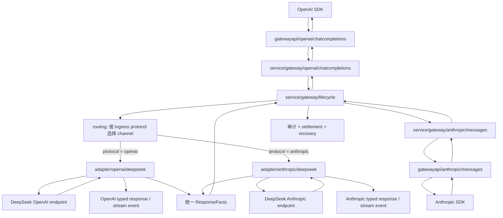

# Phase 10 Architecture - 双协议 Gateway 边界

## 1. 核心结论

Unio 不把 OpenAI 和 Anthropic 强行转换成一套“大一统聊天 DTO”。

正确边界：

```text
请求协议分离
响应协议分离
账务与审计事实统一
商业生命周期统一
```

原因：

1. OpenAI Chat Completions 与 Anthropic Messages 的请求 DTO、响应 DTO、stream 事件和错误结构差异很大。
2. 强行统一协议 DTO 会产生大量 nullable 字段、`map[string]any` 和隐式分支。
3. API key、routing、authorization、attempt、fallback、settlement、recovery、metrics 和 tracing 与公开协议无关，可以稳定复用。

## 2. 端到端链路



注意：

1. lifecycle 每次只调用 routing 选中的一个 adapter，不会同时调用两套 DeepSeek endpoint。
2. OpenAI ingress 默认只命中 OpenAI channel；Anthropic ingress 默认只命中 Anthropic channel。
3. protocol-native response 与 `ResponseFacts` 是同一次解析产生的两条输出轨道。

## 2.1 协议为先与 Provider 映射（DEC-012）

```text
Ingress（gatewayapi）
  只校验客户协议 JSON 合法；合法字段全部进入 typed DTO / extension。
  不因 provider 能力返回 400。

Adapter 出站（→ upstream wire）
  buildUpstreamWire allowlist：仅 Pass/Adapt 写入 upstream body。
  无法转换 → Drop（键/ block 不出现在 upstream JSON）。
  记录 dropped_request_fields（内部审计）。

Adapter 入站（upstream → 客户协议）
  只填充 ingress 协议 DTO 需要的字段。
  其余 → Drop（不进公开响应）；账务所需走 ResponseFacts / usage.Facts。

禁止：
  - Extensions 无脑 merge 进 upstream
  - provider 映射层 CodeAdapterRequestUnsupported 作为默认策略
  - decode 阶段因窄 struct 丢失客户协议字段
```

## 3. 包职责

`gateway-server` 仍然是一个进程。协议分类发生在 `gatewayapi`、`service/gateway`
和 `core/adapter` 内部，不拆成两个公网 server：

```text
cmd/gateway-server
  → gatewayapi/router.go
      → gatewayapi/openai
      → gatewayapi/anthropic
```

这样两套协议共享同一套认证、限流、观测和部署生命周期，同时代码边界仍然清楚。

### `internal/app/gatewayapi`

```text
gatewayapi/openai
= OpenAI HTTP decode / validate / encode / SSE write / error render

gatewayapi/anthropic
= Anthropic HTTP decode / validate / encode / SSE write / error render

gatewayapi/middleware
= 两套协议共享的 API key 身份、rate limit、request id
```

入口层不做：

```text
routing
金额计算
provider 字段改写
upstream 调用
settlement
```

### `internal/service/gateway`

```text
service/gateway/openai
= OpenAI typed operation 组装

service/gateway/anthropic
= Anthropic typed operation 组装

service/gateway/lifecycle
= 协议无关商业生命周期
```

lifecycle 不 import `internal/app/gatewayapi/openai` 或 `internal/app/gatewayapi/anthropic`。

### `internal/core/adapter`

```text
adapter/openai
= OpenAI 协议族 contract、DTO、request/response/stream 可复用基础逻辑

adapter/openai/deepseek
= DeepSeek OpenAI endpoint 具体实现与差异覆盖

adapter/anthropic
= Anthropic 协议族 contract、DTO、request/response/stream 可复用基础逻辑

adapter/anthropic/deepseek
= DeepSeek Anthropic endpoint 具体实现与差异覆盖

adapter/upstreamhttp
= outbound HTTP primitive

adapter/sse
= SSE reader primitive
```

## 4. Adapter 接口

接口按协议族定义，不在通用根包塞入一套模糊的 Chat DTO。

OpenAI：

```go
package openai

type ChatAdapter interface {
    CreateChatCompletion(
        ctx context.Context,
        ch channel.Runtime,
        req ChatCompletionRequest,
    ) (ChatCompletionResult, error)
}

type StreamChatAdapter interface {
    StreamChatCompletion(
        ctx context.Context,
        ch channel.Runtime,
        req ChatCompletionRequest,
        emit func(ChatCompletionChunk) error,
    ) (adapter.StreamOutcome, error)
}

type ChatInputTokenizer interface {
    CountChatInputTokens(
        req ChatCompletionRequest,
        upstreamModel string,
    ) (int64, error)
}
```

Anthropic：

```go
package anthropic

type MessagesAdapter interface {
    CreateMessage(
        ctx context.Context,
        ch channel.Runtime,
        req MessageRequest,
    ) (MessageResult, error)
}

type StreamMessagesAdapter interface {
    StreamMessage(
        ctx context.Context,
        ch channel.Runtime,
        req MessageRequest,
        emit func(MessageStreamEvent) error,
    ) (adapter.StreamOutcome, error)
}

type MessagesInputTokenizer interface {
    CountMessageInputTokens(
        req MessageRequest,
        upstreamModel string,
    ) (int64, error)
}
```

结果结构：

```go
type ChatCompletionResult struct {
    Response ChatCompletionResponse
    Facts    adapter.ResponseFacts
}

type MessageResult struct {
    Response MessageResponse
    Facts    adapter.ResponseFacts
}
```

`ResponseFacts` 详细定义见 [RESPONSE_FACTS.md](RESPONSE_FACTS.md)。

非流式与流式接口必须独立注册。provider 可以只实现其中一个，也可以两个都实现。
`routing.Candidate` 只表示 SQL 按数据库事实选出的同协议候选；lifecycle 必须在
生成最终 fallback plan / attempt plan 前按本次 operation capability 查询 registry
并过滤，不能等到 adapter 调用阶段才发现能力缺失。

不定义 `FullChatAdapter` 或 `FullMessagesAdapter` 作为正式 contract。组合接口不新增
行为，反而会把独立 capability 重新绑死。具体 provider 包分别做编译期断言：

```go
var _ openai.ChatAdapter = (*Adapter)(nil)
var _ openai.StreamChatAdapter = (*Adapter)(nil)
var _ openai.ChatInputTokenizer = (*Adapter)(nil)
```

Anthropic provider 同理。

Tokenizer 也按协议族定义。旧 `adapter.ChatInputTokenizer` 接收 OpenAI 偏向的
`ChatInputTokenizeRequest`，不能继续作为双协议根接口。OpenAI tokenizer 消费
`openai.ChatCompletionRequest`，Anthropic tokenizer 消费 `anthropic.MessageRequest`；
provider 实现使用 candidate 的 `upstreamModel`，按即将发送的 wire 语义估算。

同一个 provider 的不同协议入口必须分别实现 tokenizer。DeepSeek 对应：

```text
adapter/openai/deepseek/tokenizer.go
→ 实现 openai.ChatInputTokenizer
→ 按 DeepSeek OpenAI wire messages、tools 和 framing 估算

adapter/anthropic/deepseek/tokenizer.go
→ 实现 anthropic.MessagesInputTokenizer
→ 按 DeepSeek Anthropic wire system、content blocks、tools 和 framing 估算
```

本阶段不新增共享 `deepseek.Tokenizer` facade，也不为了复用把两套协议请求压成一套
中间 DTO。只有两个实现稳定后确认底层纯文本编码 primitive 完全一致，才允许提取
不感知协议 DTO、wire framing 和估算返回语义的窄工具。

## 5. Provider 双协议实现

DeepSeek 同时提供两套入口：

```text
https://api.deepseek.com
https://api.deepseek.com/anthropic
```

因此它需要两个具体 adapter：

```text
adapter/openai/deepseek
adapter/anthropic/deepseek
```

这不是重复设计。两套协议天然不同：

| 项 | OpenAI Chat Completions | Anthropic Messages |
| --- | --- | --- |
| endpoint | `/chat/completions` | `/v1/messages` |
| auth header | `Authorization: Bearer` | `x-api-key` |
| system prompt | `messages[].role=system/developer` | 顶层 `system` |
| tool response | `role=tool` + `tool_call_id` | `tool_result` content block |
| thinking | `reasoning_content` / vendor extension | `thinking` content block |
| stream | data-only chunk + `[DONE]` | named SSE events |
| usage | prompt/completion details | input/cache/output details |

可以复用的稳定 primitive：

```text
outbound HTTP
SSE reader
安全 body limit
连接关闭
metrics / tracing hook
稳定 upstream error category
```

不能强行复用的协议逻辑：

```text
request DTO
response DTO
stream event
usage 映射
finish reason 映射
provider ignored / unsupported 字段
```

协议族根目录应提供可复用函数，避免以后每接一个同协议 provider 都复制一遍 wire 代码。
具体 provider 仍然直接实现对应协议接口，并按需调用根目录函数，不额外引入一层强制
`Profile` 抽象：

```text
adapter/openai
  baseline request / response / stream functions

adapter/openai/deepseek
  implements openai.ChatAdapter
  reuses baseline
  owns DeepSeek Adapt / Drop rules

adapter/anthropic
  baseline request / response / stream functions

adapter/anthropic/deepseek
  implements anthropic.MessagesAdapter
  reuses baseline
  owns DeepSeek Adapt / Drop rules
```

## 6. Routing 与 registry

### Channel 绑定

adapter 绑定必须从 provider 下沉到 channel：

```text
channel.protocol
channel.adapter_key
```

`provider` 只表达业务服务商身份，不再决定唯一协议实现。

### Registry

registry 使用二元键：

```text
(protocol, adapter_key)
```

同一个键下分别登记 capability：

```text
non_stream
stream
input_tokenizer
```

示例：

```text
(openai, deepseek)    → adapter/openai/deepseek
(anthropic, deepseek) → adapter/anthropic/deepseek
```

过滤顺序：

```text
routing SQL
→ 按数据库 channel.protocol 选择同协议 routing candidates
→ lifecycle 查询内存 registry
→ 过滤缺少本次 non_stream / stream / input_tokenizer capability 的候选
→ 过滤熔断 channel
→ 得到本次可用 fallback plan
```

SQL 不感知 Go registry。registry 也不反向查询数据库。

### 同协议 fallback

第一版固定：

```text
OpenAI ingress    → OpenAI channels only
Anthropic ingress → Anthropic channels only
```

跨协议 bridge 暂不实现。未来若实现，必须显式增加：

```text
bridge adapter
字段损失矩阵
模型能力矩阵
计费映射
用户可见行为说明
黑盒验收
```

## 7. Lifecycle Executor

lifecycle 的职责：

```text
认证后的身份上下文
→ 创建 request record
→ routing plan
→ registry capability 过滤
→ 过滤熔断 channel
→ 对可用 fallback candidates 做保守 token 估算
→ 余额估算与冻结
→ 创建 attempt record
→ 调用一次 typed operation
→ 解析 ResponseFacts
→ settlement 或 recovery
→ 记录 delivery
→ 返回 typed response
```

### Operation 边界

lifecycle 不需要理解协议 DTO。协议 service 可以使用 typed closure 或窄 operation 接口接入 lifecycle：

```go
type AttemptInvoker interface {
    Invoke(
        ctx context.Context,
        candidate routing.Candidate,
    ) (adapter.ResponseFacts, error)
}

type StreamAttemptInvoker interface {
    InvokeStream(
        ctx context.Context,
        candidate routing.Candidate,
        markVisible func() error,
    ) (adapter.StreamOutcome, error)
}
```

具体 OpenAI 或 Anthropic service 在 invoker 内持有 typed request、typed response 和 emit 函数。lifecycle 只消费事实与稳定错误，不使用 `any`。

### Authorization

同协议 fallback 仍可能跨 provider 或 adapter。authorization 不能只使用第一个 candidate
的 tokenizer：

```text
对每个可用 fallback candidate
→ 使用该 candidate 的 upstream model 与 input_tokenizer
→ 按对应协议 wire 估算输入 token
→ 取保守 token 结果
→ 结合 max output 与客户价格冻结余额
```

缺少 tokenizer capability 的 channel 在冻结前过滤。这样 fallback 不会因为切换 provider
而静默突破原 reservation 风险边界。

共享 lifecycle 不直接调用 OpenAI 或 Anthropic tokenizer，也不接触协议 DTO。协议
service 持有 typed request，并向 lifecycle 提供候选级估算 closure：

```go
type CandidateInputTokenEstimator func(
    ctx context.Context,
    candidate routing.Candidate,
) (int64, error)
```

OpenAI service 的 closure 查询 `openai.ChatInputTokenizer`；Anthropic service 的 closure
查询 `anthropic.MessagesInputTokenizer`。lifecycle 只负责遍历候选并取保守结果。
DeepSeek 的两个 tokenizer 分别由对应 protocol adapter 返回估算值，lifecycle 不感知
它们是否属于同一个 provider。

### Retry

adapter 一次调用只发送一次上游请求。

```text
lifecycle 创建 attempt
→ adapter 发一次 HTTP
→ adapter 返回结果或稳定错误
→ lifecycle 分类
→ 必要时创建下一条 attempt
→ 同 channel retry 或换 channel fallback
```

第一版不在 transport 层做隐藏 retry。这样真实请求数、成本、熔断与审计一致。

## 8. Stream 生命周期

### OpenAI

```text
上游 SSE data chunk
→ adapter/openai/deepseek 解析
→ OpenAI ChatCompletionChunk
→ gatewayapi/openai SSE writer
→ adapter 截留 upstream [DONE]
→ lifecycle 持久化 facts 并 settlement / schedule recovery
→ gatewayapi/openai 按 include_usage 写出可选 usage 尾包
→ gatewayapi/openai 写出 [DONE]
```

### Anthropic

```text
上游 named SSE event
→ adapter/anthropic/deepseek 解析
→ Anthropic MessageStreamEvent
→ gatewayapi/anthropic SSE writer
→ adapter 截留 upstream message_stop
→ lifecycle 持久化 facts 并 settlement / schedule recovery
→ gatewayapi/anthropic 写出 message_stop
```

### 统一规则

1. 首个客户可见事件之前允许 fallback。
2. 首个客户可见事件之后禁止 fallback。
3. adapter 累积最终可靠 usage，并通过 `StreamOutcome.Facts` 返回。
4. 有最终可靠 usage 时，即使 tail error 或客户端断开，也按事实 settlement。
5. 没有最终可靠 usage 但可能产生上游成本时，释放用户冻结并写 `risk_exposure`。
6. `delivery_status` 与账务状态分开记录。
7. `[DONE]` 与 `message_stop` 是客户可见成功终态。adapter 不直接透出；只有 immutable
   recovery facts 已持久化，并且 settlement 已完成或已由 durable recovery job 接管后，
   对应 gatewayapi writer 才能写出。
8. recovery facts 无法持久化时，不能写成功终态；已开始的 stream 写协议原生 error
   event 并记录 `delivery_status=interrupted`。
9. 客户端断开后，账务收口使用有上限的内部 context，不依赖已经取消的请求 context。

## 9. 错误边界

三层错误：

```text
provider wire error
→ adapter.UpstreamError
→ lifecycle / failure.Code
→ protocol-native public error
```

职责：

| 层 | 职责 |
| --- | --- |
| provider adapter | 解析 upstream status、request ID、安全 metadata、provider 错误码和 retry category。 |
| lifecycle | 决定 retry、fallback、熔断记录、attempt 状态和账务收口。 |
| gatewayapi/openai | 输出 OpenAI error shape。 |
| gatewayapi/anthropic | 输出 Anthropic error shape。 |

禁止：

1. 直接把 upstream body 返回客户。
2. gateway service 解析 provider 原始 JSON。
3. 用公开错误文本作为内部稳定错误身份。

## 10. 不使用官方 SDK

生产 adapter 不依赖 OpenAI 或 Anthropic Go SDK。

原因：

1. Unio 必须自行掌握 wire DTO、extension、provider Drop 行为与内部 dropped-fields 审计。
2. Unio 必须在同一次解析中生成协议响应与账务事实。
3. SDK 自动 retry 会破坏 attempt、成本、熔断和审计一致性。
4. SDK 类型不应泄漏到 gatewayapi、service 或 billing。

SDK 仍可用于黑盒验收：

```text
OpenAI SDK     → 验证 drop-in
Anthropic SDK  → 验证 drop-in
```
