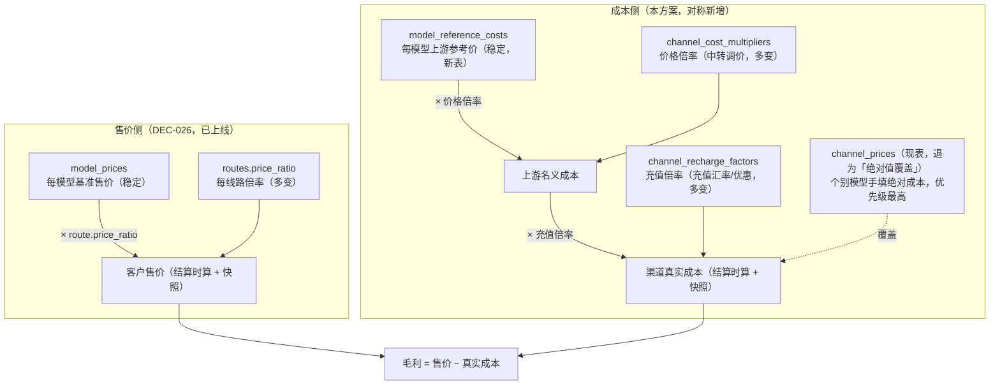
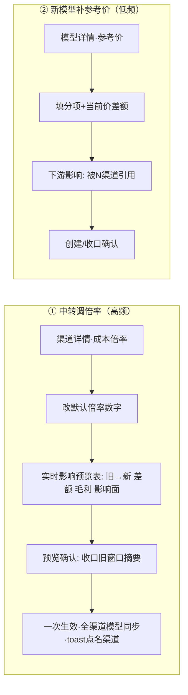

# 改造方案：渠道成本也走倍率（成本 = 上游参考价 × 渠道成本倍率）

> **修订声明（DEC-031，含 rev.1 代码复核）**：成本**基数**不再使用独立表 `model_reference_costs`，改为复用 **`model_prices`（模型基准价）**。倍率 / 充值倍率 / 绝对覆盖机制仍以本文为准；基数来源、退役参考成本表、及**落地三处校正**（成本 pin rename 取 `candidate.ModelPriceID`／该列保持无 FK／「不可售」两成因均需修）见 **[`DESIGN-cost-base-from-model-price.md`](./DESIGN-cost-base-from-model-price.md)** 文首 rev.1。下文凡写「`model_reference_costs` 作基数」的段落，落地时按 DEC-031 替换为 `model_prices`。**注**：本文 §4 的 000076-000080 迁移号是编写期勘探值，现库已 consolidation，实际以 DEC-031 §4「000037」及仓库最大号 +1 为准。
>
> 提议 **DEC-027**（渠道成本倍率；已实现，基数部分待 DEC-031 修订）。承接 **DEC-026**（倍率定价，售价侧）——本方案把「倍率」这套已在售价侧验证过的模式，**对称地补到成本侧**。
>
> - 撰写基准：对照当前工作区代码（`unio-api` / `unio-admin`）逐文件勘探，文件/行号来自真实代码（勘探时点）。
> - **阅读约定**：英文/专业词首次出现配「（中文解释）」；复杂逻辑用「小明发请求」实例。
> - 本文 = 设计 + 执行计划合一。先读 §1（模型）与 §2（决策 + 为什么这样选），再按 §7 分阶段实施。
>
> **审核修订（rev.2，对照代码复核后）**：修正 1 处正确性缺陷 + 2 处事实错误 + 补 1 处遗漏：
> 1.（正确性）成本解析**不可**按 `attemptStart` 重解析，会漂移（P1-3 pin 就是防这个）→ 改为**透传 pin 来源行 id / 或透传算好的成本向量**（§5.3、§3.1）。
> 2.（遗漏）倍率路径无 `channel_prices` 行，故 **`price_snapshots.price_id` 也要写 NULL**，不只是 `cost_snapshots`（§4 000079、§9）。
> 3.（事实）售价侧倍率快照是 `000071` 且只加 `price_ratio`；`price_snapshots.price_id` **自 `000013` 建表即可空**（初稿误写「`000057` 让其可空」）（§4、§9）。
> 4.（低估）`FindRouteCandidates` 是最大工作量：成本在**路由期**就解析进 `candidate.ChannelCost`（cheapest 排序 + 敞口用）；派生成本统一走 Go `ScaleProviderCost` 保证精度一致（§5.1）。
> 5.（补充）幂等校验 `CostPriceID<=0` 需放宽；`cost_snapshots` FK 因 `MATCH SIMPLE` 仅需 `DROP NOT NULL`；多币种上游只能走绝对覆盖（§5.3、§9）。
>
> **审核修订（rev.3，冻结/结算/请求记录复核）**：
> 6.（确认安全）**冻结完全不碰成本**（`authorization.go` 只用售价 `CandidatePrices`）；成本改倍率对预授权冻结零影响。
> 7.（确认安全）结算仍把**绝对成本冻结**进 `cost_snapshots`，历史请求读快照不重算 ⇒ 改倍率不影响历史成本。
> 8.（**缺口已补**）请求记录费用处原本**只展示售价「线路倍率」、缺成本倍率**：售价倍率已按请求快照（`request_records.sql:444 ps.price_ratio`）。补成本侧对称展示 `cost_multiplier`（§5.5 后端 DTO/查询 + §6.8 前端费用明细），让「以前的成本倍率 vs 现在的」在每条历史请求可追溯、不漂移。
>
> **审核修订（rev.4，充值倍率并入成本）**：用户指出上游除「价格倍率」外还有**「充值倍率」**（如充 33RMB 得 500 名义USD），它同样决定**真实成本**。已并入：
> 9. 成本公式改为 `真实成本 = 参考价 × 价格倍率 × 充值倍率`；新增 `channel_recharge_factors`（每渠道、账户级、versioned）（§1/§3/§4）。
> 10. 充值倍率**承担名义→真实结算币种的换算**（汇率+优惠折进去，配置时归一），`cost_snapshots.currency` 语义变为「真实结算币种」，与收入同币种、毛利可直接相减；引擎内不跨汇率（§9）。
> 11. 充值倍率**快照**（`cost_snapshots.recharge_factor`）并在请求详情费用处展示；缺省 1.0 向后兼容；取当前值、非额度库存 FIFO（近似，§9）。

---

## 1. 一句话与模型

**一句话**：上游中转站按「官方价 × 价格倍率」向你扣**名义额度**，而你充值时又以「充值倍率」把真金白银换成名义额度；所以渠道真实成本要拆成 **每模型「上游参考价」（稳定）× 每渠道「价格倍率」（中转调价就变）× 每渠道「充值倍率」（你充值汇率/优惠，充值就变）**，结算时相乘、把**真实成本**冻结进 `cost_snapshots`。**上游改一次倍率 / 你换一次充值档 → 各改 1 个数，该渠道所有模型同步生效。**



**概念锚点**：
- **model_reference_costs（上游参考价，新表）**：每个模型一组「上游官方/参考成本向量」（名义币种），versioned，跨渠道共享。语义 = new-api 的「模型倍率基准」，但落成明确金额。**变化频率低**（provider 官方调价时才动）。
- **channel_cost_multipliers（价格倍率，新表）**：每渠道一个标量倍率（可选逐模型覆盖），versioned。语义 = 该中转站在官方价上的**加价倍率**，产出**上游名义成本**。**变化频率高**（中转调价就改）。
- **channel_recharge_factors（充值倍率，新表）**：每渠道一个标量（账户级、**无逐模型**），versioned。语义 = 把「1 单位上游名义额度」换算成「你真金白银（结算币种）」的系数，**已把汇率 + 充值优惠折进去**（如充 33RMB 得 500 名义USD → 按结算币种 USD 折 ≈ 0.0092 真实USD/名义USD）。**变化频率高**（每次充值/换档就改）。
- **channel_prices（现表）**：保留为**「绝对值覆盖」逃生通道**——个别渠道/模型如果中转不按倍率计价（自有价表），仍可手填**真实成本**绝对值，**优先级最高**（覆盖时不再乘任何倍率）。现有数据零改动、继续生效。

---

## 2. 决策（DEC-027，pending）与「为什么这样选」

**决策**：渠道成本从「每 (渠道,模型) 绝对金额」升级为 **`成本 = model_reference_costs(模型) × channel_cost_multipliers(渠道[/模型])`**，在**结算时相乘**得到成本向量并冻结进 `cost_snapshots`；`channel_prices` 保留为绝对值覆盖（最高优先级）。

**为什么选「结算时算」而不是「物化成 N 行」**：

| 方案 | 做法 | 优点 | 缺点 | 结论 |
|---|---|---|---|---|
| **A 物化** | 改倍率时自动重算并写入 N 条 `channel_prices` 绝对行 | 结算/路由/快照/恢复**全不动**（风险最低） | 与售价侧不对称；行数膨胀 + 每次改倍率批量收口/新建 N 行；`channel_prices` 变「派生表」需防手改漂移（双事实源） | 备选 |
| **B 结算时算（选它）** | 保留参考价+倍率分离，命中时相乘 | **与售价侧完全对称**（团队已在 DEC-026 用同套路：runtime 算 + 快照存 source id + 倍率）；真·1 处改；单一事实源、无行churn | 触及计费热路径 + `cost_snapshots` 一个 FK；改动面较大、测试更重 | **主方案** |

选 B 的关键理由：**售价侧（DEC-026）已经做过一模一样的事**——`model_prices × routes.price_ratio` 在路由/结算时算、把「算出的售价向量 + `price_ratio` + `model_price_id/route_id`」快照进 `price_snapshots`（见 `settlement.go:423-443`、`billing/scale.go` 的 `ScaleCustomerPrice`）。成本侧照抄这套，架构一致、心智负担最小、无双事实源。B 的额外风险（热路径 + FK）可控，且下文 §7 用分阶段 + 门禁 + 真实 e2e 兜住。

**审计不变量（沿用 DEC-026 补偿思路）**：结算时 `cost_snapshots` 除了**冻结算出的绝对成本向量 + 各分项金额**（现状已做），再记 **参考价行 id + 倍率行 id + 当时倍率标量**，历史成本可按原事实独立复算，且**不随后续改倍率漂移**。

---

## 3. 计费语义（含用户实例）

### 3.1 成本解析优先级（结算 / 路由候选一致）

对某次命中的 (channel C, model M) 在时刻 t 解析**真实成本**。先定「价格倍率」再乘「充值倍率」：

1. **绝对值覆盖**：若 C/M 在 t 有启用中的 `channel_prices` 行（含路由锁定的 `ChannelPriceID`）→ 直接用它作为**真实成本**（现状路径，逃生通道，**不再乘任何倍率**：覆盖即最终真实成本）。
2. **逐模型价格倍率**：否则若 C 对 M 有启用中的 `channel_cost_multipliers`（`model_id=M`）→ 价格倍率 = 该行。
3. **渠道默认价格倍率**：否则若 C 有启用中的默认价格倍率（`model_id IS NULL`）→ 价格倍率 = 该行。
4. **都没有价格倍率 / 参考价缺失** → 该 (C,M)「未定价」：路由候选排除；结算报错。
5. **乘充值倍率**：命中 2/3 后，`真实成本 = 参考价(M,t) × 价格倍率 × 充值倍率(C,t)`；充值倍率取 C 在 t 启用中的 `channel_recharge_factors`，**缺省 = 1.0**（未配即视为「名义 = 真实」，不改变现状口径，向后兼容）。

> 参考价缺失（模型没配 `model_reference_costs`）但配了倍率 → 视为未定价（路由排除 + 管理台醒目告警「模型 M 缺上游参考价」）。
> 充值倍率是**账户级、无逐模型**：同一渠道所有走倍率的模型共用同一充值倍率。绝对覆盖路径不参与充值倍率（覆盖值本身已是真实成本）。

### 3.2 与售价 / 冻结 / 扣费的关系（**不动**）

- 冻结（pre-authorize）/ 扣费（capture）**只用售价**（`SalePrice = 基准 × 线路倍率`），成本**不参与**授权额。本方案**不触碰**授权与扣费路径。
- 成本只在**结算**与**风险敞口估算**（`cost_exposure.go`）里用于算平台成本/毛利，写 `cost_snapshots`。
- 稳定账单不变量（DEC-026）不受影响：fallback 命中更贵成本渠道，客户售价不变、只吃平台毛利。

### 3.3 用户实例

> **实例 A（一处改倍率）**：某中转渠道 C 绑了 20 个模型，之前每个模型各录一条绝对成本。中转把倍率从 1.2 调到 1.15 → 你只新建 1 条 C 的默认成本倍率（1.15，生效=现在），**20 个模型的成本同时按新倍率生效**，历史请求成本不变（已快照冻结）。
>
> **实例 B（个别模型特殊）**：中转对 `claude-opus` 单独加价 1.4、其余 1.15 → C 默认倍率 1.15 + 对 `claude-opus` 建一条逐模型覆盖 1.4。
>
> **实例 C（中转不按倍率）**：某渠道自有价表、跟官方价无倍率关系 → 对该 (渠道,模型) 用 `channel_prices` 手填绝对成本（覆盖，优先级最高），其余照走倍率。
>
> **实例 D（历史复算）**：3 个月前的请求，其 `cost_snapshots` 冻结了当时算出的绝对成本 + 当时倍率 + 参考价行 id；你今天怎么改倍率都不影响它，审计可原样复算。

---

## 4. 数据模型改动（migrations，新号从勘探最大号 000075 之后起，**实施前以仓库实际为准**）

- [ ] **`000076_create_model_reference_costs`**：结构对齐 `model_prices`（`migrations/000054`）但语义是「上游参考**成本**」：`id, model_id FK→models, currency TEXT, pricing_unit CHECK='per_1m_tokens', <成本列: uncached_input_cost NOT NULL, output_cost NOT NULL, cache_read_input_cost, cache_write_5m/1h/30m_input_cost, reasoning_output_cost（均 NUMERIC(20,10) ≥0，主两项必填、其余可空>, status CHECK IN('enabled','disabled'), effective_from/to, created/updated_at`。约束对齐：`uq(id, model_id)`、`ck_window(effective_to>effective_from)`、`ex_model_reference_costs_enabled_window`（按 `model_id+currency+pricing_unit` 的启用窗口不重叠，`EXCLUDE USING gist` + btree_gist）；索引 `(model_id, status, effective_from DESC, id DESC)`。
- [ ] **`000077_create_channel_cost_multipliers`**：`id, channel_id FK→channels, model_id BIGINT NULL（NULL=渠道默认；非空=该模型覆盖）, multiplier NUMERIC(20,10) NOT NULL CHECK(multiplier>=0), status, effective_from/to, created/updated_at`。约束：`ck_window`；启用窗口不重叠用**生成列** `model_key BIGINT GENERATED ALWAYS AS (COALESCE(model_id,0)) STORED` + `EXCLUDE USING gist (channel_id WITH =, model_key WITH =, tstzrange(...) WITH &&) WHERE (status='enabled')`（把「默认」与各「逐模型覆盖」各自当一条时间线，互不重叠）；`model_id` 非空时应指向合法 `channel_models` 绑定——用**应用层校验**（`model_id NULL` 无法进复合 FK），可选加触发器兜底；索引 `(channel_id, model_key, status, effective_from DESC, id DESC)`。
- [ ] **`000078a_create_channel_recharge_factors`**（充值倍率，本次审核新增）：`id, channel_id FK→channels, factor NUMERIC(20,10) NOT NULL CHECK(factor>=0)`（= 每 1 单位上游名义额度折合多少**结算币种**真实钱，已把汇率+充值优惠折进去）, `status, effective_from/to, created/updated_at`。约束：`ck_window`、`uq(id, channel_id)`、`ex_channel_recharge_factors_enabled_window`（按 `channel_id` 的启用窗口不重叠）；索引 `(channel_id, status, effective_from DESC, id DESC)`。**账户级、无 model_id**（充值不分模型）。
- [ ] **`000078_cost_snapshots_add_multiplier_source`**：给 `cost_snapshots` 加 `model_reference_cost_id BIGINT`、`channel_cost_multiplier_id BIGINT`、`cost_multiplier NUMERIC(20,10)`（价格倍率）、`channel_recharge_factor_id BIGINT`、`recharge_factor NUMERIC(20,10)`（充值倍率）（倍率路径下有值；绝对覆盖路径下均为 NULL）；把 `cost_price_id` **改可空**（`ALTER COLUMN cost_price_id DROP NOT NULL`）。
  - **FK 简化（核验后修正）**：现有复合 FK `fk_cost_snapshots_cost_price_channel_model (cost_price_id, channel_id, model_id) → channel_prices`（由 `000035` 从 `channel_cost_prices` repoint 而来）用 Postgres 默认 `MATCH SIMPLE`——**只要 `cost_price_id` 为 NULL，整个复合 FK 自动豁免不校验**。所以倍率路径写 `cost_price_id=NULL` 时 **无需重建 FK**，仅 `DROP NOT NULL` 即可；覆盖路径 `cost_price_id` 非空时 FK 照常校验。（比初稿说的「放开/重建 FK」更简单。）
- [ ] **`000079_price_snapshots_multiplier_path`（初稿遗漏，必补）**：倍率路径下**没有 `channel_prices` 行**，而结算现把 `price_snapshots.price_id = 命中 channel_prices.id`（`settlement.go:428`）写死。核验：`price_snapshots.price_id` **本就可空**（`000013` 建表即 `BIGINT REFERENCES`，无 NOT NULL；`000035` 把 FK repoint 到 `channel_prices`），故**无需改表**，但**结算代码**需在倍率路径写 `price_id=NULL`（`MATCH SIMPLE` 下 NULL 自动豁免 FK）。可选：为审计给 `price_snapshots` 也加 `cost_source` 备注列，非必须。→ **这条主要是代码改动，不是迁移**；列出以免遗漏。
- [ ] **`000080_settlement_recovery_jobs_add_cost_source`**：给 `settlement_recovery_jobs` 加成本来源 pin 列（`model_reference_cost_id/channel_cost_multiplier_id/cost_multiplier`），供 replay 按 **pin 行**（非 attemptStart 重解析）确定性复算，与售价侧 `000071` 给 recovery 加 `price_ratio` 的做法同源。
- [ ] 每个 up 配 down。**`channel_prices` 表结构不动**（继续作为绝对值覆盖），现有行零改动。
- [ ] （可选回填）为常用模型建 `model_reference_costs`（可用现有 `channel_prices` 成本行反推种子）；为每个纯倍率中转渠道建一条默认 `channel_cost_multipliers`。不回填也能跑（走绝对覆盖）。

---

## 5. 后端改动（文件/行号来自勘探）

### 5.1 sqlc 查询

- [ ] **新增** `sql/queries/model_reference_costs.sql`：`CreateModelReferenceCost` / `Get...` / `ListModelReferenceCostsByModel` / `ListEnabledModelReferenceCostWindows`（窗口校验）/ `UpdateModelReferenceCostWindow` / **`FindActiveModelReferenceCost(model_id, at_time)`**。仿 `sql/queries/model_prices.sql`。
- [ ] **新增** `sql/queries/channel_cost_multipliers.sql`：CRUD + 窗口校验 + **`FindActiveChannelCostMultiplier(channel_id, model_id, at_time)`**（先找 `model_id=M` 的覆盖，无则找 `model_id IS NULL` 的默认，`ORDER BY (model_id IS NULL), effective_from DESC` → 覆盖优先）。
- [ ] **新增** `sql/queries/channel_recharge_factors.sql`（充值倍率）：CRUD + 窗口校验 + **`FindActiveChannelRechargeFactor(channel_id, at_time)`**（账户级、无 model 维度）。
- [ ] **改** `sql/queries/channel_models.sql` 的候选查询（`FindRouteCandidates`）——**这是本方案最大的一处后端改动**（初稿低估）。核验：`buildChatRouteCandidate`（`router.go:365-445`）现在把成本向量 `ChannelCost`、`ChannelPriceID`、售价基准 `ModelPriceID` **全部**从单行 `FindRouteCandidatesRow` 取；且 `ChannelCost` 在**路由期**就被 cheapest 排序（`candidates.go:226 costSnapshotLess`）与 `cost_exposure` 使用。所以候选查询必须：
  - `LEFT JOIN channel_prices`（绝对覆盖）**并** `LEFT JOIN model_reference_costs`（参考价）+ `LEFT JOIN channel_cost_multipliers`（倍率，覆盖优先于默认，用 §5.2 的取行规则）。
  - 「已定价」过滤 = 「**有绝对覆盖** OR **(有参考价 AND 有可用倍率)**」；否则该候选排除。
  - 带回：绝对覆盖成本列（若有）+ 参考价成本列 + 命中倍率标量 + 三个来源 id（`channel_price_id / model_reference_cost_id / channel_cost_multiplier_id`）。
- [ ] **成本派生放 Go、不放 SQL（精度一致性，关键）**：不要在 SQL 里算 `参考价 × 倍率`——否则 SQL 的乘法/舍入与结算 Go 端 `ScaleProviderCost`（`NUMERIC(20,10)` 四舍五入）可能有尾差，导致**路由候选成本 ≠ 结算成本 ≠ 快照**。做法：SQL 只回**参考价分项 + 倍率标量**，由 `buildChatRouteCandidate` 调 `ScaleProviderCost` 算出 `ChannelCost`（与结算/敞口共用同一函数），全链路一套舍入。
- [ ] **改** `sql/queries/cost_snapshots.sql`：`CreateCostSnapshot` 增写 `model_reference_cost_id/channel_cost_multiplier_id/cost_multiplier`。
- [ ] `sqlc generate`。

### 5.2 计费核心 `internal/core/billing/`

- [ ] **新增** `ScaleProviderCost(base ProviderCostSnapshot, multiplier pgtype.Numeric) (ProviderCostSnapshot, error)`：逐分项乘倍率、四舍五入到 `NUMERIC(20,10)`，NULL 分项保持 NULL。**照抄** `scale.go` 的 `ScaleCustomerPrice`（同一套 `scaleRate`/`ratToNumeric`）。
- [ ] **合并倍率**：真实成本 = `ScaleProviderCost(参考价, 价格倍率 × 充值倍率)`。两倍率先在 Go 端用 `big.Rat` 精确相乘再传入（避免两次舍入累积误差），单次缩放到 `NUMERIC(20,10)`。充值倍率缺省按 `1.0`。
- [ ] `CalculateProviderCost`（`service.go:34`）**不改**（仍吃 `ProviderCostSnapshot`，只是该向量现在是「参考价 × 价格倍率 × 充值倍率」算出来的真实成本）。

### 5.3 结算 `lifecycle/settlement.go` + 恢复 + 敞口

- [ ] 把 `resolveSettlementChannelPrice`（`108-154`）升级为 **`resolveSettlementCost(...) (ProviderCostSnapshot, CostSource, error)`**，按 §3.1 优先级：
  - 有 pin `ChannelPriceID` 且行存在且属本 (channel,model) → 取该绝对行成本（现状 `channelPriceCostSnapshot`，`965-980`）。
  - 否则按 `attemptStart` 查 `FindActiveChannelPrice`（绝对覆盖）→ 有则用。
  - 否则用**路由期已 pin 的来源行**（见下「防漂移」）取参考价行 + 价格倍率行 + **充值倍率行**，经 `ScaleProviderCost(参考价, 价格倍率 × 充值倍率)` 得真实成本；记录 `CostSource{referenceID, multiplierID, multiplier, rechargeFactorID, rechargeFactor}`。
  - 都无 → 报 `CodeGatewayChatSettlementFailed`（未定价）。
- [ ] **防漂移（关键更正）**：**不能**在结算时按 `attemptStart` 重新解析参考价/倍率——这正是 P1-3 的 `ChannelPriceID` pin 要规避的漂移（授权后管理员倒填一条更早生效的倍率、或收口当前窗口，会让 `attemptStart` 重解析命中另一行/另一价）。正确做法二选一，均与现有模式对齐：
  - **(推荐) 透传 pin 行 id**：路由候选把解析用到的 `model_reference_cost_id + channel_cost_multiplier_id`（或绝对覆盖的 `channel_price_id`）一并带出，经 `attempt_runner` → settlement params 透传（与今天 `ChannelPriceID` 同一通道）；结算按这些**不可改行**取值重算。行金额不可变 ⇒ 同 id ⇒ 同结果，天然防漂移。
  - **(备选) 透传算好的成本向量**：像 `SalePrice`（`params.SalePrice`）那样，把路由算好的 `ChannelCost` 向量直接透传到结算写快照，不再重解析。最简单、且路由/结算成本必然一致。
- [ ] 结算写 `cost_snapshots`（`473-506`）：`cost_price_id` 走覆盖时填行 id、走倍率时为 NULL；增写 `model_reference_cost_id/channel_cost_multiplier_id/cost_multiplier/channel_recharge_factor_id/recharge_factor`。
- [ ] **幂等复算分支（`885-916`）需改**：现有 `ensureSettlementCostSnapshotMatches` 有 `if snapshot.CostPriceID <= 0 { 冲突 }`（`settlement.go:1003`），倍率路径 `cost_price_id` 为 NULL 会误判冲突 → 必须放宽该校验（改为「覆盖路径才要求 CostPriceID>0；倍率路径校验来源三列一致」）。成本向量本身仍以快照冻结值为权威复算。
- [ ] `settlement_recovery.go`（`127-135, 329-333`）：持久化 pin 来源 id（见 §4 000079），replay 走同一 `resolveSettlementCost`，按 pin 行确定性复算（**非** attemptStart 重解析）。
- [ ] `cost_exposure.go`（`118`）：**已用 `candidate.ChannelCost`**（路由期解析好的成本向量），只要路由候选的 `ChannelCost` 变成「参考×倍率派生成本」即自动正确，**无需**改用 `resolveSettlementCost`。
- [ ] `attempt_runner.go`（`322`）/ `attempt_runner_stream.go`（`353`）：候选透传除 `ChannelPriceID` 外，**新增透传倍率来源 id**（`model_reference_cost_id/channel_cost_multiplier_id`）或算好的 `ChannelCost`（按上「防漂移」选定方案）。

### 5.4 选路 `internal/core/routing/router.go`

- [ ] 候选构建：`ChannelPriceID`（`94-95, 431`）语义收窄为「绝对覆盖行 id（若有）」；候选「已定价」判定改为 §3.1 可解析即可。cheapest 排序若按成本——需要候选带**算出的成本**（参考×倍率）以比较；在候选查询/构建处解析成本向量（与售价侧 `buildChatRouteCandidate` 算 `SalePrice` 对称）。

### 5.5 Admin 后端

- [ ] **模型参考价管理（新）**：仿 `service/admin/modelprice` + `adminapi/model_prices.go`，做 `service/admin/modelreferencecost` + `adminapi/model_reference_costs.go`，路由 `GET/POST /models/{id}/reference-costs`、`PATCH /model-reference-costs/{id}`。
- [ ] **渠道价格倍率管理（新）**：`service/admin/channelcostmultiplier` + `adminapi/channel_cost_multipliers.go`，路由 `GET/POST /channels/{id}/cost-multipliers`（默认 + 逐模型覆盖）、`PATCH /channel-cost-multipliers/{id}`。窗口重叠/收口逻辑复用现有「新建一条 + 关闭旧窗口」范式（与 `channelprice` 一致）。
- [ ] **渠道充值倍率管理（新）**：`service/admin/channelrechargefactor` + `adminapi/channel_recharge_factors.go`，路由 `GET/POST /channels/{id}/recharge-factors`、`PATCH /channel-recharge-factors/{id}`。同「新建一条 + 关闭旧窗口」范式。校验 `factor>=0`；建议入参支持「按充值金额 + 到账名义额度 + 结算币种」自动折算 factor（见 §6.2）。
- [ ] **`channelprice` 保留**（绝对覆盖），仅在文案上标注「绝对成本覆盖（优先级最高）」。
- [ ] **请求记录费用处展示成本倍率（审核新增，对称售价侧）**：核验发现售价倍率在请求详情已按请求快照展示（`request_records.sql:444 ps.price_ratio AS route_price_ratio` + `RequestCostBreakdown` 的「线路倍率」行），但**成本倍率没有对称展示**。补：
  - `sql/queries/request_records.sql`（列表 + 详情）：`JOIN cost_snapshots` 带出 `cost_multiplier`（及可选 `model_reference_cost_id`），命名如 `channel_cost_multiplier`。
  - `adminapi/requests.go`：`requestListItemDTO` / `requestDetailDTO`（`costSnapshotDTO`）加 `channel_cost_multiplier *string`（覆盖路径为 NULL，展示「—/绝对」）。
  - 这样每条历史请求恒显示**当时的成本倍率**（冻结值），管理员改倍率后历史请求不漂移；与售价「线路倍率」一行左右对称。

---

## 6. 前端 / 运维体验（**重点**：人性化 + 合理创建价格 + 价格差异可视化，细节决定成败）

> 全部复用现有组件与约定，不另起炉灶：`ChannelPricesDialog` 的分项网格 + `CostRow`/`CostDelta`（红涨绿降带箭头）+ `PriceOverwriteDialog`（收口/停用确认）+ `findOverlappingChannelPrices`（`unio-admin/src/components/channels/ChannelPricesDialog.tsx`、`lib/api/channelPrices.ts`）、`DateTimePicker`、`Badge`、`Field/HintLabel`、`ServerDataTable`/`DetailPageHeader`、`format.ts`（`trimDecimal`/`roundPrice3`/`formatUSD`/`formatUSDPrecise`/`localToRFC3339`）。

### 6.0 心智模型（一句话讲清给运维）

三层，各司其职，UI 上就分成三块、颜色/图标固定：

| 概念 | 谁配、多久变一次 | UI 载体 | 视觉基调 |
|---|---|---|---|
| **模型参考价**（上游官方价） | 每模型 1 处，很少变 | `ModelReferenceCostDialog`（模型详情） | 中性、稳重 |
| **渠道成本倍率**（中转加价） | 每渠道 1 个数，**经常变** | 渠道详情「成本倍率」页（本次主角） | 主色强调、改动即预览 |
| **绝对成本覆盖**（例外逃生） | 极少数 (渠道,模型) | `ChannelPricesDialog`（重定位） | 弱化、加「覆盖」徽标 |

**贯穿全程的两条铁律**（下面每个界面都遵守）：
1. **合理创建**：开始时间留空 = 立即生效（已做）；结束时间留空 = 长期；创建即预览影响；命中重叠自动走「收口/停用」确认（已做）。运维不需要懂时间窗也能配对。
2. **差异可视化**：任何一次改动，在**确认前**就用「旧 → 新 + 彩色差额 + 影响面计数 + 毛利红绿」把后果摆到眼前。绝不让人「盲改后才发现」。

### 6.1 模型参考价管理 `ModelReferenceCostDialog`（新）

仿 `ChannelPricesDialog` 的 list↔create 两视图 + 分项网格 + versioned；入口挂模型详情「成本/定价」区（`lib/api/modelReferenceCosts.ts` 新增）。

- **create 视图**：分项「上游参考成本」向量（`uncached_input`* / `output`* 必填，其余可空）+ 币种 + 生效开始（留空=立即）/结束（留空=长期）。复用 `CostRow`：**当前价 | 参考价输入 | 差额（`CostDelta`）** 三列，一边填一边看和现价的差。
- **合理创建**：留空开始时间默认 `now`；命中已有参考价窗口 → 复用 `PriceOverwriteDialog` 的收口/停用确认。
- **下游影响提示**（人性化关键）：参考价被 N 个渠道引用；改它 = 影响这 N 个渠道该模型的成本。create 视图底部常驻一行：
  > 此参考价被 **5 个渠道** 引用（gpt 主力线等）。保存后，这些渠道该模型的**派生成本**将随之变化 —— 点「预览影响」看逐渠道 旧→新。
  点开是一张按渠道列的差异表（结构同 §6.3 的影响表，维度换成渠道）。

```
┌ 模型「gpt-5.5」· 上游参考价 ────────────────────────────── ✕ ┐
│ 上游官方/参考成本（每百万 token）。渠道成本 = 本参考价 × 渠道倍率。 │
│ 分项            当前价     参考价        差额                     │
│ 未缓存输入 *    0.50       [0.55]        ↑ +0.05                  │
│ 输出 *          2.00       [2.10]        ↑ +0.10                  │
│ 缓存读取        0.05       [0.05]        0                        │
│ …                                                               │
│ 币种 [USD]   生效开始[留空=立即]  生效结束[留空=长期]             │
│ ── 影响：被 5 个渠道引用，保存后派生成本随动  [预览影响 →]  ───── │
│                                    [返回]  [创建并继续]  [创建]   │
└─────────────────────────────────────────────────────────────┘
```

### 6.2 渠道成本倍率 UI（新，**运维高频主入口 —— 本次体验核心**）

入口：渠道详情新增「成本倍率」tab（或行操作「成本倍率」）。一个页面配齐**价格倍率**（默认 `model_id=NULL` + 若干逐模型覆盖）**与充值倍率**（账户级单值）；`lib/api/{channelCostMultipliers,channelRechargeFactors}.ts` 新增。

**充值倍率区（本次审核新增，与价格倍率并列一栏）**：
- 直觉输入:「充值金额 [33] [RMB] → 到账名义额度 [500]（上游名义币种）」+「结算币种 [USD]、汇率 [7.2]」→ **自动算出并显示** `充值倍率 ≈ 0.00917 真实USD/名义USD`（汇率折进去，落地结算币种）。也可直接填 factor。
- 改充值倍率 → 预览表所有走倍率模型的**真实成本**同步刷新（真实成本 = 参考价 × 价格倍率 × 充值倍率）；毛利红绿随之更新。
- 缺省未配 = `1.0`（名义即真实），向后兼容、不改现状。

**这一屏就是要把「改一个数、全渠道模型生效」做成一次爽快、透明、不会踩雷的操作。** 编辑倍率时，下方**实时**渲染「改动影响预览表」——不是保存后才知道，是边打字边看：

```
┌ 渠道「openai_0.16」· 成本倍率 ─────────────────────────────── ✕ ┐
│ 上游成本 = 模型参考价 × 倍率。改这里 → 该渠道所有「走倍率」模型同步生效。│
│                                                                        │
│ 默认倍率 [ 1.15 ]   生效开始[留空=立即]   生效结束[留空=长期]           │
│          当前生效 1.20（2026/7/6 起 · 长期）   [复制当前值]             │
│                                                                        │
│ ── 改动影响预览 ────────  18 模型 ·  ↑14 涨  ↓3 降  ⚠1 未定价 ──────── │
│ 模型             参考价(入/出)   旧成本 → 新成本        毛利(vs 售价)    │
│ gpt-5.5          0.55 / 2.10     0.66/2.52 → 0.63/2.42  ↓  +1.8  ● 绿  │
│ gpt-5.4          0.40 / 1.60     0.48/1.92 → 0.46/1.84  ↓  +1.1  ● 绿  │
│ gpt-5.5-mini     0.10 / 0.40     0.12/0.48 → 0.115/0.46 ↓  +0.3  ● 绿  │
│ claude-opus-4-8  0.80 / 4.00     覆盖 1.4（不随默认变）  —      ○ 覆盖  │
│ o3-pro           — 未配参考价    ⚠ 无法计价              去补参考价 →   │
│ …（滚动）                                                              │
│                                                   [取消]  [预览确认 →] │
└──────────────────────────────────────────────────────────────────────┘
```

细节：
- **默认倍率**输入即触发预览重算（防抖）。旧成本 = 当前生效倍率 × 参考价；新成本 = 输入倍率 × 参考价；差额用 `CostDelta`（红涨绿降 + 箭头），逐分项，hover 展开全 7 分项拆解。
- **逐模型覆盖**：折叠区，一行一个覆盖（模型 + 倍率 + 窗口），有覆盖的模型在预览表标「覆盖」徽标、**不随默认倍率变**（灰显）。加/删覆盖同样即时进预览。
- **未定价模型**（缺参考价）：整行灰显 + `⚠` + 「去补参考价 →」深链到 §6.1 的该模型弹窗，闭环不卡住。
- **合理创建**：开始留空=立即；点「预览确认」→ 弹 `PriceOverwriteDialog` 变体，摘要「该渠道 17 个走倍率模型的派生成本从 1.20 → 1.15，旧窗口**收口于** {now}；1 个模型有覆盖不受影响」。确认后一次事务生效（后端生成器/结算解析二选一，见 §5，前端无感）。
- **快捷**：「复制当前值」预填现行倍率；「回滚到某历史版本」= 用旧值新建一条（价格不可改，故用新建实现「撤销」）。

### 6.3 价格差异可视化（**专门抽出来做到位**）

> 你要的「差异可视化」= 一个**可复用**的展示层，三处共用：渠道倍率预览、参考价下游影响、覆盖创建对比。抽成 `PriceImpactTable` + 复用 `CostDelta`。

**A. 逐分项差额徽章（复用现成 `CostDelta`）**：`+0.05 ↑`（红=成本涨）/ `-0.02 ↓`（绿=成本降）/ `0`（灰）。金额用 `roundPrice3` 去尾零、`tabular-nums` 对齐。

**B. `PriceImpactTable`（新，跨场景复用）**：一行一个受影响对象（模型 或 渠道），列固定：
- `名称`｜`参考价(入/出)`｜`旧成本 → 新成本`（关键分项，hover 出全 7 分项）｜`差额`（`CostDelta`）｜`毛利`（红/绿圆点 + 数值）｜`来源徽标`（派生/覆盖/未定价）。
- **行 tone**：涨=红点、降=绿点、未定价=灰点 `⚠`、覆盖=空心点（复用 `ServerDataTable`/`Badge` 的 tone）。

**C. 影响面摘要条（顶部一句话，先给全局感）**：`18 模型 · ↑14 涨 ↓3 降 · ⚠1 未定价 · ⛔0 亏本`。数字点击可筛选表格（只看涨/只看亏本）。

**D. 毛利红绿（advisory 护栏）**：毛利 = 售价（`model_prices × 当前生效线路倍率`）− 新成本。
- 绿：毛利 ≥ 0；红：**亏本**（成本 > 售价）——摘要条 `⛔ 亏本 N` 高亮，确认按钮旁给非阻断警示「有 N 个模型将亏本，仍要继续？」。
- 售价随「哪条线路」而变：默认取「引用该渠道、倍率最高的线路」算最保守毛利，可切线路重算（hover 说明）。

**E. 版本时间线（轻量）**：倍率/参考价的历史版本用一条小时间线（`effective_from ~ to` 段），当前生效段高亮，hover 看当时值——「什么时候是多少」一目了然，替代干巴巴的列表。

### 6.4 `ChannelPricesDialog` 重定位为「绝对成本覆盖」（改现有组件）

现有弹窗基本保留，做三处小改，避免与倍率入口打架：
- **标题/说明改**：「绝对成本覆盖（优先级最高，仅少数特殊渠道用）」；顶部一条 `Callout`：「大多数模型用**渠道成本倍率**更省事；这里只在中转不按倍率计价时手填绝对成本。」
- **列表加来源徽标**：每条价用 `Badge` 标「覆盖」；同时把**倍率派生出来的成本**作为**只读行**混排展示（灰底 + 「派生」徽标 + 显示 `参考价 × 倍率`），让运维在一个列表看全「这个渠道每个模型最终成本从哪来」。派生行不可编辑，行尾「转为覆盖」按钮 → 预填当前派生值进 create 视图。
- **create/收口逻辑不动**：我们已做的 `findOverlappingChannelPrices` + `PriceOverwriteDialog`（收口/停用）原样服务于「覆盖」的创建。

### 6.5 交互黄金路径（两条，做顺做爽）



### 6.6 人性化细节清单（**细节决定成败**，逐条验收）

- [ ] 开始时间留空=「立即」、结束留空=「长期」，输入框 placeholder 明写（沿用已做）。
- [ ] 倍率输入：数字校验（>0）、支持小数、失焦格式化；旁标「相对上游官方价的倍数，如 1.15 = 官方价的 115%」。
- [ ] 金额显示统一走 `format.ts`：列表 `trimDecimal` 去尾零、差额 `roundPrice3`、成本 `formatUSDPrecise`（小额不被抹零）。
- [ ] 币种锁定：覆盖/倍率结果币种跟随参考价，UI 不让改错币种；不一致时禁用保存并提示。
- [ ] 状态齐全：加载 `Skeleton`、空态（「还没配参考价/倍率」+ 一键去配）、错误 `Alert`、pending 时按钮 `Spinner` + 禁用（沿用现有）。
- [ ] 确认文案具体：命中重叠时明说「收口于 {时间}」还是「停用」，并点名渠道/模型数量（复用已做的中文引导）。
- [ ] 未定价/缺参考价：灰显 + `⚠` + 深链去补，绝不静默失败或抛后端英文错误（复用 `overlapMessage` 那套友好文案思路）。
- [ ] 亏本护栏：毛利为负高亮 + 非阻断二次确认，避免手滑配出亏本。
- [ ] 倒填保护：`effective_from` 早于「现在」时黄色提示「会影响历史未结算请求成本」，默认引导用「现在」。
- [ ] 撤销心智：价格不可改，用「复制当前值/回滚到历史版本 = 新建一条」表达「撤销」，文案讲清。
- [ ] toast 点名主体：「已将渠道『openai_0.16』成本倍率更新为 1.15，17 个模型生效」。
- [ ] 无障碍：所有开关/输入 `aria-label`、`aria-invalid`；影响表可键盘滚动；焦点回落合理（沿用现有 Dialog 约定）。
- [ ] 一致性：React Query key 命名与失效沿用现有（见 §6.7），`AppLayout`/侧栏/`RangeFilter` 约定照旧。

### 6.7 前端 API 与 React Query keys（新增）

- [ ] `lib/api/modelReferenceCosts.ts`：`listModelReferenceCosts(modelId)` / `createModelReferenceCost` / `updateModelReferenceCost` / `pickCurrentModelReferenceCost` / `findOverlappingModelReferenceCosts`（照抄 `channelPrices.ts` 里我们加的重叠/取现价工具）。key：`["model-reference-costs", modelId]`。
- [ ] `lib/api/channelCostMultipliers.ts`：`listChannelCostMultipliers(channelId)`（默认 + 覆盖）/ `create` / `update` / `pickCurrentMultiplier(channelId, modelId?)`。key：`["channel-cost-multipliers", channelId]`。
- [ ] 预览用只读派生计算：前端有「参考价 + 倍率」即可本地算派生成本（`ScaleProviderCost` 的 TS 版小工具，逐分项 × 倍率 + `roundPrice3`），无需后端往返，预览即时。保存才走后端。
- [ ] 失效：改倍率成功后失效 `["channel-cost-multipliers", channelId]` + `["channel-prices", channelId]`（覆盖列表）；改参考价失效 `["model-reference-costs", modelId]` 及其下游渠道派生视图。

### 6.8 请求记录·费用明细展示成本倍率（审核新增，**重要：让新旧倍率可追溯**）

核验现状：请求详情「费用明细」`RequestCostBreakdown`（`unio-admin/src/components/requests/cost-breakdown.tsx`）已有
- 「平台成本」区：每请求**冻结的成本单价 × tokens = 金额**（来自 `cost_snapshot`，历史不漂移，已 OK）；
- 汇总区：「模型基准价（售价÷倍率）」「线路倍率 × N」「毛利」——**但只有售价侧倍率**。

补（对称成本侧，满足「费用处看得出以前的倍率 vs 现在的倍率」）：
- [ ] `lib/api/requests.ts`：`CostSnapshot` / `RequestListItem` 加 `channel_cost_multiplier: string | null`（后端 §5.5 已吐出）。
- [ ] `RequestCostBreakdown` 汇总区加三行（与「线路倍率」并列）：**「价格倍率 × 1.20」**、**「充值倍率 × 0.0092」**、**「上游参考价 输入/输出」**。覆盖路径显示「绝对成本（无倍率）」。
- [ ] 每条历史请求恒显示**结算当时**的价格倍率、充值倍率与参考价基准（均来自 `cost_snapshots` 快照）；管理员之后改任一倍率，历史请求这些行不变（读快照非实时），新请求显示新值 —— 新旧一眼可辨。
- [ ] `CostSnapshot`/`RequestListItem` 加 `channel_cost_multiplier` 与 `recharge_factor` 两字段（后端 §5.5/§4 已吐出）。

### 6.9 看板（小幅增强，非必须）

收入/成本/毛利本就来自 `cost_snapshots`（DEC-021/026 `radar`），快照结构兼容、口径不变。可选：渠道维度 breakdown 加「当前生效成本倍率」列；渠道详情「经营」区显示「倍率变更 → 成本/毛利」的时间标注。

---

## 7. 分阶段实施 + 验收门禁

- **阶段 0｜测试基建**：`sdkfixture`（`blackbox/sdkfixture/fixture.go`，勘探 `ChannelPriceID`/`fallbackChannelPriceIDs` 一带）加 helper：seed `model_reference_costs` + `channel_cost_multipliers`，并保留绝对覆盖 seed。✅ blackbox 能跑。
- **阶段 1｜后端计费核心（最关键）**：迁移 000076-000080 → sqlc → `ScaleProviderCost` → `FindRouteCandidates` 改造（§5.1，最大工作量）→ 候选透传 pin 来源 id → `resolveSettlementCost`（§3.1 优先级、**按 pin 行取值、非 attemptStart 重解析**）→ `cost_snapshots`/`price_snapshots` NULL 处理 + 幂等校验放宽 → 恢复/敞口同步。✅ 后端单测 + DB 集成 + 真实 e2e（§8）全绿；尤其**改倍率后新请求按新成本、历史请求成本不变**、**防漂移（倒填/收口）**、**覆盖优先级**、**fallback 客价不变**。
- **阶段 2｜Admin 后端**：模型参考价 + 渠道成本倍率 CRUD（含窗口收口）。✅ 接口单测 + 校验（缺参考价告警、倍率非负、窗口不重叠）。
- **阶段 3｜前端（重点，详见 §6）**：先做 `PriceImpactTable`（差异可视化基座，§6.3）→ 渠道成本倍率 UI（§6.2，含实时影响预览 + 收口确认，主角）→ `ModelReferenceCostDialog`（§6.1，含下游影响）→ `ChannelPricesDialog` 重定位为「覆盖」+ 来源徽标（§6.4）→ §6.6 人性化细节清单逐条过。✅ `tsc`/`eslint` 绿；手测门禁：改 1 处倍率**保存前即见**逐模型 旧→新 差额 + 影响面计数 + 毛利红绿、亏本/未定价有护栏、确认文案点名收口/停用、派生/覆盖来源一眼分清。
- **阶段 4（可选）**：`上游倍率同步`（若中转暴露倍率接口，自动拉取写入 `channel_cost_multipliers`）；「把现有绝对 `channel_prices` 反推为 参考价+倍率」的迁移工具。

**回滚**：每个 up 配 down；`channel_prices` 全程不动，最坏情况关掉倍率解析、纯走绝对覆盖即回到现状。前端 git revert。

---

## 8. 测试方案（务必含真实 e2e）

类型：U=单测，I=DB 集成，E=blackbox 真实 SDK/Codex e2e。

- [ ] **U** `ScaleProviderCost`：逐分项乘倍率、NULL 分项保持 NULL、四舍五入到 (20,10) 与 `ScaleCustomerPrice` 同精度。
- [ ] **U** 合并倍率：`真实成本 = 参考价 × (价格倍率 × 充值倍率)`，两倍率 `big.Rat` 精确相乘再单次缩放；充值倍率缺省 1.0 时结果 = 纯价格倍率成本。
- [ ] **U/I** 成本解析优先级（§3.1）：绝对覆盖（不乘倍率）> 逐模型价格倍率 > 渠道默认价格倍率 > 未定价报错；命中倍率路径再乘充值倍率。
- [ ] **I（充值倍率语义）**：渠道充值倍率 1.0→0.5 后，新请求真实成本减半、毛利上升；历史请求 `cost_snapshots` 不变；请求详情显示各自当时的「充值倍率」。
- [ ] **I（核心）改倍率语义**：t1 建默认倍率 1.2、跑请求 R1；t2 新建倍率 1.15（收口旧窗口）；R1（settle 于 t2 之后）仍按 1.2 成本，t2 后新请求按 1.15。历史 `cost_snapshots` 不被改写。
- [ ] **I（防漂移，本次审核新增）**：请求 R2 在 t1 路由（pin 倍率行 A）；结算前管理员**倒填**一条 `effective_from < R2.attemptStart` 的更贵倍率行 B、或**收口** A 的窗口。R2 结算必须仍用 **pin 的 A**（按 pin 行取值），**不得**漂移到 B。（若误用 attemptStart 重解析则会命中 B → 此用例即失败，正是要防住的缺陷。）
- [ ] **I** 覆盖路径 `cost_price_id` 非空、倍率路径 `cost_price_id=NULL`：两条幂等复算均通过（校验放宽后 NULL 不误判冲突）；`price_snapshots.price_id` 倍率路径为 NULL 亦不报 FK。
- [ ] **I** 参考价缺失 → 该 (渠道,模型) 未定价：路由候选排除；结算报错。
- [ ] **I/E** fallback 客价不变（沿用 DEC-026 不变量）：命中更贵成本渠道，客户售价不变、毛利变薄、账单不变。
- [ ] **E（真实 Codex）** 渠道配「默认成本倍率」，发一族模型 → 各模型成本 = 各自参考价 × 该渠道倍率；改一次倍率 → 新请求全族生效。
- [ ] **I** 审计复算：`cost_snapshots` 含 `model_reference_cost_id/channel_cost_multiplier_id/cost_multiplier` + 冻结成本向量，可独立复算成本、不随后续改倍率漂移。
- [ ] **I（冻结不受影响，审核新增）**：成本倍率变更前后，同参数请求的**预授权冻结额完全一致**（authorization 只用售价，`authorization.go` 已确认不碰成本）。
- [ ] **I（请求记录展示，审核新增）**：请求 R1 结算于倍率 1.20、R2 结算于 1.15；请求详情费用处 R1 恒显示「成本倍率 ×1.20」、R2 显示「×1.15」，改倍率后 R1 不漂移（读 `cost_snapshots.cost_multiplier` 快照）。
- [ ] **I** 恢复路径：settlement_recovery replay 成本与首次一致。

---

## 9. 边界与风险（考虑周全）

- **热路径改动风险**：`resolveSettlementCost` 在计费事务内，改动最敏感。缓解：保留绝对覆盖既有路径原样、倍率路径按 attemptStart 确定性解析、幂等复算仍以 `cost_snapshots` 冻结值为权威、§8 覆盖 U/I/E。
- **`cost_snapshots.cost_price_id` 改可空**：核验后确认这是对核心账务表的收敛式改动，且 `MATCH SIMPLE` 下 NULL 自动豁免复合 FK（仅需 `DROP NOT NULL`，无需重建 FK）。**先例更正**：售价侧 `price_snapshots.price_id` **自建表（`000013`）起就是可空**的（不是初稿误写的「`000057` 让它可空」；`000057` 是 `remove_builtin_routes`，加倍率快照的是 `000071` 且只加了 `price_ratio` 列）。可空快照外键有现成先例，风险已知。
- **售价快照 `price_snapshots.price_id` 也要处理**：倍率路径无 `channel_prices` 行，结算需写 `price_id=NULL`（列可空、NULL 豁免 FK）；否则沿用现值会 FK 失败。**这是初稿遗漏项**，见 §4 000079。
- **路由/结算成本精度一致**：派生成本统一走 Go 端 `ScaleProviderCost`（§5.1），避免 SQL 乘法与 Go 舍入尾差导致候选成本、结算成本、快照三者不一致。
- **多币种 / 充值倍率与汇率（本次审核新增，重要）**：参考价是**名义币种**（上游报价单位，如名义 USD）；价格倍率无量纲。**充值倍率承担「名义 → 真实结算币种」的换算**（含汇率 + 充值优惠），配置时就把汇率折进去，使 `真实成本` 直接落在**结算/收入同一币种**（避免把波动汇率放进计费引擎，守 DEC-021「引擎内不跨汇率」）。因此 `cost_snapshots.currency` 语义从「上游名义币种」变为「**真实结算币种**」——需在结算写快照时以结算币种记（与 `price_snapshots`/收入同币种，毛利才可直接相减）。若某中转自有价表、无「官方价×倍率」关系 → 用绝对覆盖（直接填**真实成本**）。
- **充值倍率是近似（诚实声明）**：取请求时的**当前**充值倍率，非按「额度库存」FIFO/加权还原历史充值成本。对毛利监控足够；精确 COGS（额度批次成本）需额外的充值/额度库存账，**本期范围外**。
- **向后兼容**：充值倍率缺省 `1.0`（名义即真实），未配渠道口径与现状一致；`recharge_factor` 快照列对历史行为 NULL，展示回落「—」。
- **回填时间戳/倒挂**：倍率/参考价的 `effective_from` 默认「现在或将来」，避免倒填重写历史未结算请求成本（与改价同风险，快照保护已结算请求）。倒填需谨慎、给管理台警示。
- **双入口混淆**：绝对覆盖（`channel_prices`）与倍率并存，靠 §3.1 优先级 + 前端来源徽标消歧；同一 (渠道,模型,时刻) 覆盖赢。
- **币种一致**：成本币种取参考价币种；倍率无量纲；覆盖行币种须与参考价一致（校验）。
- **NULL 分项**：参考价某分项 NULL → 成本该分项 NULL → 结算按 0 入账（`numericOrZero`，毛利偏保守），与现状一致。
- **精度**：参考 × 倍率四舍五入到 `NUMERIC(20,10)`，确定性、与售价侧同口径，幂等复算稳定。
- **授权/扣费不受影响**：成本不参与冻结/扣费，仅结算与敞口用，改动隔离在成本侧。

---

## 10. 受影响文件清单（对照打勾）

**后端新增**：`migrations/000076-000080`（+down；含 `channel_recharge_factors` 建表、`cost_snapshots`/`settlement_recovery_jobs` 增列含 `recharge_factor` 来源，`price_snapshots` 无需改表仅代码）、`sql/queries/{model_reference_costs,channel_cost_multipliers,channel_recharge_factors}.sql`、`billing.ScaleProviderCost`（含价格×充值合并倍率）、模型参考价 admin（service + `adminapi/model_reference_costs.go`）、渠道价格倍率 admin（service + `adminapi/channel_cost_multipliers.go`）、渠道充值倍率 admin（service + `adminapi/channel_recharge_factors.go`）。
**后端改**：`sql/queries/{channel_models（FindRouteCandidates 大改，§5.1）,cost_snapshots}.sql`、`core/routing/router.go`（候选带派生成本 + 透传 pin 来源 id）、`lifecycle/{settlement（resolveSettlementCost、price_snapshots/cost_snapshots NULL、幂等校验放宽）,settlement_recovery,attempt_runner,attempt_runner_stream}.go`、`cost_exposure.go`（无需改逻辑，随 `candidate.ChannelCost` 自动生效）、sqlc 重生成、`blackbox/sdkfixture/fixture.go` + seed、相关 `_test.go`。
**前端新增**：`components/pricing/PriceImpactTable.tsx`（差异可视化基座，§6.3，复用 `CostDelta`）、`components/channels/ChannelCostMultiplierDialog.tsx`（渠道价格倍率 + 充值倍率 + 实时影响预览，§6.2）、`components/models/ModelReferenceCostDialog.tsx`（§6.1）、`lib/api/{modelReferenceCosts,channelCostMultipliers,channelRechargeFactors}.ts`、`lib/billing/scaleProviderCost.ts`（前端本地派生算价 = 参考×价格倍率×充值倍率，供即时预览）。
**前端改**：`components/channels/ChannelPricesDialog.tsx`（重定位「绝对覆盖」+ 派生/覆盖来源徽标 + 派生只读混排 + 「转为覆盖」，§6.4）、渠道详情页接入「成本倍率」tab/入口、模型详情页接入「参考价」入口、`lib/api/channelPrices.ts`（注释/来源字段）、`lib/api/requests.ts` + `components/requests/cost-breakdown.tsx`（费用明细加「成本倍率 / 上游参考价」行，§6.8）。已就绪可复用：`CostDelta`/`CostRow`/`PriceOverwriteDialog`/`findOverlappingChannelPrices`（本轮已实现）。
**后端改（补，请求记录展示）**：`sql/queries/request_records.sql`（列表+详情 JOIN `cost_snapshots.cost_multiplier`）、`adminapi/requests.go`（`requestListItemDTO`/`costSnapshotDTO` 加 `channel_cost_multiplier`）、`service/admin/query/request.go`。

---

> 实施前请先审本文。认可后按 §7 阶段 0→1→2→3(→4) 推进；每阶段守住 ✅ 门禁。**核心不变量：渠道成本 = 上游参考价 × 渠道成本倍率，按 (渠道[/模型],时间) 锁定并快照冻结；改一次倍率全渠道模型同步生效，历史成本不漂移。**
