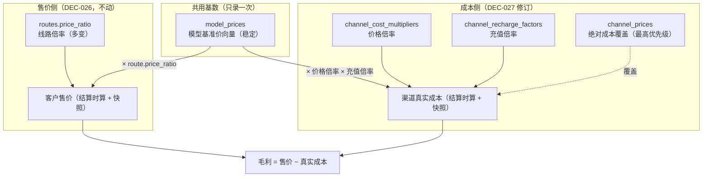

# 改造方案：成本基数改用模型基准价（退役 `model_reference_costs`）

> 提议 **DEC-031**（pending，待审）。修订 **DEC-027**（渠道成本倍率）：保留「价格倍率 × 充值倍率 + 绝对覆盖」整套机制，**去掉重复的「模型参考成本」表**——**`model_prices`（模型基准价）就是成本基数**，不必再录一次。
>
> - 撰写基准：对照当前工作区代码（`unio-api` / `unio-admin`，migrations 已 consolidation 为 36 表）逐文件勘探。
> - **阅读约定**：英文/专业词首次出现配「（中文解释）」；复杂逻辑用「小明」实例。
> - 本文 = 设计 + 执行计划合一。先读 §1 / §2，再按 §7 实施。
> - **与 `DESIGN-channel-cost-multiplier.md` 的关系**：该文仍是 DEC-027「倍率成本」正文；**成本基数来源以本文为准**（本文落地后，旧文中凡写「`model_reference_costs` 作基数」的段落视为被修订）。
>
> **审核修订（rev.1，对照当前代码逐处复核）**：修正 3 处与现状不符 + 补 5 处事实，均带 file:line 证据：
> 1.（**更正**，最关键）删除「复用售价侧已透传的 `ModelPriceID`（同源）」说法——**售价侧根本没有这个 pin**：`router.go:443` 由 `base.id` 填了 `candidate.ModelPriceID` 但下游全程不消费；`ChatSettlementParams`（`settlement.go:78-112`）无此字段，两个 `attempt_runner*.go` 都不透传，`price_snapshots`（`migrations/000029`）无 `model_price_id` 列。收入靠路由预算好的 `params.SalePrice`（`settlement.go:626`）。正确做法唯一：把**成本** pin `ModelReferenceCostID` **重命名**为 `CostBaseModelPriceID`，从**已有** `candidate.ModelPriceID` 填（成本 pin 链 candidate→params→settlement→snapshot 已存在，改动小）。见 §2、§5.3。
> 2.（**更正**）`cost_snapshots.model_reference_cost_id` **现为可空 `bigint` 且故意无 FK**（`migrations/000018:47-51`，权威是冻结金额列，配置表可删不破历史）。§4.1 原「FK 改为 REFERENCES model_prices」是回归——应**只 rename 列、保持无 FK**。`settlement_recovery_jobs` 同（`migrations/000032:88-90`）。见 §4。
> 3.（**更正**）「不可售」有**两个独立成因**，且徽标逻辑是**全新**而非微调：路由 `FindRouteCandidates` 要求 `refcost.id IS NOT NULL AND mult.id IS NOT NULL`（`channel_models.sql:157`）；**且** admin 徽标 `has_price`/`bindings_available`（`admin/model.sql`、`admin/channel.sql:580`）**只查 `channel_prices`，从不看倍率/基准价**。两者都要改，后者是净新增逻辑、需独立测试。见 §5.1。
> 4.（**利好**）`FindActiveModelPrice(model_id, at_time)` **已存在但零调用者**（dead code，`sql/queries/api/model_prices.sql:1`）；`resolveActiveSettlementCost` 现用 `FindActiveModelReferenceCost`（`settlement.go:267`）。改造只需把兜底改调**已存在**的 `FindActiveModelPrice`，无需新写查询。见 §5.3。
> 5.（**利好**）`model_prices` 与 `model_reference_costs` 列 **1:1**（`*_price`↔`*_cost`，`migrations/000027`/`000028`），且 `FindRouteCandidates` 的 `base`(model_prices) LATERAL **已 SELECT 全价格向量**（`channel_models.sql:39-48`），删 `refcost` 后 `base.*` 直接够用建成本快照，无需加 SQL 列。`ModelPriceToProviderCost` 映射函数确认**尚未实现**，须新增并三处（路由/结算/预览）共用。见 §5.5。
> 6.（**补**）售价/成本**解析路径不对称**：成本侧有 `attemptStart` 重查兜底（`resolveActiveSettlementCost`），售价侧无（只信 `params.SalePrice`）。故 §2「售价成本同源」宜表述为「共用同一 `model_prices` **基数行**」，而非「共用同一 pin/解析路径」。
> 7.（**补**）`DECISIONS.md` 目前止于 DEC-030，**DEC-027 与 DEC-031 都无独立 `##` 章节**（DEC-027 正文只在 DESIGN 文档）。§7 阶段 4 落地时应**同时补写 DEC-027 与 DEC-031** 两条决策。
> 8.（**补**）drop `model_reference_costs` 前须加硬门禁：确认无 pending `settlement_recovery_jobs` 引用 refcost id（replay 会解析失败）；rename 时历史 `cost_snapshots.model_reference_cost_id` 非空值须先全部置 NULL（旧值是 refcost id，作 model_price id 无意义）。见 §4、§7。

---

## 1. 一句话与模型

**一句话**：运维只配一次 **模型基准价 `model_prices`**；**客户售价 = 基准价 × 线路倍率**，**渠道真实成本 = 同一基准价 × 渠道价格倍率 × 充值倍率**（或走 `channel_prices` 绝对覆盖）。**不再维护 `model_reference_costs`。**

**概念锚点（修订后）**：

| 概念 | 语义 | 变化频率 | 去留 |
|---|---|---|---|
| **`model_prices`** | **模型基准价**：售价与成本的**共用基数**（名义币种向量）。配置口径 = 上游官方/牌价（或你选定的 list price） | 低（官方调价才动） | **保留并升格** |
| **`routes.price_ratio`** | 线路售价倍率 | 中 | 保留 |
| **`channel_cost_multipliers`** | 中转价格倍率（默认 / 逐模型） | 高 | 保留 |
| **`channel_recharge_factors`** | 充值倍率（名义→真实结算币种） | 高 | 保留 |
| **`channel_prices`** | 绝对真实成本覆盖 | 例外 | 保留 |
| **`model_reference_costs`** | 曾作「上游参考成本」、与基准价结构几乎同构 | — | **退役删除** |

**为什么现在还「挂不上 / 不可售」**：`FindRouteCandidates` 倍率路径要求 `model_reference_costs` **且** `channel_cost_multipliers`；运维已配 `model_prices` + 渠道倍率、但未再录参考成本 → 路由排除。管理台 `bindings_available` / `has_price` 仍只看 `channel_prices`，徽标「不可售」与真实可售条件也不一致。本改造一次修语义与运维路径。

---

## 2. 决策（DEC-031，pending）与「为什么这样选」

**决策**：

1. **成本基数 = `model_prices`**：倍率路径下  
   `真实成本 = ScaleProviderCostByFactors(model_prices 向量映射为成本向量, 价格倍率, 充值倍率)`。
2. **退役 `model_reference_costs`**：删表、删 admin CRUD / UI / sqlc / 路由 JOIN / 结算 pin 对该表的依赖。
3. **成本 pin 改钉 `model_prices.id`**：`cost_snapshots.model_reference_cost_id` **重命名**为 `cost_base_model_price_id`，**保持可空、保持无 FK**（沿用现状：`model_reference_cost_id` 本就无 FK，审计权威是冻结金额列，配置表可删不破历史；见 rev.1-②）。数据来源 = 路由**已计算**的 `candidate.ModelPriceID`（`router.go:443`，取自 `base.id`），经成本 pin 链透传落库。
   > **勘误**：初稿称「与售价侧已有的 `ModelPriceID` **同源**、复用其透传」——经核实**售价侧无此 pin**（`params.SalePrice` 是路由预算好的售价向量，`price_snapshots` 无 `model_price_id` 列）。`candidate.ModelPriceID` 虽在路由算出但下游从不消费；本改造要做的正是把它接进**成本** pin 链（成本侧已有 candidate→params→settlement→snapshot 通道，只需 rename 字段并填值）。
4. **管理台「可售 / 可用绑定」与路由对齐（净新增逻辑）**：`has_price` / `bindings_available` 当前**只查 `channel_prices`**（`admin/model.sql`、`admin/channel.sql:580`，从不看倍率/基准价），改为 = 有绝对覆盖 **或**（有基准价 **且** 有可用价格倍率）；不再要求参考成本表。**这是重写而非微调**，需独立单/集成测试（见 §5.1、§8）。

**为什么砍参考成本表（不是再加一层抽象）**：

| 现状痛点 | 说明 |
|---|---|
| **双录** | `model_prices` 与 `model_reference_costs` 列几乎一一对应（`*_price` ↔ `*_cost`），运维同一模型录两遍 |
| **易漏** | 只配基准价 + 渠道倍率仍被判「未定价」——正是当前「Enabled · 不可售」根因之一 |
| **心智冲突** | DEC-026 已说「基准价」；DEC-027 又造「参考成本」——两个「稳定基数」说不清谁才是权威 |
| **对称性更好** | 售价 / 成本都从同一 `model_prices` 出发，只差各自倍率；毛利直觉 = `基准 × (线路倍率 − 价格倍率×充值倍率)`（同币种下） |

**不选的方案**：

| 方案 | 为何不选 |
|---|---|
| 保留参考成本、UI 默认从基准价「一键复制」 | 仍是双事实源；窗口版本不同步时继续漂移 |
| 物化 `channel_prices = 基准×倍率` | 回退 DEC-027 已否决的物化路径；行膨胀 + 双写 |

**审计不变量（不变）**：`cost_snapshots` 仍冻结**绝对真实成本向量** + 倍率标量 + 来源行 id；历史请求不随后续改价/改倍率漂移。权威金额仍是快照列，来源 id 供复算与展示。

---

## 3. 计费语义

### 3.1 成本解析优先级（路由 / 结算一致）

对 (channel C, model M) 在时刻 t：

1. **绝对覆盖**：有启用中的 `channel_prices`（或 pin 的 `ChannelPriceID`）→ 直接用为真实成本，**不再乘任何倍率**。
2. **倍率路径**：否则需同时具备  
   - 启用中的 **`model_prices`（基准价）**，且  
   - 启用中的 **`channel_cost_multipliers`**（逐模型覆盖优先于渠道默认）。  
   → `真实成本 = 基准价向量 × 价格倍率 × 充值倍率`；充值倍率缺省 **1.0**。
3. **否则未定价**：路由排除；结算报错。

> **已删除**：原「缺 `model_reference_costs` 即未定价」规则。基准价缺失时售价侧本就不能路由（`FindRouteCandidates` 对 `base` 已是 INNER JOIN），成本侧自然同命运。

### 3.2 售价 / 冻结 / 扣费（不动）

- 冻结 / 扣费仍只用售价（`model_prices × routes.price_ratio`）。
- 成本只进结算、敞口、毛利；**改成本倍率不影响冻结额**。

### 3.3 配置口径（给运维的一句话）

> **`model_prices` 填上游牌价（名义）**；用 **线路倍率** 决定卖多少；用 **渠道价格倍率 + 充值倍率** 还原真实进货成本。三者各改各的，互不顶替。

若历史上有人把 `model_prices` 配成「已含加价的卖价」、线路倍率恒 1.0，而另用参考成本录牌价——落地前需把基准价改回牌价、把加价挪到线路倍率（§7 数据迁移检查清单）。

### 3.4 用户实例

> **实例 A（当前痛点消失）**：模型已有基准价，渠道已设默认价格倍率 1.2 + 充值倍率。**不必再录参考成本** → 绑定即可路由；管理台显示可售。
>
> **实例 B（一处改官方价）**：官方调价 → 只新建一条 `model_prices`。所有线路售价与所有倍率路径渠道成本同步按新基数生效；历史快照不变。
>
> **实例 C（中转改倍率）**：仍只改 `channel_cost_multipliers` 一处（DEC-027 价值保留）。
>
> **实例 D（例外）**：某渠道不按倍率 → `channel_prices` 绝对覆盖，行为不变。

---

## 4. 数据模型改动（新号从现库最大迁移之后起；consolidation 后为 **000036**，实施前以仓库为准）

- [ ] **`000037_cost_base_from_model_price`（建议单文件原子改）**：
  1. `cost_snapshots`：`model_reference_cost_id` **RENAME** → `cost_base_model_price_id`，**保持可空、保持无 FK**（现状即无 FK，`migrations/000018:47-51`）。**勿新增** `REFERENCES model_prices(id)`——`cost_snapshots` 是 append-only 审计表，权威是冻结金额列；加硬 FK 会阻断 `model_prices` 硬删、且历史行旧值（refcost id）无法通过约束校验（详见 §9「勿加 FK」）。**rename 前**先把该列全部非空历史值 `UPDATE ... SET = NULL`（旧值是 refcost id，作 model_price id 无意义；金额列仍权威）。
  2. `settlement_recovery_jobs`：同列 rename（`migrations/000032:88-90`，同样保持可空无 FK）；historical 非空值同样先置 NULL。
  3. **DROP** `model_reference_costs` 及其 sequence / 索引 / exclusion（down：可重建空表结构，**不保证**恢复已删数据）。**前置硬门禁**：确认无 `status` 仍活跃、且无 pending `settlement_recovery_jobs` 引用 refcost id 的在途 replay（否则 replay 解析失败）——见 §7 阶段 1。
- [ ] **不改** `model_prices` / `channel_cost_multipliers` / `channel_recharge_factors` / `channel_prices` 表结构。
- [ ] （可选）`model_prices` 表注释从「基准客户售价」改为「模型基准价（售价与成本共用基数）」——仅注释/文档，无 schema 强制。

**历史数据策略（诚实）**：

- 已结算请求：`cost_snapshots` 金额列不动 → **账单不变**。
- 未结算 / 在途：应极少；发布窗口避免长挂起请求，或接受回退路径按新规则用 `model_prices` 重算。
- 若库中仍有启用的 `model_reference_costs` 且与 `model_prices` **金额不一致**：上线前人工对齐（以将采用的基准价为准），见 §7 门禁。

---

## 5. 后端改动

### 5.1 sqlc / SQL

- [ ] **`sql/queries/api/channel_models.sql` · `FindRouteCandidates`（核心）**：
  - **删除** `refcost` LATERAL（`model_reference_costs`）。
  - 已定价过滤改为：  
    `cost.id IS NOT NULL OR mult.id IS NOT NULL`  
    （`base` 已 INNER JOIN，基准价必然存在）。
  - 倍率路径成本向量：SQL **不再**回 ref 成本列；Go 用已取的 **`base.*` 价格列**映射为 `ProviderCostSnapshot` 再 `ScaleProviderCostByFactors`（精度仍只走 Go，与现状一致）。
  - 行字段：去掉 `model_reference_cost_id` / `ref_*`；pin 成本基数用已有 **`model_price_id`**（即 `base.id`）。
- [ ] **删除** admin/api 中一切 `model_reference_costs` 查询（`Create/Get/List/FindActive/Update...`）。
- [ ] **`cost_snapshots` / `settlement_recovery_jobs` 查询**：列名改为 `cost_base_model_price_id`。
- [ ] **`sql/queries/admin/model.sql`（及 `admin/channel.sql:580` channel 侧同类）· `has_price` / `bindings_available`（净新增逻辑，非微调）**：
  - **现状**：两者**只 `EXISTS(channel_prices ...)`**，完全不看 `channel_cost_multipliers` / `model_prices`——这是「有基准价+渠道倍率却仍判不可售」的**第二个独立成因**（第一个在路由 `FindRouteCandidates`）。
  - 可用绑定：启用绑定且（该 (channel,model) 有启用 `channel_prices` **或** 该 channel 有对该 model 生效的价格倍率——含默认 `model_id IS NULL`）。
  - `has_price`：模型存在启用基准价，且至少一条绑定满足上式（或存在任意启用绝对覆盖）——**与路由「可卖」对齐**，消灭假「不可售」。
  - ⚠ 因是**重写**而非微调，需专门的集成测试覆盖「仅倍率路径定价」的可售判定（§8）。
- [ ] `sqlc generate`。

### 5.2 路由 `internal/core/routing/router.go`

- [ ] `ChatRouteCandidate`：**删除** `ModelReferenceCostID`；倍率路径成本基数 pin = 已有 `ModelPriceID`。
- [ ] `resolveCandidateCost`：覆盖路径不变；倍率路径用 `row` 的 base 价格列 → 映射成本向量 → `ScaleProviderCostByFactors`；返回的 reference pin 改为 `row.ModelPriceID`（或不再单独返回，直接用字段）。
- [ ] 测试假数据 / `routing_test.go` / `bootstrap/routing_test.go`：去掉「必须有 ModelReferenceCostID」断言，改为「有 ChannelPriceID 或（ModelPriceID + ChannelCostMultiplierID）」。

### 5.3 结算 / 恢复

- [ ] `ChatSettlementParams`（实际类名，非 `SettlementParams`）/ `settlementCostPins`：字段 `ModelReferenceCostID` → **`CostBaseModelPriceID`**，值取自路由透传的 `candidate.ModelPriceID`。
  > **勿走「复用售价 `ModelPriceID`」的捷径**：初稿建议「单一 `ModelPriceID` 售价与成本共用」——但售价侧**根本没把 `ModelPriceID` 透传进 `ChatSettlementParams`**（`settlement.go:78-112` 无此字段；收入用 `params.SalePrice`）。所以不存在可复用的既有字段，老老实实在**成本** pin 上 rename + 填 `candidate.ModelPriceID` 即可（`attempt_runner*.go` 已透传其余成本 pin，加这一个字段同通道）。
- [ ] `resolvePinnedMultiplierCost`：`GetModelReferenceCost` → `GetModelPrice`；校验 `price.ModelID == modelID`；`scaledMultiplierCostSnapshot` 吃 `ModelPriceToProviderCost(price)` 的映射结果。
- [ ] `resolveActiveSettlementCost`（`settlement.go:249-305`）：`FindActiveModelReferenceCost`（现 `settlement.go:267`）→ **`FindActiveModelPrice`**。**利好**：`FindActiveModelPrice(model_id, at_time)` **已存在**（`sql/queries/api/model_prices.sql:1`），当前是 **dead code（零调用者）**，本改造正好把它接上；无需新写查询。注意这是成本侧兜底重查；售价侧不重查（无对称路径），不必改。
- [ ] 写 `cost_snapshots`：填 `cost_base_model_price_id`；幂等校验改认新列。
- [ ] `settlement_recovery*`：pin 列同步；replay 按新 pin 复算。
- [ ] `attempt_runner` / `_stream`：停止透传 `ModelReferenceCostID`。

### 5.4 Admin API

- [ ] **删除** `service/admin/modelreferencecost`、`adminapi` 下 reference-costs 路由注册与 handler。
- [ ] 渠道成本倍率 / 充值倍率 / 绝对覆盖 API **保留**；文案改为「基数 = 模型基准价」。
- [ ] 请求详情 DTO：费用明细「上游参考价」改为展示 **基准价**（可从 `cost_base_model_price_id` 关联或快照金额反推展示；优先读快照已冻单价，避免改价后详情漂移）。

### 5.5 计费核心

- [ ] `ScaleProviderCostByFactors`（`billing/scale.go:54`）**不改**（仍吃 `ProviderCostSnapshot`，两倍率 `big.Rat` 精确相乘再单次缩放）。
- [ ] **新增** `ModelPriceToProviderCost(mp) ProviderCostSnapshot`（确认现**不存在**）：因 `model_prices` 与 `model_reference_costs` 列 **1:1**，映射是机械对应——`uncached_input_price → UncachedInputCost`、`output_price → OutputCost`、`cache_write_5m/1h/30m_input_price →` 对应 `*Cost`、`reasoning_output_price → ReasoningOutputCost`（NULL 保持）。供路由 `resolveCandidateCost` / 结算 `resolvePinnedMultiplierCost`+`resolveActiveSettlementCost` / 前端预览三处共用，避免手写映射漂移。可直接照抄现 `router.go:473-484` 从 `row.Ref*` 建 snapshot 的写法，改读 base 价格列。

---

## 6. 前端 / 运维体验

### 6.0 心智模型（改后三块）

| 概念 | UI | 说明 |
|---|---|---|
| **模型基准价** | 现有模型定价 / `model_prices` 对话框 | **唯一**基数入口；文案改为「基准价（售价与成本共用）」 |
| **渠道成本倍率** | `ChannelCostMultiplierDialog` | 预览改为 **基准价 × 倍率 × 充值**；**不再请求** `listModelReferenceCosts` |
| **绝对成本覆盖** | `ChannelPricesDialog` | 不变 |

### 6.1 删除

- [ ] `ModelReferenceCostDialog.tsx`、`lib/api/modelReferenceCosts.ts`。
- [ ] 模型菜单「参考成本」入口。
- [ ] 任何「缺参考成本」空态 / 深链。

### 6.2 渠道成本倍率弹窗

- [ ] `referenceByModel` 数据源改为各绑定模型的 **当前 `model_prices`**（已有 model prices API 则复用；按绑定 model_id 批量/并行拉取）。
- [ ] 影响预览表：列名「参考成本」→「基准价」；缺基准价时提示去模型页配价（与售价侧缺价同一深链）。
- [ ] 注释 / toast：「上游名义成本 = 模型基准价 × 价格倍率」。

### 6.3 请求费用明细

- [ ] 「上游参考价」行 → 「成本基数（模型基准价）」；覆盖路径仍显示「绝对成本」。
- [ ] 价格倍率 / 充值倍率展示逻辑保留（读 `cost_snapshots` 快照）。

### 6.4 模型列表可售态

- [ ] 依赖后端修正后的 `has_price` / `bindings_available`；前端徽标无需特判参考成本。

---

## 7. 分阶段实施 + 验收门禁

- **阶段 0｜盘点与对齐**  
  - 统计启用中的 `model_reference_costs` 与同模型 `model_prices` 是否金额一致。  
  - 不一致 → 人工决定以哪份为准写入 `model_prices`。  
  - ✅ 清单签字或确认「库空 / 可弃参考成本」。

- **阶段 1｜后端计费热路径**  
  - **前置门禁（drop 前必过）**：确认无启用中 `model_reference_costs` 未对齐（阶段 0 已做），**且** 无 pending `settlement_recovery_jobs` 引用 refcost id 的在途 replay（否则 replay 解析失败）；rename 列前把 `cost_snapshots` / `settlement_recovery_jobs` 的历史非空 `model_reference_cost_id` 全部置 NULL。  
  - 迁移 000037 → sqlc → `ModelPriceToProviderCost` → `FindRouteCandidates` → `resolveCandidateCost` / `resolveSettlementCost` → recovery → 测试假数据。  
  - ✅ 单测 + 集成：仅有基准价+渠道倍率即可路由/结算；改基准价新请求双边生效；历史快照金额不变；绝对覆盖仍优先；防漂移（pin `candidate.ModelPriceID` → `cost_base_model_price_id`）。

- **阶段 2｜Admin 可售查询 + 删 reference-cost API**  
  - ✅ 模型 ops 表「可售」与真实路由一致（**含仅倍率路径定价**的用例）；reference-cost 路由 404。

- **阶段 3｜前端**  
  - 删参考成本 UI；倍率弹窗改吃基准价；文案替换。  
  - ✅ `tsc`/`eslint`；手测：配基准价+渠道倍率 → 可售可打；不出现「请配参考成本」。

- **阶段 4｜文档**  
  - `DESIGN-channel-cost-multiplier.md` 文首标注「成本基数以 DEC-031 / 本文为准」；`E2E-channel-cost-multiplier.md` 种子从 `model_reference_costs` 改用 `model_prices`（现文 `:68` 仍 seed 参考成本表）；`DECISIONS.md` **补写 DEC-031，并补写 DEC-027**（现文止于 DEC-030，两条都无独立 `##` 章节，正文只在 DESIGN 文档）。

**回滚**：迁移 down 可重建空 `model_reference_costs` 并 rename 列回去，但**已删参考成本行不可恢复**；热路径回滚需同时回退代码。发布前确认无依赖参考成本的外部脚本。

---

## 8. 测试方案

类型：U=单测，I=DB 集成，E=e2e。

- [ ] **U** `ModelPriceToProviderCost`：字段映射 + NULL 保持。
- [ ] **U/I** 倍率路径仅依赖 `model_prices` + multiplier（+ 可选 recharge）；**无** reference cost 行也能算。
- [ ] **I** 已定价过滤：有倍率无覆盖 → 进候选；无倍率无覆盖 → 排除；有覆盖无倍率 → 进候选。
- [ ] **I** 改 `model_prices`：新请求售价与成本基数同时变；旧 `cost_snapshots` / `price_snapshots` 不变。
- [ ] **I** 防漂移：pin 的 `model_price_id` / multiplier id，倒填新窗口不改变在途结算。
- [ ] **I** 管理台 `ModelsOpsTable`：仅倍率路径定价时 `bindings_available≥1` 且可售徽标正确。
- [ ] **I/E** 回归 DEC-027：改渠道倍率一处、多模型成本齐变；充值倍率；绝对覆盖不乘倍率。
- [ ] **I** recovery replay 与首次成本一致（新 pin 列 `cost_base_model_price_id`）。
- [ ] **U** 删除/编译期保证无残留 `model_reference_costs` / `ModelReferenceCost` 生产路径引用（测试 fixture 除外若暂留）。
- [ ] **U/I（勘误项回归）** 结算成本 pin：`resolveActiveSettlementCost` 兜底走**已存在**的 `FindActiveModelPrice`（原 dead code）而非 `FindActiveModelReferenceCost`；`CostBaseModelPriceID` 从 `candidate.ModelPriceID` 落库（验证售价侧未新增/未依赖该 pin）。
- [ ] **I（净新增徽标逻辑）** `has_price`/`bindings_available` 改写后：仅 `channel_prices` 覆盖、仅倍率路径、二者皆无三种组合下，可售徽标与路由 `FindRouteCandidates` 可卖判定**逐条一致**（防止「路由可卖但徽标不可售」或反之）。

---

## 9. 边界与风险

- **语义迁移**：若有人把基准价当「含税卖价」用，砍参考成本后成本会被抬高 → 阶段 0 必须对齐口径（§3.3）。
- **币种**：基准价币种即名义成本币种；充值倍率继续承担名义→结算币种（守 DEC-021 引擎内不跨汇率）。绝对覆盖仍直接填真实结算币种成本。
- **勿给 `cost_snapshots.cost_base_model_price_id` 加 FK（关键，勘误初稿）**：现列 `model_reference_cost_id` **本就无 FK**（`migrations/000018:47-51`），是**有意的**——`cost_snapshots` 为 append-only 审计表，权威是**冻结金额列**，来源 id 仅辅助。若按初稿加 `REFERENCES model_prices(id)`：① 会阻断 `model_prices` 行硬删（破坏"配置表可删不破历史"）；② `ADD CONSTRAINT` 时历史行旧值是 refcost id，在 `model_prices` 无对应 → 约束校验失败（除非先全置 NULL，但那样约束也无意义）。**结论：只 rename、保持无 FK**。`settlement_recovery_jobs` 同理。
- **列 rename**：sqlc/Go/前端 DTO 全量替换 `model_reference_cost_id` → `cost_base_model_price_id`，避免半旧半新。
- **FK 历史 NULL**：rename 时把旧值全部置 NULL（旧 refcost id 作 model_price id 无意义）；详情页"基数行"因此无法深链到历史参考成本——可接受（金额列仍在）；若需考古，阶段 0 先导出 `model_reference_costs` 再删。
- **售价侧无币种换算旋钮（继承 DEC-026）**：线路倍率无量纲、售价侧不做名义→结算币种换算，故 `model_prices` 币种必须**等于收入/结算币种**，毛利才可直接相减。成本侧由充值倍率承担名义→结算换算。"单一基数"框架把这条变成硬约束——校验时锁定 `model_prices.currency` 与结算币种一致。
- **双倍率毛利**：`线路倍率 < 价格倍率×充值` 时毛利为负 → 沿用现有亏本护栏（录入预览红字 / 非阻断确认），不新增引擎拒绝。
- **consolidation 迁移编号**：以实施时 `migrations/` 最大号 +1 为准；若团队选择「重置库 + 改 000028 建表迁移直接不建 reference 表」，仅限**可丢全库**环境，生产应用增量 000037。

---

## 10. 受影响文件清单（对照打勾）

**迁移**：`migrations/000037_*`（+down）。

**后端删**：`service/admin/modelreferencecost/**`、adminapi reference-costs 注册、`sql` 中 `model_reference_costs` 查询、相关测试种子。

**后端改**：`sql/queries/api/channel_models.sql`、`sql/queries/admin/model.sql` + `admin/channel.sql`（`has_price`/`bindings_available` 净新增逻辑）、`cost_snapshots` / `settlement_recovery_jobs` 查询（列 rename）、`routing/router.go`（删 `ModelReferenceCostID`、pin 用 `ModelPriceID`）、`lifecycle/settlement.go`（单数文件；`ChatSettlementParams`/`settlementCostPins` 改名、`resolvePinnedMultiplierCost`+`resolveActiveSettlementCost` 改吃 `model_prices`、幂等校验认新列）、`settlement_recovery.go`、`attempt_runner.go`/`attempt_runner_stream.go`（透传 `candidate.ModelPriceID`）、`billing.ModelPriceToProviderCost`（新增）、sqlc 生成物、`cmd/e2e-costmult`、blackbox fixture。

**前端删**：`ModelReferenceCostDialog.tsx`、`lib/api/modelReferenceCosts.ts`、模型页入口。

**前端改**：`ChannelCostMultiplierDialog.tsx`、`scaleProviderCost.ts` 注释、`cost-breakdown.tsx`、渠道/模型文案、React Query keys 清理。

**文档**：本文；`DESIGN-channel-cost-multiplier.md` 文首修订声明；`E2E-channel-cost-multiplier.md`；`DECISIONS.md` DEC-031。

---

> 实施前请先审本文（含 rev.1 审核修订）。认可后按 §7 阶段 0→1→2→3→4 推进。  
> **核心不变量：`真实成本 = model_prices × 渠道价格倍率 × 充值倍率`（或绝对覆盖）；基准价只维护一份；历史快照金额不漂移。**  
> **三处落地要点（rev.1 校正）：① 成本 pin = rename `model_reference_cost_id`→`cost_base_model_price_id`，值取 `candidate.ModelPriceID`（售价侧无此 pin 可复用）；② 该列保持可空、无 FK；③ 「不可售」两成因（路由 + admin 徽标）都要修，徽标是净新增逻辑。**
