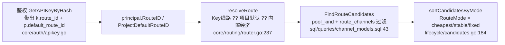

# 落地方案：API Key 直挂渠道 + 选路策略（线路 route 整条退役）

> 本文是「把用户侧选路从『线路 route』模型迁移到『API Key 直接挂渠道集合 + 策略』模型」的**落地设计文档**。
>
> - 撰写基准：2026-06-28，对应当前工作区代码（`unio-api` / `unio-admin` 均在 `main`）。
> - 文档来源：**通读真实代码**后整理（`internal/core/routing`、`internal/service/gateway/lifecycle`、`internal/core/auth`、`internal/app/adminapi`、`sql/queries/*`、`migrations/*` 以及 `unio-admin/src` 全量线路引用），不依赖任何旧设计文档。
> - **阅读约定**：所有英文 / 专业词第一次出现时后面紧跟「（中文解释）」；复杂逻辑一律用「小明发请求」这种用户实例解释，不空讲。
> - 本文**只是方案**，不含代码改动。实现请按「§9 实施顺序」执行。
>
> **本次已锁定的决策（用户拍板）**：
> 1. **Key 不选渠道 = 不让创建**（没有"空渠道兜底"，强制至少选 1 个渠道）。
> 2. **线路 route 立即整条退役**（不等上线，本次连表带代码带前端一起删）。
> 3. 策略由平台提供，用户只选；定价沿用「价在渠道」。
> 4. `channels.customer_selectable`（渠道是否对客户可选）默认 `true`，私有/测试渠道由管理员手动关。
> 5. 后台必须能**代用户操作**每一项设置（见 §6 控制面映射表）。

---

## 0. 名词速查表（先读这一节）

| 词 | 解释 |
|----|----|
| **gateway（网关）** | 我们自己的服务。客户把请求发给它，它再转发给真正的大模型上游。 |
| **upstream（上游）** | 真正的大模型服务商（OpenAI、Anthropic、DeepSeek…）。我们要付钱给它。 |
| **channel（渠道）** | 一条「用某 provider 的某把 key、调某个上游模型」的具体通道。一个模型可绑多个渠道。**售价（卖给客户的价）记在渠道上**（`channel_prices`）。 |
| **route（线路）** | 旧概念：管理员在后台建的「渠道池 + 策略」组合，用户只能选不能建。**本方案要删除它。** |
| **new-api** | 业内常见的开源 LLM 网关。它把「售价」记在**分组（group）**上，用户选分组；与我们「售价记在渠道」不同。 |
| **selection_strategy（选路策略）** | 当一把 Key 挂了多个渠道时，按什么顺序去试这些渠道。本方案取值：`cheapest`/`stable`/`custom`。 |
| **candidate（候选）** | 这次请求**实际可用**的渠道有序列表。第 1 个失败就换下一个。 |
| **fallback（兜底切换）** | 第 1 个候选渠道失败时，自动换下一个候选重试。 |
| **routing（路由 / 选路）** | 决定「这次请求能用哪些候选渠道、按什么顺序」。 |
| **api_key_channels（新表）** | 本方案新增：记录「某把 Key 选了哪些渠道，每个渠道的 priority/weight」。 |
| **priority（优先级）** | `custom` 策略下，数字越小越先尝试。 |
| **weight（权重）** | `custom` 策略下，同一 priority 内按权重做加权随机分流（负载均衡）。 |
| **customer_selectable（渠道可选）** | 新增渠道字段：该渠道是否出现在「用户建 Key 选渠道」的候选清单里。默认 `true`。 |
| **reservation / pre-authorize（冻结 / 预授权）** | 调上游**之前**先按预估把钱冻结住，保证用户付得起（不是真扣）。 |
| **capture（确认扣费）** | 请求成功后按真实用量真正扣钱。 |
| **settlement（结算）** | 「写用量 + 写价格快照 + 扣钱 + 标记成功」整套事务。 |
| **migration（数据库迁移）** | 一个带版本号的 SQL 脚本，按顺序修改数据库结构（建表/加列/删表）。 |
| **sqlc** | 把 `sql/queries/*.sql` 编译成类型安全 Go 代码（`internal/platform/store/sqlc/*.sql.go`）的工具。改了 `.sql` 必须重新生成。 |
| **DTO（数据传输对象）** | HTTP 接口请求/响应体的结构定义。 |
| **principal（鉴权主体）** | API Key 认证后得到的上下文对象，携带 key id、所属项目、限流上限等，供下游使用。 |

---

## 1. 背景：为什么能/要干掉「线路」

### 1.1 现状（删除前）

一次 `/v1/chat/completions` 请求的选路链路（真实代码位置）：



关键事实（全部已核对代码）：

- `routes` 表（`migrations/000032`）：`mode`(cheapest/stable/fixed)、`pool_kind`(all/explicit)、`is_builtin`，并在迁移里种入内置「经济」「稳定」两条。
- `route_channels` 表（`000033`）：`explicit` 线路的渠道池。
- 绑定列（`000034`）：`api_keys.route_id`、`projects.default_route_id`，解析优先级 `Key ?? 项目 ?? 内置经济`。
- 用户**不能自建线路**（后台 CRUD only）；请求里也**不能直接指定渠道**。
- 售价记在**渠道**（`channel_prices`），不是线路。

### 1.2 与 new-api 的差异，以及为什么旧模型「拧巴」

| 维度 | new-api | 我们（旧） |
|------|---------|-----------|
| 用户选的东西 | 分组 group | 线路 route |
| 售价记在哪 | **分组**上（选了分组=确定价） | **渠道**上 |
| 用户能否自建 | 能选分组 | 不能建线路、不能直接选渠道 |

把「线路」当成「new-api 分组」会出现矛盾：new-api 选分组就锁定了价格，而我们一条线路里多个渠道**各有各的价**，"选线路"无法对应一个确定售价。结论：与其引入一个中间实体去模拟分组，不如**让 Key 直接挂渠道 + 策略**——用户看到的就是渠道名与渠道售价，多渠道时由平台策略做 fallback。这样：

- 「线路」这个中间实体**没有存在必要**，可整条退役。
- 配置和 Key 一一对应，UX 直观，后台也能逐 Key 代为操作。

### 1.3 «线路能不能干掉?» —— 能，整条删

下列全部退役（详见 §4.10 / §5.3）：

- 表：`routes`、`route_channels`；列：`api_keys.route_id`、`projects.default_route_id`。
- 后端：线路 CRUD（`/admin/v1/routes*`）、线路作战台 ops、`resolveRoute`/`GetBuiltinCheapestRoute` 等。
- 前端：线路页 `/routes`、`/routes/:routeId`、侧栏入口、线路 API client、相关列与 dashboard「线路维度」。

唯一需要补的是「Key 必须挂渠道」——因为**取消了"无渠道兜底"**（用户决策 1），所以**建 Key 时强制至少选 1 个渠道**；存量 Key 通过迁移回填渠道（见 §9 决策 D6）。

---

## 2. 目标数据模型（删除后）

```sql
-- api_keys：去掉 route_id，加 selection_strategy
api_keys
  + selection_strategy TEXT NOT NULL DEFAULT 'cheapest'
      CHECK (selection_strategy IN ('cheapest','stable','custom'))
  - route_id   （删除，连同 idx_api_keys_route_id）

-- 新表：Key 选了哪些渠道（多对多）+ 每渠道 priority/weight
api_key_channels
  api_key_id BIGINT NOT NULL REFERENCES api_keys(id)  ON DELETE CASCADE
  channel_id BIGINT NOT NULL REFERENCES channels(id)  ON DELETE RESTRICT
  priority   INT    NOT NULL DEFAULT 0   -- custom 用，越小越先
  weight     INT    NOT NULL DEFAULT 0   -- custom 用，同级加权随机；全 0 = 按 priority 稳定 fallback
  PRIMARY KEY (api_key_id, channel_id)
  -- 反向索引：删/停渠道时快速查"谁在用它"
  INDEX idx_api_key_channels_channel ON api_key_channels(channel_id)

-- channels：加"是否对客户可选"
channels
  + customer_selectable BOOLEAN NOT NULL DEFAULT true

-- projects：去掉默认线路
projects
  - default_route_id  （删除）

-- 整表删除
routes / route_channels  （DROP）
```

**`ON DELETE RESTRICT` 的用意**：渠道一旦被某把 Key 选中，就**禁止直接删除**（删会报 `23503` 外键冲突，上层降级为 409 冲突）。这样避免「用户 Key 指向的渠道凭空消失」。管理员要删渠道，先把它从各 Key 移除或停用（见 §9 决策 D2）。

**选路语义（after）**：

```
候选 = 该 Key 的 api_key_channels
       ∩ 支持请求 model 的渠道(channel_models, enabled)
       ∩ 同 ingress 协议
       ∩ 项目 allow/deny 策略
       ∩ 当前有生效 enabled 售价(channel_prices)
       ∩ 渠道/provider 均 enabled
→ 按 selection_strategy 排序（cheapest/stable/custom）
→ 逐个 fallback
```

> 因为取消了"空池兜底"：若上述交集为空（例如 Key 选的渠道都不支持该模型，或都停用了），直接返回 `no_available_channel`（无可用渠道），语义透明。

---

## 3. 选路与计费语义（含用户实例）

### 3.1 三种策略

| 策略 | 含义 | 排序口径（在 `lifecycle/candidates.go` 完成） |
|------|------|-----------------------------------------------|
| `cheapest`（经济） | 优先最便宜渠道 | 按售价升序：`output_price` 为主键，`uncached_input_price` 次之（**沿用现有 `saleSnapshotLess`**） |
| `stable`（稳定） | 优先最健康渠道 | 按渠道健康分升序（**沿用现有 `ChannelHealthScore`**）；无健康分时退化为 priority 基序 |
| `custom`（自定义） | 用户自定优先级 + 同级加权随机 | **新增**：`api_key_channels.priority` 升序；同 priority 内按 `weight` 加权随机一次，得到稳定 fallback 顺序 |

### 3.2 资金语义（无需改动，已具备）

- **冻结（pre-authorize）**：按候选池**最大售价 × 最大输出上限**做保守冻结（现有 `CandidateMaxOutputTokens` + `CandidateSalePrices`，`lifecycle/candidates.go:86-105`）。多渠道 fallback 命中任一渠道都不会冻结不足。
- **扣费（capture）**：按**实际命中**的那个渠道的售价结算（现有 settlement）。
- **价超冻结**：超出部分平台核销（现有 `write_off`），用户余额不为负。

> 即：多渠道选路对**资金正确性零影响**——它只改"试哪些渠道、什么顺序"，不改"按命中渠道真实计费"。这一点是本方案能安全落地的关键。

### 3.3 定价透明性

- **单渠道 Key**：候选恒为 1 个渠道，价格完全确定（等价于 new-api 选了一个分组）。
- **多渠道 Key**：用户能在建 Key 时看到**所选每个渠道的售价**；命中哪个就按哪个收。`cheapest` 下通常命中最便宜的，只有它故障才 fallback 到更贵的（届时按更贵的真实收，仍透明）。

### 3.4 用户实例

> **实例 A（单渠道，固定价）**：小明建 Key 选了「DeepSeek-直连」一个渠道，策略随意。所有请求只走这一个渠道，价格 = 该渠道售价，确定无歧义。
>
> **实例 B（多渠道，经济）**：小红建 Key 选了「DeepSeek-A($1)、DeepSeek-B($1.2)、DeepSeek-C($1.5)」三个渠道 + `cheapest`。正常命中 A($1)；A 熔断时自动 fallback 到 B($1.2)，按 $1.2 真实收费。
>
> **实例 C（自定义优先级 + 权重）**：小刚建 Key 选了「主力渠道(priority=0, weight=7)、备份渠道甲(priority=0, weight=3)、灾备渠道(priority=1)」+ `custom`。priority=0 这层在主力/备份甲间按 7:3 加权随机分流（负载均衡）；两者都挂了才降到 priority=1 的灾备。
>
> **实例 D（候选为空）**：小美建 Key 只选了「渠道 X」，后来管理员把 X 停用了。小美发请求 → 候选为空 → 返回 `no_available_channel`。管理员在后台给小美的 Key 补一个可用渠道即可恢复（§6）。

---

## 4. 后端改动（unio-api，逐项 + 文件/行号）

### 4.1 迁移（migrations，新增 4 个，最大现号 000053）

| 文件 | 内容 |
|------|------|
| `000054_create_api_key_channels.up.sql` | 建 `api_key_channels` 表（见 §2 DDL）+ `idx_api_key_channels_channel` |
| `000055_add_api_keys_selection_strategy.up.sql` | `ALTER TABLE api_keys ADD COLUMN selection_strategy TEXT NOT NULL DEFAULT 'cheapest' CHECK (...)`，风格对齐 `000052` |
| `000056_add_channels_customer_selectable.up.sql` | `ALTER TABLE channels ADD COLUMN customer_selectable BOOLEAN NOT NULL DEFAULT true`，风格对齐 `000053` |
| `000057_drop_route_concept.up.sql` | 顺序：`DROP INDEX idx_api_keys_route_id` → `api_keys DROP COLUMN route_id` → `projects DROP COLUMN default_route_id` → `DROP TABLE route_channels` → `DROP TABLE routes` |
| （可选）`000058_backfill_api_key_channels.up.sql` | 存量 Key 回填渠道（见 §9 决策 D6） |

每个 up 都要配套写 `*.down.sql`（reverse）。`000057.down` 需重建 routes/route_channels/列与内置种子（即把 `000032/000033/000034` 的 up 内容复刻进来），保证可回滚。

> ⚠️ 顺序约束：`route_channels` 同时外键引用 `routes` 和 `channels`，必须先 drop `route_channels` 再 drop `routes`；`api_keys.route_id`/`projects.default_route_id` 外键引用 `routes`，必须在 drop `routes` 之前先 drop 这两列。

### 4.2 sqlc 查询（`sql/queries/*`）

**新增** `sql/queries/api_key_channels.sql`：
- `ListAPIKeyChannels(api_key_id)` —— 列出某 Key 的渠道 + priority/weight（带渠道名/provider 供后台展示）。
- `ReplaceAPIKeyChannels`（事务内 `DELETE` + 批量 `INSERT`）—— 整体替换一把 Key 的渠道集合。
- `CountAPIKeyChannels(api_key_id)` —— 校验"至少 1 个渠道"。
- `ListSelectableChannels()` —— `customer_selectable=true AND status='enabled'` 的渠道（名/支持模型/售价），供建 Key 的选择器。

**改造** `sql/queries/channel_models.sql`：
- 把 `FindRouteCandidates` 改名为 **`FindApiKeyChannelCandidates`**：
  - 删 L112-119 的 `pool_kind`/`route_id`/`route_channels` 分支；
  - 新增 `JOIN api_key_channels akc ON akc.channel_id = c.id AND akc.api_key_id = sqlc.arg(api_key_id)`；
  - SELECT 增加 `akc.priority, akc.weight`（供 `custom` 排序）；
  - 参数：`api_key_id, project_id, requested_model_id, ingress_protocol, at_time`（去掉 `pool_kind/route_id`）；
  - 其余过滤（model/cm/channel/provider enabled、协议、项目 allow/deny、已定价 LATERAL）**保持不变**；
  - `ORDER BY c.priority ASC, c.id ASC` 保留为稳定基序。
  - 关于是否额外加 `AND c.customer_selectable` —— 见 §9 决策 D5（推荐**不**在路由层再过滤，binding 即事实）。

**改造** `sql/queries/api_keys.sql`：
- 删除 `route_id` 出现的所有位置：`CreateAPIKey` 的列与 RETURNING、`GetAPIKeyByHash` 的 `k.route_id, p.default_route_id`、`GetAPIKeyByID`、`ListAPIKeysByProjectPage`、各 UPDATE RETURNING、以及 `SetAPIKeyRoute`（整条删）。
- 新增 `selection_strategy`：`CreateAPIKey` 列 + 所有 RETURNING + `GetAPIKeyByHash`（路由要用）+ 新增 `SetAPIKeySelectionStrategy`。

**改造** `sql/queries/projects.sql`：删 `default_route_id` 全部出现 + `SetProjectDefaultRoute`。

**整文件删除**：`sql/queries/routes.sql`、`sql/queries/route_channels.sql`、`sql/queries/routes_ops.sql`。

**dashboard / ops 连带**：
- `sql/queries/dashboard_radar.sql` L130-194 `DashboardBreakdownRoute` —— 删或改（见 §9 决策 D7）。
- `sql/queries/customer_ops.sql` L126/L140/L185-196 —— 去掉 `JOIN routes`、`default_route_name`/`route_name`。
- `sql/queries/channels_ops.sql` L290-296 `ChannelOpsRoutes` —— 删（改为"引用本渠道的 Key"，见 §9 决策 D8）。
- `sql/queries/channels.sql` L89-90 注释里 `route_channels` —— 改为 `api_key_channels`（删渠道时被它 RESTRICT）。

**重新生成**：改完 `.sql` 后 `sqlc generate`，`internal/platform/store/sqlc/` 下 `routes*.sql.go`、`route_channels.sql.go` 消失，`api_key_channels.sql.go` 生成，`models.go` 去掉 `Route`/`RouteChannel`、`ApiKey.RouteID`、`Project.DefaultRouteID`、新增 `ApiKey.SelectionStrategy`/`Channel.CustomerSelectable`/`ApiKeyChannel`。

### 4.3 选路引擎 `internal/core/routing/router.go`

- `ChatRouteRequest`（L52-68）：删 `RouteID`/`ProjectDefaultRouteID`，新增：
  ```go
  APIKeyID         int64  // 用于查 api_key_channels
  SelectionStrategy string // cheapest/stable/custom
  ```
- `ChatRouteCandidate`（L70-94）：新增 `Priority int64`、`Weight int64`（供 `custom` 排序）。
- `ChatRoutePlan`（L96-103）：`RouteMode` 改名 `SelectionStrategy`（或保留字段名、改语义注释；推荐改名以免误导）。
- `Store` 接口（L105-112）：删 `GetRouteByID`、`GetBuiltinCheapestRoute`；`FindRouteCandidates` → `FindApiKeyChannelCandidates`。
- 删 `resolvedRoute`（L114-119）、`resolveRoute`（L232-254）、`loadEnabledRoute`（L256-270）。
- `PlanChat`（L164-220）：去掉 `resolveRoute` 调用，直接 `findCandidateRows`（传 `APIKeyID`），plan 的策略字段取 `req.SelectionStrategy`。
- `findCandidateRows`（L272-340）：参数换成 `api_key_id`，其余三层诊断（model 不存在 / 项目不允许 / 无渠道）逻辑**保留**。
- `buildChatRouteCandidate`（L351-409）：补 `Priority: row.Priority, Weight: row.Weight`。
- `router_test.go`：fakeStore 去 route 方法、改候选 fake；**新增**用例覆盖「Key 多渠道 + 各策略」「候选为空」「custom 优先级/权重」。

### 4.4 鉴权 `internal/core/auth/apikey.go`

- `APIKeyPrincipal`（L30-47）：删 `RouteID`/`ProjectDefaultRouteID`，新增 `SelectionStrategy string`；确认已携带 `KeyID`（路由要用，`GetAPIKeyByHash` 已返回 `k.id`），没有就加。
- `AuthenticateAPIKey`（L69-157）：构造 principal 处（L146-156）改为填 `SelectionStrategy`、`APIKeyID`。

### 4.5 网关入口（构造 `ChatRouteRequest`，共 7 处）

把 `RouteID/ProjectDefaultRouteID` 改成 `APIKeyID/SelectionStrategy`：

| 文件 | 行 |
|------|----|
| `internal/service/gateway/openai/chatcompletions/chat_completion.go` | L47-51 |
| `internal/service/gateway/openai/chatcompletions/chat_stream.go` | L61-62 |
| `internal/service/gateway/openai/responses/create_response.go` | L163-164 |
| `internal/service/gateway/openai/responses/stream_response.go` | L74-75 |
| `internal/service/gateway/anthropic/messages/messages.go` | L47-48 |
| `internal/service/gateway/anthropic/messages/message_stream.go` | L49-50 |
| `internal/service/gateway/openai/responses/input_tokens.go` | **L34-38（当前缺，必须补全 `APIKeyID/SelectionStrategy`）** |

下游 `prepare*Candidates(..., plan.SelectionStrategy, ...)` 传参随之改名。

### 4.6 候选排序 `internal/service/gateway/lifecycle/candidates.go`

- `PrepareCandidatesParams.Mode`（L59-61）→ 改名 `Strategy`（语义对齐）。
- `sortCandidatesByMode`（L184-202）switch 加：
  ```go
  case "custom":
      // priority 升序；同级按 weight 加权随机一次得到稳定 fallback 顺序
  ```
  需要候选携带 `Priority/Weight`（§4.3 已加）。加权随机用请求级一次性 `rand` 打散同级，再 stable 排序固定结果。
- 文件内 `Mode` 相关注释（L13、L59、L178-181）同步更新。

### 4.7 Admin API（`internal/app/adminapi` + `internal/service/admin`）

**API Key（核心新增）**：
- `internal/app/adminapi/api_keys.go`：
  - `createAPIKeyRequest`/`updateAPIKeyRequest`（L77-94）删 `RouteID`，新增 `Strategy *string` 和 `ChannelIDs []ChannelBinding`（`{channel_id, priority, weight}`）。
  - 删 `parseOptionalRouteID`（L13-30）。
  - 新增校验：创建时 **`len(ChannelIDs) >= 1`**（对应用户决策 1），strategy 合法，channel 存在且属同租户、priority/weight ≥ 0。
  - `apiKeyDTO`（L42-61）：`RouteID` → `SelectionStrategy` + `Channels []channelBindingDTO`。
- `internal/service/admin/customer/apikey.go`：
  - `APIKeyCreateParams`/`APIKeyUpdateParams`（L60-87）：删 `RouteID/RouteProvided`，加 `Strategy`、`Channels`、`ChannelsProvided`。
  - `APIKeyStore`（L90-101）：删 `SetAPIKeyRoute`，加 `ReplaceAPIKeyChannels`、`ListAPIKeyChannels`、`SetAPIKeySelectionStrategy`、`CountAPIKeyChannels`。
  - `Create`（L154-223）：事务内创建 Key → 写 `api_key_channels` → 设 strategy；渠道为空报 `invalid_argument`。
  - `Update`（L226-308）：支持改 strategy / 整体替换渠道集合（替换后仍须 ≥1）。
  - `APIKey` 视图（L24-45）：`RouteID` → `SelectionStrategy` + `Channels`。

**Channel（新增可见性开关）**：
- `internal/app/adminapi/channels.go` + `internal/service/admin/channel`：`customer_selectable` 进 create/update DTO 与 service params；`sql/queries/channels.sql` 的 Create/Update/Get/List 带上该列。

**新增只读端点**：`GET /admin/v1/channels/selectable` → `ListSelectableChannels`（建 Key 选择器用）。

**线路相关整体删除**：
- `internal/app/adminapi/router.go` L175-196 的 `/routes*` 全部路由；L141 `/channels/{id}/ops/routes`；Deps（L34-35）`RouteService`/`RouteOpsService`。
- `internal/app/adminapi/routes.go`、`internal/app/adminapi/routes_ops.go`（整文件删）。
- `internal/service/admin/route/`、`internal/service/admin/routeops/`（整目录删）。
- Bootstrap 装配：`internal/bootstrap/admin_server.go` L116-117/L167-168、`internal/bootstrap/admin_http.go` L26-27/L73-74 删 route/routeops。

**Project 默认线路删除**：
- `internal/app/adminapi/projects.go`：删 `DefaultRouteID` DTO、PATCH 里 `SetDefaultRoute` 分支（L79-106）、`parseOptionalRouteID` 引用。
- `internal/service/admin/customer/project.go`：删 `Project.DefaultRouteID`、`SetDefaultRoute`（L89-105）。

**Dashboard / channelops 连带**：
- `internal/service/admin/dashboard/radar.go`：删 `BreakdownRoute`（L116）、`Breakdown` 的 route case（L312-335）。
- `internal/service/admin/channelops/channelops.go`：删 `Routes`（L416-424）、`ChannelOpsRoutes` store 依赖。
- `internal/app/adminapi/customer_ops.go`：删 `DefaultRouteName`/`RouteName` DTO 字段。

**测试**：`internal/app/adminapi/handlers_test.go` L178-538 fakeRouteService 与 routes 用例删；`customer_test.go`、`customer_handlers_test.go`、`bootstrap/routing_test.go` 中 route 相关删/改。

### 4.8 种子与夹具

- `scripts/seed-test-data.sql`：删 routes JOIN（L124-130 项目默认线路、L132-146 Key route_id）；改为「建 Key 后插入 `api_key_channels` + 设 strategy」。
- `internal/blackbox/sdkfixture/fixture.go` 等夹具同步。

### 4.9 后端删除清单速查

| 类型 | 对象 |
|------|------|
| 表 | `routes`、`route_channels` |
| 列 | `api_keys.route_id`、`projects.default_route_id`（+ 索引） |
| SQL 文件 | `routes.sql`、`route_channels.sql`、`routes_ops.sql` |
| Go 文件 | `adminapi/routes.go`、`adminapi/routes_ops.go` |
| Go 目录 | `service/admin/route/`、`service/admin/routeops/` |
| 生成码 | `sqlc/routes*.sql.go`、`route_channels.sql.go`（regenerate 后消失） |
| 函数 | `resolveRoute`/`loadEnabledRoute`/`GetBuiltinCheapestRoute`/`SetAPIKeyRoute`/`SetProjectDefaultRoute` |

---

## 5. 前端改动（unio-admin，逐项）

### 5.1 建/改 API Key（核心）

`src/components/customer/CreateApiKeyDialog.tsx` + `src/lib/api/apiKeys.ts`：

- **删**：`useQuery(["routes"], listRoutes)`（L79/L88-93）与线路 `<Select>`（L253-274）。
- **加**：
  1. **渠道多选器**：拉 `GET /admin/v1/channels/selectable`，每行展示 **渠道名 / 支持模型 / 售价**，复选。**前端校验：必须至少选 1 个**（对应用户决策 1，禁用提交按钮 + 错误提示）。
  2. **策略选择**：`cheapest`/`stable`/`custom` 单选。
  3. **custom 优先级编辑**：选 `custom` 时，对已选渠道展开 priority（拖拽排序或数字）+ weight 输入。
- `apiKeys.ts` 类型：`ApiKey`/`CreateApiKeyInput`/`UpdateApiKeyInput` 删 `route_id/routeId`，加 `strategy` + `channels: {channel_id, priority, weight}[]`。提交 body 改为新字段。
- 可复用 `src/components/routes/RouteFormDialog.tsx` 现有的"渠道勾选 + 策略选择"片段（迁移后再删该文件）。
- **新增**：建议拆出 `ChannelMultiSelect`、`RoutingStrategySelect`、`ChannelPriorityEditor` 三个小组件；并补 **编辑已有 Key 路由配置** 的入口（当前前端无 edit-route UI，`ApiKeysPage.tsx` 行操作里加"编辑路由"）。

### 5.2 渠道表单 `customer_selectable`

`src/components/channels/ChannelFormDialog.tsx` + `src/lib/api/channels.ts`：create/edit 加一个「对客户可选」开关；类型 `Channel`/`CreateChannelInput`/`UpdateChannelInput` 加 `customer_selectable`。

### 5.3 删线路（整文件删）

`src/pages/RoutesPage.tsx`、`src/pages/RouteDetailPage.tsx`、`src/components/routes/RouteFormDialog.tsx`、`src/components/routes/RouteDetailContent.tsx`、`src/components/detail-tables/route-detail-columns.tsx`、`src/components/openstatus-table/routes-os-columns.tsx`、`src/components/ops-tables/routes-columns.tsx`（已是死代码）、`src/lib/api/routes.ts`、`src/lib/api/routesOps.ts`。

### 5.4 连带修改

| 文件 | 改什么 |
|------|--------|
| `src/App.tsx` | 删 lazy import（L43-48）与路由（L110-111） |
| `src/components/layout/AppLayout.tsx` | 删侧栏「线路」（L60）；`isEntityDetailPath` 去掉 `routes`（L100） |
| `src/components/ops-tables/api-keys-columns.tsx` | 「线路」列（L79-84）→ 策略 + 渠道摘要；`toApiKey` 去 `route_id`（L38） |
| `src/lib/api/customerOps.ts` | `ApiKeyOpsRow.route_name`/`ProjectOpsRow.default_route_name`（L71/L91）→ 删或换 |
| `src/components/ops-tables/projects-columns.tsx`、`openstatus-table/projects-os-columns.tsx` | 删「默认线路」列 |
| `src/components/customer/ProjectDetailContent.tsx` | 删副标题「默认线路…」（L44） |
| `src/pages/ApiKeysPage.tsx` | 文案（L89）+ 加「编辑路由」入口 |
| `src/lib/api/dashboard.ts`、`breakdown-table/{constants,navigation,BreakdownDataTable}.tsx` | 删 route 维度 / 改维度（§9 决策 D7） |
| `src/lib/api/channelsOps.ts`、`channels/ChannelDetailContent.tsx`、`detail-tables/channel-detail-columns.tsx` | 删渠道详情「线路」Tab 与 `channelOpsRouteColumns`（§9 决策 D8） |
| `src/components/common/StatusChangeConfirmDialog.tsx` | `StatusEntityLabel` 去「线路」 |
| `src/lib/table-columns.ts`、`data-table/helpers.ts` | 清理 `col.route`/`pool_kind` 预设（`strategy` 预设可留） |

### 5.5 前端校验

`bunx tsc -b --force` 全绿 + `eslint` 通过；手测建 Key（多选渠道 + 三策略 + custom 优先级）。

---

## 6. 「每个设置都能控制 + 后台可代用户操作」控制面映射表

> 用户硬要求：**前端后端每个设置都能控制，且后台能操作用户的设置**。下表逐项落实。所有 Admin API 都在 `/admin/v1` 下，管理员鉴权后即可**代任意用户/项目/Key** 操作（现有后台已是「管理员管全部项目/Key」模型，本方案沿用）。

| 设置项 | 后端存储 | 后端 API（管理员可代操作） | 前端控件 | 备注 |
|--------|----------|---------------------------|----------|------|
| Key 选路策略 `selection_strategy` | `api_keys.selection_strategy` | `POST .../api-keys`（建）/ `PATCH /api-keys/{id}`（改 strategy） | 建/改 Key 弹窗的策略单选 | 默认 `cheapest` |
| Key 渠道集合 | `api_key_channels` | `POST .../api-keys`（建带 channels）/ `PATCH /api-keys/{id}`（替换 channels） | 渠道多选器（≥1 强制） | 替换后仍须 ≥1 |
| Key 渠道 priority/weight | `api_key_channels.priority/weight` | 同上（随 channels 一起提交） | custom 优先级编辑器 | 仅 custom 生效 |
| Key 费用上限 `spend_limit` | `api_keys.spend_limit` | `PATCH /api-keys/{id}` | 既有 | 不变 |
| Key 令牌限流 RPM/TPM/RPD | `api_keys.{rpm,tpm,rpd}_limit` | `PATCH /api-keys/{id}` rate_limits | 既有（本轮已加） | 不变 |
| Key 启停/吊销 | `disabled_at/revoked_at` | `PATCH`/revoke | 既有 | 不变 |
| 渠道是否对客户可选 | `channels.customer_selectable` | `POST/PATCH /admin/v1/channels` | 渠道表单开关 | 默认 true |
| 渠道限流 RPM/TPM/RPD | `channels.{rpm,tpm,rpd}_limit` | 既有 | 既有（本轮已加） | 不变 |
| 渠道售价 | `channel_prices` | 既有定价管理 | 既有 | 不变 |
| 项目模型 allow/deny | `project_model_policies` | 既有 | 既有 | 不变 |
| 全局限流默认/失败策略/冷却 | 配置 | `GET /admin/v1/system/config`（只读展示） | 系统页（本轮已加） | 只读 |

> 落地要点：**建 Key、改 Key 渠道/策略、改渠道可选** 三个新写接口，必须既能在「用户自助前台」用，也能在「管理员后台逐 Key 代操作」用 —— 因为它们是同一套 `/admin/v1` 接口，管理员天然可代操作。前端要保证后台的「项目 → API Key」管理流里能打开同一个建/改 Key 弹窗。

---

## 7. 测试方案（多重情况，必须全覆盖）

### 7.1 后端单元测试

**选路 `router_test.go`**：
1. Key 多渠道、`cheapest` → 候选按售价升序。
2. Key 多渠道、`stable`（注入健康分） → 按健康分升序；无健康分 → priority 基序。
3. Key 多渠道、`custom`：纯 priority 排序（weight 全 0）→ 稳定顺序；priority 同级 + weight → 加权随机分布（多次采样校验比例）。
4. Key 单渠道 → 候选恒为该渠道。
5. **候选为空的三种诊断**：模型不存在 `ErrModelNotFound`；项目 deny `ErrModelNotAvailable`；渠道都停用/未定价 `ErrNoAvailableChannel`。
6. Key 选的渠道**不支持请求 model** → 该渠道被过滤掉。
7. 候选凭据全坏 → `no_available_channel`（沿用 P1-1）。
8. 协议不匹配（openai key 选了 anthropic 渠道）→ 过滤。

**排序 `candidates_test.go`**：`cheapest`/`stable`/`custom` 各自的 `sortCandidatesByMode`；custom 同级加权随机的确定性（同一请求内顺序稳定）。

**计费回归**（已有用例 + 新增）：
9. 多渠道冻结 = 按候选**最大售价 × 最大输出上限**（验证 `CandidateMaxOutputTokens`/`CandidateSalePrices`）。
10. fallback 命中第 2 个渠道 → 按第 2 个渠道售价 capture，余额不为负，超额 write_off。

**Admin service `customer/apikey_test.go`**：
11. 建 Key **0 渠道 → 报错**（决策 1）。
12. 建 Key N 渠道 + strategy → `api_key_channels` 正确写入。
13. 改 Key 替换渠道集合（含替换为单渠道）；替换为 0 → 报错。
14. 改 strategy；priority/weight 负值 → 报错。
15. 渠道被某 Key 引用时删除渠道 → `23503` → 409 冲突（决策 2）。

### 7.2 集成 / 路由装配测试

16. `bootstrap/routing_test.go`：装配后端到端跑通新候选查询。
17. Admin handler 测试：建/改 Key 带 channels+strategy 的 HTTP 往返；`GET /channels/selectable` 返回过滤正确（`customer_selectable=false` 不出现）。

### 7.3 真实 Codex 端到端（复用现成隔离 mock 夹具 `/tmp/unio-e2e`）

> 沿用既有「单 shell 内启 mock+gateway 跑请求」的隔离方式，避免后台进程被回收。

18. **单渠道 Key**：请求只命中该渠道，账单价格确定。
19. **多渠道 + cheapest**：命中最便宜；把最便宜渠道改成会 5xx → fallback 到次便宜，按次便宜计费。
20. **多渠道 + custom 优先级**：主选渠道注入故障 → fallback 到次优先级；账单按命中渠道。
21. **候选为空**：Key 选的渠道全停用 → 返回 `no_available_channel`（透明错误，不静默兜底）。
22. **后台代操作**：用 Admin API 给某用户 Key 改渠道/策略，再发请求验证生效。
23. **渠道可选过滤**：`customer_selectable=false` 的渠道不出现在选择器返回里。

每个用例跑完用 `inspect.sql` 核对 `user_balances`/`ledger_*`：余额不为负、冻结=释放/扣费闭环。

### 7.4 前端

24. `bunx tsc -b --force` 无 `route` 残留类型错误；`eslint` 通过。
25. 手测：建 Key（多选渠道、三策略、custom 优先级、未选渠道时提交按钮禁用）；编辑 Key 路由；渠道表单 customer_selectable 开关；确认侧栏无「线路」、`/routes` 404/重定向。

---

## 8. 风险与边界情况（逐条已想过）

| 边界 | 处理 |
|------|------|
| Key 选的渠道后来被停用/下线模型 | 候选为空 → `no_available_channel`（透明）；管理员补渠道恢复（决策 2 用 RESTRICT 防误删） |
| 删渠道但被 Key 引用 | 外键 RESTRICT → 23503 → 409；先移除绑定或停用 |
| 存量 Key（迁移前已存在） | 回填 `api_key_channels`（决策 D6），否则会"无渠道不可路由" |
| `input_tokens.go` 漏传策略字段 | §4.5 已列入必改项（旧代码这里本就没传 route，等于隐性走经济） |
| 多渠道冻结过大 | 沿用「按候选最大售价」保守冻结，资金安全；只是冻结额偏大、释放时退回，不亏用户 |
| custom 加权随机不可复现 | 每请求一次性 shuffle，plan 内顺序稳定；fallback 顺序确定 |
| 历史请求归因 | `request_records`/`request_attempts` 按 `channel_id` 归因，**不依赖 routes 表**（已 grep 确认），删表不影响历史 |
| dashboard 「线路维度」 | 删除该维度并以「渠道/策略」维度替代（决策 D7），避免前端引用空端点 |

---

## 9. 需要你拍板的决策（每条 ≥3 方案 + 推荐 + 场景实例）

> 以下决策我都给了**推荐项**；若你认可推荐项，明天直接按推荐实现。

### D1. v1 策略集合

- **方案 A（推荐）**：`cheapest + stable + custom` 三个。
  - 场景：覆盖「省钱」「稳」「我自己排」三类绝大多数诉求，且全部能复用现有排序设施，零额外 plumbing。
- 方案 B：再加 `fastest`（最快）。
  - 场景：小明要极致低延迟。但需新增「渠道滚动延迟分」provider 与采集，工作量明显更大。建议 v2。
- 方案 C：只 `cheapest + custom`。
  - 场景：极简上线。但「稳定」诉求很常见（`stable` 设施已现成），砍掉可惜。
- **推荐 A**：性价比最高，全部现成。

### D2. 渠道被 Key 引用时的删除/停用语义

- **方案 A（推荐）**：`api_key_channels.channel_id` 外键 `ON DELETE RESTRICT` + 反向索引；删被引用渠道报 409，需先移绑/停用；停用渠道则候选自然为空。
  - 场景：管理员想删「DeepSeek-旧渠道」，系统提示「3 把 Key 仍在用」，避免用户 Key 突然失效。
- 方案 B：`ON DELETE CASCADE`，删渠道连带把它从所有 Key 移除。
  - 场景：管理员一键清理，但可能让用户 Key 渠道集合悄悄变化甚至变空，体验差。
- 方案 C：软删（渠道加 `deleted_at`），从不物理删。
  - 场景：审计友好，但要改一整套查询过滤，超出本次范围。
- **推荐 A**：最保护用户、改动最小。

### D3. custom 策略的数据结构

- **方案 A（推荐）**：`priority`（升序）+ `weight`（同级加权随机）。`weight` 全 0 时退化为「按 priority 的稳定 fallback」。
  - 场景：小刚要「主力:备份 = 7:3 分流，都挂了再走灾备」——一套结构同时表达「有序 fallback」和「同级负载均衡」。
- 方案 B：仅 `priority`（升序）+ 同级纯随机。
  - 场景：只想排顺序、同级随便选一个。比 A 少一个旋钮，但无法做加权分流。
- 方案 C：纯有序列表（拖拽顺序即优先级，无 priority 数值、无 weight）。
  - 场景：最简 UI。但无法表达「同级并列分流」，且与多 Key 复用时不灵活。
- **推荐 A**：表达力最强，`weight` 默认 0 时对小白等同于 B/C，不增负担。

### D4. 单渠道 / 多渠道是否要显式模式开关

- **方案 A（推荐）**：不要开关，统一「选 1 个或多个渠道 + 选策略」。选 1 个时策略无意义但无害。
  - 场景：小明只想固定一个渠道——选 1 个渠道即可，不必先切「单渠道模式」。
- 方案 B：保留「单渠道/多渠道」二选一 Tab。
  - 场景：UI 更像 new-api，但多一层心智负担，且后端要存一个冗余 mode。
- 方案 C：单渠道走独立字段，多渠道走 `api_key_channels`。
  - 场景：数据模型分裂，最差。
- **推荐 A**：最简洁，与你之前「我们只需提供策略」一致。

### D5. 路由是否在候选 SQL 里再过滤 `customer_selectable`

- **方案 A（推荐）**：**不**在路由层过滤；`customer_selectable` 只决定「建 Key 选择器里能不能看到」。已绑定即事实，路由只认 `api_key_channels`。
  - 场景：管理员临时把某渠道设为不可选（不想再被新 Key 选），但已选它的老 Key 继续正常工作，不被"静默断流"。
- 方案 B：路由也要求 `customer_selectable=true`。
  - 场景：管理员关掉可选 = 立刻对所有 Key 停用该渠道。"立即生效"但易误伤、难排查。
- 方案 C：加独立 `routable` 字段区分「可选」与「可路由」。
  - 场景：最灵活但多一个字段和心智。
- **推荐 A**：要停某渠道路由就用 `status=disabled`，职责清晰。

### D6. 存量 Key 的渠道回填（迁移策略）

- **方案 A（推荐）**：写 `000058_backfill` 迁移，对每把存量 Key 按其**当前生效线路的渠道池**插入 `api_key_channels`，并把 `selection_strategy` 设为该线路 `mode`（fixed→custom 或 cheapest）。
  - 场景：上线/灰度环境已有几把测试 Key，迁移后它们行为**与之前一致**，不用人工重配。
- 方案 B：不回填，存量 Key 一律置空渠道，要求重新配置。
  - 场景：纯本地干净库可接受；但任何已存在的 Key 会立刻不可路由。
- 方案 C：回填为「全部 enabled 渠道 + cheapest」。
  - 场景：最省事，但把原本 explicit 线路收窄的 Key 也放开成全渠道，语义漂移。
- **推荐 A**：行为零回归，最安全。（即便你说"不等上线"，回填仍能保证当前库里测试数据可用。）

### D7. Dashboard「线路维度」如何替代

- **方案 A（推荐）**：删除 `route` 维度，新增「**渠道 channel**」维度（命中渠道归因，数据天然存在于 `request_attempts.final_channel_id`）。
  - 场景：运营想看「钱花在哪个渠道、各渠道成功率」——比看线路更贴近真实成本。
- 方案 B：改为「**API Key**」维度。
  - 场景：想看「哪个客户/Key 花得多」。也有用，可与 A 并存。
- 方案 C：直接删除该维度。
  - 场景：最省事但少了归因视角。
- **推荐 A（并可顺带做 B）**：渠道维度信息密度最高且零额外存储。

### D8. 渠道详情页「引用本渠道的线路」Tab

- **方案 A（推荐）**：改为「**引用本渠道的 API Key**」（查 `api_key_channels` 反向）。
  - 场景：管理员要停/删某渠道前，先看「哪些 Key 在用它」，与 D2 的 RESTRICT 提示联动。
- 方案 B：直接删除该 Tab。
  - 场景：省事，但失去"删渠道前评估影响"的能力。
- 方案 C：保留为只读统计「被多少 Key 选用」。
  - 场景：轻量提示。
- **推荐 A**：与删渠道安全校验形成闭环。

---

## 10. 实施顺序与回滚

> 原则：**先加（additive）→ 再切（前端切流）→ 后删（删线路）**，每步可独立编译/测试，避免中途红。

1. **后端 additive**（不破坏旧行为）
   - 迁移 000054/000055/000056（建 `api_key_channels`、`selection_strategy`、`customer_selectable`）；可选 000058 回填。
   - 新增 `api_key_channels.sql` + `FindApiKeyChannelCandidates` + selectable 查询；`sqlc generate`。
   - 路由/鉴权/网关入口/排序 切到「Key 渠道 + 策略」；Admin 新增 channels+strategy 写接口与 selectable 读接口。
   - 跑通后端全部单测 + 真实 codex E2E（§7.3）。
2. **前端切流**
   - 建/改 Key 弹窗换成渠道多选 + 策略 + custom 优先级；渠道表单加 customer_selectable。
   - `tsc`/`eslint`/手测通过。
3. **删线路**（确认无引用后）
   - 迁移 000057 drop routes/route_channels/绑定列；删 §4.9 / §5.3 全部文件、路由、侧栏、维度。
   - 全量回归 + E2E，出阶段报告（追加到 `GATEWAY_PRELAUNCH_FIX_REPORT.md`）。

**回滚**：每个 up 都配 down；`000057.down` 重建 routes/route_channels/列 + 内置种子。前端用 git revert。

---

## 附 A：旧 → 新 概念映射速查

| 旧 | 现位置 | 新 |
|----|--------|----|
| 线路 `mode` | routes.mode | `api_keys.selection_strategy` |
| 线路 `pool_kind` + `route_channels` | routes/route_channels | `api_key_channels`（无 all/explicit 二层） |
| `api_keys.route_id` | api_keys | 删，改 `selection_strategy` + `api_key_channels` |
| `projects.default_route_id` | projects | 删（路由下沉到 Key） |
| `FindRouteCandidates(pool_kind,route_id)` | channel_models.sql | `FindApiKeyChannelCandidates(api_key_id)` |
| `RouteMode`（plan） | router/lifecycle | `SelectionStrategy` |
| 内置「经济/稳定」线路 | 000032 种子 | 用户决策 1：无兜底，Key 必须显式选渠道 + 策略 |
| Dashboard「线路维度」 | dashboard_radar | 「渠道/Key 维度」 |
| 渠道详情「引用线路」 | channelops | 「引用本渠道的 Key」 |

## 附 B：受影响文件清单（实现时对照打勾）

**后端删除**：`adminapi/routes.go`、`adminapi/routes_ops.go`、`service/admin/route/`、`service/admin/routeops/`、`sql/queries/{routes,route_channels,routes_ops}.sql`。

**后端修改**：`core/routing/router.go`、`core/auth/apikey.go`、`lifecycle/candidates.go`、6+1 网关入口、`adminapi/{router,api_keys,channels,projects,customer_ops}.go`、`service/admin/customer/{apikey,project}.go`、`service/admin/channelops/channelops.go`、`service/admin/dashboard/radar.go`、`sql/queries/{channel_models,api_keys,projects,channels,dashboard_radar,customer_ops,channels_ops}.sql`、bootstrap 装配、seed、夹具、相关 `_test.go`。

**后端新增**：迁移 000054-000057(+000058)、`sql/queries/api_key_channels.sql`、`GET /admin/v1/channels/selectable`。

**前端删除**：`pages/{RoutesPage,RouteDetailPage}.tsx`、`components/routes/*`、`detail-tables/route-detail-columns.tsx`、`openstatus-table/routes-os-columns.tsx`、`ops-tables/routes-columns.tsx`、`lib/api/{routes,routesOps}.ts`。

**前端修改**：`App.tsx`、`layout/AppLayout.tsx`、`customer/CreateApiKeyDialog.tsx`、`lib/api/{apiKeys,channels,customerOps,dashboard,channelsOps}.ts`、`ops-tables/{api-keys,projects}-columns.tsx`、`openstatus-table/projects-os-columns.tsx`、`customer/ProjectDetailContent.tsx`、`pages/ApiKeysPage.tsx`、`channels/ChannelFormDialog.tsx`、`channels/ChannelDetailContent.tsx`、`detail-tables/channel-detail-columns.tsx`、`dashboard/breakdown-table/*`、`common/StatusChangeConfirmDialog.tsx`、`lib/table-columns.ts`、`data-table/helpers.ts`。

**前端新增**：`ChannelMultiSelect`、`RoutingStrategySelect`、`ChannelPriorityEditor` 组件 + 编辑 Key 路由入口。

---

> 文档结束。已对照真实代码核对（文件/行号/符号名均来自当前工作区）。明天实现前，请先确认 §9 的 8 个决策；如认可推荐项，按 §10 顺序即可开工。
