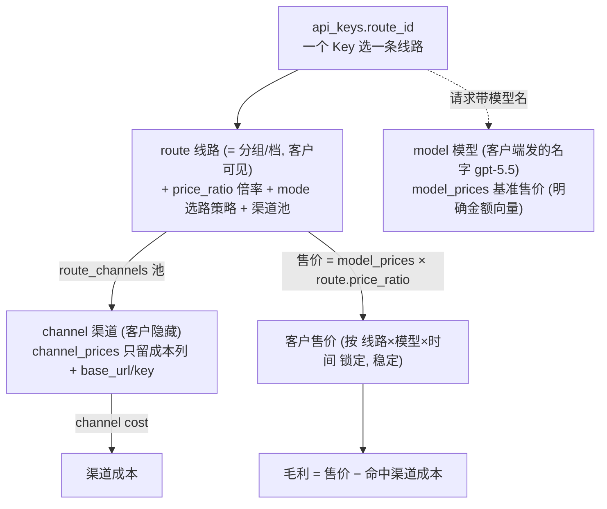

# 改造方案：线路=分组（挂 Key）+ 倍率定价（new-api 式分档网关）

> 依据 **DEC-026**（2026-06-29）。这是本次唯一的改造文档（旧 `DESIGN-key-channel-routing.md` / `EXECUTION-PLAN-key-channel-routing.md` 已删除作废，方向相反）。
>
> - 撰写基准：对照当前工作区代码（`unio-api` / `unio-admin`）逐文件勘探，文件/行号均来自真实代码。
> - **阅读约定**：英文/专业词首次出现配「（中文解释）」；复杂逻辑用「小明发请求」实例。
> - 本文 = 设计 + 执行计划合一（用户要求一份文档）。先读 §1（模型）与 §2（决策），再按 §7 阶段实施。

---

## 1. 一句话与模型

**一句话**：客户建 Key 时选一条**线路（= 分组 / 档）**；**客户售价 = 模型基准价 × 线路倍率**；**渠道对客户隐藏、只记成本**；路由在线路的渠道池内按成本/健康挑一条命中，客户价不随命中渠道变。

**概念锚点（沿用 DEC-017 第 4 点，固定语义）**：
- **model 模型**：对客户暴露的产品名（`model_id`，客户端发它，如 `gpt-5.5`）。客户可见。
- **route 线路**：客户可见的**分组/档**，挂在 Key 上；决定**倍率**（定价）+ **渠道池**（路由范围）+ **mode**（池内怎么选）。
- **channel 渠道**：某 provider 下的具体上游线路；**客户隐藏**；只记**成本**。
- **provider**：供应商/记账主体；客户隐藏。

---

## 2. 决策（DEC-026，已 accepted）

> 完整决策正文见 `DECISIONS.md#DEC-026`。要点：

1. **线路=分组，挂在 Key 上**（沿用现有 `routes`/`route_channels`/`api_keys.route_id`/`projects.default_route_id`，**不退役**）。一个 Key 选一条线路。
2. **倍率定价（超越 DEC-008 无倍率）**：售价 = `model_prices`（模型基准价，明确金额向量）× `routes.price_ratio`（标量倍率）。
3. **档的载体从 model_id 改为 Key 上的线路（修订 DEC-017 第 1 点）**。原因：Codex 等客户端写死模型名、自动请求一族模型，无法用「模型名后缀档」选档。
4. **渠道纯成本**：售价不再挂渠道；`channel_prices` 退化为只存成本。路由 `cheapest` 口径从「按售价」改「按成本」（成本最低 = 毛利最大）。
5. **不做「用户多选渠道」**（守 DEC-017 第 5 点，不暴露渠道）。

> （范围外）透明聚合 / 抽成只是远期口头设想，**本次不做、不设计、不预留**。本文聚焦：分档网关的计费内核 + 运维配置体验 + 数据指标。

**审计补偿（关键，因为引了倍率）**：结算时 price snapshot 必须记 **模型基准价行 id + 当时倍率**，历史账单可按原事实复算。

---

## 3. 计费与路由语义（含用户实例）

### 3.1 售价 / 成本 / 毛利

- **基准价 `model_prices`**：每个模型一组明确售价向量（`uncached_input` / `cache_read` / `cache_write_5m` / `cache_write_1h` / `output` / `reasoning_output`），versioned（`effective_from/to` + `status`）。= new-api 的 modelRatio，但是明确金额。
- **倍率 `routes.price_ratio`**：标量（`NUMERIC`，默认 1.0）。= new-api 的 groupRatio。
- **客户售价向量** = 基准向量逐分项 × 倍率。
- **渠道成本** = 命中渠道的成本向量（`channel_prices` 成本列，per channel-model，不变）。
- **毛利** = 售价 − 成本。

### 3.2 资金语义

- **冻结（pre-authorize）**：按售价（基准×倍率）× 保守输出上限冻结。**因为同一线路同一模型售价唯一**，冻结额是确定的（不再取候选最大售价）。
- **扣费（capture）**：按锁定售价结算。
- **超额**：成本 > 售价的部分进 `write_off`（运行期兜底）。**注意**：取消了 `channel_prices` 的 DB 毛利守卫（售价已不在该表），毛利非负改为**录入期应用校验**（基准×倍率 ≥ 池内最贵渠道成本）+ 运行期 write_off。
- **稳定账单不变量**：fallback 命中更贵成本的渠道，**客户售价不变**，只吃平台毛利（DEC-017 第 2 点 / DEC-026）。

### 3.3 用户实例

> **实例 A（单档）**：小明的 Key 选「经济线（倍率 1.0）」。Codex 发 `gpt-5.5` → 售价 = `gpt-5.5` 基准价 × 1.0；网关在经济线渠道池里挑成本最低的渠道命中,赚差价。
>
> **实例 B（多档同模型）**：小红有两把 Key,一把选「经济线(1.0)」一把选「Pro 线(1.3)」。同样发 `gpt-5.5`,经济线按基准×1.0、Pro 线按基准×1.3 收 —— 同一模型不同档不同价,客户按 Key 的线路定价。
>
> **实例 C（fallback 客价不变）**：经济线池里 A 渠道(成本$1)挂了 → fallback 到 B 渠道(成本$1.5)。客户**仍按 `gpt-5.5` 基准×1.0** 付,平台这次毛利变薄$0.5,**客户账单一分不变**。
>
> **实例 D（Codex 多模型）**：小刚 Key 选「Pro 线」。Codex 自动请求 `gpt-5.5` 和 `gpt-5.4`。两者都按「Pro 线倍率」× 各自基准价计费 —— **一次选档,全族模型统一生效**(这正是档挂 Key 而非模型名的原因)。

---

## 4. 数据模型改动（migrations，最大现号 000053）

- [ ] **`000054_create_model_prices`**：建 `model_prices`（结构对齐 `channel_prices` 的**售价半边** + 模型级）：`id, model_id FK→models, currency, pricing_unit, <6 售价列>, status, effective_from/to, created/updated_at`；约束对齐 `channel_prices`：`uq(id, model_id)`、`ck_window`、`ex_*_enabled_window`（按 model+currency+unit 的启用窗口不重叠，需 btree_gist）；索引 `(model_id, status, effective_from DESC, id DESC)`。
- [ ] **`000055_add_routes_price_ratio`**：`ALTER TABLE routes ADD COLUMN price_ratio NUMERIC(20,10) NOT NULL DEFAULT 1.0 CHECK (price_ratio >= 0)`。内置经济/稳定线路保持 1.0。
- [ ] **`000056_channel_prices_to_cost`**：`channel_prices` 退化为「渠道成本表」——`DROP CONSTRAINT ck_channel_prices_margin`；`DROP COLUMN` 6 个售价列（`uncached_input_price`…`reasoning_output_price`）。`cost_snapshots` FK 仍引用本表，成本路径不变。（表名暂留 `channel_prices`,语义已是成本;后续可改名,本期不改以省事。）
- [ ] **`000057_price_snapshots_add_ratio`**：`price_snapshots` 加 `model_price_id BIGINT`、`route_id BIGINT`、`price_ratio NUMERIC(20,10)`；`price_id`（原 FK→channel_prices）改可空 / 弃用。`settlement_recovery_jobs` 同步加这几列（replay 用）。
- [ ] 每个 up 配 down。
- [ ] （可选回填）给现有每个模型建 `model_prices`（可用旧 `channel_prices` 售价或 `models` 展示价做种子）；现有 routes `price_ratio` 默认 1.0。

> route_channels 现无 priority/weight；v1 先用 `routes.mode` 排序,不加。需要池内加权随机时再补 `route_channels.priority/weight`。

---

## 5. 后端改动（文件/行号来自勘探）

### 5.1 sqlc 查询

- [ ] **新增** `sql/queries/model_prices.sql`：`CreateModelPrice` / `GetModelPrice` / `ListModelPricesByModel` / `ListEnabledModelPriceWindows`（窗口校验）/ `UpdateModelPriceWindow` / **`FindActiveModelPrice(model_id, at_time)`**（结算/授权用）。
- [ ] **改** `sql/queries/routes.sql`：`CreateRoute` / `UpdateRoute` 带 `price_ratio`（`SELECT *`/`RETURNING *` 自动带出）。
- [ ] **改** `sql/queries/channel_models.sql` 的 `FindRouteCandidates`（`:43-119`）：LATERAL 从「join channel_prices **售价**」改为「join channel_prices **成本**」;候选「已定价」过滤改为 **模型有 `model_prices` 基准价 + 渠道有成本行**;SELECT 带回**渠道成本向量**（替代售价向量）。
- [ ] **改** `sql/queries/price_snapshots.sql`：写入 `model_price_id / route_id / price_ratio`。
- [ ] **改** `sql/queries/channel_prices.sql`：去掉售价列（Create 只录成本;`FindActiveChannelPrice` 只取成本)。
- [ ] `sqlc generate`。

### 5.2 选路引擎 `internal/core/routing/router.go`

- [ ] `resolvedRoute`（`114-119`）+ `resolveRoute`/`loadEnabledRoute`（`232-270`）：带出 `route.price_ratio`。
- [ ] `ChatRouteCandidate`（`70-94`）：`SalePrice` 改为**算出的售价**（基准×倍率）；新增 `ChannelCost billing.CustomerPriceSnapshot`（命中渠道成本，替代原 channel 售价用途）；`ChannelPriceID` 语义改为「成本行 id」，新增 `ModelPriceID`、`PriceRatio`。
- [ ] `buildChatRouteCandidate`（`351-409`）：售价 = `multiplyRates(modelBase, route.price_ratio)`（新 billing 辅助函数）；成本从渠道成本列。
- [ ] `findCandidateRows`：候选行带渠道成本 + 模型基准（或在此处查 `FindActiveModelPrice`）。

### 5.3 计费核心 `internal/core/billing/`

- [ ] 新增 `ScaleCustomerPrice(base CustomerPriceSnapshot, ratio) CustomerPriceSnapshot`（逐分项乘倍率）。
- [ ] `CalculateCustomerCharge` / `EstimateAuthorizationAmount`（`service.go:14-92`）**不改**（仍吃 `CustomerPriceSnapshot`，只是该向量现在是算出来的）。

### 5.4 候选排序 / 授权 `lifecycle/`

- [ ] `candidates.go`：`sortCandidatesByMode` 的 `cheapest`（`184-210` `saleSnapshotLess`）改为**按渠道成本升序**（成本最低=毛利最大）；`stable` 不变。
- [ ] `CandidateSalePrices`（`85-92`）：因同线路同模型售价唯一，冻结取该唯一售价即可（不再取候选最大）。
- [ ] `authorization.go`（`146-198`）：逻辑基本不变（`SalePrice` 已是算好的售价）。

### 5.5 结算 `lifecycle/settlement.go` + 恢复

- [ ] `resolveSettlementChannelPrice`（`108-148`）拆成两路：**售价** = `FindActiveModelPrice(model, attemptStart)` × `route.price_ratio`（route 来自 principal/plan）；**成本** = 命中渠道成本行（沿用）。
- [ ] `CreatePriceSnapshot`（`415-428`）：写 `model_price_id + route_id + price_ratio +` 算出的售价向量。
- [ ] cost snapshot（`461-484`）不变。
- [ ] capture / write_off（`493-541`）不变。
- [ ] 幂等复算（`839-860`）：按 snapshot 的基准×倍率复算。
- [ ] `settlement_recovery.go`（`127-187, 329`）：持久化新快照键，replay 一致。
- [ ] `attempt_runner.go` / `attempt_runner_stream.go`（`275-289 / ~332`）：传 `ModelPriceID/RouteID/PriceRatio`（替代/补充 `ChannelPriceID`）。

### 5.6 路由请求带 route_ratio 入口

- [ ] `ChatRouteRequest`（router.go `52-68`）已有 `RouteID`；principal（`auth/apikey.go:37-40,146-152`）已带 `RouteID`。倍率在 `resolveRoute` 读出后注入候选售价计算。7 处网关入口（chat_completion.go `45-52` 等）传参不变（已传 RouteID）。

### 5.7 Admin 后端

- [ ] **线路加倍率**：`service/admin/route/route.go`（`Route/CreateInput/UpdateInput/toRoute` 加 `PriceRatio`）+ `adminapi/routes.go`（DTO + create/update request + `toRouteDTO`）。
- [ ] **模型基准价管理（新）**：新增 service（仿 `channelprice` 模式）+ `adminapi/model_prices.go` handler + 路由 `GET/POST /models/{id}/prices`、`PATCH /model-prices/{id}`。
- [ ] **渠道定价改只录成本**：`service/admin/channelprice/channelprice.go` + `adminapi/channel_prices.go` 去掉售价字段与售价>成本守卫。
- [ ] key→线路、项目默认线路：**保留现状**（`apikey.go:182-189,278-287`、`projects.go:79-106`）。

---

## 6. 前端 / 运维体验（**重点**）—— 对齐你已有的「服务商 / 概览 / 渠道」三页水准

> 用户明确：前端是重点，运维配置要顺手、数据指标要完整，**照搬三页已验证好用的框架，不另起炉灶**（组件均来自现有代码）：
> - 列表：`ServerDataTable` + `useOpsServerTable` + `*-os-columns`（如 channels/providers/routes 同款 shell）。
> - 详情：`DetailPageHeader` + `OverviewStats`(5–6 格 stat tile) + `DetailSideNav`/`Tabs` + `RangeFilter`(URL `?range=`)。
> - KPI：`MetricCard`/`MetricGrid`（2×4）+ `RevenueTip` 悬浮看 收入/成本/毛利。
> - 定价向量：沿用 `ChannelPricesDialog`（分项网格 + 生效窗口 + versioned + list↔create 两视图）。
> - 启停：`StatusChangeConfirmDialog`。经营维度：`BreakdownSection`。React Query key / api client / 侧栏 `AppLayout` 约定照旧。

### 6.1 运维配置 UX（配渠道 / 线路 / 倍率 / 价格尽量顺手）

> 好消息：**线路已有列表/详情页**（`RoutesPage` + `RouteDetailContent`，已含「绑定」tab 显示 Key→线路），多为「扩展」而非「新建」。

- [ ] **线路（档）配置 = 一处配齐**：`components/routes/RouteFormDialog.tsx` 在现有 名称/mode/池/渠道/状态 上**加「价格倍率 price_ratio」输入**（带说明「客户售价 = 模型基准价 × 倍率」）；`RouteDetailContent.tsx` 头部展示倍率；`routes-os-columns.tsx` 加「倍率」列；`lib/api/routes.ts` 的 `Route/CreateRouteInput/UpdateRouteInput` 加 `price_ratio`。
  - **便捷点**：建线路弹窗内联「该档各模型预估毛利」= 基准×倍率 − 池内最贵渠道成本，实时红(亏)/绿(赚)提示，避免配出亏本档；支持「复制现有线路」快速建档。
- [ ] **模型基准价管理（新）**：仿 `ChannelPricesDialog` 做 `ModelPricesDialog`（分项「基准售价」向量 + 生效窗口 + versioned + list↔create，单位 per_1m_tokens）；入口挂 `ModelDetailPage` 的「定价」section + `ModelsPage` 行操作「基准价」；`lib/api/modelPrices.ts` 新增。把 `ModelFormDialog.tsx:287-318` 那个「仅展示不计费」的价格基线升级/替换为真实基准价入口（消歧义）。
  - **便捷点**：一个模型一处配；醒目展示「当前生效基准价」。
- [ ] **渠道定价改「只录成本」**：沿用 `components/channels/ChannelPricesDialog.tsx`，把「分项 | 售价 | 成本 | 毛利」改成「分项 | 成本 | 生效窗口」——去售价列/毛利行/售价>成本守卫（`56-63/317-337/494-499`）；`lib/api/channelPrices.ts` 去售价。入口不变（渠道行操作「成本/价格」）。
  - **便捷点**：渠道详情「模型」tab 直接显示该渠道各模型「成本 vs 各档当前售价」的毛利预览。
- [ ] **建 / 改 Key 选线路**：`CreateApiKeyDialog.tsx`（`253-274` 线路 Select）**保留**，下拉项显示「线路名（×倍率）」；**补「编辑 Key 线路」入口**（后端 `PATCH /api-keys/{id}` 已支持，仅缺 UI）；可选补「设项目默认线路」入口（后端已支持，缺 UI）。

### 6.2 数据指标 / 经营看板（**尽量完整**）—— 对齐「概览」经营驾驶舱（DEC-021）

> 复用「概览」的 `MetricCard`/`MetricGrid` + `BreakdownSection`。后端 `radar.go`（`RadarReport`）**已经算了** 收入/成本/毛利/请求/缓存/余额/结算异常，前端只是没把 P&L 提到一线——这次补全。倍率模型下毛利更透明（收入=ledger debit、成本=cost_snapshots）。

- [ ] **一线 KPI 补全 P&L 驾驶舱**：概览顶部把 **收入 / 毛利 / 利润率 / 客户余额池** 提为一线 KPI（现状偏「值班雷达」延迟/成功率），保留 成功率 / 缓存命中 / 结算异常 等；金额 `formatUSD` + `RevenueTip` 悬浮拆解；按币种不跨汇率（DEC-021）。
- [ ] **Breakdown 三维度（新模型核心经营视角）**：复用 `BreakdownSection`，扩列于 `breakdown-table/constants.ts` + `columns.tsx`：
  - **线路（档）维度【最重要】**：每档 收入 / 成本 / 毛利 / **毛利率** / 倍率 / 请求 / 成功率 —— 一眼看「哪档赚钱、哪档亏」。（breakdown 已有 `route` 维度 + margin，扩 cost/margin_rate/ratio 列即可。）
  - **模型维度**：各模型 收入 / 毛利 / 用量 / 成功率 —— 哪个模型卖得多、毛利高。
  - **渠道维度（成本中心）**：渠道 成本 / 健康 / 成功率 / 延迟 + 被哪些线路引用 —— 看成本与稳定，不看售价。
- [ ] **线路详情页加「经营」section**：该档 收入/成本/毛利 趋势（复用 channel 详情 `TrendChart`/`StatStrip` 模式）+ 绑定 Key 数 + 各模型毛利明细。
- [ ] **后端指标扩展**：`sql/queries/dashboard_radar.sql` 的 route/channel/model breakdown 已含 `revenue_usd`/`cost_usd`/`margin_usd`；按需补 `margin_rate`、线路 `price_ratio`；`radar.go` 的 `applyBreakdownMoney` 同步。

> 一句话：**配置端让运维「一处配齐 档/倍率/基准价/成本 + 内联看毛利」；指标端让你「按 档/模型/渠道 一眼看 收入−成本−毛利」**，全部照搬服务商/概览/渠道那套组件。

---

## 7. 分阶段实施 + 验收门禁

- **阶段 0｜测试基建**：修 `sdkfixture` 编译（既有问题，改用 `CreateChannelPrice` 口径/成本）；加 helper：seed `model_prices` + route `price_ratio` + 渠道成本。✅ blackbox 能跑。
- **阶段 1｜后端计费核心（最关键）**：迁移 000054-000057 → sqlc → 选路（候选带成本+算售价、cheapest 按成本）→ 结算（售价=基准×倍率 + 快照基准/倍率）→ 恢复。✅ 后端单测 + DB 集成 + 真实 e2e（§8）全绿；尤其 **fallback 客价不变** 通过。
- **阶段 2｜Admin + 前端（重点，见 §6）**：
  - 6.1 配置 UX：线路倍率 + 模型基准价管理（新 `ModelPricesDialog`）+ 渠道改只录成本 + 建/改 Key 选线路 + **建档内联毛利预览**。
  - 6.2 数据指标：概览 P&L 一线 KPI（收入/毛利/利润率/余额）+ 线路/模型/渠道 breakdown 扩列 + 线路详情「经营」section。
  - ✅ `tsc`/`eslint` 绿；手测：一处配齐 档/倍率/基准价/成本、改价即时反映新请求计费、看板按档看 收入−成本−毛利。
- **阶段 3｜回归 + 上线**：全量回归 + 真实 Codex e2e；阶段报告。

**回滚**：每个 up 配 down；前端 git revert。

---

## 8. 测试方案（务必含真实 e2e）

类型：U=单测，I=DB 集成，E=blackbox 真实 SDK/Codex e2e。

- [ ] **U** 售价 = 基准 × 倍率（逐分项）；倍率/基准改了，新请求按新值、历史按 snapshot 复算。
- [ ] **U** `cheapest` 按**渠道成本**升序；`stable` 按健康；`fixed` 单条。
- [ ] **I** 冻结 = 售价(基准×倍率)×保守输出；capture 按售价；成本>售价 → write_off；余额不为负。
- [ ] **I/E（核心不变量）fallback 客价不变**：线路池 primary 5xx → 命中更贵成本次渠道 → 客户仍按 (线路,模型) 售价付，毛利变薄、**账单不变**。
- [ ] **E（真实 Codex）** Key 选某线路 → Codex 发 `gpt-5.5`/`gpt-5.4` → 均按「该线路倍率 × 各自基准」计费；换线路（改 `api_keys.route_id`）→ 新价生效。
- [ ] **E** 渠道隐藏：客户看不到/选不到渠道；`/v1/models` 不泄露渠道。
- [ ] **I** 审计：price snapshot 含 `model_price_id + route_id + price_ratio`，可独立复算出账单金额。

---

## 9. 受影响文件清单（对照打勾）

**后端新增**：`migrations/000054-000057`、`sql/queries/model_prices.sql`、模型基准价 admin（service + `adminapi/model_prices.go`）、`billing.ScaleCustomerPrice`。
**后端改**：`sql/queries/{routes,channel_models,channel_prices,price_snapshots,dashboard_radar}.sql`、`core/routing/router.go`、`core/billing/*`(辅助)、`lifecycle/{candidates,authorization,settlement,settlement_recovery,attempt_runner,attempt_runner_stream}.go`、`adminapi/{routes,channel_prices}.go`+对应 service、`service/admin/channelprice/*`、`service/admin/dashboard/radar.go`(breakdown 扩列)、sqlc 重生成、`sdkfixture`、seed、相关 `_test.go`。
**前端新增**：`ModelPricesDialog`、`lib/api/modelPrices.ts`。
**前端改（配置）**：`lib/api/{routes,channelPrices}.ts`、`components/routes/{RouteFormDialog,RouteDetailContent}.tsx`、`components/openstatus-table/routes-os-columns.tsx`、`components/channels/ChannelPricesDialog.tsx`、`components/models/ModelFormDialog.tsx`、`pages/{ModelsPage,ModelDetailPage}.tsx`、`CreateApiKeyDialog.tsx`（保留+加编辑入口）。
**前端改（指标）**：`pages/DashboardPage.tsx`(P&L 一线 KPI)、`components/dashboard/RadarCards`、`components/dashboard/breakdown-table/{constants,columns}.tsx`、`lib/api/dashboard.ts`、线路详情「经营」section。

---

> 实施前请先审本文。认可后按 §7 阶段 0→1→2→3 推进；每阶段守住 ✅ 验收门禁。**核心不变量：客户售价 = 模型基准 × 线路倍率，按 (线路,模型,时间) 锁定，fallback 不改客户账单。**
