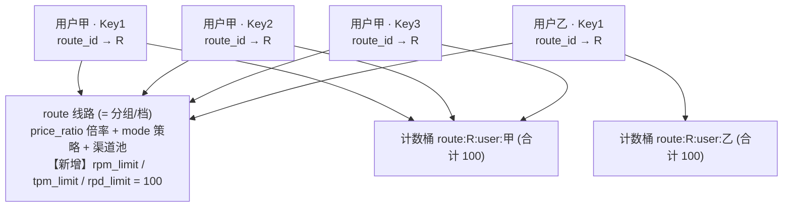
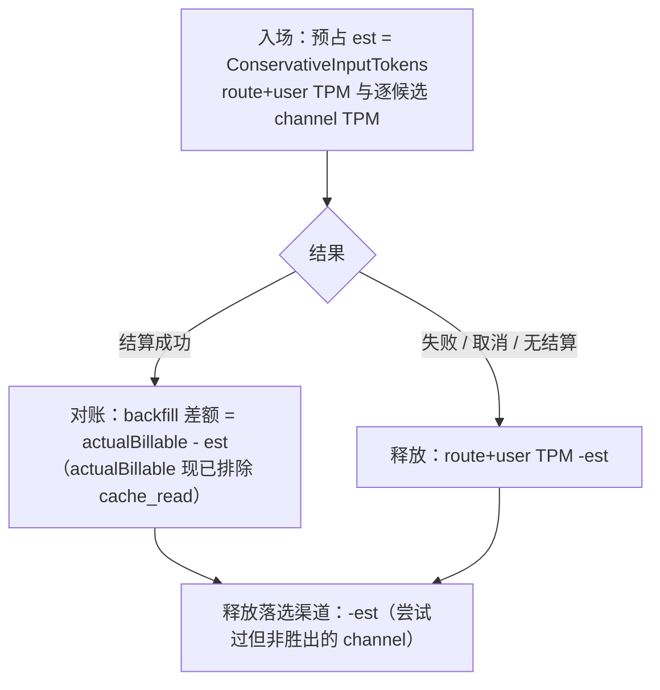

# 改造方案：线路级限流（限流定义在线路，按「线路 + 用户」计数）

> 目标：把「令牌级限流（RPM/TPM/RPD）」的**配置位置**从「用户创建 API Key 时填写」搬到**线路（route / 渠道商品）**上；
> 计数**按（线路 + 用户）**执行：同一用户在某条线路下的**所有 Key 共享该线路定义的上限**（防止一个用户多建 Key 放大配额、打爆上游），
> **不同用户各自独立**（互不共享）。
>
> - 参考对象：new-api（QuantumNous/new-api）的「分组（group）限流」思路；能超越处在「计数粒度」与「配置内聚」上超越，但不为超越而复杂化。
> - 撰写基准：对照当前工作区代码（`unio-gateway` / `unio-admin`）逐文件勘探，文件/行号来自真实代码（截至本文撰写时）。
> - 阅读约定：先读 §1（一句话与模型）与 §4（核心决策），再按 §9 分阶段实施；不确定项集中在 §12，附推荐方案与使用场景。
> - 关联决策：本文提议新增 **DEC-027**（见 §12 末尾草案），在 DEC-026（线路=分组+倍率）基础上补「限流也归线路」。

---

## 1. 一句话与模型

**一句话**：限流上限（RPM/TPM/RPD）**定义在线路上**；客户建 Key 只选线路、不填限流；网关对**每个用户在该线路下的所有 Key 合计**用「线路定义的上限」计数与拦截——即计数主体是 **(线路, 用户)**。



**关键语义**（本文锁定，已按用户纠正修正）：
- 线路 RPM=100 表示「绑定该线路的**每个用户**（不论他建了几把 Key）合计最多 100 RPM」。
- 例：线路 100。
  - 用户甲建 3 把 Key 全绑该线路 → 三把 Key **共享** 100（甲永远打不出 >100，多建 Key 无法放大配额）。✅ 防止打爆上游
  - 用户乙另有 1 把 Key → 乙**独立** 100，与甲不共享。✅ 不同用户不互相挤占
- **上游硬天花板仍由渠道级限流兜底**：线路/用户限流管「每个客户公平用量」，渠道限流管「别把某条上游打挂」，两层正交。
- 三值语义沿用现有约定：`NULL`=继承全局默认；`0`=显式不限；`>0`=具体上限。

> **为什么不是按 Key 计数**：按 Key 计数时，一个用户建 N 把 Key 就能拿到 N×上限，等于把线路限流架空、直接打爆上游。按 (线路, 用户) 计数才能既给不同客户独立配额、又让单个客户无法通过多建 Key 放大用量。

---

## 2. new-api 对照调研（读源码得到的事实）

以下为 `QuantumNous/new-api` 主分支实测阅读结论（用于借鉴，不逐字照搬）：

| 维度 | new-api 的做法 | 位置（源码） |
|------|----------------|--------------|
| 限流配置位置 | **分组（group）级**，运营后台一张表 `map[group][2]int`（总请求数、成功请求数） | `setting/rate_limit.go`：`ModelRequestRateLimitGroup` / `GetGroupRateLimit(group)` |
| Token（≈我们的 API Key）是否填限流 | **不填**。Token 只绑 `Group`、`RemainQuota`（额度）、`ModelLimits`（可用模型） | `model/token.go` |
| 计数粒度 | **按 userId** 计数（`rateLimit:...:<userId>`），同一用户多 Token 共用计数（多建 Token 无法放大配额） | `middleware/model-rate-limit.go`：`redisRateLimitHandler` |
| 窗口/算法 | 默认 1 分钟窗口；总量维度用 Redis Lua 令牌桶，成功量维度用定长 List+时间戳 | `common/limiter/limiter.go`（Lua 令牌桶）、`middleware/model-rate-limit.go` |
| 渠道保护 | **渠道级限流**独立一层：选路时超限的渠道被剔除候选并重试下一条（PR #5067 / #1711），另有渠道日 token 上限（PR #5043） | `model/ability.go`、`model/channel_cache.go`、`middleware/distributor.go` |
| 「不知道有多少用户」怎么办 | **不按用户数反推**。分组限流是运营直接定义的商品参数；总用量由 `Quota`（额度）控制；上游由渠道限流兜底 | 综合 |
| 全局默认 | 站点级默认 + 分组覆盖 | `ModelRequestRateLimitCount/SuccessCount` + `GetGroupRateLimit` |

**结论**：new-api 的方向与用户诉求一致——**限流归"分组/线路"，Key 只绑定不配置，计数按用户（多建 Key/Token 不能放大配额）**。
我们采用同样的「按用户」思路，并**按线路隔离**（subject 含 route_id），解决 new-api 未覆盖的「同一用户在不同线路应各按各自线路上限计数」的多线路场景——这是我们相对 new-api 的**超越点**（配置内聚到线路 + 即时生效 + 多线路正确隔离）。

---

## 3. 现状勘探（Unio 当前两层限流，逐文件）

当前是 **P2-8「两层限流」**：API Key 层 + 渠道层，限流值都**不在线路上**。

### 3.1 限流内核（可复用，几乎不改）
- `internal/platform/ratelimit/guard.go`：`Guard` 已是**主体无关**设计——`check(scope, id, dim, limit, ...)`，`Scope ∈ {key, chan}`，subject = `"<scope>:<id>:<dim>"`。
  - `AllowKeyRequest(apiKeyID, limits)`：ingress 查 RPM/RPD。
  - `AllowKeyTokens(apiKeyID, limits, est)` / `BackfillKeyTokens`：TPM 预占 + 回填。
  - `AllowChannel(channelID, limits, est)` / `BackfillChannelTokens`：渠道层。
- `internal/platform/ratelimit/sliding.go`：Redis 滑动窗口计数（RPM/TPM 1 分钟/1 秒桶；RPD 1 天/1 小时桶）。
- **要点**：内核只认「`limits`（上限值）」+「计数主体的 subject 字符串」。`slidingStore.CheckAndAdd` 已是 `subject string` 入参，本就支持任意主体键。改造需：①**上限值来源**从 Key 改为线路；②**计数主体**从 `key:<apiKeyID>` 改为 `route:<routeID>:user:<userID>`（复合键）。

### 3.2 上限值来源（要改）
- `internal/core/auth/apikey.go`：`APIKeyPrincipal.RPMLimit/TPMLimit/RPDLimit` 来自 **api_keys 行**（`GetAPIKeyByHash` 直接读 `k.rpm_limit/...`）。
- `internal/app/gatewayapi/middleware/rate_limit.go`：ingress 用 `principal.RPM/TPM/RPD` 作为 limits，`AllowKeyRequest(principal.APIKeyID, ...)`（**主体=Key**，要改成主体=(线路,用户)）。
- `internal/service/gateway/lifecycle/ratelimit_gate.go`：`keyRateLimits(principal)` 取 principal 三值，`AllowKeyTokens(principal.APIKeyID, ...)`（**主体=Key**，要改成主体=(线路,用户)）。
- `principal` 已含 `UserID` 与 `RouteID`（`auth/apikey.go`），构造 (线路,用户) 复合主体所需数据齐备。

### 3.3 配置写入路径（要改）
- 后端：`sql/queries/api_keys.sql`（`SetAPIKeyRateLimits`）、`internal/service/admin/customer/apikey.go`（Create/Update 的 `RateLimitsProvided` 分支）、`internal/app/adminapi/api_keys.go`（DTO）。
- 前端：`unio-admin/src/components/customer/CreateApiKeyDialog.tsx`（「令牌级限流」输入区）、`src/lib/api/apiKeys.ts`（`RateLimitsInput`）。
- 线路侧：`migrations/000032_create_routes.up.sql`、`sql/queries/routes.sql`、`internal/service/admin/route/route.go`、`internal/app/adminapi/routes.go`、`unio-admin/src/components/routes/RouteFormDialog.tsx`、`src/lib/api/routes.ts` —— **当前都没有限流字段**，需新增。

### 3.4 关键发现（让改造很轻）
1. 路由解析 `internal/core/routing/router.go` 的 `resolveRoute` 已 `GetRouteByID`（已加载线路行、含 `price_ratio`）——线路级限流值可顺带带出，供 **TPM（attempt_runner）** 使用。
2. ingress 中间件在**路由之前**运行，只有 `principal`；因此让 **principal 携带线路限流值**最省事（`GetAPIKeyByHash` JOIN `routes`）。
3. 现有 channel 层限流保持不变（保护上游），与线路层正交。

---

## 4. 核心决策（本次改造锁定）

| # | 决策 | 说明 |
|---|------|------|
| D1 | **限流上限定义在线路** | `routes` 新增 `rpm_limit/tpm_limit/rpd_limit`（可空，NULL/0/>0 三态） |
| D2 | **计数按 (线路, 用户) 复合主体** | subject=`route:<routeID>:user:<userID>:<dim>`；同一用户在该线路下所有 Key 共享一个桶，多建 Key 不放大配额；不同用户各自独立 |
| D3 | **创建/编辑 Key 不再填限流** | 前端移除令牌级限流输入；后端不再接收/写入 Key 的 rpm/tpm/rpd |
| D4 | **渠道级限流保持不变** | 上游硬天花板正交，不动；线路/用户限流管公平用量，渠道限流管保护上游 |
| D5 | **限流内核基本不改** | 复用 `Guard`/`sliding`（`CheckAndAdd` 本就 `subject string`）；仅新增以复合主体构造 subject 的入口 |
| D6 | **上限值来源 = 认证期 JOIN 线路** | `GetAPIKeyByHash` JOIN `routes` 带出线路三值到 principal；无需新表/新缓存 |

**为什么按 (线路, 用户) 而非按 Key**：按 Key 计数时，一个用户建 N 把 Key 就拿到 N×上限、直接架空线路限流打爆上游。按 (线路, 用户) 计数：不同客户各自独立配额，单个客户无法通过多建 Key 放大用量。这与 new-api「按 user 计数」同理，并额外按线路隔离以支持多线路。

---

## 5. 数据库改动

### 5.1 迁移 `000059_add_routes_rate_limits`（新增线路限流列）
> 下一个可用版本号为 `000059`（现最大 `000058`）。语义与 api_keys/channels 完全一致。

```sql
-- 000059_add_routes_rate_limits.up.sql
-- 为线路增加线路级限流上限：RPM 每分钟请求 / TPM 每分钟 token / RPD 每日请求。
-- 三列均可空：NULL=继承全局默认，0=显式不限，>0=具体上限。
-- 计数在 Redis 滑动窗口按 (线路, 用户) 复合主体执行；本列只持久化线路的"上限模板"。
ALTER TABLE routes
    ADD COLUMN rpm_limit INTEGER CHECK (rpm_limit IS NULL OR rpm_limit >= 0),
    ADD COLUMN tpm_limit INTEGER CHECK (tpm_limit IS NULL OR tpm_limit >= 0),
    ADD COLUMN rpd_limit INTEGER CHECK (rpd_limit IS NULL OR rpd_limit >= 0);
```
```sql
-- 000059_add_routes_rate_limits.down.sql
ALTER TABLE routes
    DROP COLUMN IF EXISTS rpm_limit,
    DROP COLUMN IF EXISTS tpm_limit,
    DROP COLUMN IF EXISTS rpd_limit;
```

内置线路（经济/稳定）默认三列 NULL（继承全局默认），零配置可用。

### 5.2 api_keys 旧限流列（分两步，见 §12 待决 Q2）
- **本次（推荐）**：**保留列、停用逻辑**——代码/UI 不再读写，列上加注释「deprecated：限流已归线路」。避免一次性 DROP 带来的回滚风险。
- **后续**：确认线上无回滚需求后，出 `000060_drop_api_keys_rate_limits` DROP 三列。
- 现网数据安全：当前唯一 Key（`test key`）三列均为 NULL，无历史值丢失风险。

---

## 6. 后端改动

### 6.1 认证：principal 携带"线路限流值"
- `sql/queries/api_keys.sql` 的 `GetAPIKeyByHash` 增加 `JOIN routes rt ON rt.id = k.route_id`，SELECT 出 `rt.rpm_limit / rt.tpm_limit / rt.rpd_limit`（以及可选 `rt.status`）。
- `internal/core/auth/apikey.go`：`APIKeyPrincipal` 的 `RPMLimit/TPMLimit/RPDLimit` 改为**来自线路行**（字段可保留原名，注释说明来源已改为线路）。`principal` 已含 `UserID` 与 `RouteID`。

### 6.1b 计数主体：从 Key 改为 (线路, 用户)
- `internal/platform/ratelimit/guard.go`：新增以复合主体计数的入口（内核底层 `CheckAndAdd(subject string, ...)` 不变）。两种等价做法，选其一：
  - **（推荐）** 加一个 `ScopeRouteUser Scope = "ru"` 与 `AllowRouteUserRequest(ctx, routeID, userID, limits)` / `AllowRouteUserTokens(...)` / `BackfillRouteUserTokens(...)`，subject 由 `subjectFor` 扩展为 `"ru:<routeID>:<userID>:<dim>"`。
  - 或把 `id int64` 泛化为可传复合 key 的小重载，避免新增方法。
- `middleware/rate_limit.go`：改为 `AllowRouteUserRequest(ctx, *principal.RouteID, principal.UserID, limits)`（RPM/RPD）。
- `ratelimit_gate.go`：`guardKeyTokens` / `backfillRateTokens` 的 Key 侧改用 (routeID, userID) 复合主体（TPM 预占 + 回填）。渠道侧不变。
- 说明：改的是**计数主体**与**上限来源**，判定/窗口/回填/故障策略全部复用。

> 备选来源方案见 §12 Q4（routing 已加载线路，可只让 TPM 走 routing 值；但 ingress RPM/RPD 仍需 principal，故统一用 JOIN 最简单一致）。

### 6.2 线路写入：接收并持久化限流
- `sql/queries/routes.sql`：`CreateRoute` / `UpdateRoute` 增加 `rpm_limit/tpm_limit/rpd_limit`（`sqlc.narg`，可空）。
- `internal/service/admin/route/route.go`：
  - `CreateInput`/`UpdateInput`/`Route` 增加 `RPMLimit/TPMLimit/RPDLimit *int64`。
  - 校验：非负整数或空（复用与 channel 一致的校验风格）。
  - `toRoute` 回填三值。
- `internal/app/adminapi/routes.go`：`routeDTO` + `createRouteRequest` + `updateRouteRequest` 增加三字段（`*int64`，JSON `rpm_limit`/`tpm_limit`/`rpd_limit`）。

### 6.3 API Key 写入：移除限流
- `internal/service/admin/customer/apikey.go`：
  - `APIKeyCreateParams`/`APIKeyUpdateParams` 移除 `RateLimitsProvided/RPMLimit/TPMLimit/RPDLimit`。
  - Create 移除 `SetAPIKeyRateLimits` 分支；Update 的「至少一项」校验去掉 rate limits 条件。
- `internal/app/adminapi/api_keys.go`：请求/响应 DTO 移除 `rate_limits`（响应可暂留 `rpm_limit` 等为 `null` 以兼容前端，或一并移除，见 §12 Q2）。
- `sql/queries/api_keys.sql`：`SetAPIKeyRateLimits` 停用（保留或删除，随列去留决定）。

### 6.4 限流内核 / 渠道层
- `sliding.go` / `AllowChannel` / 渠道 backfill / 判定 / 窗口 / 故障策略：**不改**。
- `guard.go`：仅**新增** (线路,用户) 复合主体入口（见 §6.1b），既有 Key/Channel 方法可保留或改造后移除。

---

## 7. 前端改动（unio-admin）

### 7.1 线路表单：新增「线路级限流」
- `src/components/routes/RouteFormDialog.tsx`：在「售价倍率」之后加一组限流输入，**复用**渠道表单的成熟组件模式（`src/components/channels/ChannelFormDialog.tsx` 已有范例）：
  - RPM：普通数字 `Input`（量级小）。
  - TPM / RPD：`RateLimitInput`（数字 + 单位 K/M/B）。
  - 文案：「线路级限流（绑定该线路的**每个用户**合计生效，多建 Key 不放大配额）：留空=继承全局默认，0=不限」。
- `src/lib/api/routes.ts`：`Route` + `CreateRouteInput` + `UpdateRouteInput` 增加 `rpm_limit/tpm_limit/rpd_limit: number | null`。

### 7.2 创建/编辑 API Key：移除「令牌级限流」
- `src/components/customer/CreateApiKeyDialog.tsx`：删除 RPM/TPM/RPD 输入区、相关 state、校验、`rateLimits` 提交；顶部改一行说明「限流由所选线路统一决定」并可展示所选线路的当前上限（只读，见 7.4）。
- `src/lib/api/apiKeys.ts`：移除 `RateLimitsInput` 与 `rateLimits` 入参（响应字段随后端决定，见 §12 Q2）。

### 7.3 线路列表/详情：展示限流（增强）
- 线路列表 `routes-os-columns.tsx`：可加一列「限流」展示 `RPM/TPM/RPD`（`—` 表示继承默认、`∞` 表示 0=不限）。
- 线路详情 `RouteOverviewStats.tsx` / 概览：展示三值，帮助运营核对。

### 7.4 创建 Key 时的只读回显（体验超越点）
- 选中线路后，Key 弹窗内**只读**显示该线路的 RPM/TPM/RPD，让客户/运营明确「这把 Key 会受什么限流」，但不可编辑。

---

## 8. 缓存策略（商业视角判断）

**结论：不新增独立缓存层，复用现有 Redis 滑动窗口即可。**

- **计数**：已在 Redis（`ratelimit/sliding.go`）。改造只是把计数 subject 从 `key:<apiKeyID>:<dim>` 改为 `route:<routeID>:user:<userID>:<dim>`——仍是同一套 Redis 滑动窗口，**不引入**新存储、新组件。
- **上限值（配置）**：来自 `GetAPIKeyByHash` 的一次认证查询（已存在，JOIN routes 仅多一个索引连接，成本可忽略）。**不建议**为线路限流值单独做缓存：
  - 认证本就 1 次 DB 查询，JOIN 不改变查询次数；
  - 线路限流值变更需**即时生效**（运营调档后立刻按新值限流），加缓存反而引入失效延迟与一致性复杂度；
  - 若未来认证查询成为热点（QPS 极高），再引入「线路配置只读缓存 + 短 TTL/失效广播」，届时作为独立优化，不在本次范围。
- **故障策略**：沿用 `RATE_LIMIT_FAILURE_POLICY`（fail_closed/fail_open），不变。

---

## 9. 可观测性

- 复用现有 `unio_ratelimit_decisions_total{decision}`（allowed/limited/redis_failure_*）。
- 语义澄清：ingress 的 Key 级判定命中即 429（现状不变，只是"上限"改为线路提供）。
- 可选增强：日志/指标加 `route_id` + `user_id`，便于按线路/用户观测限流命中率（判断某档是否卡太紧、某用户是否频繁撞限）。非必须，列为增强项。

---

## 10. 分阶段执行清单

> 建议顺序：DB → 后端读路径 → 后端写路径 → 前端 → 测试。每步可独立编译/回归。

**Phase 1 · 数据库**
- [ ] `000059_add_routes_rate_limits.up/down.sql`
- [ ] `sqlc generate`（routes/api_keys 查询产物更新）

**Phase 2 · 后端读路径（让限流按线路生效、按 (线路,用户) 计数）**
- [ ] `GetAPIKeyByHash` JOIN routes 带出线路三值
- [ ] `APIKeyPrincipal` 三值改为线路来源（注释更新）
- [ ] `guard.go` 加 (线路,用户) 复合主体入口；`middleware/rate_limit.go` 与 `ratelimit_gate.go` 改用该入口（主体=`route:<id>:user:<id>`）
- [ ] 回归：跑既有限流测试 + 新增「同用户多 Key 共享桶」用例

**Phase 3 · 后端写路径（线路可配置 + Key 去限流）**
- [ ] `routes.sql` Create/Update 加三列；route service/handler/DTO 加三字段 + 校验
- [ ] api_keys service/handler/DTO 移除 rate_limits；`SetAPIKeyRateLimits` 停用
- [ ] api_keys 旧列按 §5.2 保留+停用（DROP 延后）

**Phase 4 · 前端**
- [ ] `RouteFormDialog` 加限流输入；`routes.ts` 加字段
- [ ] `CreateApiKeyDialog` 去限流；`apiKeys.ts` 去 `rateLimits`
- [ ] 线路列表/详情展示限流（增强）；Key 弹窗只读回显线路限流（增强）

**Phase 5 · 测试与验收**
- [ ] Go 单测：`ratelimit/*`、middleware、route service 校验
- [ ] E2E（见 §11，不污染现网数据）
- [ ] `sqlc generate` 无 drift、`go build`、`go vet`、`npm run build` 全绿

---

## 11. E2E 测试方案（严格不污染现有数据）

**隔离原则**：只操作**本测试新建**的临时用户/线路/Key，测完清理；**绝不**触碰现网 `VIP-Codex`、`test key`、两条现有渠道。

**建议脚本流程（对 gateway + admin API）**：
1. 建临时线路 `e2e-rl-<timestamp>`（`pool_kind=all`, `mode=cheapest`, `rpm_limit=3`），拿到 `route_id`。
2. 建临时用户 甲、乙（或复用两个专用测试用户）。
3. 给用户甲建 **2 把** Key、给用户乙建 **1 把** Key，都绑该临时线路。
4. **验证"同用户多 Key 共享桶"（核心）**：用甲的两把 Key **交替**发请求，累计到第 4 次即 `429`（两把 Key 合计只有 3 次额度，多建 Key 没放大），`X-RateLimit-*` 头存在。
5. **验证"不同用户独立"**：紧接着用乙的 Key 发请求，前 3 次仍 `200`（乙不受甲的计数影响），第 4 次 `429`。
6. 清理：revoke/删除临时 Key → 删除临时线路 → （如新建用户）停用/删除临时用户。

**落地形式**：
- 单元/集成层：`internal/platform/ratelimit/*_test.go`、`middleware/rate_limit_test.go` 已有基础，加「上限来自线路 + 同用户多 Key 共享 (线路,用户) 桶 + 不同用户独立」的用例（用 in-memory store 替身，不碰 DB）。
- 真实 E2E：写一个 `scripts/e2e-route-rate-limit.sh`（读 `.env` 的 `ADMIN_API_TOKEN`、gateway base URL），带 `set -e` 与 `trap` 清理；默认对**临时资源**操作，需显式传参才运行，避免误跑。
- 用户已说明「可以做 E2E，但不是必须」——建议以 Go 集成测试为主，真实 E2E 脚本作为可选交付。

---

## 12. 待决事项（附推荐方案与使用场景）

### Q1. 计数粒度（已定：按 (线路, 用户)）
- **锁定**：按 **(线路, 用户)** 计数（subject=`route:<routeID>:user:<userID>:<dim>`）。同一用户在该线路下所有 Key 共享一个桶（多建 Key 不放大配额、打不爆上游）；不同用户各自独立。
- **被否决**：~~按 Key 独立~~（一个用户多建 Key 即可拿 N×上限，架空限流，已废）。
- **未来可扩展（本次不做）**：若某条线路对应"总容量固定的独占上游"，想让**该线路所有用户合计**也封顶，可在 `routes` 加 `rate_limit_scope ∈ {user, route}`（默认 `user`）：`route` 时计数主体退化为 `route:<routeID>`（全线路共享一个桶）。内核 subject 已是字符串，切换成本低。
- **场景**：
  - 按 (线路,用户)（本次）：卖「每个客户每分钟 100 RPM」的标准/VIP 档——客户建几把 Key 都只有 100，不同客户各 100。
  - 按线路合计（未来选项）：整条线路独占一个固定容量上游，要求全线路合计不超过它。

### Q2. api_keys 旧限流列如何处置？
- **推荐**：**先停用后删除**。本次保留列（加 deprecated 注释）、代码不再读写；确认无回滚需求后出 `000060` DROP。
- **理由**：现网数据无历史值（唯一 Key 三列 NULL），但停用-删除两步更稳、可回滚；符合「不污染/不破坏现有数据」诉求。
- **响应兼容**：过渡期 api_key DTO 可暂留 `rpm_limit` 等字段回 `null`，避免前端解析报错；前端清理完毕后再移除。

### Q3. 是否保留"单把 Key 特殊配额"的后台覆盖能力？
- **推荐**：**本次不做**。统一由线路决定，最简单、最符合"限流是线路属性"的产品心智。
- **若确有个别大客户要特批**：优先"给他单独建一条线路"（更清晰、可复用、可审计），而不是给 Key 开后门。
- **场景**：某超级大客户要 5× 配额 → 建 `VIP-Codex-大客户专线`（rpm 更高），把他的 Key 绑过去。

### Q4. 线路限流值的来源：认证 JOIN vs 路由解析？
- **推荐**：**认证期 JOIN routes**（principal 携带）。因为 ingress RPM/RPD 在路由之前，只有 principal；统一从 principal 取，TPM 也一致。
- **备选**：TPM 走 routing 已加载的线路值、RPM/RPD 走 principal——来源不统一、易漂移，不推荐。

### Q5. 全局默认值是否需要调整？
- 现状 `RATE_LIMIT_DEFAULT_RPM=60`（`.env` 另有遗留的 `RATE_LIMIT_DEFAULT_LIMIT/WINDOW`，实际生效以 `RATE_LIMIT_DEFAULT_RPM/TPM/RPD` 为准）。
- **推荐**：默认值不动；线路留空即继承 60 RPM。运营给每条线路显式配置后即覆盖。建议顺手在 `.env.example` 注释澄清「Key 不再单独配限流，线路留空则用这些默认」。

### Q6. 「不知道会有多少用户 / 多少请求」怎么定线路限流？
- 这是运营问题，不是技术阻塞（new-api 也不按用户数反推）。**推荐运营心法**：
  1. 线路限流 = **商品承诺**（"这档每把 Key 每分钟多少请求"），按定位直接定，与用户数无关。
  2. 总用量刹车用**费用上限**（`spend_limit`，已存在），不是靠 RPM。
  3. 上游被打爆用**渠道限流**兜底（已存在，命中即 fallback）。
  4. 上线后看监控（渠道使用率、429/fallback 比例）再调线路值或加渠道，而非事前精算。

---

### DEC-027 草案（提交实现前请确认）

> **DEC-027 限流归线路：线路定义 RPM/TPM/RPD，按 (线路, 用户) 计数（补充 DEC-026）**
>
> - **背景**：DEC-026 已确立"线路=分组/档、挂在 Key 上"。限流作为档的属性，应随之归线路，而非由客户在创建 Key 时填写。
> - **决策**：
>   1. 限流上限（RPM/TPM/RPD）定义在 `routes`；`NULL`=继承全局默认、`0`=不限、`>0`=上限。
>   2. 计数按 **(线路, 用户)** 复合主体（subject=`route:<routeID>:user:<userID>:<dim>`）：同一用户在该线路下所有 Key 共享一个桶（多建 Key 不放大配额、防打爆上游）；不同用户各自独立。**明确否决"按 Key 计数"**。
>   3. 创建/编辑 API Key 不再配置限流；令牌级限流列停用（后续删除）。
>   4. 渠道级限流（上游硬天花板）与限流内核（Guard/Redis 滑动窗口）保持不变。
> - **对齐/超越 new-api**：与 new-api「按 user 计数、多 Token 不放大」同理；额外**按线路隔离**支持多线路正确计数，配置内聚到线路且即时生效，保留 `rate_limit_scope` 扩展位（未来可切"按线路合计"）。
> - **待确认**：Q2 旧列删除时机、Q3 是否保留 Key 级覆盖。（Q1 计数粒度已定为 (线路,用户)。）

---

## 13. 影响文件清单（实现时对照）

**后端**
- `migrations/000059_add_routes_rate_limits.up/down.sql`（新增）
- `sql/queries/routes.sql`、`sql/queries/api_keys.sql`
- `internal/core/auth/apikey.go`
- `internal/service/admin/route/route.go`、`internal/app/adminapi/routes.go`
- `internal/service/admin/customer/apikey.go`、`internal/app/adminapi/api_keys.go`
- `internal/platform/ratelimit/guard.go`（加 (线路,用户) 复合主体入口）、`middleware/rate_limit.go`、`internal/service/gateway/lifecycle/ratelimit_gate.go`（改用复合主体）
- （不改）`internal/platform/ratelimit/sliding.go`
- `internal/platform/store/sqlc/*`（`sqlc generate` 产物）

**前端**
- `src/components/routes/RouteFormDialog.tsx`、`src/lib/api/routes.ts`
- `src/components/customer/CreateApiKeyDialog.tsx`、`src/lib/api/apiKeys.ts`
- （增强）`src/components/openstatus-table/routes-os-columns.tsx`、`src/components/routes/RouteOverviewStats.tsx`

**文档**
- 本文；`docs/production/DECISIONS.md` 追加 DEC-027；`.env.example` 注释澄清（Q5）

---

## 14. 缓存感知 TPM 改造 + 预占泄漏/渠道多计修复（DEC-028）

> 本节是在 §1–§13（限流归线路、按 (线路,用户) 计数）落地之后，针对 **TPM 口径本身**的二次改造。
> 关联决策：[DEC-028](DECISIONS.md#dec-028-缓存感知-tpm排除-cache_read保留-cache_write预占在未结算时释放补充-dec-027)。

### 14.1 问题（来自线上真实现象）

- 现网唯一 Key `unio_sk_TwH1SbGu` → 线路 3 `VIP-Codex`（用户 1，`tpm=300000, rpm=300, rpd=15000, cheapest`）。
- 用户用 Codex「刚配置好、发两句话」就 `429 Too Many Requests / exceeded retry limit`。别家中转站不会这样。
- 定位：[`ratelimit_gate.go`](../../internal/service/gateway/lifecycle/ratelimit_gate.go) 的 `billableTPMTokens` 把
  `cache_read`（缓存命中读取）**按全额**计入 TPM。Codex 每轮把整段对话上下文重发给上游，其中绝大部分命中
  prompt cache（每轮 ~8-9 万 cache_read）。10 次请求、22 秒内累计 ~12.6 万 billable token，几次就把每分钟
  30 万的窗口顶满 → 后续请求被拒。
- **旁证的两处隐藏 bug**（同一条链路审计发现，见 §14.4）：预占从不在失败时释放；fallback 时每个尝试过的渠道都被计入却只有胜者被对账。

### 14.2 行业口径对照（cache_read 到底「排除」还是「打折」）

| 厂商 | 缓存命中 token 在**限流**里的处理 | 备注 |
|------|-------------------------------|------|
| OpenAI | **全额**计入 TPM | 但 TPM 上限极高（tier 越高越大），单个 agent 很难打满 |
| Anthropic | **排除** cache_read（cache-aware ITPM）；cache_creation（写缓存）**计入** | 官方明确「input tokens per minute」不含缓存命中读取 |
| new-api | 每日 token 上限不含缓存加价；计费侧用 `cache_ratio`（如 0.25）**折价** | 折扣是**计费**概念，不是限流权重 |

**结论（锁定）**：限流口径**不做打折**——要么全额、要么不计。0.1~0.25 是**计费**折扣，与限流是两件事。
采用 Anthropic 口径：**cache_read 排除（权重 0）**、**cache_write 全额**、**uncached + output 全额**。

### 14.3 锁定决策

- `cache_read`（缓存命中）：**排除**（权重 0）。上游不重算、几乎零吞吐负载。
- `cache_write`（缓存创建 5m/1h）：**全额**（首次处理有真实上游负载）。
- `uncached_input` + `output`：**全额**。
- 预占仍按 `ConservativeInputTokens`（全量输入的保守估算）——入场时缓存命中率未知，取最坏情况占位（与 Anthropic
  的 worst-case token-count 一致）。**结算后的 backfill 成为唯一的缓存感知对账点**：由于 `actual` 现在已排除
  `cache_read`，差额 `actual - est` 会把预占里那部分「其实是缓存命中」的额度**退还**给窗口。

### 14.4 三处修复（reserve / reconcile / release 模型）



**Fix 1 — 排除 cache_read（核心）**
[`ratelimit_gate.go`](../../internal/service/gateway/lifecycle/ratelimit_gate.go) `billableTPMTokens`：从求和中去掉
`f.CacheReadInputTokens`，保留 `UncachedInputTokens + CacheWrite5mInputTokens + CacheWrite1hInputTokens + OutputTokensTotal`。
函数注释已改为说明「cache_read 排除（Anthropic cache-aware ITPM）」及原因。

**Fix 2 + 3 — 释放未对账的 TPM 预占（泄漏 + fallback 多计）**
两者收敛为同一句：「凡是成功结算没有对账掉的 TPM 预占，收尾时都释放」。在两个 runner 里加一个轻量预占跟踪器 + `defer` 释放：
- [`ratelimit_gate.go`](../../internal/service/gateway/lifecycle/ratelimit_gate.go)：新增 `tpmReservations`（route+user 预占 +
  各候选 channel 预占列表）及 `recordKeyTPMReservation` / `recordChannelTPMReservation` / `markReconciled` /
  `releaseUnreconciledTPM`。只在「TPM 实际生效」时登记，保证释放量 == 预占量。
- [`attempt_runner.go`](../../internal/service/gateway/lifecycle/attempt_runner.go) 与
  [`attempt_runner_stream.go`](../../internal/service/gateway/lifecycle/attempt_runner_stream.go)：
  - 通过 `guardKeyTokens` 后登记 route+user 预占，并 `defer r.releaseUnreconciledTPM(ctx, res)`。
  - 每个通过 `guardChannel` 的候选登记 channel 预占。
  - 结算 `backfillRateTokens` 之后 `res.markReconciled(winnerChannelID)`——收尾释放跳过已对账的 route+user 与胜出 channel。
- 释放复用现有 `BackfillRouteUserTokens(-x)` / `BackfillChannelTokens(-x)`（仅 TPM 维度），用
  `context.WithoutCancel(ctx)`，客户端断开也能回退。允许桶短暂为负（下一分钟自然收敛，与既有 backfill 一致）。

**范围界定**：只释放 **TPM（token）** 预占。channel/ingress 的 **RPM/RPD（请求计数）不回退**——请求确实被发起/尝试过，
计入它是上游保护/防滥用的行业标准行为（与 new-api「命中即跳过渠道、但请求已计数」一致）。

**Fix 4 — 窗口和下探为 0（E2E 发现的加固）**
[`sliding.go`](../../internal/platform/ratelimit/sliding.go) `checkAndAddScript`：判定前把「窗口聚合和」floor 到 0。
原因：TPM 的预占/回填/释放（`Add`，可为负）写入的是「当前秒桶」而非「原预占所在桶」。长流式请求的负向回填（
`actual - est`，排除 cache_read 后往往很负）比其正向预占晚落在不同秒桶；当预占桶先滚出 60s 窗口、负向修正桶仍在窗口内时，
窗口聚合和会短暂为负（E2E 实测见 §15.4，出现过 `-23612`）。用量不可能为负，若不处理，负额度会让下一次判定获得「超过配置
上限」的余量，削弱限流保证。floor 到 0 后：底层桶仍保留负值并随 TTL 自愈，但**判定永远不会因为负数而放行超过上限**。
这是 E2E 按行业标准（限流不授予负用量余量）补的加固，不改变正常正值路径。

### 14.5 单元测试

新增 [`ratelimit_gate_test.go`](../../internal/service/gateway/lifecycle/ratelimit_gate_test.go)：
- `billableTPMTokens` 排除 cache_read（含「一轮全缓存命中只剩 output」）。
- fallback：胜出对账、落选释放、route+user 与胜出不回退。
- 失败/取消：route+user 与已预占渠道全部释放。
- TPM 未生效时不登记、不释放（释放量恒等预占量，绝不凭空把桶推负）。

命令：`go build ./...`、`go vet ./internal/platform/ratelimit/... ./internal/service/gateway/lifecycle/...`、
`go test ./internal/platform/ratelimit/... ./internal/service/gateway/lifecycle/...`（全绿）。

### 14.6 Fix 5 — TPM 改用「new-api 式准入门槛」（预占不再自我否决，2026-07-02 二次修复）

**问题（上线后又踩的第二个坑）**：Fix 1 解决了「多轮累计把窗口撑爆」，但没解决**单条请求自身把上限顶破**。
Codex 每轮都把整段对话上下文重发，会话涨到 30 万+ token 后，上游调用前按 `ConservativeInputTokens`（全量输入
的保守估算）预占 TPM，而旧判定是 `已用量 + 本次预估 > 上限 即拒`。于是**即使窗口为空**，单条请求的预估
（≈整段输入，30 万+）自己就 ≥ 300k 上限 → 进门即 429（表现为「重启后第一句就 429」，实测 `req_d5b7c1e8…`：
上一次成功在 5 分钟前、窗口早已清空，仍 98ms 秒拒、未触上游）。

**行业对照**：new-api 的模型限流是**准入型**——只要窗口内**已累计用量未达上限**就放行该请求，请求本身的大小
不作为拒绝依据（它把该请求计入，允许最后一条冲过上限一次，之后才拒）。别家中转站「不会因为一条请求大就拒」正是此理。

**改法**：把 TPM（token 维度）的判定从「严格门槛」改为「准入门槛」；RPM/RPD（请求计数）保持严格门槛不变。
- [`sliding.go`](../../internal/platform/ratelimit/sliding.go)：新增 `admitThenAddScript` + `CheckThenAdd`——
  门槛只看「进入前窗口已用量 `sum`（下探 0）」：`limit>0 且 sum>=limit` 才拒；通过后仍照常占用 `amount`。
  与 `checkAndAddScript` 的唯一差异是**不把本次 `amount` 计入门槛**。
- [`guard.go`](../../internal/platform/ratelimit/guard.go)：引入 `gateMode`（`gateHard`/`gateAdmit`）。
  `AllowRouteUserTokens` 与 `AllowChannel` 的 TPM 维度走 `gateAdmit`；`AllowRouteUserRequest` 与 channel 的
  RPM/RPD 走 `gateHard`。
- 预占仍按全量估算计入（reserve/reconcile/release 与 backfill 数学不变）：准入放行后 `+est`，结算回填 `actual-est`
  把缓存命中部分退回，窗口收敛到真实（排除 cache_read 的）小额用量；下一轮自然 `< 上限` → 不再误 429。

**为什么安全**：准入门槛只放宽「单条请求自身大小」这一条，**真实滥用仍被拦**——当窗口内**已结算的真实用量**
（排除 cache_read 后）累计达到上限，后续请求照样被拒；渠道级 TPM + `spend_limit`（费用上限）继续兜底上游与账务。
代价仅是「一条真·全量非缓存的巨型请求会先被放到上游一次再触发限流」，可接受。

**语义变化提示**：渠道 TPM 从「`sum+est>limit` 即跳过」变为「`sum>=limit` 才跳过」，故单条大请求不再在每个渠道
被连续跳过导致整体 429。相关单测（`guard_test.go` 的 `TestGuardChannelTokensRespectTPM`）已按准入语义更新，
并新增：空窗口下超大单请求放行、已超上限才拒、回填退回后恢复放行。

---

## 15. E2E 测试方案（真实 Codex，独立网关，本地 Docker DB）

> 目标：站在用户视角，用**真实 Codex CLI** 对着新代码跑**多轮、上下文增长**的编码会话（正是过去会 429 的场景），
> 外加取消/失败场景，验证 Fix 1/2/3。使用本地 Docker 的 Postgres/Redis 与数据库里现有的唯一 Key，不只测几个 token。

### 15.1 环境搭建

1. 用新代码在**备用端口**起一个独立网关，连本地 Docker 的 Postgres/Redis：
   `GATEWAY_HTTP_ADDR=:8531 go run ./cmd/gateway-server`（在 `unio-gateway` 下，`.env` 提供 `DATABASE_URL`/`REDIS_ADDR`）。
   现有 dev worker（已在跑）负责 settlement/recovery；DB + Redis 共享，Codex 只连 :8531。
2. 从 DB 取 Key 明文：`SELECT key_plaintext FROM api_keys WHERE id=2`。
3. 在 `~/.codex/config.toml` 配一个专用 profile：`model_providers.unio` → `base_url=http://localhost:8531/v1`,
   `wire_api="responses"`, `env_key="UNIO_KEY"`；`profiles.unio` → `model="gpt-5.4"`, `model_provider="unio"`。

### 15.2 场景

1. **多轮真实编码任务**（Fix 1 主场景）：在临时目录里 `UNIO_KEY=... codex exec --profile unio "<任务>"`，
   让 Codex 读文件 / 推理 / 跨多轮编辑，使缓存上下文增长越过旧的 15 万点（过去必 429 处）。跑不止两三轮，模拟真实会话。
2. **取消 / 失败**（Fix 2/3）：中途 Ctrl-C 取消一轮再继续；确认后续轮次不被过早限流。

### 15.3 验证点

- **无误 429**：查 `request_records`（会话时间窗内 status/error_code），`usage_records`（cache_read 大、uncached 小）。
- **TPM 数学**：滚动 1 分钟内 `(uncached + cache_write + output)` 之和即使 cache_read 巨大也远低于 30 万。
- **预占释放**：取消/失败一轮前后，用 `docker exec <redis> redis-cli` 看桶
  `unio:dev:rl:ru:3:1:tpm:*` 与 `unio:dev:rl:chan:*:tpm:*`，确认预占被释放（净额回落）。

### 15.4 结果（2026-07-01 实跑）

环境：独立网关 `/tmp/unio-gw-e2e`（新代码）监听 `:8531`，连本地 Docker Postgres(:5432)/Redis(:6380)；
真实 Codex CLI 0.142.4（隔离 `CODEX_HOME`，provider `unio` → `:8531/v1`, `wire_api=responses`, `model=gpt-5.5`）；
真实 Key `unio_sk_TwH1SbGu…`（route 3 VIP-Codex, tpm=300000）；真实上游中转 `https://zz1cc.cc.cd/v1`（channel 2 命中）。

**场景 A — 单轮多步编码任务（5 次快速上游调用）**：Codex 加方法 + 类型标注 + 写 unittest + 跑测试至全绿。
全部 `succeeded`，无 429。每轮 cache_read 递增（1920→8576→10624→11136→11648），uncached 递减；
路由 TPM 净额（新口径）= 14,598，与 Redis 桶 `ru:3:1:tpm` 完全一致；旧口径（含 cache_read）= 58,502（4× 膨胀）。

**场景 B — 大上下文多轮会话（resume，16 次上游调用）**：读 2400 行大文件后连续多轮加 docstring/类型标注/编译。
全部 `succeeded`，**无一次 429**。聚合：

| 口径 | 一次会话累计 token |
|------|-------------------|
| cache_read（缓存命中，被排除） | **472,576** |
| 新 TPM 口径（uncached+cache_write+output） | **87,089** |
| 旧 TPM 口径（含 cache_read） | **559,665** |

即：**旧口径下这一段会话会累计 559,665 TPM，远超 300,000 路由上限 → 必然中途 429**（正是用户「发两句就 429」的现象）；
新口径仅 87,089，稳稳在上限内。单轮 cache_read 已达 ~44,416，而对应 billable 仅几百~几千。**Fix 1 验证通过。**

**场景 C — 取消 / 释放（Fix 2/3）**：对大 prompt（预占 est≈49,378）的流式请求，
- 抓拍在途预占：`ru:3:1:tpm = 49,378`；客户端在结算前中止 → +2s 后 `ru:3:1:tpm = 0`（**预占被释放**，旧实现会滞留 ~60s）。
- 连续 5 次首字节前中止的大请求后 `ru:3:1:tpm = 0`（非 5×49k 泄漏）；`request_records` 记为 `canceled / client_canceled`；
  紧接一次正常请求返回 **HTTP 200**（未被泄漏预占误限流）。RPM 计数照常 +1/次（请求确实发起过，按设计不回退）。**Fix 2/3 验证通过。**

**E2E 发现并修复的问题**：场景 B 中观察到路由 TPM 桶出现负值（如 `-23612`）——源于「负向回填落在比预占更晚的秒桶、
预占桶先滚出窗口」的时序偏移。按行业标准（限流不授予负用量余量）在 [`sliding.go`](../../internal/platform/ratelimit/sliding.go)
判定处把窗口聚合和 floor 到 0（见 §14.4 Fix 4），重编重启后复跑通过。

**结论（Fix 1/2/3/4）**：全部通过；真实 Codex 多轮/大上下文/取消场景下不再出现过早 429，TPM 计数贴近真实吞吐。

### 15.5 Fix 5 复跑（准入门槛，2026-07-02）

上线后发现第二个坑：**单条请求预占自身 ≥ 上限 → 进门即 429**（`req_ed9016ee…`、`req_d5b7c1e8…`；后者上一次成功在
5 分钟前、窗口早已清空仍 98ms 秒拒、未触上游）。原因是旧判定「已用量 + 本次预估 > 上限 即拒」把「单条请求大小」
当拒绝依据，而 Codex 会话涨到 30 万+ token 后每轮保守预占自身就 ≥ 300k。按 §14.6 改为 new-api 式准入门槛后复跑：

- **超大单请求准入验证**：对 route 3（tpm=300000）发一条估算 ~88 万 token 的请求（远超上限）：
  - 修复前：`HTTP 429`，98ms 秒拒，Redis 桶保持 0（未准入、未触上游）。
  - 修复后（`:8531` 与用户在用的 `:8521` 均验证）：在途 `ru:3:1:tpm = 880030`（**已准入**，预占记入），
    `curl http=100`（服务端已受理、上游处理中，非 429）；客户端中止后桶回落 `0`（Fix 2 释放照常）。
- **真实 Codex 多轮会话（17 次上游调用）**：读大文件后连续 4 轮加类型标注 + 编译，全部 `succeeded`，
  **rate_limit_exceeded = 0**；单轮 cache_read 最高 27,520，对应 billable 仅几百~几千。

**总结论**：Fix 1–5 全部通过。缓存命中不再计入 TPM（Fix 1），失败/取消/落选预占按时释放（Fix 2/3），
负值不授予超额余量（Fix 4），单条大请求不再自我否决（Fix 5）——真实 Codex 全场景零误 429。
