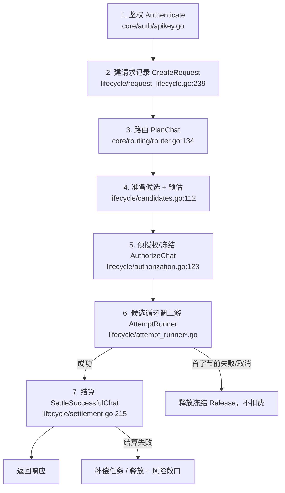
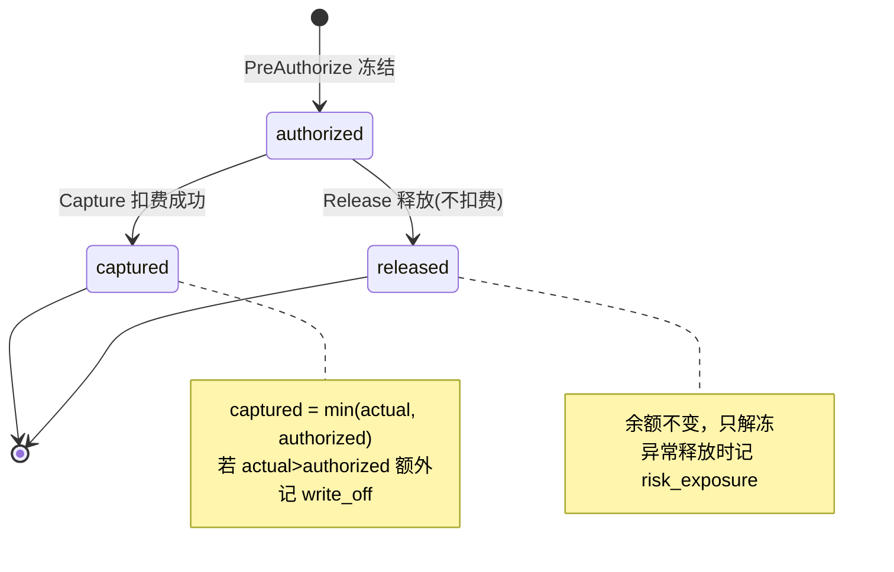

# Gateway 主链路全量审计（生产视角）

> 本文档**不依赖任何既有设计文档**，而是直接通读 `internal/service/gateway`、`internal/core/{ledger,billing,routing,usage}`、`internal/app/workers` 的真实代码后整理出来的：
>
> 1. 完整请求链路（所有线路、所有意外分支）
> 2. 资金状态机
> 3. 从「生产上线」角度（不是最小实现）发现的问题清单
>
> 审计时间：2026-06-28。审计范围对应 commit 当前工作区代码。
>
> **阅读约定**：所有专业词 / 英文词第一次出现时，后面紧跟「（中文解释）」；复杂逻辑一律用「小明发请求」这种用户实例来解释。

---

## 0. 名词速查表（先读这一节）

| 词 | 解释 |
|----|----|
| **gateway（网关）** | 我们自己的服务。客户把请求发给它，它再转发给真正的大模型上游。 |
| **upstream（上游）** | 真正的大模型服务商（OpenAI、Anthropic、DeepSeek 等）。我们要付钱给它。 |
| **channel（渠道）** | 一条「用某个 provider 的某个 key、调某个上游模型」的具体通道。一个模型可以绑定多个渠道。 |
| **candidate（候选）** | 这次请求可以用的渠道列表。第一个失败就换下一个。 |
| **fallback（兜底切换）** | 第一个候选渠道失败时，自动换下一个候选渠道重试。 |
| **routing（路由）** | 决定「这次请求能用哪些候选渠道，按什么顺序」。 |
| **reservation（预授权记录 / 冻结单）** | 一次请求在扣费前，先在账本里建的一条「冻结了多少钱」的记录。 |
| **authorization / pre-authorize（预授权 / 冻结）** | 调上游**之前**，先把预估的钱「冻结」起来（不是真扣），保证用户付得起。 |
| **estimated_amount（预估金额）** | 按预估 token 算出来的「这次大概要花多少钱」。 |
| **authorized_amount（实际冻结金额）** | 真正冻结住的钱 = `min(预估金额, 用户当前可用余额)`。 |
| **capture（确认扣费）** | 请求成功后，按真实用量把钱**真正扣掉**。 |
| **captured_amount（实扣金额）** | 真正扣掉的钱 = `min(真实费用, 冻结金额)`。 |
| **write_off（平台核销 / 平台买单）** | 真实费用超过冻结金额时，超出部分**平台自己承担**，不向用户多扣。 |
| **risk_exposure（风险敞口）** | 上游可能已经产生成本，但我们**拿不到可靠用量**、不能向用户收费时，记下来的「平台可能亏的钱」。 |
| **settlement（结算）** | 「写用量 + 写价格快照 + 扣钱 + 把请求标记成功」这一整套事务。 |
| **idempotent / idempotency（幂等）** | 同一件事重复做多次，结果和做一次一样（不会重复扣费）。 |
| **circuit breaker（熔断器）** | 某个渠道连续出错就临时「拉闸」，一段时间内不再用它，避免拖垮整个请求。 |
| **streaming（流式）** | 上游一边生成一边把内容一段段（chunk）推给客户，而不是等全部生成完再一次返回。 |
| **partial settlement（部分结算）** | 流式请求中途断了、或上游没给最终用量时，按「已经吐出来的内容」估算着收一点钱。 |
| **recovery job（补偿任务）** | 上游成功了但结算失败时，留下的一条「待重试结算」的后台任务。 |
| **token（词元）** | 大模型计费的基本单位，输入和输出都按 token 数 × 单价收费。 |

---

## 1. 主链路全景

一次 `/v1/chat/completions`（或 `/v1/responses`、`/v1/messages`）请求，从进门到结束，依次经过下面 7 步。每一步我都标了对应代码位置。



### 步骤 1：鉴权（Authenticate）

`internal/core/auth/apikey.go:64-124`

- 校验 API Key（应用程序接口密钥）是否存在、未过期、未禁用、未吊销。
- **费用上限闸门（spend limit）**：`apikey.go:115-124`。SQL 里直接算 `spent_total >= spend_limit`（已花 ≥ 上限）就拒绝。
  - ⚠️ 这是**软上限**：`spent_total`（累计已花）只在**结算时**才累加（`settlement.go:466`），而结算可能被推迟到后台 worker。所以高并发下会**轻微超额**（见问题 P2-1）。

### 步骤 2：建请求记录（CreateRequest）

`internal/service/gateway/lifecycle/request_lifecycle.go:239-269`

- 生成服务端自己的 `request_id`（请求 ID），建 `request_records` 行，状态先 `created` 再立刻推进到 `running`（进行中）。
- **关键不变量**：账务用的是服务端生成的 `request_id`，**不是** HTTP 头里的 `X-Request-ID`（那只用于日志关联）。

### 步骤 3：路由（PlanChat）

`internal/core/routing/router.go:134-171`，SQL 在 `sql/queries/channel_models.sql` 的 `FindRouteCandidates`

挑出「这次能用哪些渠道」。SQL 层过滤条件（`channel_models.sql:88-136`）：

- 模型、渠道-模型绑定、渠道、provider 都必须 `enabled`（启用）。
- 渠道协议必须和入口协议一致。
- **必须有一条「当前生效且 enabled」的售价行**（`channel_prices`），否则该渠道被排除（未定价不参与）。
- 满足项目允许/拒绝策略、线路候选池（pool_kind）。
- 排序：`priority ASC, id ASC`（priority 数字越小越靠前）。

线路（route）解析优先级（`router.go:183-205`）：Key 绑定线路 → 项目默认线路 → 内置「经济」线路。

每行再在 Go 里 `buildChatRouteCandidate`：解密渠道凭据、带出 `SalePrice`（售价快照，取 `time.Now()` 时刻生效的价）。

### 步骤 4：准备候选 + 预估输入 token（PrepareCandidates）

`internal/service/gateway/lifecycle/candidates.go:112-163`

- 按线路策略排序（`sortCandidatesByMode:171-189`）：
  - `cheapest`（最便宜）：按售价升序。
  - `stable`（最稳定）：按渠道健康分升序（越健康越靠前）。
  - `fixed`（固定）：保持 priority 序。
- 过滤掉「代码能力不支持」和「熔断中」的渠道。
- 对每个候选估算输入 token，取**所有候选里的最大值**作为 `ConservativeInputTokens`（保守输入估算）——保证无论 fallback 到哪个渠道，冻结都够。

### 步骤 5：预授权 / 冻结（AuthorizeChat）⭐ 资金核心

`internal/service/gateway/lifecycle/authorization.go:123-171` → `billing/service.go:62`（算预估金额）→ `core/ledger/reservation.go:68`（冻结）

预估金额（`EstimateAuthorizationAmount`，`billing/service.go:62-92`）：

```
预估金额 = 最贵输入单价 × 输入token估算 + 最贵输出单价 × 输出token上限
          ────────────────────────────────────────────────────
                               1,000,000
```

- 「最贵输入单价」= uncached / cache_read / cache_write 各档里取最大（偏保守）。
- 「输出token上限」= `estimateMaxCompletionTokens(req)`（`chat_candidates.go:69-77`）：
  - 客户传了 `max_completion_tokens` 或 `max_tokens` → 用它；
  - **客户没传 → 用全局默认 4096**（`lifecycle/authorization.go:25`，`DefaultAuthorizationMaxCompletionTokens`）。

冻结（`reservation.go:68` → SQL `user_balances.sql:185` `ReserveAvailableUserBalance`）：

```
实际冻结金额 authorized = LEAST(可用余额, 预估金额)
                       = min(balance - reserved_balance, estimated_amount)
```

- `balance`（总余额）、`reserved_balance`（已冻结余额）、可用 = 总 − 已冻结。
- 可用余额 ≤ 0 → 直接拒绝 `insufficient_balance`（余额不足），不调上游（`reservation.go:453-468`）。
- 0 < 可用 < 预估 → 冻结全部可用余额，请求**仍然继续**。

> 🧒 **小明例子**：小明余额 $100。他发一个请求，预估要 $0.05。因为余额够，冻结 = min($100, $0.05) = **$0.05**。账本：余额仍 $100，已冻结 $0.05，可用 $99.95。

### 步骤 6：候选循环调上游（AttemptRunner）

非流式：`lifecycle/attempt_runner.go:117-258`；流式：`attempt_runner_stream.go:196-556`

对每个候选依次：

1. 熔断检查（`BreakerAllow`）：渠道在熔断 open 状态 → 跳过，试下一个。
2. 建 attempt（尝试）记录。
3. 解析 typed adapter（协议适配器）；未注册 → fatal，释放冻结 + 标失败。
4. 调上游（`Invoke` / `Stream`）。记录上游耗时、记录渠道健康。
5. 分支：
   - **客户端取消**（`context.Canceled`）：不算上游失败、不 fallback。非流式：释放冻结、不扣费。流式：见下面「流式分支」。
   - **上游报错**：
     - `MarkAttemptFailed`。
     - 错误「可重试」（`retry.go:35`，仅 rate_limit/timeout/server_error）→ 记 `lastErr`，试下一个候选。
     - 否则 → 释放冻结 + 标失败 + 返回。
   - **成功** → 进入步骤 7 结算。
6. 全部候选都失败 → 释放冻结 + 标 `no_available_channel`。

#### 流式特有分支（attempt_runner_stream.go）

`emitted`（是否已经向客户写出过 SSE 帧）是关键开关：

- **一旦写出第一个字节，就不能再 fallback**（否则同一个流里混进两个上游的内容）。
- 上游有最终用量（`streamFacts != nil`）→ 即使流尾报错也优先结算（成本已产生，不能免费）。
- 已 emit 但无最终用量：
  - 客户端取消 → **路线 B**：按已吐内容部分结算。
  - 上游中断 → **路线 B**：部分结算 + 标 failed。
  - 正常结束但缺用量 → **路线 D**：部分结算 + 标渠道异常。
- 未 emit 就出问题 → **路线 C**：普通释放冻结、不扣费。
- 部分结算事实由 `partial_stream.go:46` 合成：输入用冻结时的保守估算，输出按「已吐可见文本」用 tokenizer 估算（偏少）。

### 步骤 7：结算（SettleSuccessfulChat）⭐ 资金核心

`lifecycle/settlement.go:215-525`

在**一个数据库事务**里完成（要么全成功，要么全回滚）：

1. 锁住 request 行（`GetRequestRecordForUpdate`）。只有 `running` 才能首次结算；`succeeded` 走幂等校验。
2. 校验 adapter 事实（用量来源、用量合法、finish 状态等）。
3. **按实际命中渠道重新查价**（`FindActiveChannelPrice`，`settlement.go:350`），`at_time` = **attempt 开始时间**。
   - ⚠️ 注意：这里**重新查价**，用的不是步骤 5 冻结时的价！（见问题 P1-3）
4. 写 usage record（用量记录）、price snapshot（售价快照）、cost snapshot（成本快照）。
5. 算客户费用 `CalculateCustomerCharge`。
6. **扣钱**（`reservation.go:163` `captureWithQueries`）：

```
实扣 captured   = min(真实费用 actual, 冻结金额 authorized)
平台核销 write_off = max(0, actual - authorized)
```

   SQL（`user_balances.sql:147` `CaptureUserReservedBalance`）：
```
balance          -= captured       (真扣这么多)
reserved_balance -= authorized     (整笔冻结释放)
```
   若 `actual > authorized` → 额外写一条 `write_off` 异常（`reservation.go:282-296`）。
7. `AddAPIKeySpentTotal(captured)`（累计已花，只加实扣，**不含 write_off**）。
8. 把 request 标 `succeeded`，commit。

> 🧒 **小明例子（续）**：小明这次冻结了 $0.05。上游返回后真实费用算出来是 **$0.10**。
> - 实扣 = min($0.10, $0.05) = **$0.05**
> - write_off = $0.10 − $0.05 = **$0.05** ← 平台买单
> - 小明余额从 $100 变成 $99.95，**只被扣了 $0.05**，剩下 $0.05 平台自己承担。
> - 注意：小明明明还有 $99.95，完全付得起 $0.10，但系统**只扣了冻结的 $0.05**。👉 这正是问题 P0-1。

---

## 2. 资金状态机（reservation 一生）



- `authorized`（已冻结）：唯一允许首次 capture 或 release 的状态。
- `captured`（已扣费）：终态，不能再 release。
- `released`（已释放）：终态，余额没动过。
- 幂等：重复 capture/release 同状态 → 直接返回，不重复操作（`reservation.go:189-218`）。

---

## 3. 结算失败的兜底链路（recovery）

这是整个系统**最复杂**的部分，因为「上游已经花钱了，但我们结算失败」是最危险的状态。

`lifecycle/settlement_recovery.go` + `internal/app/workers/settlement_recovery_worker.go`

执行顺序（`RecoverableChatSettlementExecutor.SettleSuccessfulChat:87-111`）：

1. **先**建一条 `pending`（待处理）补偿任务，存下重放结算需要的全部事实。
2. **再**执行真正结算。
3. 结算成功 → 把补偿任务标 `succeeded`。
4. 结算失败 → 返回一个特殊错误 `ErrChatSettlementRecoveryScheduled`（已安排补偿）。

调用方（AttemptRunner）看到「已安排补偿」这个错误时，**当作成功**对待——把响应正常返回给客户，扣费交给后台 worker 慢慢重试。

> 🧒 **小明例子**：小明的请求上游成功了，但结算时数据库抖了一下失败。系统已经提前建了补偿任务，于是小明**正常拿到回答**，钱由后台 worker 过几十秒重试扣。小明无感。

后台 worker（`settlement_recovery_worker.go:77-131`）每轮：

1. 先收口「已 dead 但请求还卡在 running」的任务（`finalizeNextDeadJob`）。
2. 标记「到期且重试已耗尽」的任务为 `dead`（死信）。
3. claim（认领）一条到期任务（SQL `FOR UPDATE SKIP LOCKED`，多 worker 安全），重放结算。
4. 失败 → 按 `attempt_count` vs `max_attempts` 决定重试（指数退避）还是直接 dead。

dead 收口（`settlement.go:537-595` `FinalizeDeadChatSettlement`）：以「请求仍是 running」为幂等闸门，释放冻结余额 + 记 `risk_exposure`（风险敞口）+ 把请求标 failed。

> 即：**重试到死都结不了账 → 不向用户收费（因为拿不到可靠事实），平台把这笔可能的成本记为风险敞口**。

---

## 4. 问题清单（生产视角，按严重度排序）

> 标注规则：**P0 = 直接造成资金损失/错账，必须修**；**P1 = 生产事故隐患**；**P2 = 健壮性/运维隐患**。
> 每条都给了「机制」「用户实例」「代码位置」「建议」。

---

### 🔴 P0-1：余额充足时，真实费用超冻结的差额仍由平台买单（核心账务缺陷）

**这就是你看到的那条 `write_off` 的根因，也是你直觉「逻辑不对」的地方——你的直觉是对的。**

**机制**：
- 冻结 `authorized = min(预估, 可用余额)`；
- 结算实扣 `captured = min(真实费用, authorized)`；
- 差额 `write_off = 真实费用 − authorized` 由平台承担；
- **结算阶段永远不会再去动用户「剩余的可用余额」补扣**，哪怕用户余额多得是。

所以只要 `真实费用 > 预估`（在余额充足时 `authorized = 预估`），平台就**必然漏收**，与余额是否充足无关。

**用户实例**：
> 小明余额 $100。请求预估 $0.05（冻结 $0.05），真实费用 $0.10。系统只扣 $0.05，write_off $0.05。小明账上还有 $99.95，明明付得起，平台却白白亏了 $0.05。规模化后这是系统性漏收。

**代码位置**：
- 实扣封顶：`internal/core/ledger/reservation.go:184-186`
- write_off 落账：`internal/core/ledger/reservation.go:282-296`
- 扣款 SQL：`sql/queries/user_balances.sql:147-165`

**为什么会 `真实费用 > 预估`**（三个叠加来源）：
1. **输出 token 上限默认 4096**（见 P0-2）——客户不传 max_tokens 时，冻结只按 4096 输出估，但上游可以吐几万 token。
2. **tokenizer 估算漂移**——本地估的输入/输出 token 和上游实际计费 token 不一致，本地偏少就漏。
3. **路由价 ≠ 结算价**（见 P1-3）——结算按 attempt 时刻重新查价，若涨价则真实费用 > 冻结。

**修复方案（已定原则，状态：⏸ 暂未实现 / 待排期）**

> 设计原则（业务方拍板，2026-06-28）：**用户余额绝不能为负；优先保证平台利益——可以一直收到「清空用户可用余额」为止，但不能透支。**

**精确目标行为**：设结算时真实费用 `A`、本请求冻结额 `Z`、用户「冻结之外的剩余可用余额」`F = balance − reserved_balance`。

```
实收 C       = min(A, Z + F)              ← 最多收到把可用余额清空
平台核销 W   = A − C = max(0, A − Z − F)   ← 只核销用户真付不起的部分
```

| 情况 | 现状（缺陷） | 目标 |
|---|---|---|
| `A ≤ Z` | 收 A，释放 Z−A | ✅ 不变 |
| `Z < A ≤ Z+F`（余额够付真实费用） | ❌ 只收 Z，差额平台买单 | ✅ 收满 A，**0 核销** |
| `A > Z+F`（余额连真实费用都不够） | 只收 Z，其余核销 | ✅ 收到 Z+F（**清空可用余额**），只核销 `A−Z−F` |

**关键约束**：DB 硬约束 `captured_amount ≤ authorized_amount`（`migrations/000017_create_ledger_reservations.up.sql:69-111`），冻结单本身不能扣超过冻结额。因此「超出冻结再多收」必须作为**一笔独立的补扣 debit 流水**，不能撑大 `captured_amount`。**无需新表/迁移**——复用现成 SQL 即可。

**实现要点**（单一收口点 `internal/core/ledger/reservation.go:163` `captureWithQueries`，覆盖非流式/流式/partial/recovery 全部路径）：
1. 照旧 capture 冻结：`captured = min(A, Z)`、释放剩余、写 debit#1（满足 DB 约束）。
2. 若 `A > Z`：算 `extra = min(A − Z, F)`，复用 `SubtractUserBalance`（`sql/queries/user_balances.sql:110-127`，自带「不为负、不动他人冻结」守卫）从剩余可用余额补扣，并 `CreateLedgerEntry` 写 debit#2（幂等键 `chat:settle:overage:<reqID>`）。
3. `write_off` 仅在 `A > Z + extra` 时记，平台金额 = `A − Z − extra`。
4. `AddAPIKeySpentTotal` 累加**实收总额** `Z + extra`（**决策：超额补扣计入 `spent_total` / `spend_limit`**，2026-06-28 拍板）。
5. 改幂等重放校验 `ensureSettlementCapturedReservationMatches` / `ensureSettlementWriteOffMatches`（`settlement.go:887,1060`）：认这条 overage 流水，并改 write_off 口径为「`A − Z − 已收 overage`」；replay 不可重算 `extra`（依赖当时余额），改为读取已存的 overage 流水金额做一致性校验。
6. 更新受影响的 ledger / billing / settlement 测试（现有用例断言旧的 `min(actual, authorized)` 口径）。

全程在 `GetUserBalanceForUpdate` 行锁内串行，余额并发安全、永不为负。该方案与 P0-2（给上游注入与冻结一致的输出上限）配合后，余额充足场景基本不再漏收。

---

### 🔴 P0-2：冻结用 4096 输出上限，但转发给上游的请求**不加任何输出上限**（不对称漏收）

**机制**：
- `estimateMaxCompletionTokens`（`chat_candidates.go:69-77`）：客户没传 `max_tokens` 时，**冻结**按 4096 输出估。
- 但 `mapGatewayRequestToAdapter`（`chat_dto_map.go:77-91`）把 `MaxTokens` **原样透传**——客户没传就是没传，**上游不受 4096 约束**，可以一直生成。

于是「冻结假设最多 4096 输出，上游却可以无上限输出」，两边不对称，长输出必然击穿冻结 → P0-1 的 write_off。

**用户实例**：
> 小明用某长输出模型，不传 max_tokens。系统按 4096 输出冻结约 $0.05。模型实际吐了 5 万 token，真实输出费用 $0.6。结算只扣到冻结上限，剩下约 $0.55 全平台买单。

**代码位置**：
- 冻结默认值：`internal/service/gateway/lifecycle/authorization.go:25`、`chat_candidates.go:69-77`
- 透传不加 cap：`internal/service/gateway/openai/chatcompletions/chat_dto_map.go:77-91`

**建议**（任一或组合）：
1. 客户没传上限时，gateway 主动给上游请求注入一个与冻结一致的 `max_tokens`（用模型的 `max_output_tokens`，即 TODO_REGISTER 里的 GAP-12-010），让「冻结 = 上游硬上限」。
2. 按模型真实 `max_output_tokens` 冻结，而不是全局 4096。
3. 配合 P0-1 的二次补扣，至少保证余额够时不漏。

---

### 🔴 P0-3：原生 compact 回退会产生「白嫖」的上游调用（仅 Responses 协议）

**机制**：`/v1/responses/compact`（会话历史压缩）有「原生」和「合成」两条路。原生失败且判定为「上游不支持」时，会回退到合成路再调一次上游，但**只结算合成那一次的费用**。
- 尤其当原生返回 **HTTP 200 但解析不出用量** 时，上游**很可能已经处理并计费**了，我们却不收这笔，转头又调一次合成的，于是**一次请求两次上游调用、只收一次费**。

**用户实例**：
> 小明调 compact。原生上游 200 返回但 body 没有 usage 字段 → 系统判定「不支持」→ 又走合成 chat 调一次 → 只按合成那次收费。原生那次的上游 token 成本，平台买单。

**代码位置**：
- 回退逻辑：`internal/service/gateway/openai/responses/compact_orchestrator.go:101-124`
- 「不支持」判定（含 200+缺 usage）：`internal/core/adapter/openai/responses/compact.go:105-112`

**建议**：原生返回 200 但缺 usage 时，不应静默回退白嫖；要么按保守估算对原生那次记账/风险敞口，要么不回退直接报错。区分「真 404/405（没成本）」与「200 但缺 usage（可能有成本）」。

---

### 🟠 P1-1：一个坏凭据会让整笔请求失败（可用性缺陷）

**机制**：路由在 Go 里**一次性构建所有候选**，逐行解密凭据；**任意一行凭据为空/解密失败，整个 plan 直接报错**返回，哪怕池子里还有其它健康渠道。

**用户实例**：
> 某模型绑了 3 个渠道，运维不小心把渠道 B 的凭据清空了。小明的请求本可用渠道 A 成功，却因为构建候选时撞到 B 的空凭据，整个请求直接失败。

**代码位置**：`internal/core/routing/router.go:155-162`、`:293-309`

**建议**：把「坏凭据」当作「该候选不可用」跳过（记日志/告警），而不是让整个 plan 失败。只有当**所有**候选都不可用时才报 `no_available_channel`。

---

### 🟠 P1-2：流式「已 emit 后永久结算失败且无补偿」→ 客户拿到内容但平台白送

**机制**：流式请求已经把内容写给客户后（`emitted=true`），如果结算永久失败且没有补偿任务接管，会走 `ReleaseAuthorizationForBillingException` → 释放冻结 + 记 `risk_exposure`，**不向用户扣费**。但客户**已经拿到了完整内容**。

**用户实例**：
> 小明流式请求，上游正常吐完，客户端全收到了。结算阶段（建补偿任务这一步）数据库挂了 → 系统记风险敞口、不扣小明钱。小明等于免费用了一次，平台承担上游成本。

**代码位置**：`attempt_runner_stream.go:409-435`、`:502-518`

**说明**：这是「上游成功 + 结算彻底失败」的极端兜底，本身是为了不让用户余额被永久冻结，方向正确；但**对已交付内容不收费**是真实漏收。属于可接受的极端兜底，但生产要有**告警和对账**，且要尽量让补偿任务这一步极其可靠（它是第一道防线）。

---

### 🟠 P1-3：路由价与结算价不一致 + 路由后渠道/价格被改的竞态

**机制**：
- 路由按 `time.Now()` 取价用于**冻结**；结算按 **attempt 开始时间**重新查价用于**实扣**。两者之间运维若改价/停用价，会出现：
  - 涨价 → 真实费用 > 冻结 → write_off（P0-1）。
  - 价格被停用 → 结算 `FindActiveChannelPrice` 找不到价 → 结算失败 → 补偿 → 可能 dead → 用户不被收费、平台记风险敞口，而**客户可能已拿到响应**。
- 渠道在路由后被停用：内存里的候选 plan 仍会去调它（路由结果不二次校验）。

**用户实例**：
> 路由时渠道 A 单价 $1/百万 token，冻结按 $1 估。结算前运维把 A 的价改成 $2 并停用旧价行。结算重新查价：旧价已停用、新价生效 → 真实费用翻倍或查不到价。前者击穿冻结（平台买单差额），后者结算失败走补偿。

**代码位置**：
- 路由取价 `time.Now()`：`core/routing/router.go:225-232`
- 结算重新查价 `attempt.StartedAt`：`settlement.go:350-354`

**建议**：要么结算复用冻结时锁定的同一条 `channel_price_id`（锁价），要么改价时用「新增生效行 + 保留历史行」而非停用旧行（保证历史 at_time 永远查得到）。当前 lateral 查价已按 effective_from/to 取历史，但**前提是旧价行不被删/停**——运维流程要硬约束这一点。

---

### 🟠 P1-4：`max_attempts` 内联首次结算失败也算掉一次重试预算（潜在过早 dead）

**机制**：`RecoverableChatSettlementExecutor` 先建 job（`attempt_count=0`），内联结算失败后由 worker 重试。worker 每次 claim 会 `attempt_count+1`。但内联那次失败**本身**没记到 attempt_count——这是好事。需要确认的是：`max_attempts` 默认值是否给了足够的真实重试次数（内联失败 + worker 重试）。若 `max_attempts` 偏小，瞬时抖动可能过快 dead，导致本可收的费变成 risk_exposure。

**代码位置**：`settlement_recovery_worker.go:189-243`、claim SQL `settlement_recovery_jobs.sql:225-255`、退避 `:260-271`。

**建议**：核对 `settlement_recovery_jobs.max_attempts` 默认值与退避总时长，确保覆盖常见数据库/网络抖动窗口（建议总重试跨度 ≥ 数分钟）。

---

### 🟡 P2-1：费用上限是软上限，高并发可超额

**机制**：`spent_total` 只在结算时累加，鉴权时只读快照。结算还可能被推迟到 worker。所以用户在「接近上限」时并发打一批请求，可能全部通过鉴权，最终超出 `spend_limit`。

**用户实例**：
> 小明 Key 上限 $10，已花 $9.9。他瞬间并发 50 个请求，全部在鉴权时看到「还没到上限」放行，结算后 `spent_total` 冲到 $12。超额 $2。

**代码位置**：`core/auth/apikey.go:115-124`（注释已自认是软上限），累加 `settlement.go:466`。

**建议**：若要硬上限，需在冻结时同事务校验并预占额度；当前软上限语义要在产品上明确告知，且监控超额幅度。另外 `spent_total` 只加 `captured` 不含 `write_off`，意味着「上限」统计的是实收，不是真实成本。

---

### 🟡 P2-2：流式 partial settlement 系统性偏少收

**机制**：流式中断/取消/缺用量时，按「已吐可见文本」用本地 tokenizer 估输出、输入复用冻结估算。这通常**偏少**：不含 reasoning token、tokenizer 与上游计费口径有差、输入用的是估算而非真实。

**用户实例**：
> 小明流式请求生成到一半把连接断了。系统按已吐的可见文字估了 800 输出 token 收费，但上游实际已生成 1500 token（含 reasoning）。差额平台承担。

**代码位置**：`partial_stream.go:46-83`、`attempt_runner_stream.go:396-399`。

**建议**：可接受的保守策略（宁可不超收用户），但要监控 partial 占比与金额，避免被滥用（故意中断白嫖大部分输出）。

---

### 🟡 P2-3：可重试 fallback 中，前一个候选若已在上游产生成本则不计费

**机制**：候选 A 上游报「可重试错误」（timeout/server_error）后切到候选 B 成功，只结算 B。但 timeout/server_error 有时上游**已经开始生成**（尤其超时），那部分成本无人结算。

**用户实例**：
> 候选 A 超时（上游其实已生成了一部分），切到 B 成功。小明只为 B 付费，A 的上游成本平台承担。

**代码位置**：`attempt_runner.go:177-188`、`attempt_runner_stream.go:461-475`。

**建议**：这是行业普遍取舍（失败不向用户收费），但要监控；对「疑似已产生成本的超时」可考虑记风险敞口用于对账。

---

### 🟡 P2-4：零价渠道可被正常路由（误配即免费serving）

**机制**：DB 允许单价为 0（`>= 0`），零价行能通过路由的 lateral 价过滤，`cheapest` 模式还会**优先**选它 → $0 收入请求。

**用户实例**：
> 运维新建渠道时价格忘填、落成 0。该渠道被 cheapest 优先命中，所有走它的请求全部 $0 收费，平台全额承担上游成本，直到有人发现。

**代码位置**：路由价过滤 `channel_models.sql:88-101`；cheapest 选择 `lifecycle/candidates.go:191-196`。

**建议**：业务上若不存在「真免费模型」，应在建价/路由层对 0 价加校验或告警。

---

### 🟡 P2-5：补偿 worker 串行、空闲 1s 轮询，积压时排空慢

**机制**：`Runner`（`workers/runner.go:45-100`）顺序跑各 worker，空闲睡 1s。补偿 worker 每轮只处理一条 job（claim 一条）。虽然 `FOR UPDATE SKIP LOCKED` 支持多进程并行，但单进程吞吐有限。

**用户实例**：
> 数据库抖动 5 分钟，期间产生 5000 条补偿任务。恢复后单 worker 每轮处理一条，排空缓慢，大量请求的扣费被显著延迟，期间软上限/余额视图都不准。

**代码位置**：`workers/runner.go:45-100`、`settlement_recovery_worker.go:77-131`。

**建议**：补偿任务积压场景下，单轮批量 claim/处理，或多副本部署 worker（SKIP LOCKED 已支持）。

---

### 🟡 P2-6：生产代码在结算热路径读环境变量做故障注入

**机制**：`SettleSuccessfulChat` 每次都会 `os.Getenv("BILLING_E2E_INJECT_SETTLEMENT_FAIL")`（`settlement.go:204-212`），`RecoverableChatSettlementExecutor` 同样读（`settlement_recovery.go:98`）。若该 env 在生产被误设为 `always`/`once`，**每次结算都会失败**。

**建议**：把故障注入用构建标签（build tag）或仅测试装配隔离，生产二进制不读该 env；至少在启动时若检测到该 env 非空就显式告警。

---

## 5. 做得好的地方（避免误伤）

为客观起见，这些设计是扎实的，不要动：

- **结算在单事务内完成**（用量+价格+扣费+状态），不会「先返回再异步扣费」造成错账（`settlement.go:215`）。
- **幂等覆盖充分**：reservation 状态机、settlement 重放校验、补偿任务 ON CONFLICT、worker `SKIP LOCKED`，都防重复扣费（`settlement.go:636-919`）。
- **unknown 用量绝不按 0 计费**：token 用量带 `known/not_applicable/unknown` 三态，unknown 会拒绝结算而非静默 0（`usage/facts.go:55-68`）。
- **金额全程 `big.Rat` 有理数**，最后 `roundHalfUp` 到 10 位小数，无 float 误差（`billing/numeric.go:58-79`）。
- **流式「首字节后禁止 fallback」**语义正确，避免响应内容串台（`attempt_runner_stream.go:388-394`）。
- **「上游成功但结算失败」有补偿 + 死信兜底**，不会让用户余额被永久冻结（`settlement_recovery.go`、`settlement.go:537`）。
- **熔断器 + 健康分** 保护上游、支撑 stable 路由（`breaker.go`）。

---

## 6. 修复优先级建议

| 优先级 | 问题 | 一句话修复方向 |
|--------|------|----------------|
| P0-1 | 余额够仍 write_off | 结算时按原则「余额不为负、优先收满平台、最多清空可用余额」二次补扣 `extra=min(A−Z, F)`，只核销 `A−Z−F`；详见 P0-1 修复方案（⏸ 待排期） |
| P0-2 | 冻结 4096 / 上游不限输出 | 给上游注入与冻结一致的 `max_tokens`，或按模型 `max_output_tokens` 冻结 |
| P0-3 | compact 回退白嫖 | 原生 200 缺 usage 时不静默回退，记账/风险敞口/报错 |
| P1-1 | 坏凭据拖垮整请求 | 坏凭据候选跳过而非整 plan 失败 |
| P1-3 | 路由价≠结算价 | 结算锁价复用同一 price_id，或改价用新增生效行+保留历史 |
| P1-2 | 已交付却免费 | 强化补偿任务可靠性 + 告警对账 |
| P2-* | 软上限/串行 worker/零价/env 注入 等 | 监控 + 运维约束 + 部署多副本 worker |

---

## 7. 附录：关键文件索引

| 关注点 | 文件 |
|--------|------|
| 主链路编排（非流式） | `internal/service/gateway/openai/chatcompletions/chat_completion.go` |
| 主链路编排（流式） | `internal/service/gateway/openai/chatcompletions/chat_stream.go` |
| 候选循环（非流式/流式） | `internal/service/gateway/lifecycle/attempt_runner.go` / `attempt_runner_stream.go` |
| 预授权/冻结 | `internal/service/gateway/lifecycle/authorization.go` |
| 结算 | `internal/service/gateway/lifecycle/settlement.go` |
| 补偿任务 | `internal/service/gateway/lifecycle/settlement_recovery.go` |
| 补偿 worker | `internal/app/workers/settlement_recovery_worker.go` |
| 候选准备/排序 | `internal/service/gateway/lifecycle/candidates.go` |
| 熔断器 | `internal/service/gateway/lifecycle/breaker.go` |
| 重试分类 | `internal/service/gateway/lifecycle/retry.go` |
| 部分结算事实 | `internal/service/gateway/lifecycle/partial_stream.go` |
| 账本（冻结/扣费/释放） | `internal/core/ledger/reservation.go` |
| 计费公式/估算 | `internal/core/billing/service.go` / `price.go` / `numeric.go` |
| 用量三态 | `internal/core/usage/facts.go` |
| 路由 | `internal/core/routing/router.go` + `sql/queries/channel_models.sql` |
| 余额 SQL | `sql/queries/user_balances.sql` |
| 补偿任务 SQL | `sql/queries/settlement_recovery_jobs.sql` |
| Responses compact | `internal/service/gateway/openai/responses/compact_orchestrator.go` |

---

## 8. 第二轮侦查补充发现（Round 2，2026-06-28）

> 第二轮重点查了第一轮没深挖的：**进程崩溃残留、上游健壮性、限流、内存安全、双协议对等**。结论：双协议资金链路是对等的（好消息），但发现几条**新的生产隐患**。

### 🟠 P1-5：进程崩溃会留下「永久冻结」的孤儿预授权（无清扫 worker）

**机制**：预授权（`PreAuthorize`）是**独立事务**先提交的；结算 / 补偿任务是**之后**才发生的。如果 gateway 进程在「预授权已提交」与「结算或建补偿任务」**之间**被杀掉（发版重启、OOM、panic、宿主漂移），这条 reservation 会永远停在 `authorized` 状态：
- 没有补偿任务（还没来得及建）→ 补偿 worker 不会管它（worker 只扫 `settlement_recovery_jobs`）。
- 没有任何「清扫超时 authorized 预授权」的 worker（全仓确认缺失）。
- 该用户被冻结的那笔 `reserved_balance` **永远不释放**。

**证据**：迁移里**专门为此建了索引** `idx_ledger_reservations_authorized_created_at ... WHERE status='authorized'`（`migrations/000017...:124-126`，注释写「worker recovery 会扫描仍处于 authorized 状态的旧预授权」），**但没有任何 SQL / worker 真正使用它**——只有按 id 操作的 `CaptureLedgerReservation` / `ReleaseLedgerReservation`。设计预留了清扫器，实现却从未落地。

**用户实例**：
> 小明发起请求，冻结了 $5。就在这一刻运维发版重启了 gateway，请求 goroutine 被杀，还没结算也没建补偿任务。重启后没有任何机制释放这 $5 —— 小明账上永远有 $5 处于「冻结」、可用余额永久少 $5，且无人知晓。每次发版只要有在途请求就会累积这种「幽灵冻结」。

**代码位置**：`PreAuthorize` 独立事务 `internal/core/ledger/reservation.go:68-127`；缺失的清扫器（应有未有）；预留索引 `migrations/000017_create_ledger_reservations.up.sql:124-126`。

**建议**：新增一个「过期 authorized 预授权清扫 worker」：扫描 `status='authorized' AND created_at < now() - 阈值`（阈值取「最长可能请求时长 + 安全余量」，如 15 分钟）的 reservation，逐条 `Release`（幂等，已 captured/released 的会被状态闸门挡掉）。复用现有 `ReleaseLedgerReservation` + 那条预留索引即可，无需新表。这是**上线前必须补的兜底**，否则余额对账长期漂移。

---

### 🟠 P1-6：非流式上游响应体**无大小上限**，可被超大响应打爆内存（OOM）

**机制**：OpenAI chat 与 Anthropic messages 的非流式上游响应，直接 `json.NewDecoder(resp.Body).Decode(...)`，**没有任何字节上限**。只有 Responses 协议用了 `readAllLimited(4MB)`。一个被攻陷/异常的上游（或中间代理）返回超大 200 响应体，会让 gateway 无限读入内存。

**用户实例**：
> 某上游渠道被入侵或 bug，对一个普通请求返回 2GB 的 JSON。gateway 一边解码一边吃内存直到 OOM，**一条请求拖垮整个进程**，影响所有在途用户。

**代码位置**：`internal/core/adapter/openai/chatcompletions/chat.go:96-97`、`internal/core/adapter/anthropic/messages/adapter.go:66-67`（对比 `openai/responses/util.go:5-7` 已有 4MB 上限）。

**建议**：所有非流式上游响应统一用 `io.LimitReader`（如 16-32MB，按最大合理响应设定）再解码，超限按 `decode_response_failed` 处理。与 Responses 对齐。

---

### 🟠 P1-7：流式请求「首字节后」没有 idle 超时，挂起的上游会无限占用连接与成本

**机制**：流式调用用的是 `HeaderTimeoutContext`——渠道超时**只**约束「响应头到达之前」。一旦上游回了 200 头，后续 body 读取**只受客户端是否断开**约束，**没有渠道级 idle/read 超时**。上游若在 200 之后挂起（不发数据也不关连接），只要客户端还连着，gateway 就会**一直挂着**这条上游连接。

**用户实例**：
> 上游回了 200 头就卡死（既不吐 token 也不断开）。小明的客户端是个后台任务、不会主动断开。这条请求就**永远挂着**，占用一个上游连接和一个 goroutine；大量此类请求会耗尽连接/句柄。

**代码位置**：`internal/core/adapter/stream_timeout.go:28-35`（header-only）；各 adapter stream 入口。

**建议**：给流式 body 读取加一个**「两个 chunk 之间最大间隔」idle 超时**（如 60-120s），超时按上游中断处理（此时已 emit 则走 partial settlement）。这是流式网关的标配护栏。

---

### 🟠 P1-8：流式「传输层失败」（截断 / 缺 `[DONE]`）未归类为上游故障 → 首字节前也不 fallback

**机制**：fallback 只认 `*adapter.UpstreamError`（`retry.go:36-38`）。但流式传输层错误——SSE 截断、连接中途断、缺 `[DONE]`/`message_stop` 终止符、解析失败——被包成 `CodeAdapterReadStreamFailed` 等，**不带 UpstreamError 分类**，于是**一律不可重试**。即使错误发生在**首字节之前**（本来允许 fallback），也不会切到健康渠道。

**用户实例**：
> 渠道 A 前面有个抽风的代理，经常把 SSE 流在首 token 前就截断。本应识别为「A 不健康，切到 B」，但因为这类错误不带上游分类，gateway 直接对客户报错，**白白放过了健康的渠道 B**。

**代码位置**：`internal/service/gateway/lifecycle/retry.go:35-49`；`internal/core/adapter/sse/reader.go`（`ErrMalformedStream` 等不带分类）。

**建议**：把「首字节前的传输层失败」（连接错误、截断、缺终止符）归类为 `server`/`timeout` 类上游故障，使其在**未 emit**时可参与 fallback；已 emit 后仍按现有 partial 逻辑不切换。

---

### 🟡 P2-7：429 不读 `Retry-After`，立即切下一个渠道，可能连环打爆上游

**机制**：429 仅按 HTTP 状态归类为 `rate_limit`，gateway 立即 fallback 到下一个同模型渠道，**不读 `Retry-After`、无退避**。若多个渠道同属一个上游账号/同一限流域，会被瞬间连环打爆。

**代码位置**：`upstream_error` 分类 + `retry.go:42-44`；全仓无 `Retry-After` 读取。

**建议**：解析 `Retry-After`，对该渠道做短时 cooldown（可复用熔断器的 open 态），而不是无脑切换。

---

### 🟡 P2-8：限流粒度偏粗——全局固定窗口、按请求数、无 TPM、无并发上限

**机制**：限流是「每个 API Key 一个**全局固定窗口请求计数**」（`DefaultLimit`/`DefaultWindow` 对所有 Key 相同，Redis `INCR`+`ExpireNX`）。缺：
- **不能按 Key / 项目 / 模型分别配额**（所有 Key 同一个值）。
- **没有 TPM（每分钟 token 数）**，只有 RPM（请求数）——而 LLM 成本主要由 token 决定。
- **固定窗口**有「窗口边界突发」问题（窗口切换瞬间可放过 2 倍流量）。
- **没有并发上限（max parallel requests）**。

**代码位置**：`internal/platform/ratelimit/limiter.go`、`redis_store.go`（固定窗口）、`internal/app/gatewayapi/middleware/rate_limit.go`、`internal/bootstrap/http.go:42-44`（全局值）。

**建议**：见第 9 节「可借鉴项」。至少补 **per-key TPM/RPM** 与 **并发上限**，固定窗口可升级为滑动窗口。

---

### 🟡 P2-9：JSON 请求体默认上限 1MB，偏小，可能误拒多模态 / 长上下文

**机制**：`DefaultMaxJSONBodyBytes = 1<<20`（1MB）。长上下文（几十万 token 文本）或带 base64 图片的多模态请求很容易超 1MB 被拒（`request_body_too_large`）。虽可用 `HTTP_MAX_JSON_BODY_MB` 调大，但**默认值偏小**。

**代码位置**：`internal/platform/httpx/json.go:17`。

**建议**：默认提到更合理的值（如 10-25MB），或按路由区分（多模态端点更大）。

---

### 🟡 P2-10：Responses 流式会把上游 inline 错误消息原样透传给客户端（信息泄露）

**机制**：Responses 流里上游的 `response.failed` / `error` 事件会**原样 emit 给客户端**（为兼容 Codex SDK 而有意为之），上游错误 `message` 字段可能含 provider 细节甚至敏感信息。chat/anthropic 的客户端错误是**已脱敏**的固定文案，这条是 Responses 特有的例外。

**代码位置**：`internal/core/adapter/openai/responses/stream.go:175-185`、`errors.go:75-87`。

**建议**：对透传的 inline 错误做白名单/脱敏，至少剥掉上游 base_url、内部 request id 等。

---

### ✅ 第二轮确认「没问题」的点

- **双协议资金链路完全对等**：Anthropic Messages 与 OpenAI 一样走共享 `AttemptRunner` / `RunStreamGeneric`（冻结/结算/write_off/release/补偿/取消/partial 全共享）。`attempt_runner.go:26` 那句「Anthropic 暂不接入」注释是**过时的**，实际已接入——建议改掉以免误导后人重新分叉。
- **SSE 解析**自带 4MB 行/事件上限、自定义 reader（无 `bufio.Scanner` token-too-long 问题）、严格终止符校验。
- **客户端断开**经 `r.Context()` 正确传播，emit 路径能快速取消。
- **chat/anthropic 客户端错误已脱敏**，不泄露上游状态/body。
- **限流、payload 上限、熔断**这些护栏**存在**（只是粒度/默认值需加强）。

---

## 9. 与开源网关对比与可借鉴项

对比对象：**LiteLLM**（Python，最主流的 LLM 网关）、**new-api / one-api**（Go，和本项目领域最接近：多渠道 + 计费 + token 配额）、**Portkey Gateway**（TS）、**Cloudflare AI Gateway**。

### 能力对比矩阵

| 能力 | 本项目 unio | LiteLLM | new-api/one-api | 建议 |
|------|------------|---------|-----------------|------|
| 多渠道 fallback | ✅ priority/cheapest/stable | ✅ 多策略 | ✅ priority + 权重 | — |
| **同优先级内负载均衡** | ❌ 只按 priority/价/健康排序，**同档不分流** | ✅ simple-shuffle/least-busy/latency/usage/cost | ✅ **权重随机** | **建议补：同档加权随机**，避免最便宜/最高优渠道被打爆 |
| **least-latency / least-busy 路由** | ❌ | ✅ | ⚠️ | 可选：按 P95 延迟/在途数选渠道 |
| **渠道内多 Key 轮询** | ❌ 一渠道一凭据（且坏凭据拖垮全请求 P1-1） | ✅ | ✅ 轮询/加权 + 坏 Key 自动跳过+恢复 | **建议补**：一渠道多 Key + 自动跳过 |
| **per-Key / per-Model TPM·RPM** | ❌ 仅全局 RPM | ✅ per key/team/model TPM+RPM | ✅ 用户级模型限流 | **建议补**（见 P2-8） |
| **硬预算闸门** | ⚠️ 仅 Key 生命周期 spend_limit（软、结算后才加，P2-1 会超额） | ✅ `fail_closed_budget_enforcement` 每请求查库校验（带几秒缓存） | ✅ 配额 | **建议补硬闸门**：高风险用户每请求查库预占 |
| **TPM 先检查后回填** | ❌ | ✅ 调用前按已用 token 阻断、调用后回填实际 token | — | TPM 的标准做法，可直接借鉴 |
| **429 cooldown / Retry-After** | ⚠️ 熔断需累计阈值；单次 429 不冷却；不读 Retry-After | ✅ 失败 deployment 立即 cooldown | ✅ 自动禁用/重试 | **建议补**（见 P2-7） |
| **可配置重试 / 状态码覆盖** | ❌ 固定分类 | ✅ num_retries | ✅ 状态码覆盖（如 400→500 才重试；400/504/524 默认不重试） | 可选 |
| **响应缓存（精确/语义）** | ❌ | ✅ Redis 缓存 | ✅ | 可选（省成本，但与计费/审计耦合需谨慎） |
| **缓存命中计费比例** | ⚠️ 已按 cache_read 单价独立计费（更精细） | ⚠️ | ✅ 可配比例 | 本项目做法更细，无需改 |
| **Guardrails（PII/敏感词/密钥）** | ❌ | ✅ pre/post-call | ⚠️ | 可选（安全合规需要时补） |
| **主动健康探测 / 一键测渠道** | ❌ 仅被动熔断 | ⚠️ | ✅ Test/Test All | **建议补**：后台周期探测 + Admin 一键测 |
| **渠道亲和 / sticky 路由** | ❌ 每次重排 | ⚠️ | ✅ | 可选（配合上游 prompt cache 命中率） |
| **观测：OTel/指标** | ✅ span + metrics | ✅ + Langfuse/Datadog/S3 hooks | ✅ dashboard | 可选：外部日志 sink hook |
| **预授权/冻结-结算模型** | ✅ 严格不透支 + 补偿 + 死信 | ⚠️ 多为「先用后记」 | ⚠️ 预扣额度 | **本项目更严谨**，是优势 |
| **崩溃残留清扫** | ❌（P1-5 孤儿预授权） | — | — | **必须补** |
| **上游响应体大小上限** | ⚠️ 仅 Responses 有 | — | — | **建议补**（见 P1-6） |
| **流式 idle 超时** | ❌（P1-7） | ⚠️ | ⚠️ | **建议补** |

### 最值得优先借鉴的 5 项（按性价比）

1. **per-Key/per-Model 的 TPM + RPM + 并发上限**（学 LiteLLM 虚拟 Key）——当前只有全局 RPM，挡不住「单个 Key 用大模型烧 token」。TPM 用「调用前按累计 token 阻断、调用后回填实际值」的最佳努力模型。
2. **硬预算闸门可选项**（学 LiteLLM `fail_closed_budget_enforcement`）——对高风险用户，鉴权时**查库**校验余额/上限并预占，带几秒进程内缓存控制开销，解决 P2-1 的软上限超额。
3. **同优先级内加权随机 + 可选 least-latency**（学 new-api 权重 / LiteLLM least-busy）——避免「最便宜/最高优」单渠道被打爆，自然分摊上游限流。
4. **渠道内多 Key 轮询 + 坏 Key 自动跳过/恢复**（学 new-api）——同时**修掉 P1-1**（坏凭据拖垮整请求）：把「坏 Key/坏渠道」降级为跳过而非整盘失败。
5. **主动健康探测 + Admin 一键测渠道**（学 new-api Test All）——当前只有被动熔断，渠道配错要等真实流量打到才发现；主动探测能在上线前发现坏渠道。

> 本项目相对 OSS 的**独特优势**（要保留）：严格的「预授权冻结 → 结算 capture → write_off/风险敞口 → 补偿 + 死信」资金状态机，比 LiteLLM/new-api 的「先服务后记账」在**不透支、可对账**上更扎实。把上面的可借鉴项补进来后，路由/限流/健壮性就能补齐到生产级，同时不丢掉这套账务严谨性。

---

## 10. 两轮问题总表（更新优先级）

| 级别 | 编号 | 问题 | 轮次 |
|------|------|------|------|
| P0 | P0-1 | 余额够仍 write_off（核心账务） | R1 |
| P0 | P0-2 | 冻结 4096 / 上游不限输出 | R1 |
| P0 | P0-3 | compact 回退白嫖上游调用 | R1 |
| P1 | P1-1 | 坏凭据拖垮整请求 | R1 |
| P1 | P1-2 | 流式已交付却结算失败免单 | R1 |
| P1 | P1-3 | 路由价≠结算价 + 改价竞态 | R1 |
| P1 | P1-4 | 补偿 max_attempts/退避需核对 | R1 |
| P1 | **P1-5** | **孤儿 authorized 预授权无清扫（永久冻结）** | **R2** |
| P1 | **P1-6** | **非流式上游响应无大小上限（OOM）** | **R2** |
| P1 | **P1-7** | **流式无 idle 超时（挂起占用）** | **R2** |
| P1 | **P1-8** | **流式传输层失败不 fallback（可用性）** | **R2** |
| P2 | P2-1 | 软上限并发超额 | R1 |
| P2 | P2-2 | partial 结算系统性偏少收 | R1 |
| P2 | P2-3 | 可重试 fallback 前序成本不计 | R1 |
| P2 | P2-4 | 零价渠道可被路由 | R1 |
| P2 | P2-5 | 补偿 worker 串行排空慢 | R1 |
| P2 | P2-6 | 结算热路径读 env 故障注入 | R1 |
| P2 | **P2-7** | **429 不读 Retry-After，连环切换** | **R2** |
| P2 | **P2-8** | **限流粒度粗（全局固定窗口/无 TPM/无并发）** | **R2** |
| P2 | **P2-9** | **payload 默认 1MB 偏小** | **R2** |
| P2 | **P2-10** | **Responses 流式错误透传（信息泄露）** | **R2** |
