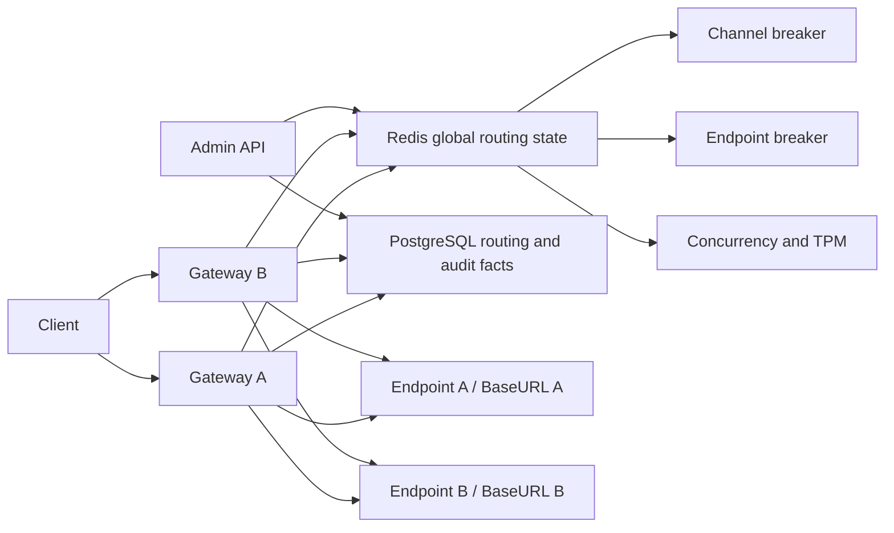

# P4：Endpoint 单故障域、Redis 全局熔断与客观路由观测改造计划

> 状态：**实施完成度高 / 发布验收未完成**
>
> 日期：2026-07-19
>
> 前置基线：[ROUTING_P3_LOAD_SPREAD.md](./ROUTING_P3_LOAD_SPREAD.md)
>
> P3 实施记录：[ROUTING_P3_IMPLEMENTATION_LOG.md](./ROUTING_P3_IMPLEMENTATION_LOG.md)

P4 不改变 P3 已确定的线路边界、`balanced/fixed` 模式、毛利门禁、sticky 和线路内 fallback。P4 专门修正 P3 运行后暴露的四类问题：

1. 进程内渠道熔断在多 Gateway 下不是同一事实，低流量时又可能长期达不到比例熔断样本；
2. `channels.base_url` 让同一上游故障域分散在多条渠道上，无法可靠执行 Endpoint 级保护；
3. 当前 balanced 使用完整上游调用耗时参与权重，流式长输出会被误判为响应慢；
4. Admin 的“健康/降级/不健康”是主观分桶且不影响路由，容易与实时熔断、凭据状态和主动检测混淆。

本计划把熔断事实统一到 Redis，以 ProviderEndpoint 作为单 BaseURL 故障域；balanced 使用容量、当前 eligible 渠道错误率、仅由流式有效 FirstToken 样本产生的 TTFT EWMA 与受限真实成本因子计算最终分流权重，流式与非流式调度共用该 EWMA；Admin 删除主观健康配置和标签，只展示可核验的原始事实及最终权重。Provider 继续表示供应商与记账主体，不承担单 BaseURL 故障域语义。

---

## 1. 目的

### 1.1 商业目的

本次改造必须达到以下结果：

1. 同一渠道或 Endpoint 在任意 Gateway 上触发熔断后，所有 Gateway 立即遵守同一状态；
2. 低流量渠道连续故障时不依赖 20 个样本才能被保护；
3. 同一 BaseURL 的公共故障能够一次摘除整个 Endpoint，避免在同一故障域内依次消耗多个渠道；
4. 长流式响应不会因为总生成时间长而被降低分流权重；
5. 运营后台不再用主观“健康”标签代替错误率、流式 TTFT、总耗时、熔断和检测结果；
6. 客户端永远看不到 Channel、Provider、Endpoint、BaseURL、候选数、熔断状态或内部 `failure.Code`；
7. 路由、限流、计费、审计和毛利边界继续保持 P3 已验收行为。

### 1.2 工程目的

1. Redis 是 Channel 和 Endpoint 熔断的唯一运行时事实源，不再保留进程内熔断状态；
2. 熔断状态迁移使用 Lua 原子执行，Gateway 实例时钟不参与状态判断；
3. Admin 直接读取 Redis 全局快照，不再 fan-out 各 Gateway 的进程内快照并做 worst-wins 合并；
4. ProviderEndpoint BaseURL 成为数据库业务事实，Channel 不再重复保存；
5. 流式 TTFT 与总耗时在数据、接口和页面上明确分开；非流式不生成 TTFT，只记录总耗时；
6. routing decision trace 能解释最终权重，但不保存敏感 URL、凭据或上游正文。

### 1.3 不在本次范围

1. 不取消线路显式渠道池，不允许 fallback 到未绑定渠道或其他线路；
2. 不恢复 `cheapest/stable/random` 等旧策略；
3. 不让成本参与 balanced 排序；
4. 不取消主动渠道检测和 `credential_valid` 凭据闸门；
5. 不引入跨 Provider 自动扩池；
6. 不承诺所有上游故障都能返回成功结果；最终错误按 P4-D16 聚合：纯客户/Channel 容量或 429 cooldown 返回安全 429，breaker、配置/同步、基础设施或混合原因返回安全 503，真实模型不存在/无权限保持 `model_not_found`；
7. 不把 Redis 作为请求、attempt、用量、金额或账务最终事实源；
8. 不在本次引入 Redis Cluster，多 key Lua 以当前单 Redis 部署为前提；未来启用 Cluster 前必须重新设计 key slot。

---

## 2. 决议记录与设计基线

第 2.0 节列出本轮全部用户决议；状态为 `accepted` 的条目均已确认，后续正文是这些决议的实施基线，不再保留并行旧语义。

### 2.0 决议记录

| 编号 | 日期 | 状态 | 决议 |
|------|------|------|------|
| P4-D01 / DEC-032 | 2026-07-20 | accepted | Provider 保持供应商/记账主体语义；新增 ProviderEndpoint 承载唯一 BaseURL 与公共故障域；Channel 引用 Endpoint；公共故障熔断按 Endpoint 执行。 |
| P4-D02 / DEC-033 | 2026-07-20 | accepted | 每次上游准入返回带唯一 ID、Endpoint/Channel 状态代际和有效期的 `AttemptPermit`；在途请求续租并通过 `Finish` 或 `Abort` 幂等收口；Reset、Endpoint BaseURL/status 变更或新一轮 half-open 探测后，旧结果保留请求审计但不得修改新状态。 |
| P4-D03 / DEC-034 | 2026-07-20 | superseded | 原决议要求流式/非流式分别维护首 chunk EWMA 与响应头 EWMA；已由 P4-D03-R1 / DEC-035 替代，不得实施。 |
| P4-D03-R1 / DEC-035 | 2026-07-21 | accepted | 参考 sub2api：只有流式请求记录有效 FirstToken/TTFT 并更新唯一 `ttft_ewma`；非流式 `FirstTokenMs=nil`，不采集响应头延迟、只记录总耗时；流式和非流式 balanced 调度都可参考这一个仅由流式 FirstToken 样本产生的 TTFT EWMA。 |
| P4-D04 / DEC-036 | 2026-07-21 | accepted | Channel 增加单调 `config_revision`；Endpoint 绑定、protocol、adapter、credential/`credential_valid`、`timeout_ms` 或 status 真正变化时递增。请求与 permit 冻结该 revision；旧版本调用继续保留客户响应、attempt、usage、settlement 和账务事实，但不得影响当前版本的 Channel breaker、TTFT 或凭据闸门。禁用阻止新请求，已经开始真实 transport 的请求不主动取消。 |
| P4-D05 / DEC-037 | 2026-07-21 | accepted | `credential_valid=false` 的 Channel 轮换 credential 后仍保持不可路由；后端保存新 credential 后立即用保存所得 revision 自动执行一次真实渠道检测，只有检测成功且 revision CAS 仍匹配时才恢复 `credential_valid=true`。检测失败或执行失败时保持 false；stale 只留历史，不应用任何状态变更。 |
| P4-D06 / DEC-038 | 2026-07-21 | accepted | Endpoint status 允许热更新并使用独立单调 `status_revision` 与 fail-closed Redis 围栏，不借用 `base_url_revision`。围栏前已取得 permit 的调用可继续，未取得 permit 的旧候选必须拒绝；旧结果保留客户响应和账务但不得修改新运行态。重新启用后 Endpoint 与子 Channel 的 breaker/错误窗口/退避/half-open/流式 TTFT 从 closed/no-sample 新代际开始，Provider 有效状态变化必须级联同等围栏。 |
| P4-D07 / DEC-039 | 2026-07-21 | accepted | credential 真变化时，无论 Channel 原先凭据是否有效，都在同一事务中保存新值并先置 `credential_valid=false`，该事务的多字段真变化只推进一次 `config_revision`；随后立即自动检测，只有 pinned revision 检测成功才恢复 true 并再次推进 revision。检测失败/执行失败保持 false，stale 不覆盖当前状态；相同 credential 且当前为 true 时幂等返回、不暂停也不检测，当前为 false 时允许重检。PUT 统一返回不含密钥的 HTTP 200 保存/验证组合结果。 |
| P4-D08 / DEC-040 | 2026-07-21 | accepted | Redis 或 BreakerStore 发生连接、超时、脚本、协议、解析等基础设施故障时统一 fail-closed：新 request admission 或任何未取得 permit 的新 attempt 立即 denied，整次客户请求停止 fallback、不得调用上游并返回安全 503；不保留 degraded admission 或 fail-open 开关。已在上游执行中的调用不强杀，继续客户响应和账务，request token/permit 收口有界重试。Gateway 保持 liveness 用于恢复；数据完整的短暂故障只有在 Redis marker 与 PostgreSQL 持久化完整性 epoch 强一致匹配、脚本和 control 全部对账后才可自动 ready。全量运行态丢失或回档必须先以 durable operation 建立 Redis pending fence、再让 PostgreSQL epoch 进入 recovering 并保持全局隔离，直到旧调用排空、窗口/保护事实恢复或自然失效，再 Commit 新 ready marker；只恢复 control 或只看到旧 marker 均不得 ready。 |
| P4-D09 / DEC-041 | 2026-07-21 | accepted | API Key/线路级资源在请求入口只计算一次；真正准备调用某个 Channel 时，由一次 Redis Lua 全有或全无地取得 Endpoint/Channel breaker、Channel concurrency、Channel RPM/RPD/TPM 和统一 `AttemptPermit`。业务拒绝不取得本候选资源并可 fallback，Store 错误按 P4-D08 终止整次请求；未进入 transport 用 `Abort` 精确归还，已进入 transport 用 `Finish` 释放并发、保留真实 RPM/RPD 并按 DEC-028 对账 TPM。permit 统一拥有候选级资源，stale 只阻止旧运行态写入，不能阻止资源收口；热更新作用语义由 P4-D10 补充，多 Gateway 权威由 P4-D11、不限计数由 P4-D12 补充。 |
| P4-D10 / DEC-042 | 2026-07-21 | accepted | Channel concurrency/RPM/RPD/TPM 限额热更新不追溯已签发 permit，也不取消在途调用；当前新限额只作用于之后的新 `AcquireAttempt`。降额时旧 permit 继续并计入当前用量，新准入按新阈值等待并发/窗口自然回落；升额后下一次使用当前配置的新 Acquire 立即可用新增余量。更新不清空并发集合或 RPM/RPD/TPM 历史窗口，`Renew/Finish/Abort` 始终按签发时固化的 resource token 收口；多 Gateway 权威来源与版本切换由 P4-D11 / DEC-043 补充。 |
| P4-D11 / DEC-043 | 2026-07-21 | accepted | PostgreSQL 保存限额配置事实，Redis admission control 是多 Gateway 准入时唯一当前权威；Channel override 使用独立 `channels.admission_limits_revision`，关键默认各自使用 `app_settings.revision`，均不复用 `channel_config_revision`。有效限额由 Lua 原子解析，pending/stale/control 缺失时 fail-closed，旧 Gateway 不得按旧高限额继续放行；原共享 rate control 由 P4-D22 / DEC-054 修订。 |
| P4-D12 / DEC-044 | 2026-07-21 | accepted | `0=不限` 只表示不以该阈值拒绝，不表示停止记录事实；RPM/RPD/TPM 仍持续写稳定窗口并按请求生命周期预占、回退和对账，Channel 及入口级并发 active set 始终维护。以后从不限切换为有限值时，新准入立即依据完整当前窗口和在途数判断。 |
| P4-D13 / DEC-045 | 2026-07-21 | accepted | 只有真实上游责任结果进入 breaker。DNS/TLS/连接类错误和 502/503/504 计入 Channel 与 Endpoint；500、首 token/读取 timeout 先计 Channel，满足跨 Channel 且跨模型证据后才计 Endpoint；429 只进入 Redis 全局冷却、不进 breaker；403 只暂停当前 Channel-Model 并复检，401 仍由凭据闸门处理；删除进程内失败软冷却。 |
| P4-D14 / DEC-046 | 2026-07-21 | accepted | 熔断采用 10 秒连续 3 次可归因失败和 30 秒至少 20 个 eligible 上游样本、失败率 50% 的双触发。比例分子只能是归因到对应 Channel/Endpoint 的上游错误，平台、Store、数据库、adapter 本地错误、客户取消及被排除的 HTTP 分类不进入分子或分母；half-open 两个不同 permit 连续成功恢复，open 退避为 15/30/60/120/300 秒。 |
| P4-D15 / DEC-047 | 2026-07-21 | accepted | Balanced 默认使用 `ttft_target_ms=2000`、`ttft_weight=0.35`、`minimum_routing_factor=0.05`、`ttft_ewma_alpha=0.2`；仅 closed 且通过硬门禁的 Channel 保留最低因子，open/busy/失效候选仍为零流量。四项参数替换现有 `gateway.routing_balance.enabled/weight_by_remaining` 值形状，严格校验并支持多 Gateway 热更新，更新不清现有样本或运行态；是否使用 balanced 继续由线路 mode 决定。 |
| P4-D16 / DEC-048 | 2026-07-21 | accepted | 客户自身线路/用户限额返回 429；所有内部候选仅因 Channel 容量、限额或 429 冷却不可用时返回安全 429，并在可确定时给出 `Retry-After`；breaker、无可用配置、配置同步、Store 故障或混合原因返回安全 503；真实模型不存在/无权限保持 `model_not_found`。 |
| P4-D17 / DEC-049 | 2026-07-21 | accepted | Admin 删除人工阈值产生的“健康/降级/不健康”配置、字段、筛选和徽章，只并列展示 credential、breaker、错误率、流式 TTFT、总耗时、容量/超限、同步状态、最终权重与实际分流；允许展示客观的当前可服务/不可服务/基础设施故障。 |
| P4-D18 / DEC-050 | 2026-07-21 | accepted | 当前环境按可重建开发库处理：使用维护窗口停止 Gateway/Admin/Worker，导出脱敏配置，空库执行新 migrations，重建 Endpoint 关系并整体启动；新旧版本不混跑，不为当前开发数据设计在线兼容迁移。任何未来含真实客户、余额或账本的环境不得照搬清库方案，必须先改为保留历史的前向迁移。 |
| P4-D19 / DEC-051 | 2026-07-21 | accepted | P4 本期不支持 Redis Cluster，只支持单 Redis、主从/Sentinel 或等价托管高可用部署；启动时检测到 Cluster 必须在建立 Handler、访问 PostgreSQL 或调用上游前拒绝 bootstrap，运行期 Redis/CROSSSLOT 故障按 fail-closed 处理，不得把多 key 原子 Lua 拆成非原子步骤。 |
| P4-D20 / DEC-052 | 2026-07-23 | accepted | Provider 运维列表增加“端点”列，直接展示 Endpoint 名称、规范化 BaseURL 与业务状态；零 Endpoint 明示为空，多 Endpoint 紧凑展示并可查看剩余项。非归档 Provider 的行级“更多”菜单增加“新建端点”并复用统一表单，归档 Provider 不提供该入口。Admin 可见文案统一使用“端点”，代码、API 和架构文档仍使用 `ProviderEndpoint` 领域名。列表 API 在同一次 PostgreSQL 查询中返回 Endpoint 摘要，不按 Provider 发起前端 N+1，也不为此列逐 Endpoint 读取 Redis 运行态；创建成功后刷新 Provider 列表与 Endpoint 查询。 |
| P4-D21 / DEC-053 | 2026-07-23 | accepted | 线路默认与渠道默认的 RPM/TPM/RPD 代码默认均为 `0/0/0`，0 表示不限但仍按 DEC-044 记录稳定窗口用量；显式线路、API Key 与 Channel 限额不受影响。 |
| P4-D22 / DEC-054 | 2026-07-23 | accepted | 废止共享 `gateway.rate_limit_defaults`，拆为 `gateway.route_rate_limit_defaults` 与 `gateway.channel_rate_limit_defaults` 两套独立 revision/control。线路默认只用于 request admission，真实命中返回 429 且不创建候选 permit；渠道默认只用于 `SnapshotMany/AcquireAttempt`，命中当前渠道后继续 fallback。`gateway.concurrency_defaults` 不拆，系统设置支持两套默认独立热更新，运行态同时展示两套 revision。 |
| P4-D23 / DEC-055 | 2026-07-23 | accepted | Balanced 加入受限真实成本因子：按七个归一化分项的最大 `channel_cost/customer_sale` 比例降权，`gateway.routing_balance.cost_weight` 新环境默认 0.5、支持 durable 热更新，旧四字段 payload 按 0 兼容；fixed 与既有 sticky 不追溯重排。`SnapshotMany` 同时修正过期 eligible 错误窗口仍长期参与评分的问题，过窗错误样本中性但 stream-only TTFT 保留。 |

本轮评审结论已经全部进入本表、对应设计、实施、测试、发布、完成定义和 `DECISIONS.md`；实施阶段以这些 accepted 决议为唯一基线。

### 2.1 Provider、Endpoint 与 BaseURL

采用单故障域模型：

```text
Provider = 供应商身份与记账主体
ProviderEndpoint = 一个 API Root = 一个上游公共故障域
Channel = Endpoint 下的一组账号级运行事实
```

- `providers` 不持有 `base_url`，继续表示 OpenAI、Anthropic、StarAPI 等供应商或中转商身份；
- `provider_endpoints` 持有唯一、规范化后的 `base_url`，并通过 `provider_id` 归属 Provider；
- `channels.base_url` 删除；
- Channel 通过 `provider_endpoint_id` 引用 Endpoint，继续持有协议、adapter、凭据、模型绑定、价格、限流和并发等账号级事实；
- Channel 继续显式持有 `provider_id`，并使用复合外键保证所选 Endpoint 属于同一 Provider，避免现有供应商、账务和归档关系漂移；
- 同一供应商若提供多个独立 API Root，应在同一 Provider 下创建多个 Endpoint，不得为每个地址伪造新的供应商；
- 不同协议只有在共享同一 API Root 时才能放在同一 Endpoint 下；
- Adapter 根据 `protocol + adapter_key + operation` 拼接最终路径。

当前本地 StarAPI 的 3 条 Channel 使用同一规范化 BaseURL，目标迁移结果应为 `1 Provider + 1 Endpoint + 3 Channels`。

### 2.2 `AttemptPermit` 与状态代际

每次真正准备调用上游前，`AcquireAttempt` 必须返回一张不可伪造、不可复用的 `AttemptPermit`：

```text
permit_id
request_admission_id
endpoint_id / channel_id
endpoint_base_url_revision
endpoint_base_url_fence_generation
endpoint_status_revision
endpoint_status_fence_generation
channel_config_revision
model_id
upstream_operation (chat_completions|responses|responses_compact|messages)
estimated_input_tokens
channel_rate_limits_revision / global_concurrency_revision
channel_admission_limits_revision
endpoint_state_generation / channel_state_generation
endpoint_half_open_probe / channel_half_open_probe
request_mode (stream|non_stream)
acquired_resource_tokens
permit_ttl_ms / renew_interval_ms / terminal_ttl_ms
acquired_at_ms / lease_until_ms
```

规则：

1. `Finish(permit, outcome)` 是唯一能把真实上游结果写入 breaker 的入口；先以 Endpoint BaseURL revision/fence 与 status revision/fence 对整张 permit 做全局校验，再分别校验 Endpoint/Channel state generation；Channel 还必须匹配服务端记录的 `channel_config_revision`，只更新仍匹配的作用域；
2. `Abort(permit, reason)` 用于已获准但没有真正调用上游的路径，只释放该 permit 取得的准入资源和 half-open 租约，不计成功或失败；
3. `Finish` 和 `Abort` 都必须幂等；同一 `permit_id` 只允许一个终态，重复提交返回第一次结果，冲突终态不得重复计数；
4. 所有仍在调用上游的请求都必须续租，长流式请求是主要场景；续租间隔不得超过租约 TTL 的三分之一。即使 breaker generation 已失效，仍须续租真实在途请求持有的 Channel concurrency，但不得续旧 half-open 权利；Channel 候选级资源所有权与入口级资源边界按 P4-D09 执行；
5. Endpoint/Channel 状态迁移、管理员 Reset 和新一轮 half-open 探测都会推进对应 `state_generation`；BaseURL 改变会推进持久化 `base_url_revision`，Endpoint 有效 status 改变会推进持久化 `status_revision`，两者都使 Endpoint 及其所有 Channel 的旧运行态失效；Channel 配置真实变化会推进持久化 `channel_config_revision`，并使该 Channel 的旧运行态失效；
6. Endpoint BaseURL/status/state generation 已 stale、permit 已过期或已终结时，真实结果仍完成 PostgreSQL request/attempt、usage 和账务收口，但对对应当前 Redis breaker 只能幂等 no-op；Channel 配置已在 PostgreSQL 递增但 Redis 尚未 rotate 时，旧 `Finish` 可写旧 revision bucket，不过该 bucket 永不作为当前事实，具体按 P4-D04；
7. Gateway 崩溃时依靠 Redis TTL 自动回收 permit、half-open 和 Channel concurrency 租约，不把崩溃视为上游成功或失败；无法确认是否已经调用上游的 Channel 限流预占不猜测回退，保守保留到各自窗口 TTL，具体按 P4-D09；
8. `permit_id/request_admission_id` 不进入公开 API 或 Prometheus label；routing trace 只保存内部关联 ID 的安全摘要。permit 额外保存内部 `model_id`、稳定 `upstream_operation` 与非负 `estimated_input_tokens`，用于 Channel-Model 403 隔离、Endpoint 跨模型证据、真实 transport 审计和 DEC-028 Channel TPM 准入，不保存 URL、credential、请求模型字符串、`upstream_model`、prompt 或上游正文；
9. 一张 permit 最多对应一次 adapter 调用和一次真实 upstream HTTP transport。adapter、provider wrapper 或 operation 内部禁止在同一 permit 下发第二次 HTTP；retry、跨 Channel fallback 和同 Channel 的 operation fallback 都必须回到 lifecycle，用新的 `permit_id` 再次 Acquire 并创建新的 attempt。

BreakerStore 是上游准入的必需基础设施。按 P4-D08，Redis 或 BreakerStore 不可用时只返回 denied，不存在独立 degraded admission，也不得在恢复后补写未获 permit 的调用结果。

第 2.0 节列出的产品与架构决议已经全部确认。第 2.3 节以后是同一组决议的实施细化；实施中只有出现会改变公开契约、故障域、计费或基础设施失败策略的新问题时，才需要重新提交用户决议。

### 2.3 Redis 全局熔断

- 删除 `ChannelCircuitBreaker` 的进程内状态实现；
- Channel 和 Endpoint 熔断全部使用 Redis；
- Redis 或 BreakerStore 不可用时统一 fail-closed；Snapshot/Acquire 任一基础设施错误都拒绝整次客户请求，停止 fallback 且不得调用上游；
- 不提供 `store_fail_open`、degraded admission 或运行时绕过开关；
- Redis 故障必须产生指标、结构化日志和 Admin 数据源异常；
- half-open 探测使用 Redis 全局租约，同一作用域同一时刻只允许一个探测。

### 2.4 Endpoint 级故障归因

Endpoint 级故障采用分级归因。只有真实进入 `http.Client.Do` 之后取得的上游结果才可以影响 breaker；adapter 查找、请求编码、数据库、Redis/Store、settlement 或客户响应写出失败均属于平台事实，不能伪装成渠道错误。

| 错误 | Channel 熔断 | Endpoint 熔断 | 说明 |
|------|--------------|----------------|------|
| DNS/TLS/连接拒绝/重置/EOF/网络断开/连接 timeout | 是 | 是 | 已进入真实 transport，通常属于公共网络或 Endpoint 故障 |
| 首 token timeout / body 读取 timeout | 是 | 条件计入 | 先计 Channel；需跨 Channel 且跨模型的短窗证据才扩大到 Endpoint |
| HTTP 502/503/504 | 是 | 是 | 明确公共服务不可用信号 |
| HTTP 500 | 是 | 条件计入 | 需短窗内至少 2 个不同 Channel 且至少 2 个不同请求模型出现，避免单模型误伤 Endpoint |
| HTTP 429 | 否 | 否 | 只写 Redis 多 Gateway 共享的 Channel 429 冷却，遵守 `Retry-After` 和系统上限 |
| HTTP 403 | 当前 Channel-Model | 否 | 只暂停该 `(channel_id, model_id)` 绑定并触发该绑定的自动复检；同 Channel 其它模型不受影响 |
| HTTP 401 | 否 | 否 | 连续 401 凭据闸门专管 |
| HTTP 400/404/405/422 | 否 | 否 | 请求、模型或能力问题；Compact 的 404/405 只表示原生 operation 不支持 |
| 客户端取消 | 否 | 否 | 非上游责任 |
| 2xx 协议解析失败 | Channel 计入 | Endpoint 否 | 真实上游返回但协议内容不合法；adapter 本地实现错误不计入 |

单次 HTTP 500 不得立即熔断整个 Endpoint。

429 与 403 使用独立运行态，不得复用 breaker 窗口：

1. 429 cooldown key 按 Channel 保存，所有 Gateway 共同读取；`Retry-After` 缺失时使用现有系统默认，超出 cap 时截断。cooldown 到期自动恢复，期间该 Channel 对所有模型均按 `rate_limited` 跳过，但不增加任何 breaker eligible 计数；
2. 403 permission key 按 `(channel_id, model_id)` 保存，记录观察到的 Channel config、Endpoint BaseURL/status revision、暂停时间和复检状态；routing candidate、`SnapshotMany` 与 `AcquireAttempt` 都必须硬拒绝该绑定，不能把整个 Channel 的 `credential_valid` 翻为 false；
3. `AttemptPermit` 固化内部 `model_id`，只用于 403 隔离和 Endpoint 跨模型证据，不保存或暴露请求模型字符串、`upstream_model`、prompt 或正文；
4. 403 后立即排队执行一次针对同一 Channel-Model 的真实复检，后续由现有周期 worker 有界重试。只有测试成功且三类 revision 与 `model_id` 仍匹配时才 CAS 清除暂停；失败保持暂停，stale 结果只留审计，不影响新绑定；
5. Channel-Model 配置真变化、解绑或归档使旧 permission key stale；新绑定/revision 不继承旧 403。Admin 必须显示该绑定“权限复检中/暂停”及最近复检事实，但不得把它显示成整个 Channel 凭据失效。

### 2.5 双触发熔断

Channel 和 Endpoint 使用同一状态机框架，触发条件包含快速触发和比例触发：

```text
快速触发：10 秒内连续 3 次可归因故障
比例触发：30 秒窗口内至少 20 个 eligible 上游样本，且归因到该作用域的渠道错误率 >= 50%
```

规则：

1. 只有归因到该作用域的 `eligible_success` 才清空连续失败计数；被排除的结果既不增加失败，也不冒充成功；
2. 状态字段固定为 `eligible_successes/eligible_failures/consecutive_eligible_failures`。比例分母只能是 `eligible_successes + eligible_failures`；平台、Store、DB、adapter 本地错误、客户取消、401、403、429、400/404/405/422 均不进入分子或分母，也不能清空或增加快速触发计数；
3. Endpoint 的 500、首 token timeout 和 body timeout 只有在短窗内至少 2 个不同 Channel 且至少 2 个不同请求模型出现同类上游证据后才进入 Endpoint 计数；
4. half-open 同一时刻只放一个探测，必须由 2 个不同且仍有效的 permit 连续成功才恢复 closed；重复 `Finish` 不得充当第二次成功；
5. half-open 任一次失败立即重新 open；
6. 重复 open 使用 `15s -> 30s -> 60s -> 120s -> 300s` 退避；
7. closed 稳定一个完整窗口后重置退避级别；
8. open 是硬摘除，流式 TTFT/错误权重不会把 open 候选重新带回；`Finish` 必须先得到稳定 attribution/eligibility，再调用 Redis 状态机，不能把一个通用 `success/failure` 布尔值直接交给 breaker。

### 2.6 流式 FirstToken/TTFT 作为分流性能信号

用于 balanced 权重的延迟信号参考 sub2api，统一为一套只由流式样本产生的 TTFT：

- 流式：从上游调用开始到第一个非 `SuppressEmit`、可向客户交付的有效 SSE chunk 到达，记录 `FirstTokenMs`；
- `FirstTokenEligible` 必须是独立协议元数据，不能直接等同于 `!SuppressEmit`。兼容命名虽为 FirstToken，实际口径是“首个有效应用层流开始事件”：OpenAI Chat 的 role/output delta、Responses 的 `response.created` 或首个 output delta、Anthropic 的 `message_start` 或首个 content delta 有效；纯空帧、usage、`ping`、error/failed、finish-only、`message_stop` 和 `[DONE]` 无效；
- 非流式：`FirstTokenMs=nil`，不采集、不保存响应头延迟，完整结果返回只记录总耗时；
- Redis 每个 Channel 只保存一套 `ttft_ewma_ms + ttft_samples`，只有流式 attempt 实际观测到的有效 FirstToken 样本可以更新；
- 流式和非流式 balanced 调度都读取同一个 `ttft_ewma_ms`。它表达该 Channel 已观测到的流式首 token 能力，不是本次非流式请求的响应头或客户等待时间；
- Channel 尚无流式 TTFT 样本时，流式和非流式调度的延迟项都保持中性；不得用非流式响应头、非流式总耗时或 `Invoke` 完成时间补样本；
- `AcquireAttempt` 把本次 `request_mode` 固化进服务端 permit record；`Finish` 仅在 mode 为 `stream` 且 FirstToken 样本有效时更新唯一 TTFT EWMA，流尾后续成功或失败由错误事实独立记录，非流式必须保持 nil；
- 完整上游总耗时在流式和非流式请求中都继续落库和展示，只作为性能副指标，不参与 balanced 权重；
- `request_records.response_started_at` 与 `request_attempts.response_started_at` 只表示流式客户首帧成功写出，不等于上游 FirstToken 到达；非流式保持 NULL，并在完整 JSON 写出成功后把 delivery 从 `not_started` 直接推进到 `completed`。

### 2.7 Channel 配置版本隔离

Channel 使用 PostgreSQL 权威的单调配置版本隔离迟到结果：

1. `channels.config_revision` 从 1 开始；`provider_endpoint_id`、`protocol`、`adapter_key`、`credential`、`credential_valid`、`timeout_ms` 或 `status` 任一真实变化时，在同一数据库事务内只递增一次；同值幂等更新不递增；
2. 名称、优先级、价格、计费展示字段和主动检测遥测本身不改变 revision；RPM/RPD/TPM/concurrency 的有效值由 P4-D11 的 Redis admission control 独立版本管理，不进入 `config_revision`；
3. Gateway 每次客户请求都从 PostgreSQL 查询候选并冻结本次候选的 `channel_config_revision`，不得跨请求复用无失效协议的候选缓存；每个 fallback attempt 把该 revision 写入 attempt 和服务端 permit；
4. Redis Channel state 同时保存当前 `channel_config_revision`、绑定的 Endpoint ID 及其 BaseURL/status revision。先比较 Channel config revision：候选更高时 `SnapshotMany` 把旧运行态视为 stale/no-sample，`AcquireAttempt` 整体切换 Endpoint 绑定与三类 revision；候选更低时拒绝。config 相等时只能比较同一 Endpoint 的 BaseURL/status revision，更高则清空旧 Channel breaker、退避、half-open 和 TTFT 后绑定当前值，更低或 Endpoint ID 不同则拒绝；不得跨两个 Endpoint 直接比较 revision 数字；
5. 配置提交前已经取得候选快照的旧请求仍可尝试准入，但不保证一定获准：旧请求与新 revision 竞争时，旧 revision 先完成 `AcquireAttempt` 可以继续，新 revision 先完成 compare-and-rotate 时旧候选必须被拒绝并按线路内 fallback/无可用路径收口；已经开始真实 transport 的旧请求不主动取消；
6. `Finish` 只有在 permit 的 `channel_config_revision` 与 Redis 当前 Channel revision 相同时，才能更新该 revision 的 Channel breaker/TTFT。新 revision 尚未首次准入时，旧 `Finish` 可以继续写旧 revision bucket；配置提交前已经冻结为旧 revision 的请求仍可按自己的快照读取该 bucket 并参与准入竞态，但新 revision 请求不得借用，Admin 当前视图也必须判为 stale。新 revision 首次 `AcquireAttempt` 必须原子清空；切换后旧 `Finish` 只能返回 `stale_config_revision`；
7. Channel revision 不替代 Endpoint 的 BaseURL/status revision/generation。旧 attempt 只要其实际 Endpoint revision/generation 仍匹配，仍可独立更新该旧 Endpoint 的 breaker；它绝不能借 Channel 当前绑定去更新新 Endpoint；
8. 连续 401 计数按 `(channel_id, config_revision, endpoint_base_url_revision, endpoint_status_revision)` 隔离。运行时凭据失效和主动检测翻转 `credential_valid` 必须携带读取配置时的三类 expected revision，并以数据库 JOIN/CAS 原子执行；只有 Endpoint 两类 revision 与 Channel config revision 都仍是当前值时，true/false 真跳变才能写状态并把 Channel revision 再加一，stale 结果只留真实检测/attempt 日志，不改变当前凭据状态；
9. 禁用/归档提交后，之后发起的请求在 PostgreSQL 硬过滤阶段即不能取得该 Channel；已经开始 transport 的调用继续返回并完成审计/账务。重新启用产生新 revision，首次准入前不得复用禁用前运行态；
10. Channel 普通配置热更新不使用 Endpoint BaseURL 的 prepare/commit/abort 协议。正确性来自 PostgreSQL 单调 revision、每请求候选快照、Redis compare-and-rotate 和数据库 credential CAS；Redis/BreakerStore 故障时按 P4-D08 fail-closed，不允许绕过版本校验继续准入。

credential 与 credential_valid 的实际变化都必须遵守上述 revision/CAS 契约；P4-D05 定义原本已经 `credential_valid=false` 的恢复路径，P4-D07 将同一保存/验证状态机扩展到原本为 true 的路径。

### 2.8 凭据轮换后自动检测

所有 credential PUT 都采用“保存成功不等于验证成功”的后端编排边界：

1. 后端提供 `RotateCredentialAndTest`（或等价 application use-case）。同值/真变化与原 `credential_valid` 必须在锁定当前 Channel 行的单个事务或等价原子条件写中判定，禁止 handler 先读后写形成竞态。提交的规范化 credential 与当前值不同时，在该事务内保存新 credential、把 `credential_valid` 置为 false，并清空仅代表旧 credential 的 `last_test_*` 当前摘要；历史 `channel_test_logs` 保留。即使多个字段同时变化，也只按 P4-D04 把 `config_revision` 增加一次。提交后新请求不得选中该 Channel；提交前已冻结旧 revision 的候选和已取得 permit 的调用继续遵守 P4-D04 的竞态/迟到结果规则，绝不能使用尚未验证的新 credential；
2. 需要检测的路径在原子保存/同值分类后立即同步复用现有 `channeltest.Service.Test`，使用新来源 `credential_rotate`。Probe 必须使用保存事务返回的 credential、Channel config revision 和当时 Endpoint BaseURL/status revision 完整快照；也可以在网络调用前先按三类 revision 做 preflight，只有完全匹配才冻结 runtime，否则直接返回 stale 且不调用上游。禁止在未校验的情况下重新读取“当前 Channel”后把另一轮 credential 当成本轮样本；不能依赖前端再调用测试接口，也不能启动无持久保证的 handler goroutine；
3. 自动检测必须使用独立、有界且不随 Admin 客户端断开而取消的 context 完成 probe、CAS 和日志收口。周期 worker 继续作为以后复检手段，但其可关闭且有轮询间隔，不能冒充本次即时检测保证；
4. 检测成功且三类 expected revision 仍匹配时，数据库以 CAS 把 `credential_valid` 从 false 改为 true，并再次把 `config_revision` 增加 1；因此一次成功恢复通常产生“保存 credential +1、验证恢复 +1”两个有业务含义的 Channel revision；
5. 401/403、timeout、模型不可用或其它真实检测失败时，新 credential 已保存但 `credential_valid` 保持 false，不产生第二次 revision，客户流量不会用于试错；
6. 无可测模型、数据库/prober 编排错误等检测执行失败也不回滚已经提交的 credential，不把保存伪装成失败；返回明确 `execution_failed`，保持 false，允许管理员稍后手动检测或幂等重试；
7. 自动检测期间发生第二次 credential/Channel 配置、Endpoint BaseURL/status 或父 Provider 有效状态修改时，旧检测返回 `stale`、`state_change_applied=false`，记录三类 tested revision，不得覆盖当前 `last_test_*` 或 `credential_valid`，也不得自动替新 revision 重试；第二次轮换负责自己的检测；
8. 相同规范化 credential 的重复 PUT 不增加 revision。当前 `credential_valid=true` 时直接幂等返回 `not_required`，不暂停路由、不调用 prober、不改 `last_test_*`、不写虚假的 `channel_test_logs`；允许记录不含密钥的普通 Admin 操作日志。当前为 false 时，对当前 revision 再触发一次自动检测，所有状态 CAS 继续幂等；
9. credential 保存失败时沿用 4xx/5xx 且不检测。保存成功或同值幂等时统一返回 HTTP 200 JSON，区分 `passed|failed|stale|execution_failed|not_required`；上游检测失败不是管理 API 执行失败，不能返回普通 5xx 诱导调用方重复保存；
10. 响应和日志不得回显 credential，只返回 saved/current revision、检测状态、是否应用状态以及脱敏的既有 TestResult。

### 2.9 Endpoint 状态版本与围栏

Endpoint 的 `enabled/disabled/archived` 允许热更新，但状态保存必须与真实准入同步：

1. `provider_endpoints.status_revision` 从 1 开始，只在 Endpoint 自身 status 真变化，或父 Provider status 变化导致该 Endpoint 的有效可路由状态变化时递增；同值更新、改名和单独修改 BaseURL 不递增；
2. `status_revision` 只表示 Endpoint 的有效状态代际，`base_url_revision` 仍只表示规范化 BaseURL 的地址版本，两者不得混用。routing candidate、Redis Endpoint/子 Channel state、`request_attempts` 和服务端 `AttemptPermit` 都冻结实际 status revision；
3. Admin 状态更新必须使用 token 化、可恢复的 fail-closed `Prepare/Commit/Abort` 围栏。先在 Redis 建立 pending status fence，再提交 PostgreSQL status/status_revision，最后激活新 revision；prepare 失败时数据库不变，数据库提交后 commit 响应失败时返回 `runtime_sync_pending`，由 recovery 对账收口；
4. `AcquireAttempt` 是状态切换的准入分界点：prepare 前已经成功取得 permit 的调用继续；尚未取得 permit 的旧候选在 pending 或 status revision stale 时必须拒绝并走线路内 fallback/无可用收口，不能在状态已停用后继续凭内存快照调用。fence generation 由 Acquire 从当前 Endpoint control 固化进新 permit，用于隔离 prepare 前 permit 的 Renew/Finish/Abort，不要求候选提前携带；
5. 已取得 permit 的请求不因 disabled/archived 被主动取消，长流继续客户响应、usage、settlement、cost、ledger 和 recovery。它的 `Finish` 在新 status fence 后只能返回 stale/no-op，不得修改 Endpoint 或任何子 Channel 的当前 breaker/TTFT；
6. 每次有效 status 变化都推进 Endpoint 与子 Channel 的运行代际。离开 enabled 后旧运行态失效；重新进入 enabled 后 Endpoint breaker、错误窗口、退避、half-open、跨 Channel 500 证据，以及子 Channel breaker、错误窗口、退避、half-open 和唯一流式 TTFT 从 `closed/no-sample` 重新开始；子 Channel 可在首次准入时按 Endpoint status revision 惰性清空，禁止只 `DEL` key 后从初始 generation 重建；
7. status 切换或限额热更新不清空 429 cooldown、RPM/RPD/TPM、concurrency、sticky、request/attempt、usage 或账务事实；既有 permit 的候选级资源继续按 P4-D09/P4-D10 收口；
8. Endpoint archived 在围栏生效后只清空 Endpoint breaker counters/跨 Channel 证据和子 Channel breaker/TTFT 样本，仍保留包含 revisions、fence generations 与 effective_status=archived 的最小 control；只在业务实体永久删除后才能删除 control。restore 基于该 control 提交一个新的 disabled status revision，commit 后仍不可路由；之后真正 enabled 时再次递增并激活下一 status revision，建立 closed/no-sample 代际；
9. Provider status 的 enabled/disabled/archived 真变化必须把所有受影响 Endpoint 作为一个有界批次执行同等 status fence，并在同一数据库事务内推进各自 status revision；Redis 对该批次使用单个 operation record 和原子 commit/abort，任一 prepare/commit 失败不得留下部分 Endpoint 已切换。所有正常写与 recovery 统一先锁 Provider、再按 ID 锁 Endpoint；Endpoint create/status/restore 也先锁父 Provider，因此并发新 Endpoint 不能穿过正在停用的 Provider 批次。受影响 Endpoint 为空时直接提交 Provider 状态，不调用要求非空的 batch Lua。Provider 归档仍同时遵守线路空池/替代渠道护栏，并级联归档 Endpoint/Channel；
10. 同一次 Endpoint 更新同时改变 BaseURL 和 status 时，两个 revision fence 使用同一管理操作关联并在一个数据库事务中分别递增；不得只 commit 其中一个。Recovery 必须锁定 Endpoint 行并同时对账两个 revision 后再完成或撤销 pending；
11. pending status fence 一律禁止新 `AcquireAttempt`。Redis 在操作开始前不可用时返回 503 且数据库不变；prepare 后 Redis 失联时保留 pending/recovery 事实，并按 P4-D08 拒绝所有尚未取得 permit 的客户 attempt，直到 Store 恢复且 recovery 对账完成。

重新启用会暂时失去停用前的流式 TTFT 样本，balanced 延迟项先保持中性，直到新流式请求产生样本；这是有意的状态隔离，不从历史表回填 Redis 当前权重。

### 2.10 删除 Admin 主观健康分桶

删除：

- `admin_backend.channel_health_thresholds`；
- `healthy/degraded/unhealthy/no_data` 渠道分桶；
- Channel、Provider、Endpoint、Model、Dashboard 中由该分桶生成的“健康/降级/不健康”标签；
- 前端本地重复实现的 `healthBucketOf`；
- Admin API 中只服务于该分桶的 `health/health_bucket` 字段。

保留：

- attempt 成功率、失败次数、超时次数和最近错误；
- 流式 TTFT 与流式/非流式完整总耗时；
- Channel/Endpoint 熔断状态及剩余 open 时间；
- 主动检测结果；
- `credential_valid`；
- 容量剩余、最终权重和实际分流占比。

后台不再给 balanced 的中间乘数起面向用户的新名字。运营只看客观输入和由唯一流式 TTFT EWMA 参与计算的“当前权重”。

### 2.11 客户端错误边界

内部继续保存完整排除原因、Channel/Endpoint breaker 状态、候选池大小和 fallback 链；外部只按原因聚合后的稳定类别返回：

| 最终原因 | HTTP | 对外语义 |
|----------|------|----------|
| 客户自身 `(route,user)` / API Key RPM、RPD、TPM 或 concurrency 超限 | 429 | 协议原生 rate-limit 错误 |
| 模型存在，且所有内部候选都只因 Channel concurrency/RPM/RPD/TPM 容量不足或 429 cooldown 不可用 | 429 | 安全的暂时容量不足；可证明最早恢复时间时带 `Retry-After` |
| breaker open、有效配置/模型绑定为空、credential gate、revision pending/stale、Store/DB 基础设施故障，或候选原因混合 | 503 | 通用 `service_unavailable` |
| 模型真实不存在或客户无权访问 | 既有模型错误 | 保持 `model_not_found`，不得伪装成 429/503 |

OpenAI Chat/Responses 的 429 使用 `rate_limit_error/rate_limit_exceeded`，503 使用 `api_error/service_unavailable`；Anthropic 使用对应协议原生错误 envelope。`Retry-After` 仅在系统能证明最早恢复时间时返回，秒数向上取整并限制在 `1..300`。所有响应继续返回 Unio `request_id` 响应头用于报障，但正文和 header 不得出现 Channel、Provider、Endpoint、BaseURL、候选数、熔断状态或内部错误码。流式首帧写出后不得重写 HTTP 状态，只能按协议内中断和 partial settlement 规则收口。

### 2.12 候选级原子准入与 `AttemptPermit` 资源所有权

请求入口资源和候选 Channel 资源必须分层，不能因 fallback 重复计算客户请求：

1. API Key 解析出的 `(route, user)` RPM/RPD 在 ingress 通过一张 request-admission token 对一次客户请求只计算一次；对应 TPM 在进入候选循环前由同一 token 只预占一次，按最终真实 usage 对账，整次请求失败、取消或无结算时继续按 DEC-028 释放；`(route, user)` concurrency 覆盖整次客户请求并由该 token 独立持有，不进入候选 permit；
2. 队首短等整次客户请求最多一次，只允许对已确认的 Channel concurrency 或 Channel RPM/RPD/TPM 容量不足进行等待。等待期间不持有 permit、half-open、Channel concurrency 或 Channel 限流预占；入口级 `(route, user)` concurrency 仍覆盖整次请求。等待结束后使用新的 `permit_id` 对冻结候选重新执行完整原子准入，不重新计算入口级 RPM/RPD/TPM；
3. adapter 查找、协议/操作解析和可以在本地完成的请求配置校验应尽量在候选原子准入前完成。真正准备调用一个 Channel 时，调用方预生成 `permit_id`，`AcquireAttempt` 使用一次 Redis Lua 原子检查 Endpoint BaseURL/status control 与 revision/fence、Endpoint/Channel breaker 与 half-open、Channel concurrency、Channel RPM/RPD 严格门槛，以及 DEC-028 的 Channel TPM 准入门槛与预估预占；
4. Lua 必须先完成所有 key 类型、参数、revision、业务门槛和返回值校验，再进入不应失败的统一写阶段。Redis 脚本运行时错误不会自动回滚已经发生的写入，禁止边写边校验。只有全部条件通过时，才能同时创建 active permit、取得 half-open/concurrency 租约并写入 Channel RPM/RPD/TPM 预占；任一业务条件不满足时，本次候选的 permit、half-open、Channel concurrency、RPM/RPD/TPM 取得类资源保持零变化，也不创建 request attempt；revision compare-and-rotate、过期租约清理等与本次资源取得无关的合法维护状态不受此句禁止；
5. `permit_id` 与完整准入指纹作为成功准入的幂等键：Lua 已签发 permit 但响应丢失时，调用方必须用相同 ID 和相同指纹重试并取回同一 permit；已存在 permit 的相同 ID 携带不同指纹必须 conflict，绝不能覆盖或重复取得资源。业务 denied 不创建 permit 或 admission tombstone，是零取得、可重新评估的结果；已经观察到 denied 后的 fallback/队首重试必须使用新的 ID。permit 的服务端记录必须固化实际取得的 concurrency lease、RPM/RPD 预占标记、TPM 原始桶/预占量和幂等回退/对账 token，调用方不得自行声明资源所有权；
6. `open/half_open_busy/concurrency_limited/rate_limited/stale_*` 等合法业务拒绝返回稳定原因，零资源、零 attempt，并按现有线路内 fallback 和最终外部错误契约收口；Redis/BreakerStore 的连接、超时、Lua、协议、解析或内部错误按 P4-D08 立即终止整次 fallback，返回安全 503；
7. permit 已取得但没有进入真实 transport 的所有路径必须 `Abort`，包括 attempt 创建失败、adapter/request 构造失败和调用前取消。协议无关 `AttemptTimingObserver.TransportStarted` 紧邻 `http.Client.Do` 的调用点是本地可观测分界：该回调前收口为 `Abort`。`Abort` first-terminal-wins，并按 permit 固化的原始桶精确归还 half-open、Channel concurrency、RPM、RPD 和 TPM 预占；窗口桶仍存在且 resource token 尚未终结时才修改原始桶，桶已自然过期视为该维度已经自愈，严禁重建旧桶或在当前时间桶另写猜测性的负数；不得记录 breaker 成功或失败；
8. `AttemptTimingObserver.TransportStarted` 已触发、完整请求交给真实 transport 后的路径只能 `Finish`：释放 Channel concurrency；Channel RPM/RPD 作为真实上游调用保留到自然窗口，不因失败、取消或后续 fallback 回退；Channel TPM 有权威 usage 时按 cache-aware actual 与 estimate 对账，无权威 usage 时按 DEC-028 释放，但对账/释放只修改仍存在的原始窗口桶，已经自然过期时该维度 no-op，不得为延迟 Finish 重建旧桶或把差额写入当前桶。A 真实调用失败再 fallback 到 B 时，客户请求级 RPM 只计一次，A/B 的 Channel RPM 各计一次；该分界不能消除回调与真实网络 dispatch 之间的最后一跳崩溃不确定性，该情况仍按第 11 点保守处理；
9. `Renew` 只延长 active permit、真实在途 Channel concurrency 和仍匹配的 half-open lease，不重复增加 RPM/RPD/TPM。Channel concurrency 由 permit renewer 唯一接管，旧的独立 `AcquireChannel`/refresher 在切换检查点退出；入口级 `(route, user)` concurrency 由 request-admission token 的独立续租器接管，不并入候选 permit；
10. breaker 的 applied/stale disposition 与资源终结彼此独立。Endpoint BaseURL/status fence、Channel config revision 或 breaker generation 已 stale，只能阻止旧结果写入当前 breaker/TTFT；只要服务端 permit 记录仍在，`Finish/Abort` 仍须幂等释放并发并按真实调用事实保留、回退或对账其候选级限流资源。permit 逻辑过期同样不能把仍可识别的资源终结误写成纯 no-op；物理 key 已丢失时才依靠租约/窗口 TTL 有界自愈；
11. Gateway 在 Acquire 后崩溃，或 Acquire/Abort 使用同一 `permit_id` 有界重试后仍无法确认时，不猜测本次是否已发出上游请求：不得继续调用上游；half-open/Channel concurrency 由 lease 回收，RPM/TPM/RPD 最坏分别保守保留到各自分钟/分钟/日窗口自然过期。该短时过计优先于错误删除一次可能真实发生的上游调用，不进行恢复后补发；
12. Responses Compact 的 Native `/responses/compact` 404/405 -> Synthetic chat 是两次真实 transport，禁止留在一个 adapter invoke/permit 中。候选准备必须按 Synthetic chat tokenizer 口径计算一个同时覆盖 Native/Synthetic 的 `ConservativeInputTokens`；同一 request token 只 Reserve 该上界一次，两张 permit 都使用该值。第一个 native attempt 用 `Finish` 保存 404/405 事实、保留一次 Channel RPM/RPD、按无权威 usage规则释放其 Channel TPM，且按 P4-D13 的 404/405 分类不进入 breaker；随后仅在既有 `compactNativeFallback` 允许时，复用同一 request-admission token 与冻结线路池，为同一 Channel 的 synthetic `chat_completions` 生成新 permit ID、重新 Acquire、创建第二条 attempt 后再调用。第二次业务 denied 时不创建第二条 attempt/transport，按冻结候选顺序继续普通 fallback；Store 错误终止整次请求。入口 RPM/RPD/TPM/concurrency 仍只计一次，Channel RPM/RPD 因两次真实调用计两次；2xx 缺 usage、解析错误及其它非 404/405 错误不得触发 Synthetic 二次调用；
13. 本决议只确定原子边界、计数次数和 permit 所有权；限额热更新对旧 permit 与新 Acquire 的时间作用语义由 P4-D10 补充，多 Gateway 当前参数与版本线性化由 P4-D11 关闭，`0=不限` 持续计数由 P4-D12 关闭。

### 2.13 Channel 限额热更新只影响新 Acquire

`concurrency_limit/RPM/RPD/TPM` 允许热更新，但限额变化不能追溯改写已经签发的 `AttemptPermit`：

1. 已签发 permit 沿用签发时固化的 resource token、原始窗口桶和预占事实。限额降低后不强制取消 transport、不提前终止 permit，也不要求 `Renew` 按新限额重新准入；旧 permit 的 Channel concurrency 仍计入当前在途数；
2. 只有新的 `AcquireAttempt` 才按准入系统已经认定的当前有效限额执行 P4-D09 单 Lua 原子准入。仅持有候选快照但尚未取得 permit 的请求不享有旧限额；fallback 与队首等待后的再次 Acquire 都是新准入；
3. concurrency 从 5 降到 2，而当前已有 4 个 active permit 时，4 个旧调用继续；新的 Acquire 在 `used >= 2` 时拒绝，必须等旧调用 `Finish/Abort` 或 lease TTL 回收到 `used < 2` 后才能再取得一个名额。降 RPM/RPD/TPM 同理：现有窗口用量不清零，新 Acquire 直接拿该历史用量与新阈值判断，等待窗口自然回落；
4. 提高限额后，Redis admission control 已激活新 `admission_limits_revision` 的下一次 Acquire 可以立即使用新增余量，不等待旧 permit 或旧窗口过期；旧 Gateway 携带旧 revision 时必须拒绝并刷新，不能自行猜测生效时刻；
5. 升额、降额、有限与 `0=不限`、`NULL=继承默认` 之间切换，都不清空 Channel concurrency active set，也不删除、归零或重建 Redis 中已经存在的 RPM/RPD/TPM 历史窗口，不推进 breaker generation，不清 breaker/错误窗口/退避/half-open/流式 TTFT。有效限额为 `0=不限` 时仍持续产生用量桶、预占/回退/对账与并发 active 事实；限额变化本身只改变后续准入门槛，不改写已经发生的资源事实；
6. 旧 permit 的 `Renew/Finish/Abort` 始终按签发时服务端固化的 resource token、原始桶和预占量收口，不重新读取当前限额：`Renew` 只续既有 concurrency lease；`Finish` 释放并发、保留真实 RPM/RPD 并按 DEC-028 对账 TPM；`Abort` 精确归还 pre-transport 资源。限额变化不得导致重复释放、错桶回退或把旧 permit 判成无资源；
7. 当前 Channel 有效限额一律来自 P4-D11/P4-D22 的 Redis admission control，并使用独立
   `admission_limits_revision`；PostgreSQL Channel override 与 `gateway.channel_rate_limit_defaults`、
   `gateway.concurrency_defaults.channel_limit` 通过可恢复发布进入 Redis，Lua 原子合并完整四维快照，旧参数
   Acquire 不能放行。线路默认不参与候选级门槛。

这里的“等待自然回落”只描述后续请求何时重新具备资格，不新增阻塞策略：单次客户请求仍只允许 P4-D09 已确定的一次队首短等，超时后正常 fallback/收口，不得一直挂到并发或分钟/日窗口回落。成功 Acquire 因响应丢失用同 `permit_id` 幂等取回原 permit，不算新的 Acquire，也不按更新后的限额重验。

### 2.14 多 Gateway 准入限额权威与不限计数

PostgreSQL 继续保存 `gateway.route_rate_limit_defaults`、`gateway.channel_rate_limit_defaults`、
`gateway.concurrency_defaults` 和 Channel 四维 override 的管理事实；Redis admission control 是所有 Gateway 真正
执行准入时唯一可信的当前生效事实：

1. Channel 增加独立单调 `admission_limits_revision`，只在 `rpm_limit/tpm_limit/rpd_limit/concurrency_limit` 真变化时递增；不复用 `channel_config_revision`，改限额不得清 breaker、错误窗口、退避、half-open 或流式 TTFT；
2. `app_settings` 每个值增加单调 revision。Redis 分别保存线路 rate、渠道 rate、concurrency 默认和 Channel
   override control。线路 rate 与 `concurrency.key_limit` 是入口 `(route,user)` 继承默认的唯一执行权威；渠道
   rate、`concurrency.channel_limit` 与 Channel override 是 `SnapshotMany/AcquireAttempt` 的唯一执行权威。
   API Key/线路显式 override 可以来自本请求认证快照，但继承默认不得由 Gateway 本机
   `Guard/ConcurrencyLimiter` 字段解析；
3. Admin 更新使用 durable operation + Redis `Prepare/Commit/Abort/Recovery`。pending、control 缺失、revision 落后或 payload 不一致时，受影响的新准入 fail-closed；数据库提交而 Redis commit 响应丢失时返回 `runtime_sync_pending`，由 reconciler 依据 PostgreSQL revision 收口；
4. 第一个入口门禁使用单 Lua `AcquireRequestAdmission` 读取并校验线路 rate 与 concurrency 两个 active control，
   原子取得本客户请求唯一一次的 route-user RPM/RPD 与 concurrency，并返回服务端 request-admission token，冻结
   实际 setting revisions、有效值和 resource token；候选估算完成后的 route-user TPM 预占以及该 token 后续的
   reserve/renew/finish 只能使用已冻结事实，不得为同一入口资源重新读取 N+1 revision 或重复扣客户额度；
5. 两套默认更新都不逐 Channel fan-out。入口脚本只从线路 rate active control 取值；候选脚本只从渠道 rate
   active control 取值。各作用域在自己的 active revision 上线性切换，不会出现 Gateway A 按新值、Gateway B 按
   旧值，也不会因调整线路默认而同步改变 Channel fallback 门槛；
6. request-admission token 只固化入口 Acquire 时使用的 `route_rate_limits_revision`、
   `global_concurrency_revision`、完整性 epoch 及入口 resource token；`AttemptPermit` 固化候选 Acquire 时使用的
   `channel_rate_limits_revision`、`global_concurrency_revision`、所选 Channel admission revision、同一完整性 epoch
   及候选 resource token。request token 在选定 Channel 前签发，绝不能携带渠道 rate 或 Channel admission
   revision。若两阶段之间 control 已切换，旧 request token 可以保持线路 rate revision N，而后续新 permit 使用
   当时当前的渠道 rate/Channel revision；两个资源所有者内部各自保持一致，成功 Acquire 的同 ID 重试取回原记录，
   已签发 token/permit 不因普通限额 revision 更新重验；
7. stable concurrency/RPM/RPD/TPM resource key 和窗口桶不带限额 revision，保证更新前后的真实 used 连续；revision 只决定新 Acquire 使用哪套门槛；
8. 有效限额为 `0=不限` 时仍执行用量记录：入口与 Channel 的 RPM/RPD/TPM 都继续写稳定窗口，pre-transport `Abort` 精确回退候选预占，真实 transport `Finish` 保留 Channel RPM/RPD 并按 DEC-028 对账 TPM；Channel 与入口并发 active set 无论 limit 是否为 0 都持续维护；
9. `0 -> 有限值` 后下一次新 Acquire 立即依据完整历史窗口和当前在途数判断，不从零开始赠送一个窗口。不限时增加 Redis 写入是已接受的安全取舍；Store/control 故障继续按 P4-D08 fail-closed；
10. 退役旧 `gateway.rate_limit_defaults`、其 `failure_policy` 和所有 `fail_open` 兼容分支；旧 JSON/Redis
    settings cache 必须在迁移中版本化或清理，严格解码不得静默接受旧字段。入口门禁返回必须区分
    `allowed|limited|store_unavailable|runtime_sync_required|runtime_sync_pending|stale_setting_revision`，不能把
    Redis 错误折成容量不足 429；
11. `ReserveRequestTokens` 是已签发 request admission 的一次性幂等延续，不是第二次新准入。它只读取 token
    中冻结的线路 TPM 门槛、revision 与 resource token，后续线路 rate control 进入 pending 或已经切换到 N+1
    都不重验旧 token；首次 `reserved|limited` 结果与估算值必须写入 token，同值重试取回原结果、异值 conflict。
    真实 TPM limited 返回 429，Store 本身不可用则返回安全 503；两者都只由 session 记录响应原因，仍由 outer
    finalizer 在响应写出结束后唯一、有界地 Finish；
12. `FinishRequestAdmission(outcome)` 是 request token 唯一终态 API。它在所有 handler 出口与 panic/cancel 路径上使用脱离客户取消、但有界的 context 幂等执行：释放 route-user concurrency、保留已接收请求的 RPM/RPD，并按可空权威 usage 对账或释放 TPM。无候选、Snapshot/路由失败、全部 fallback 失败和本地校验失败都不能遗漏该终态；同 ID 重复 Finish 返回第一次结果，冲突终态不得重复改资源；
13. request admission 保持当前路由范围：所有已经注册且要求 API Key 的 `/v1` Endpoint 都执行 Acquire/Renew/Finish；只有会真实生成上游调用的 Chat Completions、Responses、Responses Compact 与 Anthropic Messages 在候选估算后执行一次 `ReserveRequestTokens`，并在每次真实 transport 前取得 `AttemptPermit`。纯本地/静态 Endpoint 不预占 TPM、不创建 attempt/permit。完整矩阵以第 7.3 节为准。

---

## 3. 目标架构



运行时顺序：

```text
API Key 认证并读取 route rate/concurrency 的 PostgreSQL 期望 revision
  -> AcquireRequestAdmission 一次取得 route-user RPM/RPD/concurrency 与 request token；真实超限 429，Store/control 错误 503
  -> route wrapper 建立 RequestAdmissionSession 与唯一 renewer；handler 再做协议 decode/validation
  -> PostgreSQL 线路显式池与硬门禁，读取 routing control revision
  -> Redis 按 Endpoint BaseURL/status revision 与 Channel config revision 批量读取 breaker + 容量
  -> 排除 open / half-open busy
  -> candidate preparation 解析 adapter/tokenizer、得到 ConservativeInputTokens；读取唯一流式 TTFT EWMA，与 capacity_score + error_rate 计算最终权重
  -> weighted without replacement 生成线路内 fallback 顺序
  -> ReserveRequestTokens 通过 RequestAdmissionSession 幂等预占一次 route-user TPM；fallback 不重复预占
  -> authorization
  -> 真正准备调用候选前，一次 Redis Lua 原子取得 Endpoint/Channel breaker + Channel concurrency + Channel RPM/RPD/TPM + AttemptPermit
  -> 业务拒绝零资源、零 attempt 并正常 fallback；只有 Channel concurrency/限流容量拒绝可触发整请求唯一一次队首短等，等待期间零候选级资源，醒来后重跑完整 Acquire
  -> permit mode：创建 attempt 并调用真实上游；attempt 创建或 transport 前失败则 Abort；调用存活期间 Renew permit 与 Channel concurrency
  -> 已进入真实 transport：Finish，释放并发、保留 Channel RPM/RPD、按 DEC-028 对账 Channel TPM；Store 基础设施错误为 denied，终止整次 fallback 且不调用上游
  -> PostgreSQL 按真实结果持久化 request/attempt/usage/ledger/trace；权威 usage 由 service settlement 点发布给 RequestAdmissionSession
  -> handler 完成写出后，outer finalizer 停止 renewer 并唯一调用 FinishRequestAdmission；无权威 usage 的所有错误路径默认释放 TPM
```

候选 fallback 只会重复 `AcquireAttempt`，不会重复 `AcquireRequestAdmission` 或 `ReserveRequestTokens`。若在 request token 签发后、候选 permit 签发前全局 control 从 N 切换到 N+1，入口 token 继续按 N 收口，新的候选 Acquire 按当时当前 N+1 准入；这不是同一资源所有者内拼接版本。

`RequestAdmissionSession` 是放入 request context 的协议无关、并发安全且 first-write-wins 的内部对象。route wrapper 唯一拥有 Acquire、renewer 与最终 Finish；service 只取得不含 Finish 能力的窄接口，只能调用 `Reserve(ConservativeInputTokens)` 与 `PublishAuthoritativeUsage(cacheAwareActual)`。只有 inline settlement 已完成，或 settlement recovery job 已成功持久化且拿到非 partial 权威 usage 时才允许发布。Reserve limited/Store 错误只设置本次响应原因，不能由 service 提前 Finish；outer finalizer 必须等 handler 的 JSON/SSE 写出路径结束后，先停止 renewer，再以脱离客户取消但有界的 context 恰好一次调用 `FinishRequestAdmission`。没有发布权威 usage 的 decode/validation、路由、authorization、全部 fallback、partial/取消或异常路径统一让 Finish 释放 TPM 预占；Acquire 本身 denied 时不创建 session、不启动 renewer，也不调用 Finish。

Redis 只保存短期运行态；PostgreSQL 继续保存可审计事实。

---

## 4. 数据模型与迁移

当前数据库允许重建，本阶段直接修改源 migration，不保留旧 schema 兼容层。

### 4.1 `providers`

`providers` 保持供应商与记账主体语义，不新增 `base_url`：

```text
providers(id, slug, name, status, archived_at, created_at, updated_at)
```

### 4.2 `provider_endpoints`

新增 `provider_endpoints` 业务实体。为满足“一张表一组 migration”和外键创建顺序，在可重建数据库前提下，新增 `000008_provider_endpoints` 和 `000009_endpoint_routing_operations`，原 `000008_channels` 及其后 migration 统一顺延两位。`runtime_control_operations` 不影响前置外键顺序，放在顺延后的现有末尾 `000044`，避免让原有 migration 再整体改号。同步修改文档、注释和脚本中的 migration 编号引用。

目标字段：

```text
provider_endpoints(id, provider_id, name, base_url, base_url_revision, status, status_revision, archived_at, created_at, updated_at)
```

约束：

1. `base_url <> ''`；
2. 仅允许 `http/https`；
3. 不允许 userinfo、query、fragment；
4. 服务层统一规范化 scheme/host、默认端口和尾斜杠；path 大小写保持原样；
5. 规范化后的 `base_url` 全局唯一，避免同一故障域被拆成多个 Endpoint 绕过全局熔断；
6. `provider_id -> providers.id` 外键；
7. `(provider_id, name)` 唯一；
8. `status` 仅允许 `enabled/disabled/archived`，并保证 `archived_at IS NOT NULL` 当且仅当 `status='archived'`；
9. `(id, provider_id)` 唯一，供 Channel 复合外键保证 Provider/Endpoint 归属一致；
10. `base_url_revision bigint NOT NULL DEFAULT 1 CHECK (base_url_revision >= 1)`；只有规范化后的 BaseURL 真正变化时才在同一数据库事务中递增，名称或状态更新不得误增；
11. `status_revision bigint NOT NULL DEFAULT 1 CHECK (status_revision >= 1)`；按 P4-D06 在 Endpoint 自身或父 Provider 的有效状态真变化时递增，名称和单独 BaseURL 更新不得误增；
12. BaseURL 更新必须使用 fail-closed revision fence：Admin 先提交带 canonical payload hash 的 durable operation，再调用 Redis `PrepareEndpointBaseURLRevision(..., token, payloadHash)`；准备失败或 revision 冲突时业务数据库保持不变。prepare 成功后，业务事务按 Provider -> Endpoint -> operation 锁序重新校验并一起提交 BaseURL/revision 与 operation=`db_committed`；pending fence 存在或 Redis/BreakerStore 不可用时均拒绝新的 `AcquireAttempt`；
13. 数据库更新提交后调用 `CommitEndpointBaseURLRevision(endpointID, token, payloadHash)`，按 prepare 固化的 next revision 原子激活，清空 Endpoint breaker 窗口、退避和跨 Channel 500 证据，并使子 Channel 在下一次准入时推进 generation、清空旧 breaker 与流式 TTFT EWMA。数据库未提交目标 revision 时调用同 token/hash 的 Abort；进程若在任一步崩溃，由 durable operation + PostgreSQL 业务事实 recovery，pending fence 不自动回退；恢复完成前 Endpoint 保持不可准入，Redis/BreakerStore 故障期间整次客户请求按 P4-D08 denied；
14. status 更新使用独立的 `PrepareEndpointStatusRevision/CommitEndpointStatusRevision/AbortEndpointStatusRevision` token fence；每次 prepare 都推进不可回退的 status fence generation，commit 激活 PostgreSQL 当前 status revision 并推进 Endpoint/子 Channel 运行代际，abort/recovery 也不得让 prepare 前 permit 重新有效；
15. Endpoint 已有历史 request/attempt 时允许修改 BaseURL 或 status；旧 permit 的请求、attempt、usage 和账务照常按真实结果收口，但不得修改新 revision 的 breaker；历史 attempt 不依赖实时 URL 或状态复算，routing trace 不保存完整 URL；
16. BaseURL/status 更新必须在 Admin 留结构化操作日志，不记录 credential 或上游正文；若数据库已提交但 Redis commit 响应失败，Admin 必须明确返回 `runtime_sync_pending`，不能伪装成运行态已同步；
17. Provider 有效状态变化时，在同一事务内推进所有受影响 Endpoint 的 `status_revision`；批量 status fence 必须全量 prepare 后才能提交，并使用单个 batch operation record 和 Lua 原子 commit/abort；失败时由同一 token 幂等 recovery，不允许部分 Endpoint 继续按旧状态准入；
18. 创建 Endpoint 时，Admin 必须先准备可恢复的初始 control record，再让数据库中的 enabled Endpoint 对 routing query 可见；创建 disabled Endpoint 也要写入 revision=1/effective_status=disabled 的 control。control 初始化未确认时返回 `runtime_sync_pending`，不能让客户请求用候选自行补建。

### 4.3 `endpoint_routing_operations`

新增 PostgreSQL 持久操作表，作为 Redis op record 的恢复依据：

```text
endpoint_routing_operations(
  id, token, kind, provider_id, endpoint_id,
  transitions, payload_hash, state,
  created_at, updated_at, completed_at
)
```

契约：

1. `token` 全局唯一；`kind` 仅允许 `endpoint_create|base_url|status|base_url_status|provider_status_batch`；
2. `state` 仅允许 `preparing|prepared|db_committed|committed|aborted`；合法迁移为 `preparing -> prepared -> db_committed -> committed`，且只有尚未提交业务事务的 `preparing|prepared` 可以进入 `aborted`。`committed|aborted` 终态 first-terminal-wins，`db_committed` 只能 recovery/重试 Commit，绝不能 Abort；
3. `transitions` 是严格校验的 JSONB，只保存排序后的 Provider/Endpoint ID、current/next BaseURL/status revision、current/next effective status 和 operation kind，不保存 BaseURL 正文、credential、请求正文或上游错误体；`payload_hash` 从包含规范化目标 BaseURL 在内的完整 canonical operation 计算，防止同 token 被不同参数重放，同时不额外保存 URL 副本；
4. 单 Endpoint 操作只能有一个 transition；Provider batch 的 Endpoint ID 必须唯一、升序，数量不得超过 `endpoint_status_batch_max` 且绝对上限 1024；超限在 prepare 前返回 `endpoint_status_batch_too_large`，禁止拆批后产生部分 Provider 状态；
5. 操作开始先提交 `preparing` 行，再执行 Redis prepare；prepare 成功后以 token/payload hash CAS 将 durable row 从 `preparing -> prepared`。随后业务 PostgreSQL 事务必须按 `Provider -> Endpoint ID 升序 -> operation` 的统一锁序重新校验 payload，将业务行和 operation 从 `prepared -> db_committed` 一起提交；Redis commit 成功后再把 operation 置 `committed`；任一步失败按数据库事实进入 `aborted` 或 recovery。若进程死在 Redis prepare 与 durable CAS 之间，reconciler 用 Redis op record + `preparing` 行补成 `prepared` 或安全 abort；
6. Provider status 操作准备后，业务事务先锁 Provider 行再重新枚举/锁定全部受影响 Endpoint；若集合与已 prepare payload 不同，必须 abort 并重新准备。Endpoint create/status/restore/组合更新也先锁同一 Provider 行，因此并发新建 Endpoint 不能穿过 Provider 停用批次；
7. Redis op/control 丢失时，reconciler 以 `preparing/prepared/db_committed` 行和当前业务 revision/status 调用 recovery-only restore：业务未提交则恢复当前 active 并 Abort，`db_committed` 则直接按 PostgreSQL 当前事实恢复 committed active，绝不 Abort；稳定期没有非终态 operation 时也允许从 PostgreSQL 当前任意 revision 重建 absent control。已完成 operation 至少保留到两个 revision-operation TTL 的较大值，并由有界清理任务删除；
8. 永久删除 Provider/Endpoint 时不得级联删除尚未终结 operation；已终结历史可将外键设 NULL 但保留原始 target ID 摘要用于审计。

### 4.4 `channels`

修改顺延后的 `migrations/000010_channels.up.sql`：

- 删除 `base_url`；
- 增加必填 `provider_endpoint_id`；
- 增加 `config_revision bigint NOT NULL DEFAULT 1 CHECK (config_revision >= 1)`；
- 增加 `admission_limits_revision bigint NOT NULL DEFAULT 1 CHECK (admission_limits_revision >= 1)`；该版本只在
  `rpm_limit/rpd_limit/tpm_limit/concurrency_limit` 的有效值真变化时递增，不能复用 `config_revision`；
- 增加 `(provider_endpoint_id, provider_id) -> provider_endpoints(id, provider_id)` 复合外键；
- 删除相关 CHECK、SQL 返回列、sqlc 字段和 Admin DTO；
- Channel 主动检测和 Gateway runtime 均通过 `provider_endpoint_id -> provider_endpoints.base_url` 获取地址。

`config_revision` 由 PostgreSQL 作为唯一权威：

- `provider_endpoint_id/protocol/adapter_key/credential/credential_valid/timeout_ms/status` 任一值真正变化时，在同一事务中执行 `config_revision = config_revision + 1`；一次多字段更新只增加 1；
- 同值更新、`name/priority` 更新、价格/计费配置和只写 `last_test_*` 的检测遥测不增加；RPM/RPD/TPM/concurrency 真变化只推进独立 `admission_limits_revision`，不推进 `config_revision`，其候选级原子准入、permit 所有权、新旧请求时间边界和多实例发布协议分别按 P4-D09/P4-D10/P4-D11；
- 限额更新先单独持久化 `preparing` operation，再完成 Redis Prepare；随后才在同一 PostgreSQL 业务事务中推进 `admission_limits_revision` 并把 operation 置为 `db_committed`，不能先改业务行后让各 Gateway 自行轮询；旧 `config_revision`、breaker、错误窗口、退避、half-open 和流式 TTFT 均保持不变；
- credential PUT 必须锁定 Channel 行或使用等价原子条件写，一次性返回 `credential_changed/saved_config_revision/credential_valid_after`。credential 真变化时，同一事务保存新值、置 `credential_valid=false`、清空旧 credential 的 `last_test_*` 摘要并只推进一次 revision；同值 true/false 均不推进保存 revision，同值 true 也不修改 `updated_at/last_test_*` 或伪造检测日志；
- credential 轮换、运行时连续 401、manual/worker 主动检测、Channel 归档/恢复以及 Provider 级联归档所有写路径都必须复用同一 revision helper/SQL 契约，禁止绕过；
- 运行时/检测异步写使用读取配置时的 expected revision 做 CAS；主动检测的 `last_test_*` 与 credential 真跳变在同一事务内按 expected revision 应用，不能一半成功；
- `channel_test_logs` 增加 `tested_endpoint_base_url_revision`、`tested_endpoint_status_revision`、`tested_config_revision` 与 `state_change_applied`，`source` CHECK 增加 `credential_rotate`；stale 结果只写 `state_change_applied=false` 的历史日志，不覆盖当前 `last_test_*` 或 `credential_valid`，日志中的 `credential_valid_after` 必须来自数据库真实结果，不能由调用方猜测；
- Admin Channel DTO 只读返回 `config_revision`，写 DTO 不允许调用方指定或回退。

限额发布的 durable operation 使用与 Endpoint fence 相同的 first-terminal-wins 原则，状态严格为：

```text
preparing -> prepared -> db_committed -> committed
preparing|prepared -> aborted
```

发布顺序固定为：先写 PostgreSQL `preparing` operation；Redis `PrepareAdmissionLimits` 校验
`current_revision + 1`、规范化四维 payload hash 和不存在的 pending control；prepare 成功后把 operation CAS 为
`prepared`；再在同一 PostgreSQL 事务中锁定目标 Channel（默认设置则锁定对应 `app_settings` 行），提交目标配置、
`admission_limits_revision/revision` 和 `db_committed`；最后调用 Redis `CommitAdmissionLimits` 激活 control。
数据库未提交时只能 `Abort`；数据库已经提交但 commit 响应丢失时，Admin 返回 `runtime_sync_pending`，reconciler
依据 PostgreSQL revision、payload hash 和 operation state 重试 Commit；只有业务 revision 尚未提交的 `preparing|prepared` 才能安全 Abort。Recovery 不得把 pending、
control 缺失、payload hash 不一致或 Redis active revision 落后当作成功。

所有新 `AcquireAttempt` 在渠道 rate、concurrency 或 Channel override pending、control 缺失、payload hash 不一致，
或 candidate 携带的期望 admission revision 落后时都必须 fail-closed；不得继续使用本地 settings cache、候选快照
中的旧限额或旧 Gateway 默认值。线路 rate control 不参与候选 Acquire。旧 permit 不受新 revision 追溯，仍按已
固化的 resource token 收口。

线路默认与渠道默认发布都不逐 Channel fan-out。Redis control 分别保存
`gateway.route_rate_limit_defaults`、`gateway.channel_rate_limit_defaults` 与
`gateway.concurrency_defaults` 的当前 revision/value；入口 Lua 原子读取线路 rate 与 `key_limit`，候选 Lua 原子读取
渠道 rate、`channel_limit` 和 Channel override，按 `NULL=继承`、`0=不限`、正数为明确上限合并各自有效快照。
这样每个作用域的默认切换都不会产生某些 Gateway/Channel 已更新、另一些仍使用旧值的中间状态。

目标职责：

```text
Provider = 供应商身份与记账主体
ProviderEndpoint = Provider 下的唯一 API Root 与公共故障域
Channel = Endpoint 下的一组协议/adapter/凭据/模型/价格/限流事实
```

### 4.5 `runtime_control_operations`

新增 `migrations/000044_runtime_control_operations.up.sql`，承载 Channel 限额、五个关键 `app_settings` control，以及保留在 `app_settings` 中的维护专用完整性 epoch 的单目标可恢复发布；Endpoint/Provider 批量围栏继续由专用 `endpoint_routing_operations` 承担，二者不合表：

```text
runtime_control_operations(
  id, token, kind,
  channel_id, setting_key,
  current_revision, next_revision,
  payload_hash,
  epoch_transition, expected_marker_hash, recovery_evidence,
  state,
  created_at, updated_at, completed_at
)
```

契约：

1. `token` 是非空全局唯一安全随机值。对 Channel/普通 setting，`payload_hash` 是规范化完整目标 payload 的小写 SHA-256；对 `runtime_state_epoch`，它只覆盖不可变 `epoch_transition` envelope，不覆盖 PostgreSQL 当前 `recovering|ready`、`activated_at`、可变的 `expected_marker_hash` 或 `recovery_evidence`。禁止保存 credential、请求正文或上游正文；
2. `kind` 仅允许 `channel_admission_limits|app_setting|runtime_state_epoch`。第一种要求 `channel_id NOT NULL AND setting_key IS NULL`；第二种要求 `channel_id IS NULL` 且 `setting_key` 只允许 `gateway.route_rate_limit_defaults|gateway.channel_rate_limit_defaults|gateway.concurrency_defaults|gateway.circuit_breaker|gateway.routing_balance`；第三种要求 `channel_id IS NULL AND setting_key='gateway.runtime_state_epoch'`，只能由启动/恢复维护 use-case 写入，普通 settings API 永远不能创建或修改；
3. `channel_id` 外键引用 `channels.id`，`setting_key` 外键引用 `app_settings.key`，均使用 RESTRICT；未终结 operation 存在时禁止删除目标事实。非 epoch kind 要求 `epoch_transition/expected_marker_hash/recovery_evidence` 全部为 NULL；epoch kind 要求严格解码的 `epoch_transition` 非空、其它两列按状态约束；
4. 普通发布要求 `current_revision >= 0`、`next_revision = current_revision + 1`。正常更新的 current 从 1 开始；`0 -> 1` 只用于初始 control 建立，不能覆盖已经存在的 Redis control。数据完整时单个 absent control 的任意当前 revision 恢复只允许走第 5.3 节 recovery-only restore，不得伪装成普通 Prepare；全量 state loss 另受第 5.5 节隔离门禁约束；
5. `state` 仅允许 `preparing|prepared|db_committed|committed|aborted`；三种 kind 都必须经过 `preparing -> prepared -> db_committed -> committed`。普通 Channel/setting 仍允许业务 revision 未提交时 `preparing|prepared -> aborted`。`runtime_state_epoch` operation 在任何阶段都不允许 Abort，只能保持隔离并恢复至 Commit；其 Prepare 是 Redis marker 的 pending fence：已存在 marker 时只从 `expected_marker_hash` 对应的精确 ready marker 切为 pending，marker absent 时写同 token pending epoch op；Redis 成功/幂等结果必须先让 PostgreSQL operation CAS `preparing -> prepared`，随后同一 PostgreSQL 事务才把保留行推进到新随机 epoch、`state=recovering` 并 CAS `prepared -> db_committed`。Redis Commit 后，`recovering -> ready`、`db_committed -> committed`、`completed_at` 和最终审计摘要必须在同一 PostgreSQL 事务提交；
6. `completed_at` 仅在 `committed|aborted` 非空；同一 Channel 或 setting 同时最多一条非终态 operation，使用两个 partial UNIQUE index 保证，不能只依赖进程锁；
7. 创建 operation、状态 CAS、epoch expected-marker/evidence CAS、按非终态扫描、按 token 读取和终态有界清理放入 `sql/queries/shared/runtime_control_operations.sql`；Admin 与 Worker 共用生成的 sqlc 查询，不各写一套状态机；
8. Redis op/control 丢失时，普通 control 的 `preparing|prepared` 且业务 revision 未提交只能恢复 PostgreSQL 当前 active 并安全 Abort；`db_committed` 必须从 Channel 或 `app_settings` 当前值/revision 直接恢复 committed active，绝不能 Abort。`runtime_state_epoch` 必须从 durable `epoch_transition` 重建：即使 Redis Prepare 成功后进程崩溃、pending/op 又被 flush 或回档覆盖，只要 transition 声明 state loss 已确认，就重新建立同 token/hash/next epoch 的 pending fence、补 `preparing -> prepared`，再把 PostgreSQL 推进 recovering/db_committed，绝不能把旧 marker 恢复为 ready。稳定期 control 丢失时即使当前 revision > 1 且旧终态 operation 已清理，也必须通过 recovery-only restore 重建。终态 operation 与 Redis op tombstone 固定至少保留 24 小时；这是恢复协议常量，不放进其自身管理的热更新设置，清理不得删除任何非终态行；
9. Channel 创建和五个 setting 初始 seed 后，在目标可参与新准入/评分前同步建立 revision=1 control；数据保留型 restart 或单个 control 丢失时由同一个 reconciler 从 PostgreSQL 当前 value/revision 重建任意 revision 的 absent control。control 缺失期间 fail-closed，客户请求不得自行创建 control；全量 flush 即使重建 control 也不能绕过第 5.5 节完整性隔离；
10. `epoch_transition` 是不可变、严格 schema 的 JSONB：`old_epoch/old_revision`（bootstrap 可空）、`new_epoch/new_revision`、`reason=bootstrap|state_loss|restore`、`state_loss_confirmed`、`detected_at`、`not_before`；普通换代要求 new revision=old+1，bootstrap 要求 old 为空且 new revision=1，三种正式原因均要求 `state_loss_confirmed=true`。本期不存在诊断型 reason 或可中止 epoch transition，schema 不提供 `abort_allowed`。`expected_marker_hash` 不进入 immutable payload hash，只能在 application 严格解码 observed marker 后保存保留字 `absent`，或保存 epoch/revision 与 immutable transition 的 `old_epoch/old_revision` 完全一致的 ready marker canonical hash；bootstrap 只接受 `absent`。同 operation pending/new ready 直接走幂等分支，不重写该字段；其它 operation、更新 epoch、畸形或不匹配 marker 一律保持该字段不变并 conflict，绝不能先把任意 stale marker 登记为 expected 再覆盖。Lua 发现 marker 在分类读取后变化也必须 conflict。`recovery_evidence` 是严格 JSONB，只保存操作者引用、drain、窗口、breaker/cooldown、permission、control、离线脚本校验与受审计 maintenance probe 的状态/时间/摘要 hash，不保存 URL、credential 或响应正文；达到 `not_before` 且所有必需项通过后才允许 Redis Commit。进入 state loss/restore 前先阻断外部流量，写完整 transition 的 `preparing` operation，再 Prepare Redis pending fence；Prepare 成功或幂等确认后先 CAS operation=prepared，随后 PostgreSQL 事务把保留行推进到新 epoch/state=recovering 并置 db_committed。首次 bootstrap 是安全例外：在尚无 Gateway 流量时，同一 PostgreSQL 事务插入 revision=1/state=recovering 保留行和完整 preparing operation以满足外键，再从 absent marker 走同一 Prepare/Commit；ready 前始终不可准入。禁止 `SET NX` 或普通 control restore 改写 epoch。

该通用表只覆盖单目标 revision control。Endpoint BaseURL/status、Endpoint create 和 Provider status batch 需要 transitions、Provider-first 锁序与批量原子语义，继续使用 `endpoint_routing_operations`，避免把两个不同恢复模型伪装成一个通用状态机。

### 4.6 URL 拼接契约

ProviderEndpoint BaseURL 是 adapter root，不包含由标准 adapter 固定追加的 operation 路径。使用结构化 URL API 拼接，不允许继续散落 `strings.TrimRight(base, "/") + path`。

基线 operation：

| 协议/operation | 标准路径 |
|----------------|----------|
| OpenAI Chat Completions | `/v1/chat/completions` |
| OpenAI Responses | `/v1/responses` |
| OpenAI Responses Compact | `/v1/responses/compact` |
| Anthropic Messages | `/v1/messages` |

Provider-specific adapter 可以定义自己的相对前缀，但仍只能从 Endpoint BaseURL 派生。若同一供应商的两个协议必须使用不同 root，应在同一 Provider 下创建两个 Endpoint。

### 4.7 请求与 attempt 时间事实

`request_records.response_started_at` 和 `request_attempts.response_started_at` 已存在，P4 将其收紧为“流式客户首帧成功写出”；非流式保持 NULL。上游 FirstToken 另存，不能与客户写出混用。为准确保存上游调用边界，`request_attempts` 新增三项 attempt 级上游时间事实：

```text
request_attempts.upstream_started_at
request_attempts.upstream_first_token_at
request_attempts.upstream_completed_at
```

- `upstream_started_at`：真实 transport 调用即将开始；拿到 permit 但未调用上游的 attempt 保持 NULL；
- `upstream_first_token_at`：只用于流式第一个非 `SuppressEmit` 有效 chunk 到达；非流式必须为 NULL；
- `upstream_completed_at`：adapter 调用成功或失败返回的时刻，用于计算完整上游总耗时；
- 三个字段均为可空 `timestamptz`，允许流式进行中已经写 first、completed 仍为 NULL。约束拆开表达：first 非空则 start 必须非空且 `start <= first`；completed 非空则 start 必须非空且 `start <= completed`；first/completed 均非空时才要求 `first <= completed`；
- 非流式响应头不是 P4 路由或历史 TTFT 事实，不新增 header timestamp，也不得借用 `response_started_at` 保存。

为保证 Channel 调整 Endpoint 后历史归因不随当前关系漂移，新增不可变身份快照：

```text
request_attempts.provider_endpoint_id
request_attempts.provider_endpoint_base_url_revision
request_attempts.provider_endpoint_status_revision
request_attempts.channel_config_revision
request_attempts.routing_candidate_index
request_attempts.upstream_operation
request_attempts.breaker_endpoint_disposition
request_attempts.breaker_channel_disposition
request_records.final_provider_endpoint_id
```

字段契约：

```text
provider_endpoint_base_url_revision bigint NOT NULL CHECK (provider_endpoint_base_url_revision >= 1)
provider_endpoint_status_revision bigint NOT NULL CHECK (provider_endpoint_status_revision >= 1)
channel_config_revision bigint NOT NULL CHECK (channel_config_revision >= 1)
routing_candidate_index integer NOT NULL CHECK (routing_candidate_index >= 0)
upstream_operation text NOT NULL CHECK (upstream_operation IN ('chat_completions','responses','responses_compact','messages'))
breaker_endpoint_disposition text NULL
breaker_channel_disposition text NULL
```

两个 disposition 在 attempt 创建时为 NULL，Finish 终态收口时写入；允许值为
`applied|stale_revision|stale_status_revision|stale_config_revision|stale_generation|runtime_sync_required|expired|unknown_permit|terminal_conflict|result_unknown|not_applicable`，
必须由 CHECK 约束拒绝未知值。`result_unknown` 表示脚本是否已执行在有限重试后仍无法确认，不能误写成 `store_unavailable` 或 no-op。

- `attempt_index` 改为同一 request 内按真实 transport 创建顺序从 0 单调连续递增，不再复用可能有空洞或重复使用的 routing candidate index；`routing_candidate_index` 单独冻结原候选位置。同一 Compact candidate 的 Native 与 Synthetic 两次调用共享 routing candidate index，但拥有不同 attempt index、permit 和 `upstream_operation`；
- attempt 创建时同时冻结 `provider_id/provider_endpoint_id/provider_endpoint_base_url_revision/provider_endpoint_status_revision/channel_id/channel_config_revision/routing_candidate_index/upstream_operation`；每次 fallback 以各自 attempt 的快照为权威，不使用 request 当前最终 Channel 反推；
- 凡现有收口流程写入 `final_provider_id/final_channel_id` 时，在同一原子更新中从同一最终 attempt 写入 `final_provider_endpoint_id`；普通未结算失败或取消仍保持 NULL，并通过 `request_attempts` 查询实际历史；
- `request_records.final_provider_id`、成本快照、账本中的 Provider 继续表示供应商/记账主体，不因 Endpoint 引入而改义；
- 历史 Endpoint 性能只能按 attempt 快照聚合，不能通过 Channel 当前绑定反查；
- 已调用上游的 attempt 持久化实际使用的 `provider_endpoint_base_url_revision/provider_endpoint_status_revision/channel_config_revision`，以及 `Finish` 对两个作用域的 disposition：`applied/stale_revision/stale_status_revision/stale_config_revision/stale_generation/runtime_sync_required/expired/unknown_permit/terminal_conflict/result_unknown/not_applicable`；`runtime_sync_required` 表示终态已确认且资源已收口，但当前 runtime control 缺失/损坏，breaker/TTFT 未应用；重复同终态返回第一次 disposition，不覆盖已保存事实；
- disposition 只解释该真实结果是否影响 breaker，不得改变 attempt outcome、usage、settlement 或账务。`Abort` 发生在 attempt 创建前时只写有界结构化日志和 metric；若 attempt 已创建，则仍按“未调用上游”事实终结 attempt。

需要统一写入和查询规则：

1. 流式首个非 `SuppressEmit` 有效 chunk 到达时写 `upstream_first_token_at`；首次 SSE 写出成功后再写 request/attempt `response_started_at` 并把 delivery 推进到 `in_progress`；写出失败不得声称客户已收到首帧；
2. 非流式 `upstream_first_token_at`、request/attempt `response_started_at` 均保持 NULL；不使用 `GotFirstResponseByte`、`http.Client.Do` 返回时间或完整 `Invoke` 返回时间生成 FirstToken；
3. 非流式完整 JSON 写出成功后，delivery 允许从 `not_started` 直接推进到 `completed` 并写 `response_completed_at`；不为兼容旧 TTFT 查询伪造中间 `in_progress`；
4. 只有流式 attempt 实际观测到的 `upstream_first_token_at - upstream_started_at` 可以作为 Redis TTFT EWMA 样本；首 token 后发生的流尾失败仍可保留该延迟样本并独立增加错误事实，非流式 attempt 不得更新；
5. 流式与非流式完整上游总耗时均使用 `upstream_completed_at - upstream_started_at`；attempt 生命周期总耗时仍可使用 `completed_at - started_at`，但不得冒充完整上游耗时；
6. 客户 TTFT 查询只选择 `request_records.stream = true` 且 `response_started_at IS NOT NULL` 的请求；非流式只进入总耗时查询；
7. Channel/Endpoint 的 TTFT 历史只聚合流式 attempt，Provider 通过其 Endpoint 聚合；总耗时可以按 stream/non-stream 分组；不读取 Redis 当前 EWMA 回填历史。

### 4.8 `app_settings`

`app_settings` 继续是 PostgreSQL 的管理事实，但每行增加：

```text
revision bigint NOT NULL DEFAULT 1 CHECK (revision >= 1)
```

`app_settings.revision` 对每行存在；`gateway.route_rate_limit_defaults`、
`gateway.channel_rate_limit_defaults`、`gateway.concurrency_defaults`、`gateway.routing_balance` 和
`gateway.circuit_breaker` 各自维护独立的 `revision`；只有该设置的语义值真变化时递增，改描述或重复写相同值不递增。
上述五个关键设置的更新必须经过 `runtime_control_operations` 的 `preparing -> prepared -> db_committed -> committed` 或 `preparing|prepared -> aborted` 状态机，
并遵守 Redis `Prepare/Commit/Abort/Recovery` 顺序。Redis commit 响应丢失统一返回 `runtime_sync_pending`，直到
reconciler 按 PostgreSQL `revision` 完成对账；新 Acquire/评分在 pending 或 revision stale 时拒绝使用旧值。
其它非 P4 关键设置可以继续使用普通 settings 发布链，但写 SQL 仍须在规范化语义值真变化时原子递增 revision；不得通过通用 `UpsertAppSetting` 绕过上述五项的 durable publisher。五项初始 seed 必须先确保 PostgreSQL row/revision=1，再由 reconciler 建立 Redis control；缺行、严格解码失败或 control 未建立都阻止 Gateway readiness，不能沿用当前“读失败回代码默认且继续 ready”的普通设置语义。

另外 seed 一条不属于普通可配置项的 PostgreSQL 安全事实 `gateway.runtime_state_epoch`：

```json
{
  "epoch": "<128-bit-random>",
  "state": "recovering|ready",
  "reason": "bootstrap|state_loss|restore",
  "activated_at": "<nullable-rfc3339>"
}
```

该行使用同一个 `revision` 单调标识 epoch：创建新的随机 epoch 时 revision 才 `+1`；同一 epoch 从 `recovering -> ready` 只表示恢复协议完成，不再次递增 revision，`activated_at` 在该 CAS 中写入。它不进入 Admin 通用设置列表、普通 settings cache 或五个热更新设置的 API。每次新 `AcquireRequestAdmission` 前，以及既有 request token/permit 的 `Renew/Finish/Abort` 前，Gateway 必须从 PostgreSQL 强一致读取当前 epoch/revision/state；读取失败按基础设施故障 fail-closed，禁止以进程缓存继续。只有 `state=ready` 且 Redis marker 的 epoch/revision 完全一致时 Lua 才能创建或修改运行态。Redis restore/rollback 属于受控基础设施操作：恢复前必须先阻断流量、Prepare Redis pending fence，再通过维护 use-case 把 PostgreSQL 行推进到新 `recovering` epoch；应用无法从一个未申报、且 marker 也随快照回到同一旧值的回档中自行证明数据完整，因此这种绕过维护 hook 的回档明确不受支持，并由部署权限/恢复流程禁止。

删除定义和种子：

```text
admin_backend.channel_health_thresholds
```

删除旧 `gateway.rate_limit_defaults` 及其 `failure_policy`，新增两套互不继承的默认限流设置：

```text
gateway.route_rate_limit_defaults
gateway.channel_rate_limit_defaults
```

两者值形状相同：

```json
{
  "rpm": 0,
  "tpm": 0,
  "rpd": 0
}
```

按 DEC-053/DEC-054，两套代码默认三维均为 `0=不限`。线路/API Key 只继承线路默认，Channel 只继承渠道默认；
只有对应作用域显式配置正数时才执行上限。不限期间仍按 DEC-044 持续记录 RPM/RPD/TPM 用量，后续切换为
有限值时不会从零重新计数。线路默认命中返回入口 429；渠道默认命中只跳过当前候选并继续 fallback。

`gateway.concurrency_defaults` 保留现有字段，但执行权威改为 Redis revisioned control：

```json
{
  "key_limit": 0,
  "channel_limit": 0
}
```

替换现有 `gateway.circuit_breaker` 值形状，目标配置：

```json
{
  "enabled": true,
  "window_ms": 30000,
  "min_requests": 20,
  "failure_ratio": 0.5,
  "consecutive_failures": 3,
  "consecutive_window_ms": 10000,
  "half_open_successes": 2,
  "attempt_permit_ttl_ms": 30000,
  "attempt_permit_renew_interval_ms": 10000,
  "attempt_permit_terminal_ttl_ms": 300000,
  "endpoint_base_url_revision_operation_ttl_ms": 86400000,
  "endpoint_status_revision_operation_ttl_ms": 86400000,
  "endpoint_status_batch_max": 256,
  "open_durations_ms": [15000, 30000, 60000, 120000, 300000],
  "endpoint_ambiguous_distinct_channels": 2,
  "endpoint_ambiguous_distinct_models": 2
}
```

替换现有 `gateway.routing_balance` 值形状，删除旧 `enabled/weight_by_remaining`，目标配置：

```json
{
  "ttft_target_ms": 2000,
  "ttft_weight": 0.35,
  "cost_weight": 0.5,
  "minimum_routing_factor": 0.05,
  "ttft_ewma_alpha": 0.2
}
```

升级兼容仅允许旧的严格四字段形状；它按 `cost_weight=0` 解释，避免仅部署新二进制就在同一 setting revision
下改变生产流量。新写入一律规范化为五字段形状并经 durable runtime-control 推进 revision。

Redis/BreakerStore 故障统一 fail-closed 是不可配置的安全不变量；目标 JSON 不增加 `store_fail_open`、failure mode 或紧急绕过字段，配置种子和迁移也不得引入此类开关。

所有已列字段必须严格解码、拒绝未知字段并支持热更新。`attempt_permit_renew_interval_ms * 3 <= attempt_permit_ttl_ms`，且 `attempt_permit_terminal_ttl_ms >= attempt_permit_ttl_ms`；两个 distinct 阈值都必须 `>= 2`；`ttft_target_ms > 0`、`0 <= ttft_weight <= 1`、`0 <= cost_weight <= 1`、`0 < minimum_routing_factor <= 1`、`0 < ttft_ewma_alpha <= 1`；`1 <= endpoint_status_batch_max <= 1024`。TTFT 更新固定使用 `ewma_new = alpha * sample + (1 - alpha) * ewma_old`，首个样本直接作为初值。P4 本期 request-admission token 与 `AttemptPermit` 共用这三个 `attempt_permit_*` 生命周期参数，不增加第二套租约设置；两类新 Acquire 都把实际 TTL/renew/terminal 值固化进服务端记录，已签发 token/permit 不追溯热更新。`AcquireRequestAdmission` 不接受或冻结 circuit-breaker revision，也不读取 PostgreSQL routing facts；它只从 `gateway.circuit_breaker` 最后一个 committed active payload 读取三项生命周期参数，因此该 control 正在 pending 时仍按旧 active 值签发入口 token，Commit 后的新 token 才冻结新值。active control 缺失或畸形仍 fail-closed。breaker 窗口/阈值与 TTFT alpha 则由每次状态更新脚本读取当时 committed active control。两个 `endpoint_*_revision_operation_ttl_ms` 都必须覆盖管理员重试和 recovery 最大间隔；runtime control operation/tombstone 使用固定至少 24 小时保留期。降低 batch max 不影响已 prepared operation，但新操作超过当前值必须在 prepare 前拒绝。

五个设置通过 `runtime_control_operations` 发布到 revisioned Redis control；现有 `<namespace>:settings:<key>` 只能继续作为普通设置缓存，不是这五项的执行权威。保存后无需重启。`gateway.routing_balance` 的新值只影响后续评分和在 control 激活后执行的后续流式 TTFT 样本更新，不清空已有 TTFT、breaker、错误窗口、限额窗口、429 cooldown、Channel-Model permission 状态或 active permit。`gateway.circuit_breaker` 保存也不隐式清状态；新 Acquire 使用新 permit TTL 参数，已经签发的 permit 沿用服务端固化参数，复位走独立管理员动作。Redis/BreakerStore 故障统一 fail-closed 是不可配置的安全不变量，旧 `gateway.rate_limit_defaults` 与 `failure_policy/fail_open` 字段必须在迁移中移除，严格解码不得继续接受。

`gateway.circuit_breaker.enabled=false` 只关闭 Endpoint/Channel breaker 的 open 门禁和新 eligible 窗口写入，不能关闭 Endpoint revision/status、permission/cooldown、Channel concurrency/RPM/RPD/TPM 或 `AttemptPermit`；Store 不可用仍按 P4-D08 fail-closed。关闭和重新开启都不隐式删除运行态，重新开启前先按 Redis TIME 淘汰过窗样本和已到期 open/lease，再从剩余当前事实继续；需要清空时只能执行管理员 Reset。TTFT 采集归 `gateway.routing_balance`，不因 breaker disabled 停止。

### 4.9 sqlc 和查询

至少涉及：

- `sql/queries/admin/provider.sql`；
- 新增 Endpoint 管理与运维查询；
- 新增 durable endpoint routing operation/recovery 查询；
- 新增 `sql/queries/shared/runtime_control_operations.sql` 的创建、CAS、非终态扫描、recovery 与终态清理查询；
- `sql/queries/shared/app_settings.sql` 的读写返回 `revision`，关键设置更新改为 expected-revision CAS，不再由通用 Upsert 绕过发布状态机；
- 新增 `GetGatewayAdmissionControlRevisions` 与 `GetGatewayRoutingControlRevisions`（或等价的按需批量读取）：
  admission 查询在同一 PostgreSQL statement snapshot 中取得线路 rate、渠道 rate、concurrency 与完整性 epoch；所有
  认证 `/v1` 请求在入口只使用线路 rate/concurrency，进入上游候选路由时刷新 admission snapshot 并使用渠道
  rate/concurrency，同时取得 circuit-breaker/routing-balance revision。任一必需行缺失、重复或 revision 非法都
  明确报 `runtime_sync_required`，不得回退本机缓存；
- `sql/queries/admin/channel.sql`；
- `sql/queries/api/channel_models.sql`；
- provider/endpoint/channel archive replacement 查询；
- channel test 查询；
- route runtime pool 查询；
- provider/endpoint/channel/model/dashboard 运维聚合。

`FindRouteCandidates` 必须选择 `pe.base_url`、`pe.base_url_revision`、`pe.status_revision`、`c.config_revision` 和 `c.admission_limits_revision`。Go 侧构造 `channel.Runtime.BaseURL` 时来源只能是 ProviderEndpoint；`routing.ChatRouteCandidate` 必须冻结 Endpoint BaseURL/status revision、Channel config revision 与 Channel admission revision，并在 `SnapshotMany/AcquireAttempt` 时同时携带。候选查询中的 RPM/RPD/TPM/concurrency 列只是 PostgreSQL 管理事实，不得再构造 Gateway 可信的 effective limits，也不得传给 Acquire；实际门槛只能由 Redis control 原子解析。
每个认证 `/v1` 请求必须读取入口所需的线路 rate/concurrency PostgreSQL revision；只有会调用上游的请求才在候选
阶段刷新渠道 rate/concurrency revision，并补读 circuit-breaker/routing-balance revision，把这四项候选期 expected
runtime revisions 交给 `SnapshotMany/AcquireAttempt`。读取可以与 `FindRouteCandidates` 分开，但不得跨客户请求
缓存。两次读取与配置更新并发时由 Redis active/pending revision 最终判定：旧 expected 只能在旧 control 仍 active
时成功，pending 或新 control 已激活后必须刷新/拒绝，不能形成旧 Gateway 放行窗口。`/v1/models`、
`/v1/responses/input_tokens` 与 stateless 501 Endpoint 不使用候选期四项 revision，也不因未使用的
routing-balance/circuit-breaker control pending 而失败。
候选硬过滤必须同时要求 `providers.status`、`provider_endpoints.status` 和 `channels.status` 均为 `enabled`。

修改后执行 `sqlc generate`，并用 diff 检查所有生成结构中不再存在 `Channel.BaseUrl`。

---

## 5. Redis 全局熔断设计

### 5.1 Key

使用版本化 namespace，避免与 P3 进程内状态或未来状态结构冲突：

```text
<namespace>:breaker:v2:channel:<channel_id>
<namespace>:breaker:v2:endpoint:<endpoint_id>
<namespace>:breaker:v2:permit:<permit_id>
<namespace>:breaker:v2:endpoint-base-url-revision-op:<base_url_fence_token>
<namespace>:breaker:v2:endpoint-status-revision-op:<status_fence_token>
<namespace>:breaker:v2:endpoint-routing-op:<combined_or_batch_token>
<namespace>:admission:v1:route-rate-limits
<namespace>:admission:v1:channel-rate-limits
<namespace>:admission:v1:global-concurrency
<namespace>:admission:v1:channel:<channel_id>
<namespace>:admission:v1:request:<request_admission_id>
<namespace>:admission:v1:op:<operation_token>
<namespace>:runtime-control:v1:setting:gateway.circuit_breaker
<namespace>:runtime-control:v1:setting:gateway.routing_balance
<namespace>:runtime-control:v1:op:<operation_token>
<namespace>:runtime-control:v1:state-integrity-marker
<namespace>:cooldown:v2:channel-429:<channel_id>
<namespace>:permission:v1:channel-model:<channel_id>:<model_id>
```

状态不得包含 URL、credential、model、prompt 或上游正文。

`state-integrity-marker` 是无普通 TTL 的 Redis 全局完整性标记，保存安全随机 epoch、对应 PostgreSQL `gateway.runtime_state_epoch.revision`、`ready|pending` 状态与初始化时间；pending 形态额外固化 operation token、immutable transition payload hash、old/new epoch+revision 和 Prepare 时的 expected marker hash。marker absent 时，同样内容先写入 `<namespace>:runtime-control:v1:op:<operation_token>` pending 记录。PostgreSQL 保留行是外部持久权威，Redis marker 不能自证完整。每次新 `AcquireRequestAdmission/SnapshotMany/AcquireAttempt` 以及既有 token/permit 的 `Renew/Finish/Abort`，都必须携带刚从 PostgreSQL 强一致读取的 expected epoch/revision/state；Lua 只有在 PostgreSQL snapshot 为 ready、marker 也为 ready 且二者完全一致，并且 token/permit 自身 epoch 匹配时才允许创建或修改运行态。客户请求和普通 control reconciler 不得创建或替换 marker。数据保留型 restart 只有在 marker 与 PostgreSQL 权威仍匹配时才可恢复；全量 flush、已申报回档或任何无法证明 active token/permit、限流窗口、breaker/cooldown/permission 完整的事件都通过专用 epoch operation 先建立 Redis pending fence，再推进 PostgreSQL 到新的 `recovering` epoch，使旧 marker 失效并进入 `runtime_state_lost`。未经过该维护 hook、且 marker 随同快照回到同一旧值的回档无法由应用自行识别，部署契约明确禁止。

Hash 字段建议：

```text
state                    closed|open|half_open
provider_endpoint_id     Channel only; bound Endpoint identity
base_url_revision        Endpoint current BaseURL revision; Channel bound Endpoint BaseURL revision
status_revision          Endpoint current effective status revision; Channel bound Endpoint status revision
effective_status         enabled|disabled|archived; combines Endpoint and parent Provider status
channel_config_revision  Channel only; PostgreSQL channels.config_revision
base_url_revision_state   active|pending (Endpoint only)
pending_base_url_revision Endpoint only
base_url_fence_generation Endpoint only
base_url_fence_token     Endpoint only
status_revision_state    active|pending (Endpoint only)
pending_status_revision  Endpoint only
pending_effective_status Endpoint only
status_fence_generation  Endpoint only
status_fence_token       Endpoint only
last_revision_op_result  Endpoint only; bounded idempotency metadata per fence kind
state_generation         Monotonic within the current scope revisions
window_started_at_ms
eligible_successes
eligible_failures
consecutive_eligible_failures
last_failure_at_ms
open_until_ms
open_level
half_open_successes
half_open_permit_id
half_open_lease_until_ms
ttft_ewma_ms            Channel only; stream samples only
ttft_samples            Channel only; stream samples only
last_transition_at_ms
last_failure_category
```

Endpoint 对 `http_500|first_token_timeout|body_read_timeout` 分类别维护短窗 distinct Channel ID 集合与 distinct `model_id` 集合；两组阈值必须同时满足，且不同错误类别不能相互拼样本。集合只保存内部整数 ID，不进入公开响应或 Prometheus label。

Endpoint hash 同时承担 revision/fence control record；只要 PostgreSQL 中该 Endpoint 业务行仍存在，包括 disabled/archived，就不得随普通 breaker 样本 TTL 消失。实现可以把 control 与 breaker counters 拆成两个 key，但 `SnapshotMany/AcquireAttempt` 必须把 control 缺失视为 `runtime_sync_required`，绝不能信任旧请求携带的 revision 自行重建。Channel hash 仍可按运行样本 TTL 回收，并由携带当前 PostgreSQL `config_revision` 的 Acquire 按 P4-D04 初始化/推进。

版本含义不得混用：`base_url_revision` 是 PostgreSQL 地址版本，只在规范化 BaseURL 变化时递增；`status_revision` 是 PostgreSQL Endpoint 有效状态版本，按 P4-D06 递增；各自的 `*_fence_generation` 是 Redis 更新围栏轮次，每次 prepare 都递增，即使数据库最终回滚也不回退；`channel_config_revision` 是 PostgreSQL Channel 配置版本，仅按 P4-D04 的字段真变化递增；`state_generation` 是 Redis breaker 状态轮次，只在状态迁移、Reset、新探测或切换到更高配置/状态版本时递增。四类版本不得互相替代。

Permit key 保存有界的短期准入事实：

```text
status                    active|finished|aborted|expired
request_admission_id
runtime_integrity_epoch / runtime_integrity_revision
endpoint_id / channel_id
endpoint_base_url_revision
endpoint_base_url_fence_generation
endpoint_status_revision
endpoint_status_fence_generation
channel_config_revision
model_id                  Internal database ID; used only for permission isolation/evidence
upstream_operation        chat_completions|responses|responses_compact|messages
estimated_input_tokens    Non-negative DEC-028 ConservativeInputTokens used for Channel TPM
channel_rate_limits_revision
global_concurrency_revision
channel_admission_limits_revision
endpoint_state_generation / channel_state_generation
endpoint_half_open_probe / channel_half_open_probe
request_mode              stream|non_stream; immutable and server-recorded
acquired_resource_tokens Required; server-authoritative Channel concurrency lease plus RPM/RPD/TPM original bucket, amount, applied flag and idempotency tokens
permit_ttl_ms / renew_interval_ms / terminal_ttl_ms
acquired_at_ms / lease_until_ms
terminal_at_ms / terminal_result
```

Request-admission key 只拥有入口 `(route,user)` 资源，不能拥有或重复计算任何候选级资源：

```text
status                              active|finished|expired
route_id / user_id
admission_fingerprint               Immutable idempotency fingerprint
runtime_integrity_epoch / runtime_integrity_revision
route_rate_limits_revision
global_concurrency_revision
effective_request_limits            Frozen RPM/RPD/TPM/concurrency after trusted request overrides
acquired_request_resource_tokens    Server-authoritative RPM/RPD buckets and concurrency lease
reserved_tpm_token                  Optional; original bucket/amount/idempotency token
reserve_estimated_input_tokens      Optional; immutable after first Reserve call
reserve_state / reserve_result      none|reserved|limited plus first stable disposition
lease_ttl_ms / renew_interval_ms / terminal_ttl_ms
acquired_at_ms / lease_until_ms
terminal_at_ms / terminal_result
```

`AcquireRequestAdmission` 在入口只执行一次；后续输入 token 估算完成后使用同一记录预占 TPM。`ReserveRequestTokens` 的首次 `reserved|limited` 结果与非负估算值都固化在 request key：同值重试返回第一次结果，异值返回 conflict，响应丢失不得让同一请求从 limited 重新评估为 allowed。客户请求结束时以唯一终态 `FinishRequestAdmission(outcome)` 按 P3/DEC-028 口径释放 route-user concurrency、保留已接收请求的 RPM/RPD，并按可空权威 usage 对账或释放 TPM。`reconcile/release` 是该 Finish 的内部资源动作，不是独立终态 API，也不存在 request-token `Abort`。它与候选 `AttemptPermit` 是两个资源所有者：fallback 不能重复取得入口资源，候选 `Abort/Finish` 也不能修改入口记录。request token 只冻结线路 rate 与 concurrency 两个 setting revision；渠道 rate 与 Channel admission revision 只存在于选定 Channel 后签发的 permit，不能提前写进 request token。

`request_admission_id` 与 `permit_id` 都由安全随机源产生；Lua 必须使用不存在检查创建，发生碰撞时拒绝而不是覆盖。候选 `AcquireAttempt` 必须验证引用的 request-admission token 仍 active，但不得读取、释放或修改其资源；没有有效 request token 不能签发 permit。两类 revision fence token 同样使用安全随机值，并在各自独立 op key 中记录 prepare/commit/abort 终态，避免响应丢失后的重试误操作。两类准入 key 都不保存业务请求正文、URL、凭据、请求模型字符串或 `upstream_model`。

Admission control hash 至少同时保存 `active_revision/active_payload_hash/active_values` 与可空的 `pending_revision/pending_payload_hash/pending_operation_token`，以及最后终态。线路 rate、渠道 rate 与 concurrency control 分别保存各自 `app_settings.revision`；Channel control 保存 `channels.admission_limits_revision`。同一个 Lua 只能从其作用域所需 control 读取默认/Channel 数值并生成 resource token，调用方传入的本机默认或 token 一律不接受。线路 rate 或 concurrency 的入口部分 pending 时，新的 request admission 拒绝；渠道 rate、concurrency 的候选部分或 Channel admission control pending 时，新的 Snapshot/AcquireAttempt 拒绝。旧 active 只供幂等恢复、既有 token/permit 收口，以及已签发 request token 的一次性 `ReserveRequestTokens` 延续，不能重新作为新准入。Reserve 只能读 token 内冻结的线路 TPM/revision，不能重新读取 pending control 的旧 active。

`gateway.circuit_breaker` 与 `gateway.routing_balance` 使用独立 runtime-control hash，同样分别保存 active 与可空 pending revision、规范化 JSON payload/hash、operation token 和最后终态；不能复用 admission key，也不能把 `<namespace>:settings:<key>` 本地缓存当作 active control。`SnapshotMany/AcquireAttempt` 在读取 breaker 门禁和新 permit 参数时使用 active circuit-breaker revision；Balanced 评分使用 Snapshot 返回的 active routing-balance revision/payload。对这两个路由执行面，pending、control 缺失、payload 不匹配或调用链携带的 expected revision stale 时返回 `runtime_sync_pending|required|stale_setting_revision`，不得回退本机旧值。唯一例外是 `AcquireRequestAdmission` 只需要 breaker payload 中的三项共享生命周期参数：它不携带 expected breaker revision，pending 时读取最后 committed active，且不把 breaker revision 写入 request token。路由评分以成功 `SnapshotMany` 为本次客户请求的 setting 线性化点：其后才激活的新 routing-balance revision 不重排已经形成的本次候选计划，下一客户请求必须读取新 revision。

既有 request-admission token 的 `Reserve/Renew/Finish` 与既有 permit 的 `Renew/Finish/Abort` 不因任一 runtime control pending 而拒绝延续或资源收口：TTL/renew/terminal 参数和 resource token 已经服务端固化，入口与 Channel 资源始终按各自记录处理。Attempt `Finish` 的 breaker 窗口/阈值与 TTFT alpha 使用 Redis 当时最后一个 committed active control；若该 active control 缺失或损坏，则把 breaker/TTFT disposition 标为 `runtime_sync_required` 并完成资源、attempt 和账务收口，不得重用本机缓存。只有脚本是否执行无法确认时才使用 `result_unknown`。Redis Commit 是新运行参数的唯一激活点，之后完成的 Finish 使用新参数；配置更新不追溯重算已经写入的窗口或 EWMA。429 cooldown 保存 `until_ms/source_retry_after_ms`；Channel-Model permission 保存 `channel_config_revision`、Endpoint 两类 revision、`model_id`、`paused_at_ms`、`recheck_state/last_rechecked_at_ms`。这些 key 与 breaker 计数独立，Reset breaker 不得清除它们。

Redis routing op record 必须与 PostgreSQL durable operation 的 `token/kind/payload_hash` 和 transition 摘要一致，但不能镜像或伪造数据库专属的 `db_committed`：Redis 只记录自身 `prepared|committed|aborted` 终态，PostgreSQL 单独记录 `preparing|prepared|db_committed|committed|aborted`。combined record 只引用一个 Endpoint 的两类 current/next revision；Provider batch record 保存排序后的 Endpoint ID/revision 摘要和数量，不保存 URL/credential。Redis record 与 PostgreSQL payload hash 不同必须 fail-closed 报 conflict，不能择一覆盖。

Endpoint HTTP 500 跨渠道证据使用同一 Endpoint key 下的短期 distinct channel 集合，或单独版本化短 TTL key；实现必须有硬上限，不能随 channel 数无界增长。

### 5.2 Redis 时间与 TTL

- Lua 使用 Redis `TIME`，不信任 Gateway 本机时钟；
- `lease_until_ms` 是逻辑有效期，不是 active permit key 的物理过期时间；active permit key 至少保留到 `lease_until_ms + attempt_permit_terminal_ttl_ms`，让过期后的 `Finish/Abort` 能写入 `expired` tombstone；`Renew` 只能在逻辑有效期内延长，不得复活过期 permit；
- `Renew` 在逻辑有效期内必须把 active permit key 的物理过期时间同步推进到新的 `lease_until_ms + attempt_permit_terminal_ttl_ms`，并同步延长仍真实在途的 Channel concurrency lease；RPM/RPD/TPM 不因续租重复增加；只在对应 generation 仍匹配时延长 half-open lease；
- `Finish/Abort` 后保留短期 tombstone 到 `attempt_permit_terminal_ttl_ms`，用于重复提交幂等返回；
- request-admission active key 的物理 TTL 必须至少保留到 `lease_until_ms + terminal_ttl_ms`，续租时同步推进 token 与 route-user concurrency lease；客户请求终结后保留有界 tombstone，保证重复 `FinishRequestAdmission` first-terminal-wins。Finish 内部的 TPM reconcile/release 不构成独立终态，不得因候选 fallback 创建第二份入口记录；
- request token 逻辑过期后 `RenewRequestAdmission` 不得复活；只要服务端记录仍保留完整 resource token，迟到 Finish 仍可 first-terminal-wins 地释放 concurrency，并在原始桶仍存在时对账/释放 TPM。物理 key 已删除后返回 `unknown_request_admission`，入口 concurrency 由 lease、RPM/RPD/TPM 由各自窗口 TTL 有界自愈，不得重建旧桶或改写当前桶；
- permit 到期后 `Renew` 不得复活，`Finish/Abort` 也不能重新创建或补记 breaker 结果；但只要服务端 permit record 仍保留完整 resource token，expired/stale 只让 breaker/TTFT 应用 no-op，资源终结仍须 first-terminal-wins 地释放/保留/对账。物理 key 已删除后返回 `unknown_permit`，此时才只能依靠 concurrency lease 和限流窗口 TTL 自愈，不能把 unknown 误记为 expired；
- 两类 token/permit 的 TTL 与普通 revision stale 都不能绕过完整性 epoch。每次 `Renew/Finish/Abort` 先验证 PostgreSQL 强一致 expected epoch、Redis marker 与服务端记录三者相同且 ready；任一不匹配返回 `runtime_state_lost|stale_integrity_epoch` 且零 Redis 运行态写入。新 epoch 激活后旧 key 即使因回档重新出现也不能释放、对账或写 breaker，只保留 PostgreSQL 业务事实；
- 限流窗口桶的 TTL 独立于 permit record。`Finish/Abort` 只能修改 resource token 指向且仍存在的原始桶；原始 RPM/TPM/RPD 桶已经自然过期时，该维度视为已自愈并返回稳定 no-op，严禁重建旧桶、延长旧桶 TTL 或向当前桶写补偿；
- closed 状态 TTL 至少覆盖窗口和稳定重置时间；
- open/half-open TTL 至少覆盖最大 `open_duration + lease`；
- Endpoint control key 在业务行存在期间不设普通样本 TTL；其 breaker counters 可在 closed/no-sample 或 archived 时原子清空，但 revision/fence/effective status 必须保留。Channel 状态 key 的 TTL 必须覆盖所有 logical active permit 的 `lease_until_ms`，续租时同步延长，避免状态 key 先过期后 generation 从初值重建；permit terminal tombstone 的额外保留不要求 Channel 状态 key 继续存活；
- `base_url_revision_state=pending` 或 `status_revision_state=pending` 的 Endpoint fence 不得因普通 breaker TTL 自动过期或回到旧 revision，只能由 commit/abort/recovery 解析；
- 两类 pending revision-op key 都不得自动过期；commit/abort 后才按各自 `endpoint_*_revision_operation_ttl_ms` 保留终态，供响应丢失重试读取；
- 无样本且 closed 的 Channel key 可自然过期；Endpoint control key 不可因此过期；
- Endpoint/Channel 归档先完成各自 status/config fence 并推进 generation，使旧 permit 对当前运行态失效；Endpoint 仅清 breaker counters 并保留最小 archived control，子 Channel state 可在无 active permit 依赖后 best-effort 删除。`Finish` 不得重建缺失 Channel state，`AcquireAttempt` 也不得从旧候选重建 Endpoint control。Provider 归档时级联处理所属 Endpoint 和 Channel；Endpoint 业务行永久删除后才可删除 control。

### 5.3 原子操作

实现最少十九个能力族。Redis Lua 无法读取 PostgreSQL；下文涉及普通 PostgreSQL operation/业务 revision 的 Commit/Abort、完整性 epoch 的 Prepare/Commit/Recover，以及准入或缺失 control 恢复前置条件，必须由受信任的 application service/reconciler 强一致读取并验证，再携带 expected epoch/revision、token、payload hash、current/next revision 调用 Lua。Lua 只校验调用方提供的 PostgreSQL snapshot 与 Redis marker/control/op record 中同一组值及原子状态迁移，不能声称自行查询了数据库：

1. `SnapshotMany(candidates, modelID, expectedRuntimeRevisions)`：候选携带 Endpoint ID、Endpoint `base_url_revision/status_revision`、Channel `config_revision/admission_limits_revision`，全局参数携带刚从 PostgreSQL 强一致读取的完整性 epoch/revision/state，以及渠道 rate、concurrency、circuit-breaker 与 routing-balance 的期望 revision；只批量读取，不修改状态。完整性 snapshot 不是 ready 或与 Redis marker 不同，返回 `runtime_state_lost|stale_integrity_epoch`；Endpoint 或任一所需 control key 缺失、pending、payload hash 不一致或 active revision 与期望 revision 不同，返回 `runtime_sync_required|runtime_sync_pending|stale_admission_revision|stale_setting_revision` 并拒绝使用旧容量/权重。revision 通过后先检查 Channel 429 cooldown 和 `(channel_id, model_id)` permission key：cooldown 未到期返回 `rate_limited`，当前三类配置 revision 匹配的 permission pause 返回 `model_permission_paused`；再读取 breaker、容量、TTFT 与 active routing-balance payload。Channel state 缺失返回 no-sample；state 存在时先比较 Channel config revision：候选更高返回 stale/no-sample 等待 Acquire 整体 rotate，更低拒绝；相等时要求绑定的 Endpoint ID 相同，再比较该 Endpoint 的两类 revision，相等才可读取旧 open/错误率/TTFT，候选更高返回 stale/no-sample，更低或 Endpoint ID 不同按 stale 拒绝；
2. `AcquireAttempt(permitID, admissionFingerprint, requestAdmissionID, expectedIntegrityEpoch, expectedIntegrityRevision, endpointID, endpointBaseURLRevision, endpointStatusRevision, channelID, channelConfigRevision, modelID, upstreamOperation, requestMode, estimatedInputTokens, expectedChannelRateLimitsRevision, expectedGlobalConcurrencyRevision, expectedChannelAdmissionLimitsRevision, expectedCircuitBreakerRevision)`：这些身份、模式、非负 token 估算与期望 revision 是调用方允许提交的完整准入输入；expected integrity 必须来自本次强一致 PostgreSQL snapshot，并与 Redis marker、active request token 三者一致。严禁传入四维限额数值、effective limits、窗口桶、lease 或 resource token。`estimatedInputTokens` 必须等于本请求 `CandidatePlan.ConservativeInputTokens`，纳入 admission fingerprint，并与 active request-admission token 已幂等 Reserve 的数值一致；负数、token 缺失/已终结、未 Reserve、epoch 或数值不一致都拒绝且零候选资源。调用方必须预生成 `permitID`；已签发 permit 的同 ID/同指纹重试返回同一 permit，已存在 permit 的同 ID/不同指纹 conflict；业务 denied 不保存 tombstone，可在新的 fallback/队首尝试中用新 ID 重新评估。校验 `modelID` 存在、`upstreamOperation` 只能为 `chat_completions|responses|responses_compact|messages`、`requestMode` 只能为 `stream|non_stream`，并把 request-admission 关联、operation、mode、模型、估算、完整性 epoch、各类 admission revision、permit TTL 参数与 Lua 实际取得的 resource token 固化到服务端 permit record；Endpoint control key 缺失时拒绝并触发/等待 PostgreSQL 对账恢复，不得由请求候选自行初始化；control 存在时先原子校验 effective status 必须为 enabled、BaseURL/status revision 与两个 fence generation，任一 pending 都拒绝，旧 status revision 返回 `stale_status_revision`，旧 BaseURL revision 返回 `stale_revision`，且都不创建 permit；再处理 Channel state：key 缺失时绑定当前 Endpoint ID 与三类 revision 并初始化 closed/no-sample；候选 Channel config revision 更高时整体推进 Channel generation，直接绑定新 Endpoint ID 及其当前两类 revision，不比较不同 Endpoint 的 revision 数值，并只清空 Channel breaker/错误窗口/退避/half-open/TTFT；候选 config 更低时返回 `stale_config_revision`；config 相等时 Endpoint ID 必须相同，再比较同一 Endpoint 的 BaseURL/status revision，候选更高则推进 Channel generation 并清上述运行态后绑定当前值，更低则按对应 stale disposition 拒绝，全部相等才复用。任何 rotate 都不清 429 cooldown、permission、限流或并发。Lua 随后校验渠道 rate、concurrency、Channel override 三类 admission control 与 circuit-breaker control 都无 pending、payload hash 一致且等于调用方期望 revision；在脚本内原子读取渠道默认与 Channel override，解析 `NULL=继承/0=不限/正数上限`，不得信任 Gateway 本地数值。接着检查未到期 429 cooldown、当前 revision 的 Channel-Model permission pause、Endpoint/Channel breaker、half-open、Channel concurrency、RPM/RPD 严格门槛与 DEC-028 TPM 准入门槛，并按该 estimate 预占 Channel TPM；全部校验完成后才统一写入 permit、租约与预占，任一业务拒绝零资源变化；
3. `Renew(permit)`：延长仍 active 的 permit 与真实在途 Channel concurrency，不重复增加 RPM/RPD/TPM；只对 generation 仍匹配的作用域延长 half-open lease，并返回各作用域 disposition；
4. `Finish(permit, outcome)`：只用于已经进入真实 transport 的 attempt，first-terminal-wins 地释放 Channel concurrency/half-open，保留该 permit 的 Channel RPM/RPD，按 DEC-028 对账或释放 Channel TPM，并分别对代际仍匹配的 Endpoint/Channel 原子记录真实上游结果；Channel 必须同时匹配服务端 permit 的 `channel_config_revision`，只有当前 revision 的 stream permit 且 outcome 带有效 FirstToken 样本时才更新当前唯一 TTFT EWMA；同一 outcome 的成功/失败仍独立更新错误事实，非流式样本必须为 nil；
5. `Abort(permit, reason)`：只用于未进入真实 transport 的 attempt，first-terminal-wins 地按服务端 resource token 的原始桶精确归还 Channel concurrency、half-open 与 RPM/RPD/TPM 预占，不修改成功、失败、EWMA 或退避计数；
6. `Reset(scope, id)`：不删除 key，原子递增该作用域 `state_generation` 并恢复 closed/no-sample；旧 permit 随后只能 no-op；
7. `PrepareEndpointBaseURLRevision(endpointID, currentBaseURLRevision, nextBaseURLRevision, token, payloadHash)`：建立 fail-closed pending fence，只允许 next revision 等于 current + 1；application 已确认 PostgreSQL operation=`preparing` 后调用，Lua 原子校验 Redis active/pending 与 payload hash，把 `base_url_fence_generation` 推进到下一值并写入 op record。pending 期间拒绝该 Endpoint 新准入，prepare 前 permit 永久 stale，旧 permit 只续真实并发占用，不再更新 breaker；
8. `CommitEndpointBaseURLRevision(endpointID, token, payloadHash)`：application/reconciler 已确认 PostgreSQL durable operation=`db_committed` 与业务 revision 后调用；Lua 使用 prepare 时固化的 next revision，校验 Redis token/hash/current pending/fence generation 后激活、推进 state generation，并清空 Endpoint breaker/退避/500 证据；子 Channel 在下一次准入时推进 generation，清空旧 breaker 和唯一 TTFT EWMA；
9. `AbortEndpointBaseURLRevision(endpointID, token, payloadHash)`：application/reconciler 仅在 PostgreSQL durable operation/业务行证明未提交目标 revision 时调用；Lua 解析对应 Redis pending fence，但保留已推进的 `base_url_fence_generation`，重置 Endpoint 运行态并永久 fence prepare 前 permit；不得无条件把 revision 或 fence generation 调小；
10. `PrepareEndpointStatusRevision(endpointID, statusTransition, token, payloadHash)`：`statusTransition` 必须包含 current/next status revision 与 current/next effective status，next revision 只能等于 current + 1；Lua 校验 payload hash 后建立独立 pending status fence，推进 `status_fence_generation` 并把 next effective status 固化到 control/op record。pending 期间拒绝新准入，prepare 前 permit 永久 stale；
11. `CommitEndpointStatusRevision(endpointID, token, payloadHash)`：application/reconciler 已确认 PostgreSQL durable operation=`db_committed` 与业务 status revision 后调用；Lua 只使用 prepare 时固化的 next revision/effective status，校验 Redis token/hash/current pending/fence generation 后激活。进入 enabled 时推进 Endpoint 与子 Channel generation，并把本决议规定的 breaker/TTFT 运行态恢复为 closed/no-sample；进入 disabled/archived 时保持不可准入并使旧运行态失效；
12. `AbortEndpointStatusRevision(endpointID, token, payloadHash)`：application/reconciler 仅在 PostgreSQL durable operation/业务行证明未提交目标 revision 时调用；Lua 解析对应 pending，保留已推进的 `status_fence_generation` 并重置旧运行态，使 prepare 前 permit 永久 stale；不得把 status revision 或 fence generation 调小；
13. `Prepare/Commit/AbortEndpointRoutingChange(endpointID, baseURLTransition, statusTransition, token, payloadHash)`：用于同一 Endpoint 同时修改 BaseURL/status；单个 Lua 在同一 Endpoint control 上原子 prepare/commit/abort 两类 fence，任一校验失败时两者都不变化，禁止顺序调用两个单项 commit；
14. `Prepare/Commit/AbortEndpointStatusRevisionBatch(providerID, orderedTransitions, token, payloadHash)`：用于 Provider 有效 status 变化；application/reconciler 先按统一锁序验证 PostgreSQL operation 与 transitions，单个 Lua 再原子校验并修改整批 Redis Endpoint control。数量必须为 `1..endpoint_status_batch_max`、ID 唯一升序且 Redis op payload hash 匹配；任一 Endpoint conflict/mismatch 时整批不变，超限明确拒绝，禁止拆批；
15. `Prepare/Commit/AbortEndpointControlCreate(endpointID, initialEffectiveStatus, token, payloadHash)`：用于 reserved Endpoint ID 的 absent -> BaseURL/status revision 1 control 初始化；prepare 只在 control 不存在时写 pending create，已有 control 一律 conflict 且不得覆盖。数据库 insert 与 durable op=`db_committed` 后才能 commit；唯一约束失败、事务回滚或崩溃时 abort/recovery 删除 orphan pending control，但保留有界 op 终态；
16. `Prepare/Commit/AbortRuntimeControl(target, currentRevision, nextRevision, token, payloadHash)`：target 只能是 Channel 四维 override，或 `gateway.route_rate_limit_defaults|gateway.channel_rate_limit_defaults|gateway.concurrency_defaults|gateway.circuit_breaker|gateway.routing_balance`。Prepare 先校验 Redis `next=current+1`、active payload/revision 和不存在其它 pending，再写 pending；application/reconciler 只有在 PostgreSQL `runtime_control_operations.state=db_committed` 且业务行 revision/payload hash 与 prepared payload 完全一致时才可调用 Commit，Lua 再原子校验 Redis token/hash/current pending 后激活。只有数据库未提交目标 revision 时才可调用 Abort 恢复旧 active control。同 token 同 hash 幂等，异 token 或同 token 异 hash conflict。`RecoverRuntimeControl` 先读取 PostgreSQL 业务行/durable operation，再结合 Redis op record决定 Commit/Abort；在恢复前受影响的新准入或评分 fail-closed，既有 token/permit 仍按前述规则续租与收口。Channel admission 与两套 rate 默认可以保留窄接口名，但必须委托同一 runtime control 状态机，不得另建第二张 operation 表。
17. `AcquireRequestAdmission/ReserveRequestTokens/RenewRequestAdmission/FinishRequestAdmission`：第一个入口操作以安全随机 `requestAdmissionID`、幂等指纹、route/user 身份、可信认证快照中的显式 override，刚从 PostgreSQL 强一致读取的 ready integrity epoch/revision，以及 PostgreSQL 期望 route rate/concurrency revisions 调用；Lua 原子验证 marker 和两个 control 的 active/pending/hash/revision，读取线路默认并合并 override，一次取得 route-user RPM/RPD 与 concurrency 后返回服务端 token。token 只固化 integrity epoch、`route_rate_limits_revision`、`global_concurrency_revision` 和入口资源，不包含渠道 rate 或 Channel admission revision。`limit=0` 仍写 stable usage bucket/active lease，只跳过阈值拒绝。输入 token 估算后，service 通过 context 中的 `RequestAdmissionSession.Reserve` 让 `ReserveRequestTokens` 只按同一 token 冻结的 revision/有效 TPM 预占一次，后续普通 control pending/切换不重验；首次 Reserve 必须原子固化非负估算值和 `reserved|limited` 结果，同值重试返回第一次结果、异值 conflict。`RenewRequestAdmission` 只延长 active token 与 route-user concurrency lease，不释放或重复增加任何窗口资源；`FinishRequestAdmission(outcome)` 才进入唯一终态，释放 concurrency、保留已接收请求的 RPM/RPD，并按可空权威 usage 依 DEC-028 对账或释放 TPM。初次 Acquire denied 时所有入口资源零变化；TPM reserve limited 时不写 TPM 预占，但保存 stable limited 结果，session 只记录响应原因并交给 handler 返回 429，不能由 service 提前 Finish 或释放 concurrency；outer finalizer 等响应写出路径结束后再用唯一 Finish 收口。每次 Reserve/Renew/Finish 仍须校验当前 PostgreSQL epoch、marker 与 token epoch 相同；完整性换代不是普通 setting 更新，绝不能沿用旧 token。Store/control/epoch 错误返回稳定 `store_unavailable|runtime_sync_required|runtime_sync_pending|stale_setting_revision|runtime_state_lost|stale_integrity_epoch`，不能折成 `limited`；
18. `RestoreMissingEndpointControl/RestoreMissingRuntimeControl`：仅供启动/后台 reconciler 在按既定锁序读取并锁定 PostgreSQL 业务行、确认当前 revision/value/effective status 与非终态 durable operation 后调用，用于数据保留型 restart、单个 control 丢失，或全量 state-loss 隔离期间的 control 重建。Lua 只接受 absent control，允许直接安装 PostgreSQL 当前任意 `revision >= 1`，这是 recovery-only 例外，不受普通 Prepare 的 `next=current+1` 或初始 `0->1` 限制；已存在 control 绝不覆盖。无非终态 operation 时安装当前 active；`preparing|prepared` 且业务 revision 未提交时安装旧的当前 active、原子写 aborted Redis tombstone，并由 application CAS PostgreSQL operation 为 aborted；`db_committed` 时直接按 PostgreSQL 当前值/revision 安装 active 与 committed Redis tombstone，再把 durable operation收口为 committed，严格禁止 Abort。Endpoint create 尚无业务行且未 db_committed 时只终结 orphan pending/op，不伪造 active。两个 reconciler 或响应丢失重试使用 token/hash 幂等；异 token 竞争时失败方重读，只有已存在 control 与 PostgreSQL 当前事实完全一致才视为成功。该接口绝不创建或替换完整性 marker，全量 state loss 下 control 重建后仍不可准入；
19. `Prepare/CommitRuntimeStateEpoch` 与 `RecoverRuntimeStateEpochFence`：application 先锁定 PostgreSQL epoch 行/operation，严格验证 immutable transition、payload hash、expected marker hash 和唯一非终态约束。Prepare Lua 真值表固定为：marker absent 且 expected=`absent` 时建立同 token/hash pending；marker canonical hash 等于 expected old ready marker 时 CAS 为 pending；已经是同 token/hash/new epoch 的 pending 时幂等成功；已经是同 operation 的 new ready marker时返回 `new_ready_observed`；其它 marker/op 一律 conflict、零覆盖。`new_ready_observed` 只有在 PostgreSQL epoch=next/recovering 且 operation=db_committed 时才证明 Redis Commit 已执行并允许进入 PostgreSQL 终结；若数据库仍为 old/preparing/prepared，则是不可证明的跨存储冲突，继续隔离。Prepare 成功或响应丢失后确认 Redis 已 pending，必须先 CAS PostgreSQL operation `preparing -> prepared`；随后同一 PostgreSQL 事务才写 new epoch/revision、state=recovering 与 `prepared -> db_committed`，不得跳过 prepared。三类新准入和所有旧 token/permit Redis 写入从 pending 线性化点起均 fail-closed。

    Redis flush/回档覆盖 pending 时，专用 Recover 只有在 application 已锁定并证明 PostgreSQL transition 完整、`state_loss_confirmed=true`，且 operation 为 `preparing|prepared` 或 epoch=next/recovering + operation=db_committed 后才可运行。application 必须先严格解码 observed marker：只有 `absent`，或 ready 且 epoch/revision 与 immutable transition 的 old 值完全一致，才可把 `absent`/canonical hash CAS 写入 durable `expected_marker_hash`，再按同一真值表换成原 token/hash/next epoch 的 pending；同 operation pending/new ready 只走幂等分支且不更新 expected；其它 operation、更新 epoch、畸形或不匹配 marker 不得更新 expected，直接 conflict 并继续隔离。Lua 执行前 marker 再变化也必须 conflict。若 operation 仍 preparing，Recover 成功后补 CAS prepared；若已经 db_committed，只重建 pending，绝不能回退 PostgreSQL epoch或改变 next payload。已经是同 operation new ready marker时，仅在 PostgreSQL epoch=next/recovering 且 operation=db_committed 的前置条件下进入 PostgreSQL 终结。

    Commit 前只允许完成不依赖普通 Gateway admission 的离线脚本/control 校验和受审计、独立限额的 maintenance probe，并把结果写入 `recovery_evidence`；普通客户流量与真实 Gateway smoke 此时仍被 pending/recovering 硬拒绝。达到 `not_before` 且 drain、窗口、breaker/cooldown、permission、control 与上述预检全部通过后，Commit Lua 才可把同 token/hash pending 原子变为 new ready marker；同 operation new ready 幂等成功，absent/old marker必须先走 Recover，其它 marker conflict。Redis Commit 确认后，PostgreSQL 必须在一个事务中完成 epoch `recovering -> ready`、operation `db_committed -> committed`、`completed_at` 与最终 evidence/audit；任一步未知都保持不就绪。外部 ingress 继续关闭，待 Gateway 以 matching ready epoch/marker 启动并通过真实 Gateway smoke 后才开放客户流量。smoke 失败只保持 ingress 关闭并进入诊断：若 PostgreSQL/Redis 仍是 matching ready 且未证明 state loss，修复代码、配置或上游问题后在当前 epoch 重跑 smoke；只有独立证据确认 state loss 或决定执行 restore 时，才以当前 ready epoch 为 old 创建全新随机 epoch、`revision+1` 和新 durable operation，完整重走 `preparing -> Redis Prepare pending -> prepared -> PostgreSQL recovering/db_committed -> Redis Commit -> PostgreSQL ready/committed`。任何情况都不得把当前 ready 行原地改回 recovering，也不得复用已 committed operation/token。`runtime_state_epoch` 不实现 Abort API/Lua；任何阶段失败都保持 fail-closed，由同 token 的 Recover/Commit 或新一轮受控恢复继续收口。

上述十九类 Lua 的 epoch 参数只用于与强一致 PostgreSQL snapshot、Redis marker 和服务端 token/permit 做相等校验，调用方不能自行生成 expected epoch。完整性 epoch 变化时，旧 token/permit 的 `Renew/Finish/Abort` 即使在回档数据中重新出现也必须零写入；只有普通 control revision/generation stale、且 epoch 未变时，才继续按已有 resource token 收口。

`AcquireAttempt` 必须避免 TOCTOU：候选准备时 closed 或有容量不代表真正 attempt 前仍可用。脚本先完成所有解析、key 类型、revision 和门槛校验，再进入统一写阶段；禁止依赖“Lua 出错会自动回滚”而边写边校验。业务竞争失败不创建 request attempt，也不得留下半个 breaker、并发或限流资源，只在 routing trace 和 skip metric 中记录；成功返回 permit 后，后续任何“未真正调用上游”路径都必须 `Abort`。

上述“先校验、后写”不是 `AcquireAttempt` 专属：`Renew/Finish/Abort` 也必须先校验 permit/terminal tombstone、全部相关 key 类型、resource token、原始桶是否存在以及所有待写参数，再进入不应失败的统一写阶段。缺失且已过期的窗口桶是预期 no-op，不得当作错误重建；其它畸形状态按 P4-D08 fail-closed，且在脚本错误前不得已经释放、回退、对账或写入 terminal，避免重试时双退/双计。

`Finish`、`Abort` 和 `Renew` 均以 Redis 中的 permit 记录为权威，不能信任调用方单独提交的 revision、generation、探测标志或 resource token。先校验 Endpoint BaseURL/status 两类 revision fence 都为 active、permit 中两类 revision/fence generation 与当前值全部匹配；任一 pending、revision 或 fence generation 不匹配时，整张 permit 的 Endpoint 与 Channel breaker 都不得更新。全局 fence 通过后，再分别校验 Endpoint/Channel `state_generation`，Channel 另校验 `channel_config_revision`。只 Reset/换配置的 Channel 旧 permit 可以按冻结的实际 Endpoint 规则更新仍匹配的 Endpoint，但不得再更新当前 Channel。上述 stale 只影响 breaker/TTFT applied disposition；只要 permit record 仍在，候选级资源仍按 `Finish/Abort` 的真实终态收口。

Channel 配置不使用两阶段 Redis fence：PostgreSQL 提交后，Redis 旧 revision bucket 可以暂存旧 permit 的结果。配置提交前已冻结旧 revision 的请求仍以自己的候选 revision 调用 `SnapshotMany`，state revision 相等时可以读取旧 bucket；提交后查询到新 revision 的请求遇到 mismatch 必须中性，Admin 则用 PostgreSQL 当前 revision 与 Redis runtime revision 对账并判 stale。第一张新 revision permit 的 `AcquireAttempt` 与并发旧 `Finish` 由 Lua 串行化：旧 `Finish` 先执行则其结果随后被 rotate 清空，新 Acquire 先执行则旧 `Finish` 为 `stale_config_revision`。任何路径都不得把旧 bucket 复用成新配置的运行事实。

若 permit 标记某个作用域为 half-open probe，`Finish/Renew` 还必须核对该作用域当前 `half_open_permit_id == permit_id`，并使用 Redis TIME 确认 `lease_until_ms` 未过期；ID 不匹配或逻辑租约已过期时不得计入 half-open 成功/失败。`Abort` 可以幂等释放仍由该 permit 持有的 lease，但不能释放后来 permit 的 lease。

所有 single/combined/batch revision fence 都必须 first-terminal-wins：同一 token 的重复 prepare/commit/abort 返回第一次结果；相同 token 但 payload hash 不同，或不同 token 命中任一相关 pending control 时返回 conflict；已经 commit 的 token 不能再 abort，已经 abort 的 token 不能再 commit。网络响应丢失时可按 PostgreSQL durable operation 与 Redis op record 安全重试。Recovery 按 `Provider -> Endpoint ID 升序 -> operation` 锁序读取当前 `base_url_revision/status_revision` 和 Endpoint/Provider status 并重新计算 effective status，再决定 commit 或 abort；两个 recovery worker、第二次状态/BaseURL 更新或二者组合更新不得交叉覆盖。Provider batch 的 prepare/commit/abort 必须分别由单个 Lua 原子处理整批 key，不能用循环调用 singular 方法冒充批次原子性。

Admin/Worker 必须有启动时和后台周期性的 control reconciler：Endpoint 分支从 PostgreSQL 当前 Provider/Endpoint status 与两类 revision 重建缺失 control 并解析 `endpoint_routing_operations`；runtime 分支从 Channel 限额与五个关键 `app_settings` 的当前 value/revision 重建 admission/runtime control，并从维护专用 `gateway.runtime_state_epoch` 与 `runtime_control_operations` 对账完整性 epoch。单个 control 丢失、且 Redis marker 与 PostgreSQL ready epoch 强一致匹配、其它运行资源完整时，可以使用 recovery-only restore 安装 PostgreSQL 当前任意 revision 的 absent control；在相关 control 恢复完成前对应 Endpoint、入口/候选准入、breaker 更新或评分 fail-closed 为 `runtime_sync_required`。Redis 全量 flush、marker 与 PostgreSQL 不匹配或 PostgreSQL epoch 为 recovering 时，即使 control 已重建也仍保持 `runtime_state_lost`，不能恢复 readiness。旧 request-admission key 丢失时返回 `unknown_request_admission`，旧 permit key 丢失时返回 `unknown_permit`；旧 key 尚在但 epoch 不匹配时返回 `stale_integrity_epoch`。客户请求不得抢先把旧 revision 或 marker 写回。Redis/BreakerStore 或 PostgreSQL epoch 读取整体不可用时按 P4-D08 拒绝所有新 request admission/attempt。

P4-D09 已补充 P4-D02：Channel concurrency、RPM/RPD/TPM 与 breaker permit 必须由同一 Lua 全有或全无地取得，permit 必须记录实际 resource token，`Renew/Finish/Abort` 统一续租、释放、保留或对账。P4 实现切换后不得再调用旧的 Channel `AcquireChannel` 或独立 refresher；入口级 `(route, user)` concurrency 与 API Key/线路限流使用独立 request-admission token 保持请求级生命周期，不能并入候选 permit 或继续依赖本机默认。P4-D10 已固定旧 permit 不追溯、新 Acquire 使用当前限额；P4-D11 已固定 Redis admission control、独立 revision 和可恢复发布的多实例权威，P4-D12 已固定 `0=不限` 仍持续计数。

### 5.4 状态迁移

```text
closed
  -> fast trigger or ratio trigger
open(level=n, until=redis_time+duration[n])
  -> until reached
half_open(global single lease)
  -> 2 sequential successes from 2 distinct current permits: closed and reset counters
  -> any attributable failure: open(level=min(n+1,max))
```

每次真正发生状态迁移（closed -> open、open -> half_open、half_open -> closed/open）、取得下一次 half-open 探测资格、管理员 Reset 或 Channel 切换到更高 `config_revision` 时，必须推进对应作用域的 `state_generation`。普通 closed 状态下只更新窗口计数或 EWMA 时不得推进，否则同一批正常并发请求会互相作废。这样上一轮普通在途请求、已过期探测和重复终态都不能覆盖新状态。

非渠道责任结果不增加失败。若该结果占用了 half-open lease，必须通过 `Finish` 中性释放 lease 但不得把它视为恢复成功；若从未调用上游则使用 `Abort`。下一请求取得新 generation 后继续探测。

### 5.5 Redis/BreakerStore 故障统一 fail-closed

Redis 与 BreakerStore 是 Gateway 上游准入的必需基础设施，按 P4-D08 执行：

1. PostgreSQL 硬过滤、毛利、凭据、能力和线路边界仍正常执行；API Key/线路级资源由入口 request-admission token 计算一次，任何真实上游 attempt 还必须通过 P4-D09 的候选级单 Lua 原子取得 breaker、Channel concurrency、Channel RPM/RPD/TPM 与服务端 `AttemptPermit`，不能拆步或绕过任一 token/permit 调用上游；
2. Redis 连接拒绝/断开、超时、Lua/脚本错误、协议或返回解析错误、BreakerStore 内部错误都 fail-closed。入口 `AcquireRequestAdmission` 失败时立即返回稳定 503，且不创建 request token；`ReserveRequestTokens` 只会在路由、Snapshot 与候选估算之后、authorization 和真实 transport 之前执行，其基础设施或 runtime-sync 错误同样返回稳定 503；真实 `limited` 仍按入口契约返回 429。`SnapshotMany` 命令失败直接终止本次路由；任一候选的 `AcquireAttempt` 发生基础设施错误也终止整次 fallback，返回 `AttemptAdmission{mode=denied, reason=breaker_store_unavailable}`，不继续尝试其它 Channel、不创建本候选 permit/attempt、不调用上游；这两条路径中入口已经签发的 request token 仍由 route wrapper 的 outer finalizer 唯一 `FinishRequestAdmission`，不能遗漏或误称未创建；
3. `open/half_open_busy/stale_revision/stale_config_revision` 等合法业务结果不是 Store 故障，继续按既定 skip/fallback 规则处理；单 Endpoint control 缺失使用 `runtime_sync_required` 拒绝受影响候选并触发 reconciler，若因此无可用候选则正常按安全 503 收口；
4. 不实现 `mode=degraded`、`store_fail_open`、紧急绕过开关或 Redis 恢复后的结果补写。`AttemptAdmission` 只允许 `permit|denied`，routing trace 的 `breaker_store_admission` 只允许 `normal|denied`；
5. Store 基础设施故障发生在尚未开始上游调用时，OpenAI 与 Anthropic 两个公开协议族的三个生成执行面统一返回安全 `503 service_unavailable`，不得暴露 Redis/Store 名称、内部错误或候选信息；流式尚未写出首帧时可返回协议错误 envelope，已经开始流式响应时不能重写 HTTP 状态，按既有流中断/partial settlement 规则收口；
6. 对已经签发 request token 或 permit、且正在本地处理或上游执行的请求，Redis/Store 故障不强制取消真实调用。两类 `Renew` 失败不影响客户响应和账务，也不能把 token/permit 当作已终结；本次调用若需要后续 fallback，新 attempt 仍因 Store 故障 denied。`FinishRequestAdmission` 与 permit 的 `Finish/Abort` 收到超时或连接错误时使用同一 ID 做有界幂等重试并优先读取 terminal tombstone；仍无法确认则记录 `result_unknown`，不能声称 no-op。入口 concurrency 最终由 lease、RPM/RPD/TPM 由窗口 TTL 有界自愈，候选资源按 permit 既定 TTL 边界自愈；
7. Gateway 启动时 Redis/BreakerStore 未就绪则启动失败或保持 readiness=false。运行中确认 Store 基础设施故障后，Gateway 保持 liveness 以执行后台健康检查和 recovery，但 readiness=false 且所有新 request admission/attempt fail-closed。只有 PostgreSQL `gateway.runtime_state_epoch` 为 ready、Redis marker 的 epoch/revision 与其强一致匹配、Redis/BreakerStore 健康、必需脚本可执行，并且故障期间受影响的 Endpoint control/`endpoint_routing_operations`、admission/关键 setting control 与 `runtime_control_operations` 全部对账完成后，数据保留型故障才可自动恢复 readiness；单次 Redis `PING`、marker 仅存在或只重建 control 均不足。Store 可访问时单个 Endpoint control 缺失仍按第 3 点做 Endpoint 级隔离，不单独把整个 Gateway 置为不健康；
8. 依赖 Store 正确性的 Admin create/BaseURL/status/reset、Channel 限额和五个关键 setting 发布操作在故障时继续返回 503，并遵守“prepare 前数据库不变、提交后 pending 等 recovery”契约；PostgreSQL 只读管理页面可以继续用于诊断，但 runtime 必须明确显示“基础设施故障，准入已拒绝”，不得显示无样本或正常；
9. Redis/BreakerStore 故障日志必须采样/限速，避免日志风暴；Prometheus、readiness、Admin 和内部 trace 明确记录 `breaker_store_unavailable` 与 denied。恢复事件同样记录并可审计；
10. P4-D09/P4-D10 已固定候选级原子顺序、Store 错误策略与热更新时间边界；P4-D11 进一步固定 Redis admission control 是入口与候选的唯一当前权威、全局/Channel 独立 revision 和可恢复发布，P4-D12 固定 `0=不限` 持续计数。只要 BreakerStore 未成功签发入口 request-admission token，或未签发包含全部候选级资源的 permit，就绝不能调用真实上游。

全量运行态丢失的恢复是上述 fail-closed 的一部分，不提供人工 fail-open：

1. marker 缺失、与 PostgreSQL epoch/revision 不匹配、PostgreSQL epoch 为 recovering 或完整性不可证明时，所有 Gateway 返回 `runtime_state_lost`、readiness=false；control reconciler 可以重建配置，但不能创建/替换 marker 或打开流量；
2. 首选恢复同一份可信 Redis AOF/RDB/托管备份，使 marker、active token/permit、窗口和保护状态一并恢复，再执行脚本与 control 对账。任何 restore/rollback 必须先由基础设施阻断外部流量，创建包含完整 immutable transition 的 durable epoch operation，并在 Redis 可访问时把精确旧 marker Prepare 为 pending（marker 已丢失则建立 pending op）；确认 Redis 结果后先把 operation CAS 为 prepared，随后 PostgreSQL 事务才推进到新的随机 `recovering` epoch 并置 db_committed，再允许应用备份。这样回档带回的旧 ready marker必然与外部权威失配；即使 Prepare 记录被回档覆盖，PostgreSQL recovering epoch 与 durable transition 也能重建 pending 并持续拒绝。未申报且 marker 也随快照恢复为同一旧值的回档无法由应用自行识别，生产部署必须以权限和恢复 hook 禁止；
3. 无可信备份时，只能执行有审计的维护恢复：所有故障前 Gateway 实例先自然排空旧 request/transport（或保持停机并确认零在途）；无法从可靠事实重建的 RPM/TPM/RPD 必须等待最长受影响窗口自然过期，当前 RPD 为近似滑动 24 小时，因此最短放行时刻不得早于最后可能接收旧请求后 24 小时；
4. 丢失的 breaker/open 与 429 cooldown 必须恢复或等待其最大有效期；Channel-Model permission pause 必须从可靠事实恢复，否则所有受影响绑定先按 `recheck_required` 排除并完成真实复检，不能默认恢复可路由；
5. 只有上述条件、全部 control 对账、离线脚本/control 校验和受审计 maintenance probe 同时通过，并已写入满足 `not_before` 的 `recovery_evidence` 后，受信任的 reconciler 才可锁定 PostgreSQL `db_committed` epoch operation；普通 Gateway smoke 在 pending/recovering 阶段必然被拒绝，不能伪装成此处前置条件。若回档覆盖了 Redis pending op，先按 durable transition 和精确 observed marker 真值表 recovery-only 重建 pending fence，再用 Commit Lua 将该 pending 原子激活为 new ready marker。禁止 `SET NX`、无条件覆盖或客户请求创建。Redis 激活确认后，在同一 PostgreSQL 事务把 epoch state CAS 为 ready、operation 置 committed 并写 completed_at/最终 evidence/audit；并发恢复、恢复中再次 flush、响应结果未知或任一条件失败都保持 recovering 与隔离。外部 ingress 继续关闭，Gateway 以 matching ready epoch/marker 启动并通过真实 smoke 后才开放客户流量；smoke 失败只保持 ingress 关闭并诊断，未证明 state loss 时修复后在当前 matching ready epoch 重跑，只有确认 state loss 或决定 restore 才创建全新随机 epoch、`revision+1` 和新 durable operation并完整重走 Prepare/pending/Commit，禁止原地 ready -> recovering 或复用已 committed operation/token；
6. request token/permit 都固化签发时 epoch/revision。旧 key 缺失时迟到终态分别返回 `unknown_request_admission/unknown_permit`；旧 key 因回档仍存在但与当前 PostgreSQL/marker epoch 不一致时返回 `stale_integrity_epoch`。两种情况都只保留 PostgreSQL request/attempt/usage/账务事实，不得释放、对账或把 breaker 结果写入新 epoch。

---

## 6. Balanced 权重

P3 的容量计算保留：

```text
capacity_score = min(concurrency_remaining, tpm_remaining)
```

`concurrency_remaining/tpm_remaining` 都必须 clamp 到 `>= 0`；D10 降额产生 `used > limit` 时显示 `remaining=0`，不能用负值生成负权重。`limit=0` 表示不限，容量项按既有 unlimited 中性/上界口径处理，不能误算为零容量。限流配置 revision 不得进入 concurrency/RPM/RPD/TPM 资源 key 或窗口桶 key；版本只校验“当前门槛”，stable resource key 保证热更新前后的真实 used 连续。

删除用户可见的 `health_factor`。内部直接根据可核验输入计算：

```text
error_factor = 1 - clamp(error_rate, 0, 1)
latency_penalty = ttft_ewma_ms / (ttft_ewma_ms + ttft_target_ms)
routing_factor = max(minimum_routing_factor, error_factor * (1 - ttft_weight * latency_penalty))
cost_ratio = max(normalized_channel_cost_component / normalized_customer_sale_component)
cost_factor = max(minimum_routing_factor, 1 - cost_weight * clamp(cost_ratio, 0, 1))
final_weight = capacity_score * routing_factor * cost_factor
ewma_new = alpha * sample + (1 - alpha) * ewma_old
```

规则：

1. 无错误样本时 `error_rate=0`；
2. Channel 没有流式 TTFT 样本时，流式和非流式请求都不施加延迟惩罚；
3. 首个有效流式 TTFT 样本直接初始化 EWMA，后续样本使用 `ttft_ewma_alpha` 按上式更新；
4. `minimum_routing_factor` 只适用于 closed 且已经通过 status、credential、permission、revision、breaker 和容量硬门禁的 Channel；open、half-open busy、disabled、stale、permission paused 或 capacity=0 的候选最终权重仍为 0；
5. half-open 探测不参与普通 weighted random，由全局 lease 单独控制；
6. Redis breaker 全部未知或 Snapshot/Acquire 发生 Store 基础设施错误时按 P4-D08 终止整次路由并拒绝准入，不计算或使用降级权重；
7. 非流式响应头和总耗时不更新 TTFT EWMA；总耗时、输出 token 数和 TPS 不进入最终权重；
8. 成本使用已通过负毛利门禁的真实 ChannelCost 与本线路客户售价，覆盖全部七个归一化计价分项；
   `cost_weight=0` 完全保持旧评分，低价不能绕过任何硬门禁；
9. closed scope 的 eligible 窗口超过当前 `circuit_breaker.window_ms` 后，Snapshot 评分按无错误样本处理，
   但不能清除 stream-only TTFT EWMA 或推进状态机；
10. sticky 仍在候选可用后置顶，不突破 Endpoint/Channel open，也不因成本热更新主动迁移已有绑定；
11. fixed 不执行 weighted random，也不应用成本降权，但仍遵守 Endpoint/Channel breaker 和准入；
12. routing trace 保存使用的 routing-balance setting revision、`ttft_ewma_ms/ttft_samples/ttft_sample_source=stream_only/capacity_score/error_rate/cost_ratio/cost_weight/cost_factor/final_weight`，并明确非流式请求也可能参考该流式样本产生的 TTFT EWMA。

---

## 7. Gateway 改造

### 7.1 ProviderEndpoint BaseURL 与 status 接线

1. routing SQL 从 ProviderEndpoint 同时读取 BaseURL、`base_url_revision` 与 `status_revision`，并保留 Provider 供应商身份；
2. `channel.Runtime.BaseURL` 继续作为 adapter 的纯运行时输入，来源改为 ProviderEndpoint；两类 Endpoint revision 只交给 lifecycle/BreakerStore，不进入 adapter；
3. Channel service/API 删除 BaseURL 校验与写入；
4. 新增 ProviderEndpoint service/API，负责 BaseURL 创建、更新、规范化和唯一冲突处理；规范化结果变化时必须在同一数据库事务递增 `base_url_revision`，相同值更新不得递增；
5. Channel 创建/更新必须校验 Endpoint 属于所选 Provider；
6. channel test 查询 ProviderEndpoint 并使用 Endpoint BaseURL；
7. adapter URL 构建统一使用结构化 helper，覆盖已有 OpenAI、Responses、Compact、Anthropic 和 provider-specific adapter；
8. BaseURL 更新严格执行 `PrepareEndpointBaseURLRevision -> PostgreSQL commit/rollback -> CommitEndpointBaseURLRevision/AbortEndpointBaseURLRevision`；prepare 失败不得修改数据库，Redis 可用时 commit 待恢复的 Endpoint 保持 fail-closed；
9. Endpoint/Provider 有效 status 更新按 P4-D06 执行独立 status revision fence；同一次更新同时改 BaseURL/status 时必须关联两个 fence 并由 recovery 一起对账；
10. adapter 仍不查数据库、不读 Redis。

### 7.2 流式 FirstToken/TTFT 与总耗时观测

非流式：

1. `upstream_started_at` 在真实 HTTP transport 调用前记录；
2. 不安装 `GotFirstResponseByte` 或响应头完成回调，不生成 `FirstTokenMs`，`upstream_first_token_at` 和 request/attempt `response_started_at` 始终为 NULL；
3. adapter 读取、限制、校验并解析完整 body，调用结束时记录 `upstream_completed_at`；完整上游总耗时为 `upstream_completed_at - upstream_started_at`；
4. `Finish` 的 FirstToken 样本必须为 nil，Redis 不更新 TTFT EWMA；非流式成功/失败仍照常更新 breaker 成功率与错误事实；
5. 最终 JSON 完整写出成功后，request delivery 从 `not_started` 直接变为 `completed` 并记录 `response_completed_at`；写出失败则进入 `interrupted`，不得为兼容 TTFT 伪造 `response_started_at`；
6. 删除 non-stream runner 在返回 DTO 前提前调用 `MarkDeliveryCompleted` 的路径。service 向 HTTP handler 返回绑定 request、opaque、内部可见且 first-terminal-wins 的一次性 delivery finalizer（或等价内部结果封装）；handler 必须在 `httpx.WriteJSON` 返回 nil 后恰好 complete 一次，在 write error 或 panic 时恰好 interrupt 一次。request 业务终态可以保持 `succeeded` 而 delivery 为 `interrupted`，业务 request/attempt ID 不进入公开响应 DTO；Chat、Responses、Compact、Anthropic 均复用并用 recording fake/真实 store 验证，不能因测试 fake 缺少可选 marker 而静默跳过。

流式：

1. 第一个非 `SuppressEmit`、可交付 chunk 到达时设置 `upstream_first_token_at`，计算 `FirstTokenMs = upstream_first_token_at - upstream_started_at`；
2. 上游 FirstToken 候选在 eligible chunk 到达时锁定；客户 `response_started_at` 由实际 SSE frame 的逐帧 write-ack 决定：第一个 `WriteData` 返回 nil 后只写一次。Responses bridge 的一次 encoder/`EmitChunk` 可能写多帧，不能等聚合 `EmitChunk` 返回后才推断；若首帧成功、第二帧失败，`response_started_at` 已有值且 delivery 最终 interrupted；若没有任何一帧成功，保持 NULL；
3. stream 结束时记录 `upstream_completed_at`；存在有效 FirstToken 时通过 `Finish` 更新唯一 TTFT EWMA，流尾后续失败仍按真实错误进入 breaker/审计；
4. 长尾总耗时继续进入 PostgreSQL/Prometheus 性能指标，不进入权重。

BreakerStore 的 `AcquireAttempt` 必须把 `request_mode=stream|non_stream` 固化进服务端 permit record。`Finish` outcome 携带可选 FirstToken 样本，Redis 只接受 stream permit 的有效样本；non-stream permit 必须保持 nil。抽出协议无关的 attempt timing 事实，OpenAI Chat、Responses 直传/桥接和 Anthropic 必须复用。

`upstream_started_at` 不能直接复用 runner 调用 adapter 闭包前的 `time.Now()`，因为该范围还包含请求编码和 HTTP request 构造。定义协议无关 `AttemptTimingObserver`（或等价上下文 hook）：adapter 在紧邻 `http.Client.Do` 前调用 `TransportStarted`，lifecycle 在 `FirstTokenEligible` 事件到达时锁定 FirstToken，并在 adapter 返回时写 `TransportCompleted`。official/provider-specific wrapper 只能透明转发 observer，不能重新计时。adapter resolve、编码或 request 构造在 transport 前失败时三项 upstream 时间均为 NULL；transport 已开始后的非 2xx、读取/解析失败、取消和成功都必须至少保存 start/completed。

Attempt timing 不依赖成功 settlement：started/first/completed 使用 first-write-wins 的幂等 lifecycle 写入，覆盖 succeeded、failed、canceled、partial、fallback 的每个真实 attempt。流中 FirstToken 可立即持久化，adapter 返回后补 completed；创建 settlement recovery job 前必须先把当前 attempt timing 持久化，recovery 从 attempt 权威事实重读，不能只在成功 settlement 参数中携带而让 job/失败路径丢失。

### 7.3 熔断接线

替换：

- `lifecycle.ChannelCircuitBreaker`；
- Gateway 内存 snapshot；
- `/internal/v1/circuit-breaker`；
- Admin `gatewayruntime.Client` fan-out 和实例 worst-wins。

新增协议无关接口：

```text
BreakerStore.SnapshotMany
BreakerStore.AcquireRequestAdmission
BreakerStore.ReserveRequestTokens
BreakerStore.RenewRequestAdmission
BreakerStore.FinishRequestAdmission
BreakerStore.AcquireAttempt
BreakerStore.Renew
BreakerStore.Finish
BreakerStore.Abort
BreakerStore.Reset
BreakerStore.PrepareEndpointBaseURLRevision
BreakerStore.CommitEndpointBaseURLRevision
BreakerStore.AbortEndpointBaseURLRevision
BreakerStore.PrepareEndpointStatusRevision
BreakerStore.CommitEndpointStatusRevision
BreakerStore.AbortEndpointStatusRevision
BreakerStore.Prepare/Commit/AbortEndpointRoutingChange
BreakerStore.Prepare/Commit/AbortEndpointStatusRevisionBatch
BreakerStore.Prepare/Commit/AbortEndpointControlCreate
BreakerStore.Prepare/Commit/AbortRuntimeControl
BreakerStore.RestoreMissingEndpointControl
BreakerStore.RestoreMissingRuntimeControl
BreakerStore.StateIntegrity
BreakerStore.CreateStateIntegrityEpoch (trusted maintenance only)
```

route wrapper 另外持有具体 `RequestAdmissionSession`；放入 service context 的窄接口只暴露：

```text
RequestAdmissionUsageSession.Reserve
RequestAdmissionUsageSession.PublishAuthoritativeUsage
```

`Finalize`/`FinishRequestAdmission` 不在该窄接口中，service 和 AttemptRunner 在类型层面都不能调用。当前认证路由的准入矩阵固定如下：

| Method + path | 错误协议 | Acquire/Renew/Finish request token | Reserve request TPM | Acquire attempt |
|---|---|---:|---:|---:|
| `GET /v1/models` | OpenAI | 是 | 否 | 否 |
| `POST /v1/chat/completions` | OpenAI | 是 | 是 | 每次真实 transport |
| `POST /v1/responses` | OpenAI | 是 | 是 | 每次真实 transport |
| `POST /v1/responses/compact` | OpenAI | 是 | 是，整请求一次 | 每次真实 transport；Native 404/405 -> Synthetic 为两次 |
| `POST /v1/responses/input_tokens` | OpenAI | 是 | 否 | 否 |
| `GET /v1/responses/{response_id}` | OpenAI | 是 | 否 | 否 |
| `DELETE /v1/responses/{response_id}` | OpenAI | 是 | 否 | 否 |
| `GET /v1/responses/{response_id}/input_items` | OpenAI | 是 | 否 | 否 |
| `POST /v1/responses/{response_id}/cancel` | OpenAI | 是 | 否 | 否 |
| `POST /v1/messages` | Anthropic | 是 | 是 | 每次真实 transport |

三条协议执行面必须共享同一实现：

- OpenAI Chat Completions；
- OpenAI Responses，包括直传、bridge 与 Compact；
- Anthropic Messages；
- 流式和非流式。

`AcquireRequestAdmission` 在第一个入口门禁返回 request-scoped 服务端 token，使 API Key/线路级 RPM/RPD/TPM 与 `(route, user)` concurrency 对整次客户请求只计算一次；fallback 复用该 token，不能再次扣入口资源。入口脚本从 Redis active route rate/concurrency control 合并认证快照中的显式 override，pending/stale/control 缺失或 Store 故障时在任何上游调用前安全 503；真实超限才返回 429。现有 `Guard.SetDefaults/SetFailOpen`、`ConcurrencyLimiter.SetDefaults` 和只有 `ok bool` 的入口接口不得继续作为生产执行权威；`limit=0` 也不能再短路用量写入。

`AcquireAttempt` 返回显式 `AttemptAdmission`。每个真正准备调用的候选由同一 Lua 全有或全无地取得 breaker、Channel concurrency、Channel RPM/RPD/TPM 和带 Endpoint BaseURL/status revision 与 `channel_config_revision` 的 `AttemptPermit`。permit mode 在上游调用存活期间运行协议无关的续租器，且该续租器是 Channel concurrency 的唯一 refresher；真正进入 transport 的路径以真实 outcome 执行一次 `Finish`，attempt 创建失败、adapter 查找/请求构造失败和调用前取消等未调用上游路径执行一次 `Abort`。原子 Acquire 不存在“部分准入补偿失败”路径。成功、失败、取消、协议解析失败、fallback 和 panic recovery 都必须停止续租并幂等收口，不能依赖某个 handler 的正常 return。denied mode 不得伪装 permit；合法业务拒绝零资源并按现有 fallback/最终错误契约处理，Store 基础设施错误必须终止整次 fallback，不能当成普通候选 skip。

现有 `AttemptRunner.guardKeyTokens`、route-user `recordKeyTPMReservation/releaseUnreconciledTPM/backfill` 和三个生成执行面 service/bootstrap 的 `SetRateLimitGuard` 生产接线必须删除；入口 TPM 只能由 `RequestAdmissionSession.Reserve/Finish` 管理。Channel guard 与旧 `AcquireChannel` 同样由 `AttemptPermit` 取代，禁止新旧门禁叠加。

`Finish` 返回 stale/expired 时只表示该结果不能再修改当前 breaker；只要服务端 permit record 尚在，Channel concurrency 与限流资源仍按 `Finish/Abort` 的真实终态收口。request/attempt、usage、settlement 和客户响应继续按真实调用事实完成，不得为了让 breaker 收口成功而改写或重试客户账务。配置或 Endpoint status 提交前已经取得候选快照的旧请求仍须执行正常准入：若围栏前已取得 permit 可以继续，若 pending/status revision 已前进则旧候选被拒绝并 fallback；已取得 permit 的调用不主动 cancel，revision stale 只影响运行态应用。

### 7.4 错误归因

扩展稳定上游分类时不得依赖字符串匹配上游 body：

- HTTP 状态以 status code 分类；
- 网络错误通过 `errors.Is/As` 和 transport 类型分类；
- EOF、unexpected EOF、connection reset 归 `server_error`；
- 2xx 协议不合法保留明确 protocol 类别；
- Endpoint 500 distinct-channel 证据只使用 channel ID 和 Redis 时间。

### 7.5 安全外部错误

统一修改 OpenAI Chat、Responses 和 Anthropic handler：

- routing/lifecycle 必须返回可聚合的稳定候选排除原因，handler 不能只检查一个无原因的 `routing.ErrNoAvailableChannel`；
- ingress API Key 或 `(route,user)` RPM/RPD/TPM/concurrency 超限 -> 协议原生 `429`；
- 入口 request-admission Store/control 故障、pending/stale 或 revision mismatch -> 通用 `503 service_unavailable` 且零上游调用；入口接口必须保留 `limited` 与 `store_unavailable/runtime_sync_*` 的稳定区分，不能沿用 bool 把 Redis 错误映射成 429；
- request admission 发生在 handler 前，不能指望三个业务 handler 事后改写错误。路由注册必须为每个 `/v1` Endpoint 声明 `openai|anthropic` 错误协议，入口 wrapper 直接调用对应安全 renderer：Chat/Responses/Compact/Input Tokens/Models/静态 Responses Endpoint 使用 OpenAI envelope，Messages 使用 Anthropic envelope；禁止在 Anthropic 路径调用通用 `httpx.WriteError` 产生 OpenAI 风格正文；
- 模型存在且最终所有候选只由 Channel concurrency/RPM/RPD/TPM 或未到期 429 cooldown 排除 -> 安全 `429`；系统可证明最早恢复时按 `1..300` 秒返回 `Retry-After`；
- breaker open、有效配置/绑定为空、credential 或 Channel-Model permission gate、revision/control pending/stale、Store/Redis/DB 故障，或容量与上述其它原因混合 -> 通用 `503 service_unavailable`；
- 模型真实不存在或客户无权访问 -> 保持既有 `model_not_found`，不能改写成 429/503；
- `routing.ErrBreakerStoreUnavailable`（或等价稳定内部错误）同样映射为通用 `503 service_unavailable`，且必须终止整次 fallback；
- 除既有 `model_not_found` 契约外，不回显请求模型名，避免把内部可售/可路由状态作为错误差异泄露；
- stream 首个有效 chunk 成功写出前可正常写协议错误 envelope；
- stream 已经开始后不得再写第二个 HTTP envelope，沿用现有流中断/partial settlement 边界；
- request record 保存安全 message，内部 detail 仍只在 Admin `include_internal=true` 返回。

### 7.6 生命周期不变量

1. breaker skip 不创建 attempt，也不产生 active permit；
2. API Key/线路级 RPM/RPD/TPM 与 `(route, user)` concurrency 对整次客户请求只计算一次；fallback 候选只能取得各自 Channel 级资源；
3. `AcquireAttempt` 返回 permit mode 后必须恰好以 `Finish` 或 `Abort` 进入一个幂等终态；任一业务 denied 对所有候选级资源零变化且不创建 attempt，Store 基础设施错误的 denied 终止整次 fallback；
4. 已进入真实 transport 必须创建并终结 attempt，且只能 `Finish`，不得用 `Abort` 隐藏真实结果；未进入 transport 的 attempt 创建/构造/取消路径只能 `Abort`；
5. `Finish/Abort` 的资源终结与 breaker applied/stale 独立；只要 permit record 仍在，stale/expired 也必须按真实终态收口资源，unknown 才依靠租约/窗口 TTL；
6. 队首短等整次请求最多一次，等待期间不持有任何候选级 permit、half-open、Channel concurrency 或限流预占；醒来后对冻结候选重新执行完整原子 Acquire；
7. 旧 Endpoint BaseURL/status revision、Channel config revision 或 state generation 的真实结果继续完成 PostgreSQL 审计和账务，但不得改变当前 revision/generation 的 breaker、TTFT 或凭据状态；
8. fallback 永远限制在初始线路池；
9. Endpoint open 同时影响引用该 Endpoint 下任一 Channel 的所有线路，但不摘除同一 Provider 的其它 Endpoint；
10. Redis breaker 写失败不回滚已经完成的 settlement；
11. 失败请求不扣客户费用，除已有 partial/bill-on-disconnect 风险规则明确要求；
12. 成功请求 usage、cost、price、ledger 事实不因 P4 变化；
13. Channel/Endpoint breaker 不参与毛利判断；
14. `AcquireRequestAdmission` 成功后必须启动独立 request renewer，并在无候选、本地校验失败、路由/Snapshot 失败、全部 fallback 失败、成功、取消与 panic 等所有出口恰好调用一个幂等 `FinishRequestAdmission`；候选 permit 的任何终态都不能代替或修改它；
15. `ReserveRequestTokens` 对同一 request token 最多产生一份 TPM 预占，是入口 token 的延续而不是新 admission；control 后续 pending/换版不重验，Store 基础设施错误仍 fail-closed；
16. 同一客户请求中的 request token 与后续新 `AttemptPermit` 可以因 control 在两次 Acquire 之间切换而冻结不同 active revision；各资源所有者内部禁止混用版本，旧 token 不追溯，新候选 Acquire 使用当时当前 revision；
17. 一张 permit 最多对应一次 adapter 调用和一次真实 HTTP transport。Compact Native 404/405 必须先 Finish 第一条 `responses_compact` attempt，再为 Synthetic `chat_completions` 重新 Acquire 并创建第二条 attempt；不得在 adapter 内隐式发第二次 HTTP。

---

## 8. Admin Backend 改造

### 8.1 Provider 管理

Provider DTO 保持供应商身份字段，不增加 `base_url`。Provider 详情聚合展示所属 Endpoint，但 Provider 本身没有 breaker 状态。Provider status 真变化若改变所属 Endpoint 的有效可路由状态，必须在同一管理操作中对所有受影响 Endpoint 执行 P4-D06 status fence；任一 prepare 失败时 Provider 数据库状态不得部分提交。

新增 ProviderEndpoint DTO：

```json
{
  "provider_id": 1,
  "name": "StarAPI 默认端点",
  "base_url": "https://open.codex521.cc",
  "status": "enabled"
}
```

规则：

- 创建和更新时执行 URL 规范化；Endpoint create/status/restore/BaseURL 组合更新统一先锁父 Provider 并校验当前状态，再锁 Endpoint/执行 control 编排；创建先初始化可恢复的 Endpoint control，再让 enabled 行对 routing 可见；名称更新按普通事务生效，status 真变化必须执行独立 status revision fence；同值状态更新不递增 revision、不清空运行态；
- 重复故障域返回 409；
- 规范化后的 BaseURL 改变时先建立 Redis pending revision fence；prepare 失败返回 503 且数据库不变，Redis 可用且可读取 pending 时 Endpoint 暂停新准入；
- 数据库事务只在 fence 成功后递增 `base_url_revision` 并提交，随后 commit fence；旧 revision 的 Gateway 准入被严格拒绝，旧 permit 结果只收口审计和账务；
- 数据库已提交但 fence 尚未 commit 时返回明确的 `runtime_sync_pending`，由恢复任务读取 PostgreSQL revision 后完成；不得绕过 pending fence 继续服务，Redis/BreakerStore 故障期间按 P4-D08 拒绝所有新 attempt；
- status 更新先 prepare Redis status fence，再在数据库提交 status/status_revision，最后 commit；围栏前已取得 permit 的调用继续完成但结果不写当前运行态，未取得 permit 的旧候选必须拒绝；
- Endpoint 重新 enabled 后展示 fresh closed/no-sample；清空范围只含 P4-D06 明确的 Endpoint/子 Channel breaker 与流式 TTFT 运行态，不清空限流、并发、sticky 或账务；
- Endpoint 详情展示 BaseURL，但不得在公开 Gateway 错误或客户侧 API 返回；
- Endpoint 响应 DTO 只读返回 `base_url_revision/status_revision/runtime_sync_state`；写 DTO 拒绝调用方指定 revision。control 缺失或 pending 显示 `runtime_sync_required/runtime_sync_pending`，不能显示“无样本”或“正常”；
- Endpoint 归档必须检查所属 Channel 和受影响线路并先完成 status fence；归档后保留最小 control，restore 在下一 status revision 回到 disabled，真正 enabled 时才建立 fresh 代际；Provider 归档继续遵守线路空池/替代渠道事务护栏，并级联归档所属 Endpoint 与 Channel。

### 8.2 Channel 管理

- Channel 创建/编辑 DTO 删除 `base_url`；
- Channel 创建/编辑必须选择 ProviderEndpoint；Provider 可由 Endpoint 自动带出，提交时仍校验二者一致；
- Channel DTO 只读返回 `config_revision`；Endpoint 绑定、protocol、adapter、credential、`timeout_ms`、status 以及 credential 状态真变化时，按 P4-D04 原子递增，调用方不得指定 revision；
- 当前 Router 每个客户请求重新从 PostgreSQL 查询候选；P4 继续禁止跨请求复用无 revision 失效协议的候选缓存。配置提交前已冻结的旧请求遵循 compare-and-rotate 竞态，提交后新请求读取新 revision；
- Channel 详情从 Endpoint 关系只读展示“上游地址”，不提供 Channel 覆盖；
- Channel 列表保留 Provider、Endpoint、协议、adapter、credential 状态、限流和检测；
- 主动检测结果文案从“渠道健康”改为“最近检测”；
- 运行时连续 401 计数以 `(channel_id, config_revision, endpoint_base_url_revision, endpoint_status_revision)` 为键；异步 invalidator 必须从服务端 permit/attempt 取得三类 expected revision，只有 Endpoint 两类 revision 和 Channel revision 都仍匹配时，true -> false CAS 才翻牌并递增 Channel revision；旧 Endpoint status/BaseURL permit 的 401 不得失效当前 credential；
- manual/worker/credential_rotate 主动检测冻结测试开始时的 Endpoint BaseURL/status revision 与 Channel config revision；401/403 或成功结果只在三类 expected revision 仍匹配时翻转 `credential_valid` 并递增 Channel revision，stale 检测只写带三类 tested revision 的历史日志，不能覆盖当前 `last_test_*` 或伪报 `credential_valid_after`；其他检测失败只记录被测 revision 的客观事实；
- credential PUT 必须统一由后端 `RotateCredentialAndTest` 编排。credential 真变化时，无论原状态为 true/false，保存事务都确保 `credential_valid=false`，验证完成前新请求不可路由，只有 pinned revision 检测成功才能恢复；
- 相同 credential 且当前为 true 时幂等返回，不暂停、不检测、不推进 revision；当前为 false 时允许对当前 revision 重新检测。

### 8.3 删除主观健康

Backend 删除：

- `appsettings.AdminBackendChannelHealthKey` 及 definition/decoder/tests；
- `opsutil.HealthBucket`；
- `channelops/providerops/dashboard` 的阈值读取和 HealthBucket 派生；
- `channel/providers/overview` DTO 中的 `health/health_bucket`；
- 仅为分桶服务的排序/过滤参数。

保留 `attempt_total/attempt_succeeded/success_rate` 等客观字段。

### 8.4 Redis 运行态查询

Admin API 从 PostgreSQL 业务查询取得 Endpoint 当前 `base_url_revision/status_revision/status`、Channel 当前 `config_revision/admission_limits_revision`，以及五个关键 `app_settings.revision`；通过 Redis BreakerStore 只读实现取得对应 active/pending runtime revision 与以下运行态，再在 API 层比较：

- Endpoint/Channel `closed/open/half_open`；
- open 剩余时间；
- 当前窗口成功/失败数与错误率；
- 连续失败数；
- Channel 唯一 TTFT EWMA/样本数，并明确样本来源仅为流式有效 FirstToken；
- 最近状态迁移时间；
- Endpoint active/pending BaseURL revision 和 Channel 状态所绑定的 Endpoint BaseURL revision；
- Endpoint active/pending status revision、有效 status、status fence generation，以及 Channel 状态所绑定的 Endpoint status revision；
- Redis runtime Channel config revision；API 同时返回 PostgreSQL 当前 revision 及二者是否一致；
- Channel admission、线路 rate、渠道 rate 与 concurrency control 的 PostgreSQL revision、Redis active/pending revision、payload 是否一致与 `active|runtime_sync_pending|required|stale`；
- `gateway.circuit_breaker` 与 `gateway.routing_balance` 的 PostgreSQL revision、Redis active/pending revision、payload 是否一致与同步状态；
- Redis state-integrity 状态 `ready|runtime_state_lost`、当前 epoch 摘要、最早允许维护恢复时间与未满足门禁；
- Redis 数据源是否可用。

不再返回：

- Gateway 实例级 breaker snapshots；
- worst-wins 合并状态；
- `health_score/health_factor`；
- 把缺失快照伪装成绿色 closed 的默认值。

无 Redis 数据且 Store 查询成功时显示“无运行样本”；Redis/BreakerStore 请求失败显示“基础设施故障，准入已拒绝”，不能显示“正常”或普通无样本。Endpoint BaseURL/status revision 或任一必需 runtime control pending 时显示“配置同步中”，对应的新准入/评分不可用。Channel 状态绑定的 BaseURL/status revision 落后于数据库 Endpoint、Redis runtime config revision 与 PostgreSQL Channel 当前 revision 不一致，或 admission/关键 setting 的 active revision/payload 不一致时，均显示 stale/runtime-sync 状态，不得把旧地址、旧状态、旧阈值或旧权重伪装成当前事实。

### 8.5 Admin API

目标接口：

```text
GET    /admin/v1/routes/{id}/ops/runtime
GET    /admin/v1/provider-endpoints/{id}/ops/runtime
GET    /admin/v1/channels/{id}/ops/runtime
PUT    /admin/v1/channels/{id}/credential
DELETE /admin/v1/provider-endpoints/{id}/ops/circuit-breaker
DELETE /admin/v1/channels/{id}/ops/circuit-breaker
```

`DELETE .../ops/circuit-breaker` 表示显式复位运行时状态，不删除业务实体；必须鉴权、原子推进目标作用域 `state_generation`、记录结构化管理员操作日志并返回复位后的 closed/no-sample 状态。Reset 前签发的 permit 不得再更新被复位的作用域。

`PUT .../credential` 在 credential 保存失败时返回原有 4xx/5xx 且不检测；保存成功或同值幂等时统一返回 HTTP 200，不回显 credential，并明确区分保存与验证：

```json
{
  "data": {
    "credential_saved": true,
    "credential_changed": true,
    "saved_config_revision": 8,
    "verification": {
      "state": "passed",
      "tested_endpoint_base_url_revision": 3,
      "tested_endpoint_status_revision": 4,
      "tested_config_revision": 8,
      "state_change_applied": true,
      "credential_valid_after": true,
      "result": {
        "success": true,
        "latency_ms": 420
      }
    },
    "current_config_revision": 9
  }
}
```

相同 credential 且当前仍为 true 时返回：

```json
{
  "data": {
    "credential_saved": true,
    "credential_changed": false,
    "saved_config_revision": 9,
    "verification": {
      "state": "not_required",
      "tested_endpoint_base_url_revision": null,
      "tested_endpoint_status_revision": null,
      "tested_config_revision": null,
      "state_change_applied": false,
      "credential_valid_after": true,
      "result": null
    },
    "current_config_revision": 9
  }
}
```

响应继续使用 Admin API 统一 `{ "data": ... }` 成功信封。`verification.state` 只允许 `passed|failed|stale|execution_failed|not_required`。`failed` 表示真实检测已执行但未通过；`execution_failed` 表示无可测模型或内部编排失败；两者都保持凭据已保存、渠道不可路由，不能改用普通 5xx 让调用方误判保存失败。`not_required` 只用于“相同 credential 且当前仍为 true”的未执行检测路径，此时 tested revisions 与 result 为 null、`state_change_applied=false`、saved/current revision 相同。`credential_saved=true` 表示本次写请求已成功持久收口或确认数据库已有同值；是否真正写入新值由 `credential_changed` 表达。相同 credential 且当前为 false 时不推进保存 revision，但会重新执行一次验证。

route runtime channel 行目标字段：

```text
channel/provider/endpoint identity
current endpoint BaseURL/status revision + runtime revision + pending/current flag
current channel config revision + runtime channel config revision + revision current flag
current channel admission revision + route/channel rate + concurrency setting revisions + Redis active/pending/sync state
circuit-breaker/routing-balance PostgreSQL revision + Redis active/pending revision/payload/sync state
eligibility + exact exclusion reason
endpoint breaker state
channel breaker state
channel 429 cooldown remaining
current model permission pause/recheck state
concurrency used/limit/remaining
RPM used/limit/remaining
RPD used/limit/remaining
TPM used/limit/remaining
error rate + sample count
TTFT EWMA + stream-only sample count
TTFT sample source = stream_only
capacity score
final weight
1m/5m selected and fallback counts
```

### 8.6 历史性能

- “上游 TTFT”使用 stream attempt 的 `upstream_first_token_at - upstream_started_at`，作为路由性能主指标并明确只含流式样本；
- “客户首帧”使用 stream request 的 `response_started_at - started_at`，只用于交付审计/请求详情，不参与路由 EWMA；
- “总耗时”作为副指标，可按 stream/non-stream 分组；非流式不显示 TTFT；
- 成功率、失败次数继续按所选时间范围；
- 不用历史 24h 成功率决定实时 breaker 标签；
- 不用 Redis 当前 EWMA回填历史图表。

### 8.7 线路当前状态与区间事实

删除当前 `deriveServiceable` 把区间内任意一次 no-available 直接映射为顶部“异常”的混合语义。线路详情拆成三类独立事实：

1. 配置状态：`enabled/disabled/archived`；
2. 当前服务状态：基于当前模型/协议的硬过滤候选和 Redis breaker，值为“可服务/不可服务/基础设施故障（准入已拒绝）”；
3. 区间表现：请求数、成功率、fallback、no-available、流式 TTFT 和按模式分组的总耗时，只描述所选时间范围。

规则：

- 历史窗口出现过 no-available 不得把当前实时状态标成异常；
- 当前有效候选为 0 时显示“当前不可服务”；
- Redis/BreakerStore 不可用时显示“基础设施故障，准入已拒绝”，不能显示普通状态未知、正常或无样本；
- `2 / 4` 候选但仍有可用冗余时显示候选事实，不生成主观异常标签；
- 区间异常需要提示时使用“所选区间存在失败”，并明确时间范围，不与实时状态共用徽章。

---

## 9. Admin Frontend 改造

### 9.1 Provider 页面

- Provider 新建/编辑表单保持名称、slug 和状态，不出现 BaseURL；
- Provider 详情展示供应商聚合指标和 Endpoint 列表；
- 每个 Endpoint 行展示名称、BaseURL、状态、熔断、客观请求指标和受影响 Channel 数；
- Endpoint 新建/编辑时在字段旁显示 URL 校验错误；
- Endpoint status/BaseURL 围栏 pending 时显示“配置同步中”，禁用其它冲突编辑；重新启用完成后显示 closed/no-sample，不复用停用前 breaker/TTFT；
- Endpoint open 时显示“熔断中”和剩余时间，并提供明确的“复位熔断”操作和确认弹窗。

### 9.2 Channel 页面

- Channel 表单删除 BaseURL；
- Channel 表单选择 Endpoint，并只读显示其 Provider 与 BaseURL；
- 删除“健康/降级/不健康”列、筛选和徽章；
- 保留“最近检测”“凭据”“熔断”“成功率”“错误”“上游 TTFT（流式样本）”“总耗时”；请求详情另显示流式客户首帧，非流式不显示 TTFT/响应头延迟；
- Channel 详情中原“健康”区块替换为“运行事实”区块，不再产生综合结论。
- Channel 配置 revision 与 Redis runtime revision 不一致时，运行事实显示“待新请求刷新”，breaker/TTFT/权重显示 `--`，不得展示旧 revision 的值。

### 9.3 线路实时页

表头调整为：

```text
顺序 | 渠道 | Endpoint | 资格 | 并发 | TPM | Endpoint 熔断 | 渠道熔断 | 错误率 | 流式 TTFT | 容量/当前权重 | 1m/5m 分流
```

- 删除“健康 100%”和 `health_factor`；
- “当前权重”保留精确值和 Tooltip，Tooltip 明确 TTFT EWMA 只由流式有效 FirstToken 样本产生，但同一权重可供流式和非流式调度参考；
- Channel 没有流式 TTFT 样本时显示 `--`，不得显示 `0ms`，延迟因子保持中性；
- open 渠道显示明确排除原因但不参与顺序编号；
- Redis/BreakerStore 不可用时显示“基础设施故障，准入已拒绝”，不显示虚假正常、无样本或降级权重。
- Channel revision mismatch 时该候选按中性 no-sample 解释，并展示明确的 stale runtime 数据源状态，不能把旧 open 或旧 TTFT 当作当前事实。

线路页顶部同步调整：配置状态、当前服务状态和区间表现分开显示；近 24 小时历史 no-available 不再覆盖当前实时状态。

### 9.4 Dashboard、Provider、Endpoint 和 Model 分析

- 删除健康分桶卡片和列；
- “异常渠道 Top”改为“失败渠道 Top”；
- 默认按上游失败次数排序，同时展示 attempt 数和失败率；
- 不用任意阈值把渠道归为健康/不健康；
- Provider/Endpoint/Model 下的渠道表删除健康徽章，保留成功率、失败、流式 TTFT 和总耗时；Provider 指标由所属 Endpoint 的 attempt 事实聚合，不生成 Provider breaker。

### 9.5 系统设置

- 删除“渠道健康分桶阈值”；
- 熔断设置保留并扩展为全局 Redis 状态机配置；
- `gateway.route_rate_limit_defaults` 与 `gateway.channel_rate_limit_defaults` 使用两张独立设置卡，默认均为
  RPM/TPM/RPD=`0/0/0`；前者说明命中后入口返回 429，后者说明命中当前渠道后继续 fallback；
- `gateway.routing_balance` 替换旧 `enabled/weight_by_remaining` 值形状，展示 TTFT target/weight、渠道成本权重、minimum factor 与 EWMA alpha；线路是否使用 balanced 仍由线路 mode 决定；
- 字段说明必须表达触发条件、时间单位，并明确 Redis/BreakerStore 故障固定 fail-closed、没有可配置绕过；
- 五个关键设置保存后显示 PostgreSQL revision、Redis active/pending revision 与 `active|runtime_sync_pending`，不能把数据库已保存误报为执行面已激活；
- 路由运行态摘要固定分组为“默认限流 线路 rX · 渠道 rY”和“控制 并发 rX · 熔断 rX · 均衡 rX”，
  不能再用一个 rate revision 模糊两个作用域；
- 保存配置后不自动清除熔断、TTFT、限额、cooldown 或 permission 状态；复位走独立操作。

---

## 10. 可观测性

### 10.1 Prometheus

新增或调整：

```text
unio_gateway_breaker_state{scope="channel|endpoint",id,state}
unio_gateway_breaker_transition_total{scope,from,to,reason}
unio_gateway_breaker_skip_total{scope,reason}
unio_gateway_breaker_store_operation_total{operation,result}
unio_gateway_breaker_store_latency_seconds{operation}
unio_gateway_breaker_store_unavailable
unio_gateway_breaker_store_ready
unio_gateway_runtime_state_integrity{state="ready|lost"}
unio_gateway_runtime_state_loss_recovery_total{result}
unio_gateway_request_admission_operation_total{operation,result}
unio_gateway_request_admission_active
unio_gateway_breaker_permit_operation_total{operation,result}
unio_gateway_breaker_permit_active
unio_gateway_breaker_ignored_result_total{scope,reason}
unio_gateway_channel_config_revision_mismatch_total{operation}
unio_gateway_channel_credential_rotation_verification_total{state}
unio_gateway_endpoint_base_url_revision_fence{endpoint_id,state="active|pending"}
unio_gateway_endpoint_base_url_revision_pending_seconds{endpoint_id}
unio_gateway_endpoint_status_revision_fence{endpoint_id,state="active|pending"}
unio_gateway_endpoint_status_revision_pending_seconds{endpoint_id}
unio_gateway_endpoint_status_revision_mismatch_total{operation}
unio_gateway_runtime_control_operation_total{target,operation,result}
unio_gateway_runtime_control_pending{target}
unio_gateway_runtime_control_pending_seconds{target}
unio_gateway_runtime_control_revision_mismatch_total{target,operation}
unio_gateway_runtime_control_recovery_total{target,result}
unio_gateway_endpoint_failure_total{endpoint_id,category}
unio_gateway_channel_failure_total{channel_id,category}
unio_gateway_upstream_ttft_seconds{provider_id,endpoint_id,channel_id,protocol,operation,sample_source="stream_only"}
unio_gateway_upstream_total_duration_seconds{provider_id,endpoint_id,channel_id,protocol,operation,mode="stream|non_stream"}
unio_gateway_balanced_final_weight{route_id,channel_id}
```

要求：

- 不以 Provider/Endpoint/Channel 名称作为高基数 label；
- 不在 label 中放 URL、model、request ID、permit ID 或错误正文；
- state gauge 保证同一 scope/id 只有一个状态值为 1；
- runtime-control 指标的 `target` 只能是固定低基数枚举 `channel_admission|route_rate|channel_rate|global_concurrency|circuit_breaker|routing_balance`，不能放 Channel ID、setting payload 或 operation token；
- credential rotation verification counter 的 `state` 仅允许 `passed|failed|stale|execution_failed|not_required`；同值 true 每次 PUT 可计一次 `not_required` 管理操作，但不得同时产生 probe 指标或检测日志；
- Redis/BreakerStore 失败、readiness=false、`runtime_state_lost` 和恢复必须可以独立告警；无样本不得触发基础设施故障指标。

### 10.2 结构化日志

关键事件：

- breaker open/half-open/close/reset；
- Endpoint BaseURL revision prepare/commit/abort/recovery；
- Endpoint/Provider status revision prepare/commit/abort/recovery，以及批量围栏的 operation ID/成功/失败数；
- Channel admission 与五个关键 setting 的 runtime-control prepare/commit/abort/recovery；完整性 epoch 的 prepare/commit/recover。两类日志记录目标类别、PostgreSQL/Redis revision、epoch state、operation state 和 payload hash 摘要，不记录普通设置 payload 正文或敏感事实；
- Endpoint status stale candidate/permit、重新启用 fresh generation 与旧 Finish no-op；
- Channel config revision compare-and-rotate、stale candidate/Finish、credential/probe CAS applied/stale；
- credential PUT 记录 `credential_changed`、saved/current revision、自动验证 `passed|failed|stale|execution_failed|not_required` 与最终 credential 状态；`not_required` 不能产生真实检测日志；
- permit renew failure、expired/stale `Finish`、重复或冲突终态；
- request-admission acquire/reserve/renew/finish 的 limited、runtime-sync、Store failure、expired 与重复终态；
- Redis/BreakerStore unavailable、`admission=denied`、readiness 变化、control recovery，以及 state-loss 检测、drain/window/permission 门禁和新 epoch 维护恢复；
- Endpoint 500 跨渠道证据满足；
- half-open lease 超时回收；
- 客户 `service_unavailable` 映射；
- Endpoint BaseURL 修改。
- Endpoint/Provider status 修改及 fresh runtime 代际。

字段只允许业务 ID、状态、revision/generation、分类、计数、时长、request ID 和仅供内部关联的 permit ID；不记录 credential、完整 URL 或上游 body。permit ID 不得进入指标 label、公开 API 或 routing trace，相关日志必须遵守既有保留期和访问控制。

### 10.3 Routing decision trace

候选评分调整：

```json
{
  "endpoint_id": 1,
  "candidate_endpoint_status_revision": 4,
  "runtime_endpoint_status_revision": 4,
  "endpoint_status_revision_current": true,
  "candidate_channel_config_revision": 7,
  "runtime_channel_config_revision": 7,
  "candidate_channel_admission_limits_revision": 5,
  "runtime_channel_admission_limits_revision": 5,
  "route_rate_limits_revision": 3,
  "channel_rate_limits_revision": 5,
  "global_concurrency_revision": 2,
  "circuit_breaker_revision": 6,
  "routing_balance_revision": 4,
  "runtime_control_state": "active",
  "runtime_revision_current": true,
  "endpoint_breaker_state": "closed",
  "channel_breaker_state": "closed",
  "error_rate": 0.1,
  "error_samples": 20,
  "ttft_ewma_ms": 820,
  "ttft_samples": 18,
  "ttft_sample_source": "stream_only",
  "capacity_score": 0.75,
  "cost_ratio": 0.4,
  "cost_weight": 0.5,
  "cost_factor": 0.8,
  "final_weight": 0.4848,
  "breaker_store_admission": "normal"
}
```

删除 `health_score/health_factor` 和 gateway instance snapshots。`breaker_store_admission` 只允许 `normal|denied`；Store 基础设施故障的 denied trace 记录稳定内部 reason、fallback 已终止和零上游调用，不保存底层 Redis 错误正文。异常 trace 继续 100% 保存，普通成功保持稳定采样。Admin attempt 详情和内部 trace 可返回两个 breaker disposition 解释真实结果为何 applied/ignored，但不得返回 permit ID、完整 URL 或凭据。

### 10.4 告警建议

发布门禁至少准备：

1. Redis/BreakerStore 导致 readiness=false，或连续 30 秒不可用仍未恢复；
2. 任一 Endpoint open；
3. 同一 Endpoint 10 分钟内反复 open >= 3 次；
4. 线路有效 Endpoint 故障域少于 2；
5. `service_unavailable` 比例超过阈值；
6. half-open lease 超过租约仍未收口；
7. request-admission 或 permit `Renew` 连续失败、expired 比例或 ignored stale 结果突增；
8. Endpoint BaseURL revision fence 长时间处于 pending；
9. Endpoint status revision fence 长时间处于 pending，或 Provider 批量状态围栏只完成部分 prepare；
10. Channel admission、五个关键 setting 或完整性 epoch 的 runtime control 长时间 pending、revision/epoch mismatch 或 recovery 连续失败；
11. Channel config revision mismatch/stale credential CAS 持续突增，排查旧 Gateway、异常长候选生命周期或配置抖动；
12. 流式 TTFT P95 明显升高但错误率未升高；
13. 流式或非流式总耗时升高但流式 TTFT 稳定，用于区分生成变长与首 token 变慢。

---

## 11. 实施步骤

开始编码时新建：

```text
docs/production/ROUTING_P4_IMPLEMENTATION_LOG.md
```

实施日志必须包含工作区保护、检查点、实际改动、测试结果、偏差、临时数据和恢复结果。每完成一个检查点立即更新，不允许最后一次性补写。

> 本节 A-G 保留最初的实施拆解，不再作为当前完成状态的唯一来源。部分早期 `[ ]` 已在后续纵切中完成；当前状态以
> [ROUTING_P4_IMPLEMENTATION_LOG.md](./ROUTING_P4_IMPLEMENTATION_LOG.md) 的最新 H 节和本节 H 验收清单为准，避免把历史计划误读为当前缺口。

### A. 基线与文档治理

- [ ] 建立 P4 实施日志并记录当前 dirty worktree；
- [ ] 记录现有 DB/Redis/Admin/Gateway 测试基线；
- [ ] 在 P3 文档标注 P4 替代的健康度、进程内 breaker 和总耗时权重语义；
- [x] 将 P4-D01 ProviderEndpoint 决议写入 `DECISIONS.md`；
- [x] 将 P4-D02 AttemptPermit/状态代际决议写入 `DECISIONS.md`；
- [x] 将已被替代的 P4-D03 / DEC-034 与修订后的 P4-D03-R1 / DEC-035 写入 `DECISIONS.md`；
- [x] 将 P4-D04 Channel config revision/迟到结果隔离决议写入 `DECISIONS.md`；
- [x] 将 P4-D05 失效凭据轮换后自动检测决议写入 `DECISIONS.md`；
- [x] 将 P4-D06 Endpoint status revision/围栏决议写入 `DECISIONS.md`；
- [x] 将 P4-D07 有效凭据轮换先暂停并自动检测决议写入 `DECISIONS.md`；
- [x] 将 P4-D08 Redis/BreakerStore 故障统一 fail-closed 决议写入 `DECISIONS.md`；
- [x] 将 P4-D09 候选级资源原子准入与统一 AttemptPermit 所有权决议写入 `DECISIONS.md`；
- [x] 将 P4-D10 Channel 限额热更新只影响新 Acquire、既有 permit 自然排空决议写入 `DECISIONS.md`；
- [x] 将 P4-D11 至 P4-D19 的 admission 权威与不限计数、错误归因、熔断阈值、Balanced、外部错误、Admin、迁移和 Redis 部署决议同步写入本计划与 `DECISIONS.md`；
- [x] 将 P4-D20 Provider 列表 Endpoint 可观测列与行级创建入口决议同步写入本计划与 `DECISIONS.md`；
- [ ] 扫描 TODO/GAP/RELEASE_BLOCKERS，新增阻断项时按仓库规范登记。

### B. Schema 与契约

- [ ] 插入 `000008_provider_endpoints` 与 `000009_endpoint_routing_operations`，将原 channels 及后续 migration 顺延两位并同步编号引用；在顺延后的末尾新增 `000044_runtime_control_operations`；
- [ ] Provider 保持供应商/记账主体字段不变；
- [ ] ProviderEndpoint 增加规范化、唯一 BaseURL、单调 `base_url_revision` 与独立单调 `status_revision`；
- [ ] Channel 删除 BaseURL，增加 ProviderEndpoint 绑定和 Provider 一致性约束；
- [ ] Channel 增加单调 `config_revision`，所有已确认配置/凭据状态写路径按真变化原子递增，同值更新不递增；
- [ ] Channel 增加独立 `admission_limits_revision`，`app_settings` 增加逐行 `revision` 与维护专用 `gateway.runtime_state_epoch`；新增单目标可恢复的 `runtime_control_operations`，包含 epoch kind 的 immutable `epoch_transition`、`expected_marker_hash`、`recovery_evidence` 及对应 CHECK/CAS；
- [ ] request 级候选快照携带 Endpoint BaseURL/status revision、Channel config/admission revision；`request_attempts` 持久化实际 ProviderEndpoint 身份、两类 Endpoint revision、Channel config revision、`routing_candidate_index/upstream_operation`、breaker disposition 和三项上游时间事实；`attempt_index` 按真实 transport 顺序连续递增，request_records 只保留既定 final Provider/Endpoint/Channel，不重复新增 final revision；
- [ ] 修改 Admin/API/routing/channeltest SQL；`FindRouteCandidates` 明确选择 `c.admission_limits_revision`，关键 `app_settings` 使用 expected-revision CAS，并新增 runtime operation/reconciler 查询；
- [ ] 执行 `sqlc generate`；
- [ ] 空库重建到最新 migration；
- [ ] 清理 Redis 旧 ID 和旧 breaker 状态，并建立 Endpoint 新 key。

### C. Adapter URL、流式 TTFT 与交付事实

- [ ] 建立结构化 URL 拼接 helper；
- [ ] 迁移 OpenAI Chat/Responses/Compact；Compact 候选准备按 Synthetic chat 口径冻结覆盖双路径的 token 上界，Native 404/405 回落必须返回 lifecycle 后重新 Acquire，禁止 adapter 内复用 permit 发第二次 HTTP；
- [ ] 迁移 Anthropic Messages；
- [ ] 迁移 provider-specific adapters；
- [ ] 非流式不捕获响应头 FirstToken，保持 `FirstTokenMs=nil`，只记录完整上游总耗时；
- [ ] 统一流式首个有效 chunk 到达、FirstTokenMs 与首次客户写出成功的时间语义；
- [ ] 新增独立 `FirstTokenEligible` 协议元数据和逐帧 SSE write-ack，不能复用 `SuppressEmit` 或聚合 Emit 返回值；
- [ ] adapter timing observer 在紧邻 `client.Do` 前记录 transport start，provider wrapper 只透明转发；
- [ ] request/attempt 的流式 TTFT、总耗时和 Prometheus 指标对齐；
- [ ] 证明长流总耗时不进入分流权重。

### D. Redis BreakerStore

- [ ] 定义状态、配置和分类领域类型；
- [ ] 实现版本化 state/attempt-permit/request-admission/admission/runtime-control key、无 TTL `state-integrity-marker`、PostgreSQL `gateway.runtime_state_epoch` 保留行与 durable epoch operation、terminal tombstone 和批量 snapshot；三类新准入及两类 token/permit 终态 Lua 都强校验 PostgreSQL expected epoch、Redis marker 和服务端记录；epoch Prepare/Recover/Commit 严格实现五分支 marker 真值表、`preparing -> prepared -> db_committed -> committed` 与原子 PostgreSQL 终结；
- [ ] 实现入口 `AcquireRequestAdmission/ReserveRequestTokens/Renew/Finish` 单 Lua 契约：从 route rate/concurrency active control 合并可信 override，RPM/RPD/concurrency 全有或全无，TPM 后续按同一 token 幂等预占/对账，fallback 不重复取得入口资源；
- [ ] 实现 Channel config revision 的 Snapshot mismatch 中性语义与 Lua compare-and-rotate；
- [ ] 实现 Lua `AcquireAttempt -> AttemptPermit`，调用方预生成幂等 permit ID，服务端冻结 Channel config/admission revision、request mode、permit TTL 参数和 resource token，并全有或全无地取得 breaker、Channel concurrency 与 Channel RPM/RPD/TPM；
- [ ] 实现 Lua `Renew/Finish/Abort`，包含 first-terminal-wins、双 scope generation 校验、服务端 resource token 与原始桶精确回退/保留/对账；stale breaker disposition 不阻止资源收口；
- [ ] 实现 P4-D10 热更新边界：旧 permit 不重验新限额，降额时自然排空、升额后当前配置的新 Acquire 可立即使用，限额更新不清并发集合、限流窗口或 breaker/TTFT；
- [ ] 实现 `runtime_control_operations` 与统一 `Prepare/Commit/Abort/Recovery`：覆盖 Channel admission、route/channel rate、concurrency、`gateway.circuit_breaker`、`gateway.routing_balance`，pending fail-closed、payload hash/revision 校验、commit 响应丢失的 `runtime_sync_pending` 和 PostgreSQL reconciler；
- [ ] 线路/渠道默认不逐 Channel fan-out；入口 request-admission 读取 route rate/concurrency active control，候选 Snapshot/Acquire 读取 channel rate/concurrency 与 Channel override；调用方不得传入本机默认、拼接后的有效限额或 resource token；
- [ ] capacity snapshot/Admin 对 temporary over-limit 显示 `used > limit, remaining=0`，balanced 容量不产生负数；`limit=0` 不得误作零容量；
- [ ] concurrency/RPM/RPD/TPM stable resource key 不按限额版本分桶；配置版本只能校验新 Acquire 门槛，不能通过换 key 清历史 used；
- [ ] Lua 先完成全部解析/key 类型/revision/门槛校验再写入；任一业务 denied 断言所有候选级资源零变化，脚本/协议错误按 P4-D08 fail-closed；
- [ ] 实现 Endpoint BaseURL revision prepare/commit/abort fence 与 PostgreSQL 对账恢复；
- [ ] 实现 Endpoint status revision prepare/commit/abort fence、Provider 批量围栏与 PostgreSQL 对账恢复；
- [ ] 实现 durable routing operation 状态机、单 Endpoint combined Lua、Provider batch Lua、payload hash/批量上限和统一锁序；
- [ ] 实现启动/后台 control reconciler：分别解析 `endpoint_routing_operations` 与 `runtime_control_operations`；Endpoint/admission/关键 setting control 缺失时 fail-closed，客户请求不得初始化 control；stable revision>1、终态 op 已清理、`preparing|prepared` 和 `db_committed` 四类缺失场景均走 recovery-only restore；marker 缺失时 control 可在隔离中重建，但专用 epoch recovery coordinator 必须创建/续接 confirmed transition、执行 pending/recovering/Commit 状态机，普通 reconciler 绝不能直接恢复 readiness；
- [ ] 实现 Channel 双触发；
- [ ] 实现 Endpoint 分级归因与跨渠道 500 证据；
- [ ] 实现 half-open 2 个不同有效 permit 成功和租约回收；
- [ ] 实现退避、稳定重置、TTL；
- [ ] 按 P4-D08 实现 Redis/BreakerStore 固定 fail-closed：删除 degraded/fail-open 分支，Store 错误终止整次 fallback，接入 readiness、恢复对账和观测；
- [ ] 删除 `GatewayFailureCooldownKey`、`SetFailureCooldown`、`RecordFailure`、`FailurePreferred`、旧 `FailurePolicy/FailOpen`、`gateway.channel_failure_cooldown_ms`，以及 settings applier 对本地 fail-open/失败软冷却的推送；429 cooldown 与 Channel-Model permission key 保留为 Redis 全局事实；
- [ ] `settingsApplier` 不再向 breaker、admission 或 balanced scorer 推送五个关键设置的本机值；生产路径移除/停用 `Guard.SetDefaults/SetFailOpen` 与 `ConcurrencyLimiter.SetDefaults` 对这些默认的权威作用，热路径只消费 Redis committed active control，普通 `<namespace>:settings:<key>` 仅保留非关键设置缓存用途；
- [ ] 增加统一候选 Lua 的部署校验：当前只接受单 Redis/主从/Sentinel 的同一逻辑主节点；Redis Cluster/CROSSSLOT 启动拒绝或运行时 fail-closed，不得拆步降级；
- [ ] 实现推进 generation 的管理员 reset。

### E. Gateway 生命周期

- [ ] 删除进程内 breaker 和 internal snapshot endpoint；
- [ ] 在第一个入口资源门禁前强一致读取 PostgreSQL integrity epoch 与 route rate/concurrency revisions，取得并在 request context 冻结 request-admission token；token 只保存完整性 epoch、route rate 与 concurrency revision，不保存 channel rate/Channel revision；入口 RPM/RPD、route-user concurrency、候选前 TPM 与终态收口复用该 token，三个生成执行面和 fallback 不重复扣入口资源；
- [ ] 入口 admission 返回稳定 `allowed|limited|store_unavailable|runtime_sync_required|runtime_sync_pending|stale_setting_revision`，删除 Redis 错误与容量满共用 `ok=false` 的生产接口；真实 limited 映射 429，其余同步/基础设施错误映射 503；
- [ ] 用协议感知 route wrapper + 协议无关 `RequestAdmissionSession` 持有 request token：wrapper 唯一拥有 Acquire、renewer 与 Finish；service 只持有 `Reserve/PublishAuthoritativeUsage` 窄接口。成功 Acquire 后启动 renewer，所有 handler return/panic/cancel/write-error 路径都在响应写出结束后以脱离客户取消但有界的 context 恰好一次调用 `FinishRequestAdmission`；Acquire denied 不创建 session/renewer/Finish，无候选、路由/Snapshot/Reserve/authorization 失败也不得提前 Finish 或只等 TTL；
- [ ] 三个生成执行面候选准备接 Redis snapshot；
- [ ] attempt 前原子准入接线并保存 `AttemptPermit`；
- [ ] 所有认证 `/v1` 请求在首个入口 admission 前读取 route rate/concurrency revision；只有上游生成 Endpoint 在候选 Snapshot 前刷新 channel rate/concurrency 并补读 circuit-breaker/routing-balance revision。纯本地/静态 Endpoint 只 Acquire/Renew/Finish request token，不 Reserve TPM、不创建 permit/attempt；候选携带 PostgreSQL 当前 Endpoint BaseURL/status revision 与 Channel config/admission revision，禁止无失效协议的跨请求缓存；
- [ ] routing candidate 同时冻结实际 credential；Acquire 成功后的 transport 只使用候选快照，不得重新查询当前 credential，保证提交前旧候选只可能使用旧值；
- [ ] 实现 permit renewer 并唯一接管 Channel concurrency；切换后删除 Gateway 候选路径对旧 `AcquireChannel`/独立 refresher 的调用，保留入口级 `(route, user)` concurrency 生命周期；
- [ ] API Key/线路级 RPM/RPD/TPM 与 `(route, user)` concurrency 由 request-admission token 整请求只计算一次；`limit=0` 仍写 stable usage/active lease；队首短等期间零候选级资源，醒来后只重跑候选 Acquire；
- [ ] `Renew/Finish/Abort` 始终使用 permit 签发时 resource token，禁止因 Channel/default limit 热更新而重读当前限额、重验资格或改写旧资源；
- [ ] 成功 `SnapshotMany` 是本请求 routing-balance revision 的线性化点；Acquire 再校验 circuit-breaker/admission revision，stale 时刷新/拒绝，不能由旧 Gateway 本机值继续放行；
- [ ] request token 的 frozen revision 只约束其 Reserve/Renew/Finish；后续新候选 Acquire 使用当时当前 revision，允许同一请求 token=N、permit=N+1，但两个资源所有者各自内部不得混用；
- [ ] 删除 `AttemptRunner.guardKeyTokens`、route-user `recordKeyTPMReservation/releaseUnreconciledTPM/backfill` 及三个 service/bootstrap 的旧 `SetRateLimitGuard` 生产接线；Channel guard/旧 `AcquireChannel` 也由 permit 接管，测试断言新路径旧 Guard 调用数为零；
- [ ] runtime control pending/缺失不得阻止既有 permit 的 Renew/Finish/Abort 资源收口；只有 breaker/TTFT 应用按 committed active control 执行或记录 `runtime_sync_required`；
- [ ] 按“已调用上游 Finish、未调用 Abort”终态矩阵覆盖所有 return/panic/fallback 路径；
- [ ] Compact Native 404/405 先 Finish `responses_compact` permit/attempt，再以同一 request session 为 Synthetic `chat_completions` 新建 permit/attempt；第二次 denied 零 attempt/transport 并继续普通 fallback，Store 错误终止请求，2xx 缺 usage/解析失败/其它错误禁止二次调用；
- [ ] 非流式 settlement 的 FirstToken/`response_started_at` 均传 nil，HTTP 写出成功后 delivery 直接 `not_started -> completed`；
- [ ] non-stream runner 不再提前完成 delivery；三个生成执行面 handler 通过内部一次性 finalizer 按 `WriteJSON` 成功/失败收口 completed/interrupted；
- [ ] upstream timing 覆盖 succeeded/failed/canceled/partial/fallback，并在创建 settlement recovery job 前持久化；
- [ ] 删除 `RecordUpstream` 把完整耗时无条件写入旧 latency EWMA 的路径，完整耗时只进入观测；
- [ ] stale/expired/terminal_conflict/result_unknown disposition 不改变 attempt、usage、settlement 和客户响应；
- [ ] stale Channel config revision 不进入当前 Channel breaker/TTFT；实际旧 Endpoint 是否应用仍按其独立 revision/generation 判断；
- [ ] Endpoint status pending/stale 时拒绝尚未取得 permit 的旧候选；围栏前 permit 不取消客户调用，但其 Finish 不进入当前 Endpoint/子 Channel breaker/TTFT；
- [ ] Snapshot/Acquire 的 Redis/BreakerStore 基础设施错误统一 denied 并终止整次 fallback；未获 permit 零上游调用，已在途调用继续响应/账务且收口有界重试；
- [ ] Gateway 启动与运行时接入 BreakerStore readiness/liveness：PostgreSQL epoch=ready、Redis marker epoch/revision 强一致匹配、PING、必需脚本和 control/pending 对账全部健康后才 ready；实现 restore 前维护 hook、Redis marker pending fence、PostgreSQL recovering epoch、全量 state-loss 隔离、旧实例 drain、24h 未重建窗口门禁、permission recheck 与 pending token Commit，禁止 `SET NX`、只恢复 control 或只看到旧 marker 后自动 ready；
- [ ] balanced 使用错误率 + 唯一流式样本 TTFT EWMA + 容量，流式和非流式调度共用；
- [ ] fixed/sticky/fallback 不变量回归；
- [ ] 两个公开协议族的三个生成执行面聚合最终排除原因：纯客户/Channel 容量或 429 cooldown 返回 429，breaker/配置/同步/基础设施/混合原因返回 503，真实 model not found 保持原错误；Store denied 固定映射安全 503；流式首帧后沿用中断/partial settlement，不重写 HTTP 状态；
- [ ] 将旧 `RateLimit`/`ConcurrencyLimit` 两层中间件收敛为按路由声明协议的 request-admission wrapper；入口 429/503 在 handler 前分别渲染 OpenAI/Anthropic 原生 envelope，不能让 Anthropic SDK 收到通用/OpenAI 错误体；
- [ ] routing trace/metrics/logs 更新。

### F. Admin Backend

- [ ] Provider CRUD 保持供应商语义；
- [ ] ProviderEndpoint CRUD 接 BaseURL/status revision fence 和 pending recovery；
- [ ] Provider status 真变化对受影响 Endpoint 执行全量 prepare、单事务 revision 更新和幂等 commit/abort/recovery；
- [ ] Channel CRUD 删除 BaseURL；
- [ ] Channel CRUD 接 ProviderEndpoint 且校验 Provider 一致性；
- [ ] Channel 四维限额与五个关键 `app_settings` 接统一可恢复 runtime-control 发布；关键 setting 的通用 PUT 必须路由到 publisher，禁止直接 Upsert；Admin 返回 PostgreSQL/Redis revision、active/pending/runtime_sync_pending；
- [ ] Channel CRUD、credential rotation、归档/恢复和 Provider 级联归档统一递增 config revision；
- [ ] runtime 401 gate 改为 `(channel_id, config_revision, endpoint_base_url_revision, endpoint_status_revision)`，异步 invalidator 从 permit/attempt 使用三类 expected revision CAS；
- [ ] manual/worker/credential_rotate 主动检测冻结 Endpoint BaseURL/status 与 Channel config revision，stale 结果只留日志，不覆盖当前 `last_test_*`/`credential_valid`；
- [ ] 实现后端 `RotateCredentialAndTest`：在锁行事务/等价原子条件写中分类 credential 同值/真变化和当前 valid 状态；真变化时保存并先置 false，随后同步复用 channeltest，使用独立有界 context 收口；
- [ ] channel test source 增加 `credential_rotate`；PUT credential 所有保存成功/同值幂等路径统一返回不含密钥的 HTTP 200 结构化结果，包含 `credential_changed` 和五种 verification state；
- [ ] 主动检测读取 Endpoint BaseURL；
- [ ] 删除 channel health setting 和分桶；
- [ ] 删除 gatewayruntime fan-out；
- [ ] runtime API 改读 Redis；
- [ ] Endpoint/Channel breaker reset API 推进 generation 并审计；
- [ ] 流式 TTFT 与流式/非流式总耗时查询，非流式 TTFT 保持 NULL；
- [ ] Dashboard/Provider/Endpoint/Model 客观指标契约更新。

### G. Admin Frontend

- [ ] Provider 页面保持供应商信息并增加 Endpoint 列表；
- [ ] ProviderEndpoint 表单、详情、运行态和 BaseURL；
- [ ] Endpoint/Provider 状态操作展示 status revision pending/current，重新启用后展示 fresh closed/no-sample；
- [ ] Channel 表单删除 BaseURL；
- [ ] Channel 表单改为选择 ProviderEndpoint；
- [ ] true/false credential PUT 统一展示凭据已保存、是否变化和 `passed/failed/stale/execution_failed/not_required`；失败明确显示“新凭据已保存且渠道已摘除”，`not_required` 显示“凭据未变化，无需检测”，不得伪装成一次新检测通过；
- [ ] 删除全部主观健康配置、列和徽章；
- [ ] route runtime 表重排；
- [ ] Endpoint/Channel breaker 状态和 reset；
- [ ] 流式 TTFT 与总耗时分开展示，并标注 TTFT 样本仅来自流式请求；
- [ ] Redis/BreakerStore 基础设施故障显示“准入已拒绝”并与无样本严格区分；
- [ ] API 类型、组件测试和 Playwright 更新。

### H. 验收与发布

- [x] 后端普通测试、全仓 race、vet、command build、`sqlc generate` 与 `git diff --check` 全绿；空库顺序应用 44 个 migration 成功；
- [x] 隔离 P4 fault blackbox 6/6 覆盖 marker/operation 丢失后的 maintenance 恢复、六种入口基线、单 control 丢失、数据保留型 Redis stop/restart、两 Gateway 共享 breaker 与未执行 maintenance 的 `FLUSHDB` 后持续隔离/零上游调用；
- [x] 两 Gateway 共享 breaker E2E；
- [x] StarAPI OpenAI Chat/Responses 与 Anthropic Messages 的流式、非流式六种基础模式；
- [x] Codex CLI 和 Claude CLI smoke；
- [x] Admin lint/build/Vitest 与 P4 Playwright；完整 Playwright 中旧 P3 live 用例因未提供 live 环境变量按既定条件跳过；
- [ ] 完整部署态长流故障矩阵：已覆盖普通 active permit 的持续续租、status pending 与数据保留型 Redis stop/restart；BaseURL revision 迟到 Finish；有效 credential 轮换后的 Channel `stale_config_revision`；Reset 后当前 generation 的 `open -> half-open -> 两张不同 permit -> closed` 与旧失败流 `stale_generation`；以及 Channel half-open 长流跨多个 TTL、Gateway `SIGKILL` 后 TTL 回收和另一 Gateway 接管。仍缺旧 credential 返回 401 的迟到回写、Endpoint half-open 对应部署态，以及第 12.6 节其它长流/并发组合；
- [ ] 完整 state-loss 门禁：已通过 `FLUSHDB -> begin -> commit -> 六协议 smoke -> release`、真实 Redis 7 AOF/RDB 独立文件回档、Redis Prepare 后/PG prepared 前进程崩溃恢复、五类 marker 真值表、同 epoch smoke 重试，以及再次确认 state loss 后 revision+1 新 operation。带 active request token/permit 的 AOF 旧 epoch 回档已证明新 Acquire、旧 Renew/Finish fail-closed 且目标 owner/control/counter/concurrency 状态零污染，但刻意停在 recovering 安全边界；仍缺 24h RPD/permission 实际时间门禁、active-owner 真实排空后的 commit/smoke/release、active-owner RDB 变体，以及未申报同 epoch 回档的部署权限拒绝；
- [x] 真实 Redis Cluster/CROSSSLOT 负向部署演练：Gateway 在 bootstrap 阶段拒绝启动，PostgreSQL 与上游调用均为 0；跨 slot Lua 报错且无部分写入。当前语义是“启动拒绝、没有 Handler”，不是启动后由 Handler 返回 503；
- [x] Compact Native 404/405 -> Synthetic 完整隔离部署态 E2E：真实 Gateway + PostgreSQL + Redis + 本地 HTTP fault upstream 已证明一张 request token、两张 permit、两条连续 attempt、两次 transport、入口一次、Channel 两次、404/405 breaker ignored，以及 usage、单次 debit、snapshot、settlement recovery audit；该项不冒充外部 Provider/StarAPI Compact 验收；
- [x] 外部 StarAPI Compact 透明代理矩阵：真实 StarAPI Native 200、chat-only adapter 直接 Synthetic，以及透明代理稳定注入 Native 404 -> Synthetic 均通过；三条链路均验证非流式 compact 不产生 `response_started_at/upstream_first_token_at`、账务/usage/snapshot/trace 收口，以及真实 attempt operation 链；
- [ ] 至少两个独立真实 Endpoint/BaseURL 的容灾验收；当前仅有一个 StarAPI BaseURL，不能宣称 Endpoint 级真实容灾；
- [ ] Admin live Gateway 真实浏览器全矩阵验收；
- [ ] 性能门禁、生产配置复核、发布/回滚演练；
- [x] 本轮隔离空库、Redis namespace 与临时数据已清理；
- [x] 更新 P4 实施日志和 P3 替代说明；P4 整体状态保持“实施完成度高、发布验收未完成”。

#### 2026-07-23 新增验收记录

- 标准隔离 P4 fault 套件已由 5/5 增至 6/6，新增项是 marker/operation 丢失后的 maintenance 恢复、smoke 与 release；2026-07-23 显式复验 6/6 用时 26.95 秒；
- 独立 opt-in 完整 `FLUSHDB` maintenance 闭环同日复验用时 15.87 秒，通过 `begin -> commit -> 六协议 smoke -> release`；它不计入上述标准 6/6 编号；
- 修复了 post-commit smoke 与 infrastructure fault latch 的互锁：PostgreSQL readiness snapshot 新增精确的 `runtime_maintenance_smoke_allowed` 事实，只允许绑定当前 ready epoch 的唯一 `awaiting_release` operation 在后台严格对账完成后清除 fault latch 并执行内部 smoke；对外 `/readyz` 在 release 前仍返回 `503/runtime_operation_pending`，不会提前接客户流量；
- 独立 Redis Cluster 套件 3/3 通过，覆盖 BreakerStore 拒绝、Gateway 在接触 PostgreSQL/上游前拒绝 bootstrap，以及 CROSSSLOT 零部分写入；
- 完整部署态 Compact Native 404/405 -> Synthetic 两个分支均通过；使用隔离本地 HTTP fault upstream。外部 StarAPI Compact 透明代理矩阵也已通过：Native 200、直接 Synthetic 与 Native 404 -> Synthetic 三条真实链路均完成；
- 数据保留型 Redis 故障中的在途长流 E2E 用时 26.84 秒：客户先收到 SSE 首帧，Redis 停止超过一个 renew 周期后新请求 503 且零上游，既有流保持打开；Redis 恢复后同一 permit lease 前进，最终 usage、账务、delivery 与两级 concurrency 全部收口；
- Redis Prepare 成功但 PostgreSQL operation 仍为 `preparing` 时 kill 维护进程的 E2E 已连续通过；同一 immutable transition 在 pending marker/operation 丢失后恢复，不 Abort、不创建新 epoch，并完成 smoke/release；
- 真实 Redis 7 AOF 文件回档 E2E 已通过，wall time 15.02 秒：归档旧 ready epoch 的 manifest/AOF segment，PostgreSQL 进入 recovering 后清空并回档 Redis volume，确认旧 marker/control 被文件恢复但两 Gateway 仍 503/零上游，再由同一 operation 重建 pending、commit、六协议 smoke 和 release；
- 真实 Redis 7 RDB 独立文件回档也已通过：`SAVE` 后校验并归档 `dump.rdb`，清空原 volume、只恢复该文件并以 RDB-only 启动，旧 marker/control 回归后两 Gateway 继续隔离，再由同一 durable operation 完成 pending、commit、六协议 smoke 和 release；最终合并复验该用例用时 12.54 秒；
- active-owner AOF 回档安全边界最终合并复验用时 19.86 秒：旧流首帧后归档带 active request token/permit 的 AOF，PostgreSQL 推进到新 recovering epoch 后回档旧 ready 文件；新 Acquire、旧 Renew/Finish 均返回 `runtime_state_lost`，目标 owner/control/counter/concurrency 状态不被污染，客户流、usage、debit 和 delivery 正常收口。由于无法伪造真实排空证据，用例保持 recovering，不执行 commit/release；
- BaseURL 与 credential revision 长流围栏最终合并复验用时 6.31 秒：新请求只使用新地址/新凭据，旧流照常完成客户交付和账务；BaseURL 旧结果对 Endpoint/Channel 均为 `stale_revision`，credential 旧结果只允许当前 Endpoint success 正常应用，当前 Channel breaker、TTFT、credential 与 config revision 不变；
- 场景 26/29 的 Channel half-open 完整部署态最终合并复验用时 10.21 秒：permit、request token 和两类 concurrency lease/物理 TTL 跨多个短 TTL 持续刷新；持有 probe 的 Gateway 被 `SIGKILL` 后，旧 owner 到期，另一 Gateway 使用两张不同 permit 完成恢复。场景 27 最终用时 7.13 秒，明确跨过 Reset 后的新 `open -> half-open -> closed`，旧失败流的 partial usage、reservation capture、debit、余额、request token 和并发全部收口，当前 breaker 语义快照不变；
- 2026-07-23 最终一次性开启全部现有 p4fault gate 的包级复验用时 151.736 秒，全部通过；独立 Cluster 3/3 包级用时 6.359 秒。随后全仓 normal/race/vet/build、`sqlc generate` 一致性、密钥零匹配与资源清理再次复核；
- 先前 96.977 秒的记录只代表当时已存在的 gate，不再作为当前全量耗时；
- 上述结果只完成对应聚焦门禁，未覆盖本节仍为 `[ ]` 的部署态组合。Phase H/P4 仍不得标记发布完成。

---

## 12. 测试计划

### 12.1 单元测试

#### ProviderEndpoint URL

- 规范化 scheme/host/端口/尾斜杠；
- 拒绝空值、非 http(s)、userinfo、query、fragment；
- 重复规范化 URL 冲突；
- adapter operation 路径拼接；
- provider-specific path；
- Channel DTO 不再接受 BaseURL；
- Channel 只能绑定同一 Provider 下的 Endpoint；
- BaseURL 规范化结果不变时 revision 不增加，真正变化时只增加 1；
- revision fence prepare 失败时数据库 BaseURL/revision 均不变，pending 恢复时以 PostgreSQL revision 为权威。

#### Endpoint 状态版本

- 创建从 `status_revision=1` 开始；自身 status 真变化与父 Provider 有效状态真变化分别只增加 1，同值/改名/单独 BaseURL 更新不增加；
- status prepare 失败时 PostgreSQL 不变；prepare 后数据库失败、commit 响应丢失、Admin 崩溃均由 token/recovery 幂等收口，prepare 前 permit 永久 stale；
- 新建 enabled/disabled Endpoint 都先建立 revision=1 的 control；control 初始化响应丢失可恢复，enabled 行不会在 control 缺失时被客户请求调用；
- pending 或旧 `status_revision` 的候选不能 Acquire；Acquire 把当时的 status fence generation 固化进 permit，围栏前已取得 permit 可以续租/Finish，但对 Endpoint 和子 Channel 当前运行态均为 no-op；
- disabled/archived 不可准入；archived restore 只到 disabled；重新 enabled 后 Endpoint/子 Channel breaker 与流式 TTFT 为 closed/no-sample；
- status 切换不清空 429 cooldown、RPM/RPD/TPM、concurrency、sticky、request/attempt/usage/ledger；
- Provider 多 Endpoint 批量围栏任一 prepare 失败时不提交 Provider 状态或任何 Endpoint status revision；
- Provider disable/archive 与并发 Endpoint create/status/restore 遵守统一 Provider-first 锁序：要么新 Endpoint 先完成并在批次重验时被纳入，要么创建方在 Provider 提交后按新父状态初始化，不能产生 effective_status=enabled 的漏网 control；
- Provider 没有受影响 Endpoint 时只提交 Provider 状态且不调用 batch Lua；有 1/max/max+1 个 transition 分别成功/成功/在 Redis 与业务 DB 写入前拒绝，`endpoint_status_batch_max=0` 或 `>1024` 配置拒绝；热调低不影响已 prepared op；
- BaseURL 与 status 同请求变化时两个 revision 各 +1、共同 pending/commit/recovery，不允许单边生效；
- durable operation 覆盖 `preparing -> prepared -> db_committed -> committed`、`preparing|prepared -> aborted` 每个崩溃点；断言 `db_committed -> aborted` 非法，并覆盖 CAS 非法跳转、first-terminal-wins、token 相同但 payload hash 不同、Redis op 丢失重建、终态 TTL 清理，以及业务实体永久删除不删除未终结 operation。

#### Channel 配置版本

- 创建从 `config_revision=1` 开始；已确认字段真变化、多字段同事务、同值更新分别为 `+1/+1/+0`；
- `name/priority`、价格/计费字段和主动检测遥测不误增 revision；RPM/RPD/TPM/concurrency 真变化只推进 `admission_limits_revision`，不推进 `config_revision`；同值限额写 `+0`，多字段同事务真变化只 `+1`；
- Router 连续两次客户请求分别读取 PostgreSQL N/N+1，没有跨请求候选缓存；
- `SnapshotMany` 在 state 缺失或 Channel revision mismatch 时返回中性 no-sample 且不修改 Redis；
- `AcquireAttempt` 对相等 revision 复用、对更高 revision 原子 reset/rotate、对更低 revision 返回 `stale_config_revision`；并发 rotate 只执行一次且 revision 永不回退；
- Channel 从 Endpoint A（BaseURL/status revision 较高）改绑到 Endpoint B（revision 从 1 开始）时，以更高 `channel_config_revision` 整体 rotate 并绑定 B，不得跨 Endpoint 比较 revision 数值后误拒绝；config revision 相等时 Endpoint ID 不同必须按 stale/corrupt 拒绝；
- 旧 revision `Finish` 不改变当前 Channel breaker/TTFT，但对实际旧 Endpoint 的应用仍独立判断；重复 Finish disposition 稳定且不重复计数；
- 连续 401 的计数和成功清零仅作用于同一 `(channel_id, config_revision, endpoint_base_url_revision, endpoint_status_revision)`；旧 credential 或旧 Endpoint permit 的 401/成功均不能失效当前凭据或清零新 revision；
- credential 状态 CAS 真跳变只递增一次；并发/重复更新和 stale expected revision 不改变当前状态；
- manual/worker/credential_rotate probe 与 credential 轮换、Endpoint 改绑/BaseURL/status 或 Provider status 交错时，三类 revision 任一 stale 都只写历史日志，不覆盖当前 `last_test_*`/`credential_valid`。

#### Runtime control 与限额发布

- Channel `admission_limits_revision` 与五个关键 `app_settings.revision` 均从 1 开始、只在语义值真变化时单调 `+1`；其它设置普通写同样只在语义值真变化时递增自身 revision；完整性 epoch 只有创建新 epoch 时 revision +1，同 epoch recovering -> ready 不加 revision；
- `runtime_control_operations` 的 target CHECK、外键、同目标非终态 partial UNIQUE、completed_at 约束与 24 小时终态清理正确；epoch kind 强制 immutable `epoch_transition`、可 CAS `expected_marker_hash`、严格 `recovery_evidence`，非 epoch kind 三列全 NULL，payload hash 只覆盖 immutable transition；
- durable operation 逐一覆盖 `preparing -> prepared -> db_committed -> committed` 与普通 control 的 `preparing|prepared -> aborted` 合法路径；断言所有 `db_committed -> aborted` 以及 epoch operation 在任意阶段转为 aborted 均非法，并覆盖其它非法跳转、first-terminal-wins、同 token 异 payload hash、Redis prepare/commit 响应丢失和进程崩溃；
- Redis prepare 失败时业务值/revision 不变；PostgreSQL 已提交但 Redis commit 未确认时返回 `runtime_sync_pending`，reconciler 依据 PostgreSQL revision 与 payload hash 完成 commit；
- 普通 control 的 recovery-only restore 只接受 absent control：稳定期 PostgreSQL revision>1 且旧终态 op 已清理时可直接恢复当前 active；`preparing|prepared` 只恢复旧 active 并 Abort，`db_committed` 直接恢复新 committed active 且绝不 Abort；已有 control、异 payload 或双 worker 竞争不能被覆盖。epoch recovery 单独使用其 durable transition 与 marker 真值表，不得套用普通 control Abort；
- PostgreSQL `gateway.runtime_state_epoch` 与 Redis marker 在数据保留型 restart 后仍须强一致；全量 flush、已申报回档、marker 缺失/失配或 epoch=recovering 使三类新准入和旧 key 终态硬拒绝，即使全部 control 已重建也不能 ready。逐项覆盖 marker absent、等于 durable old ready、同 token/hash pending、同 operation new ready 和其它 conflict；其它 conflict 必须保持 `expected_marker_hash` 不变。覆盖 Redis Prepare 成功后、PostgreSQL 尚为 preparing 时进程崩溃且 pending/op 随后被 flush/回档，reconciler 仍从 immutable transition 重建 pending、补 prepared、再进入 recovering，绝不能 Abort 回旧 ready。Commit 前只跑离线/control/maintenance probe；Commit 与 PostgreSQL 原子终结后、外部 ingress 仍关闭时才跑真实 Gateway smoke，成功才放流；另覆盖非 state-loss smoke 失败时 epoch/revision 不变且修复后同 epoch 重跑，以及确认 state loss/restore 后 revision+1、新 operation、完整 Prepare/Commit，原地 ready -> recovering 和复用 committed operation/token 均失败；未申报的同 epoch 回档明确为部署禁止项；
- 五个关键 setting 缺行、严格解码失败或初始 control 未建立时 readiness=false；普通 settings 默认回退不能穿过该门禁；
- 入口 `AcquireRequestAdmission` 遇到 pending/control/epoch 错误时不创建 request token；request token 已签发后，`SnapshotMany/AcquireAttempt` 遇到 pending、control 缺失、payload hash 不一致、期望 revision 落后或 Store 错误时只是不创建本候选 permit/attempt、零上游调用，既有 request token 仍由 outer finalizer 唯一 Finish；
- request-admission 同 ID/同指纹幂等、同 ID/异指纹 conflict；RPM/RPD/concurrency 全有或全无，TPM 只预占一次，fallback 不重复计入口资源，终态重复提交 first-terminal-wins；
- 入口 `limited`、Store error、runtime pending/missing/stale 分别保留稳定 disposition；Redis 错误不能被 bool 接口折成 429，三个生成执行面只把真实 limited 映射为 429；
- Acquire 入参出现四维限额数值、effective limit、窗口桶、lease 或 resource token 时接口/类型层即拒绝；入口 Lua 只能从 Redis route rate/concurrency control 解析线路资源，候选 Lua 只能从 channel rate/concurrency 与 Channel override 解析候选资源，并把实际 revisions/resource token 写入对应 token/permit；
- 线路默认与渠道默认更新都不逐 Channel fan-out；两个 Gateway 在各自作用域的 active setting revision 上切换，且 route/channel revision 可以独立前进，不出现一个实例用新值、另一个实例用旧值；
- `NULL=继承`、`0=不限` 和正数上限逐维原子合并；`0=不限` 期间入口与 Channel RPM/RPD/TPM 窗口和 concurrency active set 仍持续记录，切到有限值后的第一张新 token/permit 立即依据已有 used 判断；
- admission 更新不清 breaker、eligible 窗口、退避、half-open、TTFT、429 cooldown、Channel-Model permission、稳定限流桶或既有 permit；
- circuit-breaker/routing-balance control pending 时新 Snapshot/Acquire/评分不使用本机旧值；既有 permit 的 Renew/Finish/Abort 仍终结资源，Finish 使用最后 committed active 参数，control 缺失/损坏时写 `runtime_sync_required` 而非泄漏资源；
- routing-balance Commit 是新评分参数的激活点，成功 Snapshot 后再更新不重排本次计划；circuit-breaker Commit 后完成的 Finish 使用新阈值，历史窗口不追溯重算；
- `gateway.circuit_breaker.enabled=false` 不绕过 AttemptPermit、Endpoint status/revision、permission、cooldown 或 Channel 限额；重新 enabled 不隐式清状态，Reset 才清空。

#### `RequestAdmissionSession`

- 表驱动覆盖当前 10 个认证 `/v1` method+path：全部恰好一次 Acquire/Renew/Finish；只有 Chat、Responses、Compact、Messages Reserve，六个本地/静态 surface 不 Reserve、不创建 permit/attempt；
- Acquire denied 不创建 session、不启动 renewer且 Finish 调用为 0；Acquire allowed 后 decode/header/validation、routing/DB/Snapshot、Reserve limited/Store error、authorization、无候选、全部 fallback、成功、取消、panic、JSON/SSE 写出失败各路径的 Store Finish 调用都恰好为 1；
- Finish 必须发生在 handler 写出返回并停止 renewer之后；service mock 只能取得 `Reserve/PublishAuthoritativeUsage`，不能在编译契约上调用 Finish；
- Reserve 首次 `reserved|limited` 与估算值固化；响应丢失后的同值重试返回第一次结果，异值 conflict，limited 不得重新评估成 allowed；
- Renew 只续 active token/concurrency；finished/expired 不复活。逻辑过期但 record 尚在的迟到 Finish 仍按 resource token 收口；物理删除后稳定返回 `unknown_request_admission`，只依赖入口 lease/window TTL；
- 只有 inline settlement 或已持久化 recovery job 的非 partial 权威 usage能 first-write-wins 发布；无发布、partial、取消与失败均由唯一 Finish 释放 TPM；
- 旧 `guardKeyTokens`/route-user reservation/backfill 和 `SetRateLimitGuard` 调用数固定为零，防止与 request token 双重预占。

#### 凭据轮换验证

- true/false + 新 credential：同值判断、credential 保存、置 false、旧 `last_test_*` 摘要清理和保存 revision 在一个锁行事务/等价原子条件写内完成；无论原状态如何都只 `+1`，历史检测日志保留，提交后新请求不可路由，自动检测使用新 credential 与 saved revision；
- true + 新 credential 的保存事务不得出现“新 credential + credential_valid=true”的可见中间状态；并发两个轮换只能各自按串行后的真实数据库状态分类，不能让先读后写误报 `not_required`；
- 自动检测成功：三类 tested revision 均匹配时 false -> true、Channel revision 再 +1，返回 `passed` 和数据库真实 current revision；
- 401/403/timeout/模型不可用：credential 已保存、仍为 false、无第二次 revision，返回 `failed` 而不是 5xx；
- 无绑定模型、DB/prober 编排错误：不回滚 credential、不伪装保存失败，返回 `execution_failed` 且 result 可空；
- A 保存提交后、probe 冻结 runtime 前轮换 B：A 必须 preflight 后直接 stale 且不调用上游，或只使用保存事务返回的 A 快照；不得实际测试 B 却记录 A 的 tested revision；
- A 自动检测在途时轮换 B，或 Endpoint BaseURL/status/Provider status 变化：A 只写带三类 tested revision 的 stale 日志，不覆盖当前 `last_test_*`/`credential_valid`，新 revision 的检测独立应用；
- Admin 客户端在等待检测时取消，独立有界 context 仍完成 CAS/日志收口且不泄漏 goroutine；
- 相同 credential + true：不暂停、不检测、不推进 revision、不改 `updated_at/last_test_*`，prober 调用数和检测日志增量均为 0；HTTP 200 返回 `credential_changed=false`、`not_required` 和真实 current revision。相同 credential + false：不推进保存 revision，但重新检测，成功时只为 false -> true 增加一次；
- 提交前冻结的旧候选若先 Acquire，只能使用快照中的旧 credential；新 revision 先 rotate 时旧候选被拒绝。两种顺序都不得让旧候选读取新 credential 或让旧结果污染当前状态；
- 周期 worker 关闭或 Channel disabled 时，响应不得声称已经排队后台重试；
- PUT 200 响应使用统一 `{data: ...}` 信封；`credential_saved/credential_changed`、saved/current revision、五种 verification state 与数据库事实一致，且任何状态都不包含 credential。

#### 熔断状态机

- 3 次连续故障快速 open；
- 连续故障超过 10 秒不错误合并；
- 对应作用域的 `eligible_success` 清空连续失败；被排除结果不能清空；
- 20 个 eligible 样本且 10 个 eligible failure 精确触发 50% 比例 open；19 个样本即使失败率超过 50% 也不触发；
- `eligible_successes`、`eligible_failures`、`consecutive_eligible_failures` 在成功、可归因失败和窗口淘汰后分别正确维护，比例分母只等于前两者之和；
- 平台、Store/Redis、DB、adapter 查找/本地实现、编码/请求构造、settlement/账务、客户响应写出、pre-transport Abort 和客户取消不进入 eligible 分子或分母，也不清空/增加连续失败；
- 401/403/429/400/404/405/422 不进入 eligible 分子或分母，也不清空/增加连续失败；
- half-open 全局单 lease；
- 2 个不同且有效的 permit 连续探测成功关闭；
- half-open 失败重新打开；
- open duration 分级退避和上限；
- closed 稳定后重置级别；
- lease 超时自动回收；
- 非责任错误释放 lease但不记成功；
- Redis TIME 驱动，无本机时钟依赖；
- key TTL 和 reset。

#### `AttemptPermit` 与代际

- permit ID 唯一且碰撞不覆盖现有记录；
- 调用方预生成 permit ID；成功 Acquire 的同 ID/同 admission 指纹响应丢失重试返回同一 permit 且不重复占资源，已存在 permit 的同 ID/不同指纹 conflict；业务 denied 不留 tombstone且可用新 ID 重新评估；
- Endpoint/Channel breaker、half-open、Channel concurrency、RPM/RPD 严格门槛与 DEC-028 TPM 准入由同一 Lua 全有或全无取得；每一种业务 denied 均断言 permit/half-open/concurrency/RPM/RPD/TPM 全部零变化且不创建 attempt；
- Lua 畸形 key、类型/解析/revision 错误在任何写入前失败，禁止出现前序 RPM 已写而后序 TPM 拒绝的部分状态；
- `Renew/Finish/Abort` 的畸形 permit/tombstone/resource token/key 类型同样在任何 terminal、释放、回退、对账或 breaker 写入前失败，响应丢失重试不双退/双计；
- `AcquireAttempt` 只接受 `stream|non_stream`，并把 mode 固化进服务端 permit；只有 stream permit 的有效 FirstToken 样本能更新唯一 TTFT EWMA，流尾失败另计错误，non-stream permit 始终不更新；
- Endpoint 和 Channel 分别/同时 half-open 时，permit 的两个 probe 标志正确；
- `Finish` 同终态重复调用返回第一次结果且只计数一次，`Finish/Abort` 冲突时 first-terminal-wins，输掉竞争的真实 attempt 记录 terminal_conflict；
- `Finish/Abort` 脚本已执行但响应丢失时，同 permit 重试从 tombstone 取回第一次 disposition，不重复计数或释放；有限重试仍无法确认时为 result_unknown；
- runtime control 缺失/损坏但 permit 仍存在时，资源终态可确认且 disposition 为 `runtime_sync_required`，不能误写成 `result_unknown`；
- `Abort` 只用于 pre-transport 路径，按 permit 原始 resource token 精确归还 half-open、Channel concurrency、RPM/RPD/TPM，不增加成功/失败/EWMA；
- `Finish` 只用于真实 transport，释放 Channel concurrency、保留该 attempt 的 RPM/RPD，并按 DEC-028 对账或释放 TPM；A 失败 fallback B 时客户请求级 RPM 为 1，A/B Channel RPM 各为 1；
- 一张 permit 只允许一次 adapter/transport；Compact Native 404/405 与 Synthetic 分别使用 `responses_compact/chat_completions` permit，首条 Finish 后第二条重新 Acquire。两条 attempt 共用 routing candidate index、attempt index 连续，入口资源一次、Channel RPM/RPD 两次，首条 TPM 按无 usage 释放；
- `Renew` 延长 active permit 与真实在途 Channel concurrency，不重复增加 RPM/RPD/TPM；expired/finished/aborted permit 不得复活；
- breaker state transition、下一轮 half-open、Reset 后的旧 `Finish` 返回 stale_generation；
- BaseURL revision 改变后旧 permit 对 Endpoint/Channel 都返回 stale_revision；
- Endpoint status revision 改变后旧 permit 对 Endpoint/Channel 都返回 stale_status_revision，客户响应和账务仍按真实调用收口；
- BaseURL revision commit 清空 Endpoint breaker/退避/500 证据及子 Channel breaker/唯一 TTFT EWMA；
- Endpoint 重新 enabled 后清空 P4-D06 规定的 Endpoint/子 Channel breaker/错误窗口/退避/half-open/流式 TTFT；离开 enabled 后保持不可准入；
- Channel 配置 N -> N+1 后、首次新 revision Acquire 之前，旧 `Finish` 可写 N bucket，已冻结为 N 的旧请求可按自己的快照读取，Admin 和携带 N+1 的新请求不得读取；新 Acquire 完成 compare-and-rotate 后，旧 permit 的 Channel disposition 为 `stale_config_revision`，当前 breaker/TTFT 不变；
- 旧 revision 与新 revision 并发 Acquire：旧先获准可继续，新先 rotate 则旧候选被拒绝且不创建 attempt；
- ordinary closed 窗口计数和 EWMA 更新不推进 generation，并发正常结果不会互相作废；
- generation stale 后不续旧 half-open 权利，但真实 transport 尚未结束时仍续 Channel concurrency；stale/expired breaker 应用 no-op 不阻止 permit record 尚在时的资源终结；
- Gateway 在 Acquire 后被 kill 时，half-open/Channel concurrency 按租约释放，无法确认的 RPM/TPM/RPD 只在各自窗口内保守过计且不永久泄漏；物理 permit key 丢失后返回 unknown，不猜测回退；
- 长流跨过 RPM/TPM 原始桶 TTL 后再 `Finish`，或延迟 pre-transport `Abort` 跨过任一窗口 TTL 时，不重建已过期桶、不向当前桶写负数；仍存在的 RPD 等原始桶按 token 精确收口；
- Channel concurrency `5 -> 2` 且 active=4 时，旧 4 个 permit 继续 Renew/Finish，新 Acquire 在 used>=2 时拒绝，直到 used<2；`2 -> 5` 后使用当前配置的下一 Acquire 可立即取得新增名额；
- Channel RPM/RPD/TPM 降额保留现有窗口用量并按新阈值拒绝新 Acquire，升额后新 Acquire 立即使用新增余量；`0=不限`、`NULL=继承` 与有限值互换都不清窗口、breaker 或 TTFT；
- 限额更新与旧 permit `Renew/Finish/Abort` 并发时，旧 permit 始终按签发 resource token 收口且不重新准入；只持有旧候选、队首醒来或 fallback 的请求必须作为新 Acquire 使用准入系统当前配置；
- 成功 Acquire 响应丢失后恰逢降额/升额：同 permit ID 重试返回原 permit，不按新门槛重验；业务 denied 后用新 ID 重试才是新的 Acquire；
- TPM 降额后旧 permit 的 `actual > estimate` 仍按签发原始桶完整对账，不因当前新限额截断或拒绝终态写；
- “等待窗口回落”不新增无限等待：一次队首短等超时后继续既定 fallback/错误收口；
- permit TTL 到期和 Gateway 崩溃不伪造上游结果；租约型资源自动回收，无法确认的限流资源只等待窗口 TTL；
- 逻辑 lease 到期且 permit record 尚在时，breaker/TTFT 返回 expired no-op，但 `Finish/Abort` 仍按 first-terminal-wins 收口 resource token；terminal tombstone/物理 key 到期后返回 unknown_permit，才只能依靠租约/窗口 TTL；
- permit active key 在逻辑 lease 到期后仍能返回 expired 并形成 tombstone，物理 TTL 后才返回 unknown_permit；
- prepare/commit/abort 响应丢失后重试不重复推进 revision，冲突 token 被拒绝；
- pending -> PostgreSQL rollback -> abort 后，prepare 前的 closed/half-open permit 仍因 fence generation stale；
- 两个 recovery worker 与第二次 BaseURL 更新竞争时，Endpoint row lock 和 token 规则保持单调。
- 两个 recovery worker、第二次 status 更新及组合 BaseURL/status 更新竞争时，两类 revision/fence generation 单调且无单边 commit。

#### Endpoint 归因

- DNS/TLS/EOF/timeout/502/503/504 同时计 Channel 和 Endpoint；
- 单渠道 HTTP 500 不计 Endpoint；
- HTTP 500、首 token timeout、body read timeout 分别只有在同一错误类别短窗内同时满足不同 Channel `>=2` 且不同请求模型 `>=2` 时才计 Endpoint；只有不同 Channel 或只有不同模型均不够；
- 不同错误类别不能拼成 Endpoint 样本，例如一个 HTTP 500 与一个首 token timeout 不满足任何类别门槛；
- 401/403/429/4xx 不误熔断 Endpoint；
- Endpoint open 摘除其所有渠道，但不影响同一 Provider 的其它 Endpoint；
- Endpoint half-open 只选择一条有效渠道探测。

#### 流式 FirstToken/TTFT 与权重

- 非流式 `FirstTokenMs=nil`，不安装响应头计时，不更新 TTFT EWMA；
- OpenAI Chat、Responses、Compact、Anthropic Messages 与 provider-specific wrapper 的非流式路径均返回 nil FirstToken；支持流式的路径统一从首个非 `SuppressEmit` 有效 chunk 产生样本；
- `FirstTokenEligible` 协议矩阵：Chat role/output、Responses `response.created`/output delta、Anthropic `message_start`/content delta 有效；空/usage/ping/error/failed/finish-only/message_stop/[DONE] 无效，且首个样本 first-write-wins；
- 非流式响应头延迟、body 延迟和 header/body 连续到达都只改变总耗时，不改变 TTFT EWMA/权重；
- 流式 delayed first non-`SuppressEmit` chunk + long tail；
- 两条流总耗时不同但 TTFT 相同，最终权重相同；
- 一个流式有效 FirstToken 样本更新唯一 TTFT EWMA；即使随后流尾失败，TTFT 样本保留且错误率独立增加，后续流式和非流式评分都读取新值；
- 首个样本直接初始化；后续按 `alpha * sample + (1-alpha) * old` 更新，`ttft_ewma_alpha` 热更新只影响下一样本；
- 两个 Gateway 在 routing-balance setting revision 激活后同时读取新 alpha/target/weight/minimum factor；pending/stale setting control 不使用本地旧值；未知字段及所有边界值按严格校验拒绝；
- 成功 Snapshot 是本请求的 routing-balance 线性化点；Snapshot 后 Commit 新 revision 不重排本请求，下一请求读取新值；
- routing-balance 热更新不清 TTFT 样本、eligible 窗口、breaker、限额桶、429 cooldown、permission 或 active permit；
- 仅有非流式流量、尚无流式 TTFT 样本时，流式和非流式评分都保持延迟中性；
- 流式 chunk 到达与首次客户写出分别落到 upstream/customer 字段，写出失败不推进 delivery；
- 首个 eligible chunk 已到但第一帧写出失败：upstream FirstToken/TTFT 样本保留、`response_started_at` 为 NULL、下游写失败不计 Channel 故障；首帧成功后第二帧失败：`response_started_at` 保留且 delivery interrupted；
- 流式 TTFT 慢只降权不直接 open；
- 总耗时不进入 scorer；
- Prometheus 非流式不观测 TTFT histogram；流式有效 FirstToken 后即使流尾失败也只观测一次并标记 `sample_source=stream_only`；
- Redis/BreakerStore unavailable 时整次评分/路由直接 denied，不计算降级权重，trace 只记录 `breaker_store_admission=denied`；
- `minimum_routing_factor` 只保留 closed 且所有硬门禁通过、容量大于 0 的候选；open、half-open busy、disabled、stale、permission paused、cooldown 或容量为 0 时权重仍为 0；
- `limit=0` 的 unlimited 维度仍显示 used，remaining 使用 unlimited 口径；temporary over-limit 的 remaining clamp 为 0，不能成为负 capacity/weight；
- trace 中无 `health_factor`。

#### 外部错误

- OpenAI Chat、OpenAI Responses 和 Anthropic 对客户/API Key/route-user 限额，以及模型存在且所有候选仅因 Channel concurrency/RPM/RPD/TPM 或 429 cooldown 排除的情况，均返回协议原生安全 429；
- breaker、配置/绑定为空、credential/permission gate、revision/control pending/stale、Store/Redis/DB 或混合排除原因，三个 surface 均返回协议原生安全 503；
- Snapshot/Acquire Store 故障在非流式和流式首帧前均映射通用 503，停止 fallback 且不调用上游；流式首帧后故障沿用中断/partial settlement，不能写第二个 HTTP envelope；
- body/header 不出现内部错误码、channel/provider/endpoint/BaseURL；
- `Retry-After` 只在可证明最早恢复时间时出现，秒数向上取整并 clamp 到 `1..300`；混合原因/503 不携带伪造的容量恢复时间；
- model not found 仍为协议原生 404；
- stream 首帧前/后的错误边界。

### 12.2 PostgreSQL/sqlc 集成测试

- 从空库执行 migration 1 -> latest；
- providers 无 base_url，仍是供应商/记账主体；
- provider_endpoints.base_url 必填、规范化且全局唯一；
- provider_endpoints.base_url_revision 必填、单调递增且与 BaseURL 事务一致；
- provider_endpoints.status_revision 必填、单调递增，并与 Endpoint/Provider 有效状态事务一致；
- endpoint_routing_operations 的 kind/state/transitions 数量与 JSON 约束、payload hash、状态 CAS、未终结行的删除护栏和终态有界清理；
- runtime_control_operations 的 kind/target/revision/state/completed_at/partial UNIQUE/外键约束、状态 CAS、非终态扫描和终态有界清理；
- durable operation 在 Redis prepare 前 `preparing`、prepare 后 `prepared`、业务行同事务 `db_committed`、Redis Commit 后 `committed`；只有业务事务未提交的 `preparing|prepared` 可到 `aborted`，每个崩溃点 recovery 结果与 PostgreSQL 当前事实一致；
- Provider status 与 Endpoint create/status/restore 并发时统一 Provider-first 锁序无死锁；批次锁后重验 Endpoint 集合，变化则不提交旧 payload 并安全重试；空集合只更新 Provider；
- channels 无 base_url，且 Provider/Endpoint 归属由复合外键保证；
- channels.config_revision 必填、单调；所有确认写路径在真变化时原子 +1，同值和非版本字段更新为 +0；
- channels.admission_limits_revision 必填、单调；`FindRouteCandidates` 与生成的 `routing.ChatRouteCandidate` 携带该值，但不把候选行限额作为 Redis Acquire 权威；
- app_settings 全行有 revision；五个关键 setting 使用 expected-revision CAS 与 runtime publisher，通用 Upsert 不能绕过；维护专用 `gateway.runtime_state_epoch` 不进入普通 API/cache，强一致读取失败或 state 非 ready 时所有运行态 Lua fail-closed；入口/路由按需 revision 查询的必需行缺失或非法时明确失败，纯本地 Endpoint 不读取未使用的 breaker/balance revision；
- 首个入口 admission 能在资源写入前取得 route rate/concurrency 当前 PostgreSQL revisions；request token 的 Reserve/Renew/Finish 始终使用该 token 冻结值。后续候选查询与新 `AcquireAttempt` 使用当时当前 channel rate/concurrency/circuit-breaker/routing-balance revision，因此线路与渠道默认可以独立换版，但任一资源所有者内部不得拼接代际；
- credential 原子写在 true/false + 真变化时都只执行“新值 + false + 清旧 `last_test_*` + revision +1”，并返回真实 `credential_changed/saved revision`；并发双轮换按锁序串行分类，同值 true 不修改任何业务/检测摘要且不新增检测日志；
- Provider/Endpoint/Channel CRUD 往返；
- routing 从 ProviderEndpoint 解析 BaseURL；
- Channel test 从 ProviderEndpoint 解析 BaseURL；
- 上游生成请求的候选快照携带正确 Endpoint BaseURL/status revision 与 Channel config/admission revision，并取得五个关键 setting revision；纯本地/静态 Endpoint 只使用入口的 route rate/concurrency。request_attempts 冻结 ProviderEndpoint 身份、三类配置 revision、`routing_candidate_index/upstream_operation` 和 breaker disposition；`attempt_index` 按真实 transport 连续，Channel 改绑或 Endpoint 状态变化后历史归因不漂移；
- runtime invalidator/主动检测的 Endpoint BaseURL/status + Channel config expected-revision JOIN/CAS 与三类 tested revision、applied/stale 日志事实一致；
- request_attempts 三项 upstream 时间可空、顺序约束正确，`upstream_first_token_at` 在非流式恒为 NULL；
- running attempt 允许 first 非空而 completed 为 NULL；started/first/completed first-write-wins，failed/canceled/partial/fallback 也保存实际 timing；
- archive/replace/margin guard 不回归；
- 非流式成功 request/attempt 的 `response_started_at` 与 `upstream_first_token_at` 均为 NULL，delivery 可直接 completed；
- request/attempt 的流式 TTFT 与流式/非流式总耗时查询口径；非流式不进入 TTFT；
- 插入 legacy 非流式且 `response_started_at` 非 NULL 的行，请求详情与 Dashboard TTFT 查询仍因 `stream=false` 排除；
- settlement recovery job 创建前 attempt timing 已持久化，inline settlement 失败后 recovery 重读仍不丢 started/first/completed；
- Admin API 不再返回 health bucket；
- `sqlc generate` 二次执行无 diff。

### 12.3 真实 Redis 集成测试

不得只用内存 fake 代替最终门禁：

- 两个 BreakerStore 实例共享状态；
- 两个 Gateway 实例观察同一 open；
- Lua 并发竞争 half-open 只有一个成功；
- breaker + Channel concurrency + Channel RPM/RPD/TPM 单 Lua准入无部分写入或租约泄漏；
- 两个 Gateway 在 `channel concurrency=1` 下只有一个取得统一 permit；RPM/RPD/TPM 业务拒绝同样对所有候选级资源零变化；
- 两个 Gateway 的入口 request-admission 对同一 `(route,user)` concurrency=1 只有一个成功；RPM/RPD 取得与 concurrency 全有或全无，TPM 按同一 token 只预占一次，fallback 到多个 Channel 不重复计入口资源；
- request-admission 同 ID/同指纹返回原 token、同 ID/异指纹 conflict；route rate/concurrency control 在 token 签发后 pending/换版时，同 token 的 TPM Reserve 仍按冻结值幂等完成，而新的 request admission fail-closed；`gateway.circuit_breaker` pending 时新的 request admission 仍按最后 committed active 生命周期参数签发，Commit 后新 token 才冻结新参数，且 request token 不保存 breaker revision；Renew 只续租，所有 handler 出口的 Finish first-terminal-wins 且不重复释放/对账；
- 热调低 concurrency 时允许旧 permit 形成可观测的 temporary over-limit，但新 Acquire 不得扩大；热调高后当前配置的新 Acquire 可立即放行，既有 permit 不重签；
- RPM/RPD/TPM 升降与 `0/NULL/有限值` 切换不删除、归零或按新 revision 分桶，历史窗口事实连续；旧 permit 收口不读取新限额；
- 两 Gateway 共享 route/channel/concurrency/Channel admission control：入口 route-user 与 Channel 的升额、降额、`NULL/0/有限值` 分别在各自 active revision 生效；两套默认可独立切换，旧期望 revision、pending、control 缺失或 payload hash 不一致全部 fail-closed；
- admission Prepare/Commit/Abort 每个响应丢失点可用同 token 幂等恢复；PostgreSQL `db_committed` 后 Redis commit 未确认时保持 `runtime_sync_pending`，reconciler 完成前零新上游调用；
- 两 Gateway 共享 circuit-breaker/routing-balance active control；Commit 后同时使用新 revision，pending/stale/缺失时新请求不读取本机 settings cache；
- runtime-control Prepare/Commit/Abort 的响应丢失与单个 control 删除由 `runtime_control_operations`/recovery-only restore 恢复；`db_committed` 永不 Abort，稳定 revision>1 且终态 op 已清理时仍能重建 absent active，恢复前 readiness=false；全量 flush 另进入 state-loss 隔离；
- runtime setting pending 与既有长流 Finish 并发时，concurrency/RPM/RPD/TPM 精确收口；breaker/TTFT 使用最后 committed active 参数，control 缺失时 disposition=`runtime_sync_required`；
- `0=不限` 期间入口与 Channel 连续产生 RPM/RPD/TPM 窗口和 concurrency active fact，随后切成低于当前 used 的有限值时两个 Gateway 的下一 request token/attempt permit 都立即拒绝；
- temporary over-limit 的 `remaining` 固定为 0，capacity/final weight 不得为负；unlimited 不得误显示 remaining=0；
- 两个 BreakerStore 实例对同一 permit 的 `Finish/Abort` 仍 first-terminal-wins；
- 注入 Lua 已执行但客户端丢失响应，跨实例重试仍返回 terminal tombstone 原结果；
- 长流跨过多个 permit TTL 仍只由 permit renewer 续一份 Channel concurrency，结束后 permit/half-open/concurrency 全部收口；旧 Channel refresher 不再运行；
- 数据保留的 Redis restart 后先验证 PostgreSQL ready epoch 与 Redis marker 强一致、脚本、active resource 与 control 完整性再自动恢复；单独删除 Endpoint/admission/关键 setting control 时返回 `runtime_sync_required`，reconciler 在无 operation、`preparing|prepared`、`db_committed` 以及当前 revision>1/终态 op 已清理场景按 PostgreSQL 事实重建。全量 flush、marker 缺失/失配或 epoch=recovering 必须进入第 5.5 节全局隔离，control 重建本身不得恢复 readiness；旧 request token/permit key 缺失时迟到 Finish 分别为 `unknown_request_admission`/`unknown_permit`，回档 key 存在但 epoch 不符时为 `stale_integrity_epoch`，均不发生 generation/revision ABA；
- epoch recovery 五类 marker 真值表逐项验证：只有 absent/durable old ready 可更新 expected 并建立 pending，同 operation pending/new ready 幂等且不更新 expected，其它 marker conflict、`expected_marker_hash` 不变且 Redis marker 零覆盖；post-Commit smoke 非 state-loss 失败保持 ingress 关闭和 epoch/revision 不变，修复后同 epoch 重跑；另行确认 state loss/restore 时必须 revision+1、新 operation、完整 Prepare/Commit，直接 ready -> recovering 和复用 committed operation/token 均被拒绝；
- 只注入统一候选准入 Store 局部错误、保持共享 Redis 与入口级 `(route, user)` concurrency/限流正常时，Snapshot/Acquire 仍 fail-closed、终止整次 fallback 且零上游调用，并产生 denied/readiness/告警事实；不得再声称 Channel concurrency/限流可与 BreakerStore 独立成功，也不得用停掉整套 Redis 冒充局部测试；
- 注入连接、超时、Lua、协议/解析和内部 Store 错误均 denied；合法 open/busy/stale 仍按普通候选 skip/fallback，不得混淆；
- 数据保留型 BreakerStore 恢复在 marker、必需脚本和 control/pending operation 对账完成后无需重启 Gateway 即可恢复 readiness；单独 PING 成功不算恢复；全量状态丢失不得走该自动路径；
- Store 故障前已签发 permit 的长流继续客户响应与账务；Renew/Finish/Abort 有界重试，未确认写 `result_unknown`，故障后需要的下一次 fallback attempt 必须 denied；
- 高并发 `Finish` 计数不丢失且重复提交不多计；
- Reset、下一轮探测和 BaseURL/status revision 变化与迟到 `Finish` 并发时旧结果不改新状态；
- 同一 Channel 的模型 A 返回 403 后，两 Gateway 都只拒绝 `(channel,A)`；模型 B 继续可 Acquire。复检成功仅在 Channel config + Endpoint BaseURL/status revision + model ID 全部匹配时 CAS 清除，复检失败或 stale 时保持暂停；整个 Channel 的 `credential_valid` 不翻转；
- 两 Gateway 共享 Channel 429 cooldown；覆盖合法 Retry-After、缺失时使用默认、超过 cap 截断、到期自动恢复，期间 breaker 的 eligible/连续失败计数零变化；
- breaker Reset 只重置 breaker/generation，不删除 429 cooldown 或 Channel-Model permission key；
- 两 Gateway 对 Channel config revision N -> N+1 的首次 Acquire/旧 Finish 竞争结果一致，旧 bucket 永不进入 N+1 请求的 snapshot 或 Admin 当前视图；
- Endpoint/Channel 归档后旧 `Finish` 不得重建已清空/删除的 breaker state；Endpoint 最小 archived control 保持且拒绝准入；
- pending BaseURL/status revision fence 期间数据保留型 Redis restart 后，recovery 依据 PostgreSQL revision 重建 active/pending 状态；全量 flush 时可在隔离中重建 control，但不得接受旧 permit或提前 ready；
- Provider 批量 status fence 在两个 BreakerStore 实例、响应丢失和部分 prepare 失败下保持全量提交或全部 abort/recovery；
- combined BaseURL/status Lua 在任一 current revision、token 或 payload hash 校验失败时两类 fence 都零变化；成功 prepare/commit/abort 分别只产生一个 first-terminal op；
- Provider batch Lua 对 1 个和 `endpoint_status_batch_max` 个 transition 原子成功；任一中间 key conflict/mismatch 时整批零变化，max+1 在写任何 control/op 前明确拒绝，禁止循环 singular commit；
- 同 token/revision 但不同 next effective status 或 payload hash 返回 conflict，原 control/pending/terminal result 均不变；
- Endpoint control create 只接受 expected-absent -> revision 1；已有 control 不覆盖，Redis prepare 后数据库 insert 唯一冲突/回滚/崩溃时 durable recovery 删除 orphan pending control 并留下 aborted 终态；
- active permit、terminal tombstone、Endpoint/Channel key TTL 正确。
- Acquire/Abort/Finish 响应丢失时跨实例使用同 permit ID 幂等重试；kill -9 orphan 的 concurrency/half-open 按 lease 回收，RPM/TPM/RPD 最坏仅保守保留到各自窗口 TTL；
- 长流/延迟 Abort 跨过 RPM/TPM/RPD 各原始桶 TTL 后，脚本只处理仍存在的桶；已过期桶不重建且当前窗口不出现补偿负数；
- 当前部署使用单 Redis/主从/Sentinel；Redis Cluster 必须在建立 Handler、访问 PostgreSQL 或调用上游前拒绝 bootstrap，因此没有“启动后返回 503”的请求路径；独立 CROSSSLOT 演练必须证明 Lua 零部分写入。若运行中的受支持部署出现 Redis/CROSSSLOT 基础设施错误，则已有 Handler 按 P4-D08 对新请求安全 503、零上游调用，且不得拆成多步准入。

### 12.4 生命周期集成测试

使用可控 upstream 覆盖：

- balanced Channel open 后只 fallback 线路内其他渠道；
- Endpoint open 后引用它的多线路同时摘除，同 Provider 其它 Endpoint 仍可服务；
- 未绑定但可用的渠道永不进入 attempt；
- fixed 唯一渠道 open 时内部记录 no-available，外部只见通用 503；
- sticky 指向 open 渠道时失效并改绑；
- 429 cooldown 与 breaker 不相互污染；两个 Gateway 共享同一到期时间，Reset breaker 不清 cooldown；
- Channel-Model A 的 403 暂停不影响同 Channel 模型 B；复检成功按四元 revision/model CAS 恢复，失败/stale 保持暂停且不翻整个 Channel credential gate；Reset breaker 不清 permission pause；
- 401 credential gate 与 breaker 不重叠；
- 旧 credential 长流跨过轮换/禁用后仍完成客户响应与账务；新 revision 已 rotate 时其 Channel Finish 为 stale，实际 Endpoint scope 独立收口；
- 配置提交前已冻结但尚未 transport 的旧候选遵守 Acquire 竞态：获准则可调用，revision 已前进则 fallback；已经开始 transport 的请求不主动取消；
- Endpoint status prepare 前已取得 permit 的长流继续完成；仅持有旧候选但尚未 Acquire 的请求在 pending/commit 后被拒绝并 fallback，不能访问已 disabled/archived Endpoint；
- Endpoint 重新 enabled 后 first Acquire 看到 fresh closed/no-sample；停用前 permit 的迟到成功/失败不恢复旧 breaker、TTFT 或跨 Channel 500 证据；
- 停用前 permit 在重新启用后迟到返回 401/成功时，三类 revision CAS 失败，只保留真实 attempt/检测日志，不翻当前 `credential_valid`、不清当前 401 计数；停用前 manual/worker probe 同样 stale；
- 客户取消不惩罚 Channel/Endpoint；
- 三个生成执行面在首个入口门禁只创建一张 request-admission token；fallback、队首唤醒和候选重排均复用，RPM/RPD/concurrency 不重复取得，TPM 只按同一 token 预占/对账一次；
- request token 签发后的无候选、JSON/本地校验失败、路由/DB/Snapshot 错误、TPM limited、全部 fallback 失败、成功、取消与 panic 均停止 renewer 并执行同一 `FinishRequestAdmission`；并发立即释放、RPM/RPD 保留、TPM 按是否存在权威 usage 对账或释放，重复终态不重复改资源；
- request token 在 route rate revision=N 签发后把线路 control 切到 N+1：同 token Reserve/Renew/Finish 继续按 N，后续新 request token 才按 N+1；channel rate 可在候选阶段独立换版并由新 AttemptPermit 冻结，两边均不出现 stale 值拼接或重复入口计数；
- 入口真实限额不足返回协议 429；Store 连接/Lua/解析错误及 route rate/concurrency control pending/missing/stale 返回安全 503、零上游调用，不能被旧 concurrency `ok=false` 或 rate-limit 500 路径吞掉；
- attempt 创建失败、调用前取消、请求构建失败和 adapter 缺失均 `Abort`；原子 Acquire 不存在“并发补偿失败后再回滚其它资源”的半取得路径；
- transport 开始后的成功、失败、取消、协议解析失败和每次 fallback attempt 均 `Finish`；
- Compact 同候选 Native 404/405 -> Synthetic 产生两张 permit、两条连续 attempt 和两个 operation；入口 request token/TPM 只取得一次，Channel RPM/RPD 两次，Native 405 不进入 breaker。第二次业务 denied 不建 attempt/transport并继续普通 fallback；fallback disabled、2xx 缺 usage、解析错误和其它 HTTP 状态均只有一次真实 transport；
- adapter resolve/编码/request 构造在 transport 前失败时 upstream timing 全 NULL；transport 开始后的所有终态都有 start/completed，各 fallback attempt 的 FirstToken 候选互不串联；
- 长流运行期间 renewer 持续工作，所有终态停止且无 goroutine/ticker 泄漏；
- 队首等待取消/超时期间零候选级资源；醒来后若 revision、breaker 或容量变化，重新执行完整原子 Acquire 并按新业务结果 fallback；入口级资源不重复计数；
- Reset 不取消已在服务客户的请求，但其旧 breaker 结果被忽略；
- stale/expired `Finish` 仍完整终结 attempt，并保持 usage/settlement/账务真实；
- 非流式 runner 返回时 delivery 仍为 `not_started`；handler `WriteJSON` 成功后才 completed，写出失败时 interrupted，且两条路径 `response_started_at` 均为 NULL；
- 流式先观测有效 FirstToken、随后流尾失败时，TTFT 样本只增加一次、错误事实独立增加，后续流式/非流式 balanced 都读取更新后的同一 EWMA；
- 重复/冲突 `Finish` 不重复增加 TTFT 样本；non-stream permit 即使错误携带非 nil FirstToken 也不得更新；
- fallback 成功后的 usage/ledger/trace 完整；
- 失败请求无普通扣费；
- partial stream 和 bill-on-disconnect 既有语义回归。

### 12.5 Admin Backend 和前端测试

Backend：

- Provider CRUD 不接受 BaseURL；
- ProviderEndpoint BaseURL/status CRUD、冲突/归档/restore 及两类 revision fence prepare/commit/abort/recovery；
- Provider enabled/disabled/archived 真变化的 Endpoint 批量 status fence、revision 更新、线路空池护栏和部分失败回滚；
- Channel 的 Provider/Endpoint 不一致时严格拒绝；
- Channel `config_revision` 只读；CRUD/credential rotation/archive/restore/provider cascade 的 revision 递增和 no-op 规则；
- Channel `admission_limits_revision` 与五个关键 setting revision 只读；Channel 限额和关键 setting 保存返回 `active|runtime_sync_pending`，runtime 同时返回 PostgreSQL/Redis current revision、payload 一致性和同步状态；完整性 epoch 仅在维护诊断面只读展示 ready/recovering 与是否匹配，不暴露随机值；通用 setting PUT 无法绕过 publisher；
- manual/worker/credential_rotate probe 与 runtime 401 invalidator 的 Endpoint BaseURL/status + Channel config expected revision CAS、stale 日志及真实 `credential_valid_after`；
- true/false credential rotation 的 `RotateCredentialAndTest` 原子保存/暂停/旧摘要清理/检测边界、pinned runtime/preflight、五种 verification state、同值幂等、保存失败与检测失败 HTTP 语义；
- Channel 请求含 base_url 返回 400 或严格拒绝未知字段；
- health setting 不再注册；
- runtime Redis 正常/无样本/不可用；
- runtime 返回 PostgreSQL/current 与 Redis runtime Endpoint BaseURL/status revision、Channel config/admission revision、五个关键 setting active/pending revision/payload 及一致性标志，并返回脱敏的 integrity epoch state/revision/match；任一相关 mismatch/pending 时对应 breaker/capacity/TTFT/weight 为空且状态为 stale/pending，epoch 不匹配时整体显示 `runtime_state_lost`；
- route runtime 返回 concurrency/RPM/RPD/TPM 四维 `used/limit/remaining/unlimited`，temporary over-limit 显示 remaining=0；并返回 429 cooldown 剩余时间和逐 Channel-Model permission pause/recheck 事实；
- route runtime 返回唯一 TTFT EWMA/流式样本数和统一权重，并明确 `sample_source=stream_only`；
- reset 鉴权、generation、旧 permit fencing 和日志；
- 历史流式 TTFT 与流式/非流式总耗时查询；
- 当前服务状态与区间 no-available 分离。

Frontend component：

- Provider 表单无 BaseURL；Provider 运维列表的“端点”列直接展示 Endpoint 名称、BaseURL 与业务状态，零项明确为空，多项可完整查看；
- 非归档 Provider 的行级“更多”菜单可直接“新建端点”，创建后当前列表立即刷新；
- ProviderEndpoint 表单 BaseURL；
- Endpoint status revision pending/current、disabled/archived/restore/重新启用 fresh 状态；
- Channel 表单无 BaseURL；
- Channel 表单选择 Endpoint；
- 无健康阈值编辑器；
- 无健康徽章/列；
- 系统设置分别显示线路默认限流与渠道默认限流两张卡，且路由运行态分别显示两套 revision；
- open/half-open/closed、无样本、Redis/BreakerStore 基础设施故障且准入已拒绝；
- Channel config revision mismatch 显示 stale/待刷新，旧 breaker/TTFT/weight 不渲染；
- admission revision pending/stale 显示“配置同步中/待恢复”，四维容量不伪装成当前值；Channel-Model permission pause 只标在对应模型绑定，429 cooldown 显示客观剩余时间；
- circuit-breaker/routing-balance revision pending/stale 同样显示“配置同步中/待恢复”，不展示来自本机旧缓存的 breaker/权重；
- true/false credential PUT 明确区分“已保存”、是否变化与验证 `passed/failed/stale/execution_failed/not_required`；`not_required` 不显示成一次新检测成功；
- 流式 TTFT 与总耗时分开展示，非流式不显示 TTFT；
- 当前权重 Tooltip 说明 TTFT 样本仅来自流式请求，但流式/非流式调度共用；无流式样本显示 `--`；
- reset 确认和刷新；
- 当前服务状态与区间表现分开渲染。

Playwright：

- Provider 创建/编辑；
- ProviderEndpoint 创建/编辑；
- Provider 列表覆盖零/单/多 Endpoint 展示，以及“更多 → 新建端点 → 当前行刷新”；
- BaseURL revision pending/success/failure 状态与恢复；
- Endpoint status revision pending/success/failure、Provider 批量状态失败和重新启用 closed/no-sample；
- Channel 创建绑定 Endpoint；
- Channel config revision mismatch/首次新 Acquire 刷新后的两种页面状态；
- Channel admission、route/channel rate、concurrency 及 circuit-breaker/routing-balance revision active/pending/recovery、四维 used/limit/remaining/unlimited 与 temporary over-limit；
- 同 Channel 模型 A 403 暂停/复检时模型 B 保持可用；429 cooldown 到期前后与 breaker Reset 不误清状态；
- true/false credential 轮换后自动检测成功/失败/stale/执行失败，页面不回显 credential 且不会把失败渠道提前恢复；覆盖 true + 正确/错误新 credential，以及相同 true credential 返回 `not_required` 且不出现路由暂停/新检测记录；
- 线路 runtime 真实轮询；
- 线路 runtime 显示唯一 TTFT EWMA/样本来源与统一权重；无流式样本时显示 `--`；
- 注入 Channel open 后页面 3 秒内更新；
- 注入 Endpoint open 后全部所属渠道显示排除，同 Provider 其它 Endpoint 不受影响；
- 注入 BreakerStore 故障后页面显示基础设施故障/readiness=false/准入已拒绝，不显示降级权重；数据完整时完成 PostgreSQL ready epoch/Redis marker、脚本和 control 对账后自动恢复，全量状态丢失或 epoch mismatch 时显示 `runtime_state_lost` 并保持隔离；
- reset 后页面恢复；
- 页面控制台无错误，桌面和移动视口无重叠。

### 12.6 真实上游 E2E

真实上游 E2E 继续是发布硬门禁，使用用户提供的 StarAPI。不得用纯 mock 成功响应代替。

#### 隔离方式

1. 创建 `e2e-routing-p4-<run-id>` 前缀的 Provider、ProviderEndpoint、Channel、Model、Route、User、API Key 和余额；
2. Endpoint BaseURL 指向本地透明故障代理；
3. 代理正常模式完整转发到真实 StarAPI，保留真实响应、usage 和 request ID；
4. 代理只在指定故障场景注入错误，不生成伪造成功响应；
5. 凭据只从安全输入进入数据库/进程环境，不写文档、代码或测试输出；
6. 请求限制 max tokens 和并发，故障测试不主动打满真实上游配额；
7. 测试结束清理全部前缀数据和 Redis key，保留脱敏验收摘要。

#### 必测场景

1. OpenAI Chat 非流式真实 200、`FirstTokenMs/response_started_at=nil`、delivery completed、真实总耗时、usage 和账务闭环；
2. OpenAI Chat 流式真实 200、首个有效 chunk、客户首帧与总耗时事实；
3. OpenAI Responses 非流式真实 200、`FirstTokenMs/response_started_at=nil`、delivery completed、真实总耗时、usage 和账务闭环；
4. OpenAI Responses 流式真实 200、首个有效 chunk、客户首帧与总耗时事实；
5. OpenAI Compact 覆盖 Native 200、直接 Synthetic，以及透明代理 Native 404/405 -> Synthetic：均保持 `FirstTokenMs/response_started_at=nil` 并只记录总耗时；回落分支只有一张 request token/一次入口 TPM，但有两张 permit、两条连续 attempt、两个 operation 和两次 Channel RPM/RPD，首个 404/405 不进入 breaker；
6. Anthropic Messages 非流式真实 200、`FirstTokenMs/response_started_at=nil`、delivery completed、真实总耗时、usage 和账务闭环；
7. Anthropic Messages 流式真实 200、首个有效 chunk、客户首帧与总耗时事实；
8. provider-specific wrapper 与其基础协议保持相同 FirstToken nil/stream sample 契约；
9. 非流式响应头/body 延迟注入：`FirstTokenMs` 仍为 nil、总耗时上升、唯一 TTFT EWMA 和权重不变；
10. 流式首 chunk 延迟注入：唯一 TTFT EWMA 变慢，随后流式和非流式调度都参考更新后的权重；
11. 流式长尾注入：FirstToken 不变、总耗时上升、权重不变；
12. 流式有效 FirstToken 后注入流尾失败：TTFT 样本保留、错误率增加，随后两种调度读取同一新 EWMA；
13. Channel 连续 3 次 transport/5xx 故障，全局快速 open；
14. 两 Gateway 中 A 触发，B 下一请求立即跳过；
15. half-open 全局只放一个真实探测，由 2 个不同有效 permit 连续成功恢复；
16. 单渠道或单模型 HTTP 500 不触发 Endpoint；同 Endpoint 的同类 HTTP 500 只有在不同 Channel `>=2` 且不同请求模型 `>=2` 时才满足 Endpoint 证据，HTTP 500 与 timeout 不能混拼；
17. Endpoint 502/503 故障后该 Endpoint 全部渠道全局摘除；
18. 同一 Provider 下 Endpoint A open 时只摘除 A 的渠道，Endpoint B 仍可真实服务；
19. 仅注入统一候选准入 Store 调用失败、保持共享 Redis 与入口级 `(route, user)` concurrency/限流正常时，两个公开协议族的三个生成执行面均返回安全 503、停止 fallback 且透明代理确认零上游调用；既有 request token 仍恰好一次 Finish；Gateway readiness=false、liveness 保持，恢复并完成 epoch/marker/control 对账后自动重新接流量；
20. 整套 Redis 停止时，新 attempt 安全 503 且零上游调用；Store 故障前已开始的非流式/流式调用继续按真实客户响应和账务收口，流式首帧后不得重写 HTTP 503。数据完整重连只有在 PostgreSQL ready epoch、Redis marker、脚本和 control 全部匹配时自动恢复；随后制造全量 flush，让 concurrency=1 的旧长流仍在途，证明 control 全恢复后新请求仍 503，旧流结束但 24h RPD 窗口/permission 尚未解决时仍不 ready。另将带旧 ready marker 和旧 active permit 的 RDB/AOF 快照回档：恢复 hook 必须先阻断流量并 Prepare Redis pending fence、CAS operation=prepared，再把 PostgreSQL 推进到新 recovering epoch/db_committed；两个 Gateway、旧 token Renew/Finish 与新 Acquire 全部零 Redis 写入。逐一验证 marker absent、durable old ready、同 token pending、同 operation new ready 与其它 conflict，最后一类不得更新 expected 或覆盖 marker；特别在 Redis Prepare 成功而 PostgreSQL operation 仍 preparing 时 kill 进程并 flush/回档，reconciler 必须从 immutable transition 重建 pending、补 prepared 后继续，绝不能 Abort。Commit 新 marker 与 PostgreSQL 原子终结后仍保持外部 ingress 关闭，真实 Gateway smoke 成功才放流；再分别注入非 state-loss smoke 失败与确认 state loss/restore 的失败：前者保持 epoch/revision 不变并在修复后同 epoch 重跑，后者必须 revision+1、新 operation、完整 Prepare/Commit，直接 ready -> recovering 或复用 committed operation/token 均失败；绕过恢复 hook 的同 epoch 回档必须被部署权限测试拒绝；
21. 分别制造纯 Channel 容量/429 cooldown、纯 breaker/配置/同步/基础设施和混合 no-available：OpenAI Chat/Responses 与 Anthropic 依次返回安全 429、503、503；可证明容量恢复时 `Retry-After` 为 `1..300`，真实 model not found 保持既有错误；
22. 历史测试 no-available 保留在区间指标，但当前候选恢复后线路顶部显示可服务；
23. Codex CLI 输出确定性成功标识；
24. Claude CLI 输出确定性成功标识；
25. Admin 在 3 秒刷新窗口内显示正确 TTFT 样本来源、统一权重和客观指标；
26. half-open 长流持续超过多个 permit TTL，只有 renew 后的当前 permit 可完成探测，且结束后无 lease/concurrency 泄漏；
27. 延迟旧请求跨过 Reset 和新一轮探测后再失败，其 attempt/账务照常收口，但 Endpoint/Channel 新状态不变；
28. 透明代理保持旧请求在途时修改 Endpoint BaseURL，新 revision 请求走新地址，旧地址迟到结果对 Endpoint/Channel 均为 stale_revision；
29. half-open 请求所在 Gateway 被终止后，permit/lease 按 TTL 回收，另一 Gateway 可取得新 permit 完成恢复。
30. 透明代理保持旧 credential 长流在途时轮换 Channel credential；新请求使用新 revision，旧请求客户响应、usage 和账务照常完成，但旧 401/Finish 不改变当前 credential、Channel breaker 或 TTFT；
31. 可控并发分别证明旧 revision 先 Acquire 时允许完成、新 revision 先 compare-and-rotate 时旧候选被拒绝并 fallback，两个顺序都不污染当前运行态；
32. manual/worker probe 在 credential 轮换、Endpoint 改绑/BaseURL/status 或 Provider status 变化期间迟到返回，检测日志保留三类旧 revision 事实，但当前 `last_test_*` 和 `credential_valid` 不变；
33. 禁用 Channel 后新客户请求不再选中；禁用前已开始 transport 的长流不被取消；重新启用后的首次 Acquire 清空禁用前 breaker/TTFT，旧 Finish 不能恢复旧状态。
34. 将 Channel 置为 `credential_valid=false` 后轮换到透明代理的新 credential：验证完成前真实客户请求不选中；自动真实检测成功后才恢复，错误 credential/检测执行失败时保持摘除且 API 明确表示 credential 已保存。
35. `credential_valid=true` 时轮换到透明代理的有效新 credential：保存事务原子写入新值并先置 false；验证期间提交后的真实客户请求不使用新 credential，旧候选若先 Acquire 也只使用冻结的旧 credential；检测成功后恢复并使用新 revision。
36. `credential_valid=true` 时轮换到返回 401/403 的错误 credential：API 明确表示凭据已保存但验证失败，Channel 保持摘除，任何真实客户请求都不承担新 credential 试错；fixed/唯一渠道在验证窗口按无可用渠道收口。
37. 相同 credential 在 true 状态重复 PUT：无路由暂停、无真实检测、revision 不变并返回 `not_required`；在 false 状态重复 PUT：保存 revision 不变但重新检测，成功后只增加恢复 revision。
38. 同一 Endpoint 下保持旧候选等待、旧 permit 长流和新请求并发，执行 enabled -> disabled -> enabled：未 Acquire 的旧候选被拒绝，旧长流完成客户响应与账务但不写新运行态，新请求只在 commit enabled 后进入且 Endpoint/子 Channel 从 closed/no-sample 重建。
39. Provider 下至少两个 Endpoint 时执行 status 变更并注入第二个 Endpoint prepare/commit 响应丢失：数据库与所有 status revision 不出现部分提交，recovery 后全部 Endpoint 的有效状态一致。
40. Provider enabled -> disabled/archived 与创建或恢复 Endpoint 并发：统一 Provider-first 锁序和批次集合复验保证新 Endpoint 要么进入本次原子 fence，要么按已停用父状态创建 disabled control；停用前旧候选不能 Acquire。
41. 透明代理让停用前 permit 跨过 Endpoint disabled -> enabled 后迟到返回 401：真实 attempt/客户错误照常记录，但当前 credential_valid、当前 revision 401 计数和新运行态不变。
42. 同一客户请求让 Channel A 进入真实 transport 后失败并 fallback 到 B 成功：只创建一张 request-admission token，API Key/线路级 RPM/RPD/TPM 和 `(route, user)` concurrency 只计算一次；A/B 各自 Channel RPM/RPD 只计一次，两个 Channel TPM 分别按各自真实 usage 或 DEC-028 无 usage 规则收口。
43. 对 breaker open、Channel concurrency 满、RPM/RPD/TPM 拒绝逐一注入：每个被拒候选的 permit/half-open/concurrency/RPM/RPD/TPM 均零变化且不创建 attempt；只有容量拒绝可触发一次队首短等，等待期间零候选级资源，醒来后重跑完整 Acquire。
44. Acquire 已成功但返回丢失、Abort/Finish 返回丢失及 Gateway kill -9：同 permit ID 跨实例重试不重复计数/释放；已知 pre-transport Abort 精确归还全部候选资源，崩溃 unknown 时 concurrency/half-open 按 lease 回收，RPM/TPM/RPD 只保守保留到各自窗口 TTL且不永久泄漏。
45. Channel concurrency 在 4 条真实长流在途时从 5 降到 2：4 条旧流不中断并按原 permit 续租/收口，所有新 Acquire 被拒绝直到 used<2；随后升到 5，使用当前配置的下一 Acquire 立即成功，过程不清 breaker/TTFT。
46. 入口 `(route,user)` 与 Channel RPM/RPD/TPM/concurrency 分别执行高->低、低->高、`0=不限`/`NULL=继承`/有限值切换：Redis 中已有窗口/active 用量始终保留，新 request token/Attempt Acquire 只按 Redis active admission revision 判断，旧 token/permit 仍按签发 resource token 收口；`0=不限` 期间持续新增事实，切换为低于当前 used 的有限值后下一 Acquire 立即拒绝。
47. 同一 Channel 的模型 A 真实返回 403 后仅 A 在两个 Gateway 上暂停，模型 B 仍真实成功；A 的复检成功仅在 Channel config、Endpoint BaseURL/status revision 与 model ID 全匹配时恢复，复检失败/stale 保持暂停，Channel `credential_valid` 始终不因该模型 403 翻转。
48. 两 Gateway 共享 Channel 429 cooldown：覆盖 Retry-After 缺失使用默认、合法值、超过 cap 截断和到期恢复；期间不增加或清空 eligible/连续失败，breaker Reset 不清 cooldown，且 Reset 也不清既有 Channel-Model permission pause。
49. Channel override、线路默认、渠道默认与 concurrency 分别注入 Redis prepare/commit 响应丢失：Admin 返回 `runtime_sync_pending`，受影响阶段中携带旧期望 revision 的两个 Gateway 都零新上游调用；reconciler 依据 PostgreSQL revision 恢复后，入口与候选分别在各自 active revision 准入。证明只调整线路默认不会改变 Channel fallback，只调整渠道默认不会改变入口 429。随后把设置推进到 revision>1、清理旧终态 op，只删除目标 control key（保留完整性 marker 与其它运行态），验证 recovery-only restore 仍能从 PostgreSQL 当前值恢复而不回退到 revision 1；全量 flush 只按场景 20 的 state-loss 门禁处理。
50. 热更新 `gateway.routing_balance` 的 alpha/target/weight/minimum factor：两个 Gateway 同时使用新 setting revision，下一流式样本按新 alpha 更新，已有 TTFT/eligible/breaker/admission/permission/cooldown 与 active permit 均不清空；流式和非流式评分继续共用该 stream-only EWMA。

若某协议没有至少一条真实可用渠道，不得把该协议 E2E 标记通过。Endpoint 容灾测试需要至少两个独立 Endpoint/BaseURL；只有一个 StarAPI BaseURL 时，可以验收 Endpoint 熔断行为，但不能宣称已具备真实 Endpoint 级容灾。

### 12.7 回归与性能

后端：

```bash
sqlc generate
go test ./...
go test -race ./...
go vet ./...
go build ./cmd/...
git diff --check
```

Admin：

```bash
bun run lint
bun run build
bun run test
bun run test:e2e
```

性能门禁：

- 入口 request-admission 与统一候选准入 Lua 的 P95/P99 必须分别记录并评估，包含预期最大资源 key 数与窗口边界；
- 同等本地压测下 Gateway 吞吐回退不超过 5%；
- breaker 读取批量化，不能按候选逐条 N+1 请求 Redis；
- 以预期峰值 QPS 和 terminal TTL 测量 request-admission/permit/tombstone key 数量、Redis 内存与两类续租写放大，并设容量门禁；
- permit renewer 必须是 Channel concurrency 唯一续租器，证明旧 refresher 已退出、长流期间并发不提前归零且不双重占用；
- Redis 故障日志必须采样/限速；
- Admin runtime 3 秒轮询不能造成 Redis 热 key 放大；
- 所有长流租约和 half-open lease 最终归零。

---

## 13. 发布、迁移与回滚

### 13.1 发布前

本节的停机空库步骤只适用于当前已确认可重建、没有真实客户余额/账本保留要求的开发环境，不是通用生产迁移方案。

1. 导出现有 Provider/Channel/Route/Model/Price 配置的脱敏快照，并生成按规范化 BaseURL 分组的 Endpoint 迁移清单；
2. 对快照执行数量、主键/外键、Channel 四维限额、模型绑定、价格和 BaseURL 分组校验，并在独立临时库完成一次恢复演练；快照无法验证时不得清库；
3. 停止 Gateway/Admin/Worker，避免新旧 schema 混跑；
4. 清理旧开发业务库并从空库执行 migrations；
5. 先导入 Provider，再按规范化 BaseURL 去重导入 Endpoint，最后把每条 Channel 绑定到原 BaseURL 对应的 Endpoint；所有导入 Channel 的 `config_revision/admission_limits_revision` 从 1 开始；
6. 清理 Redis sticky、限流、并发和 breaker 旧 ID 状态；新建 Endpoint 的 `base_url_revision/status_revision` 均从 1 开始，无旧数据回填；
7. 保持外部 ingress 关闭，启动 Redis/PostgreSQL，再启动 Worker/Admin reconciler；确认 Endpoint control、Channel admission、route/channel rate、concurrency、`gateway.circuit_breaker` 与 `gateway.routing_balance` control 均按 PostgreSQL revision/value 恢复，且五个关键 setting 严格解码通过；本次维护窗口已停止全部旧 Gateway且 Redis 为明确空的新 P4 namespace，使用受信任初始化动作先 seed PostgreSQL `gateway.runtime_state_epoch` 与完整 durable transition，再通过 Prepare/Commit 建立首个 matching ready marker，禁止直接 `SET NX`，最后启动 Gateway 和 Admin 前端；
8. 外部 ingress 继续关闭；验证不存在未收口的 `endpoint_routing_operations`/`runtime_control_operations`、pending revision/control、active request-admission/permit 异常残留，PostgreSQL epoch=ready 且 Redis marker epoch/revision 完全匹配、Gateway readiness=true 后运行真实 Gateway smoke，只有 smoke 成功才开放客户流量；失败时保持 ingress 关闭并诊断，未证明 state loss 时修复后在当前 matching ready epoch 重跑，只有确认 state loss 或决定 restore 才创建全新随机 epoch、`revision+1` 和新 durable operation并完整重走 Prepare/pending/Commit，禁止原地 ready -> recovering 或复用已 committed operation/token。

### 13.2 不支持混合版本

P4 新增 `provider_endpoints`、`channels.provider_endpoint_id`，删除 `channels.base_url` 并移除进程内 breaker，新旧 Gateway/Admin 不能滚动混跑。发布必须作为停机维护窗口执行，或准备独立新环境后整体切流。

### 13.3 回滚

由于数据库允许重建，回滚策略是配置快照 + 旧版本空库重建，不提供在线 down migration 数据兼容承诺：

1. 停止 P4 全部进程；
2. 清理 P4 新增的 Endpoint/breaker/admission/runtime-control/permit/op/cooldown/permission Redis key；不得只删除 `breaker:v2` 后把新 control 或 tombstone 留给旧版本；
3. 用旧代码源 migration 重建数据库；
4. 从发布前快照把 Endpoint BaseURL 展开回旧 `channels.base_url`，恢复旧 Provider/Channel 配置；
5. 启动旧版本并执行协议 smoke；
6. request/ledger 历史若必须保留，应在发布前另行备份，不能依赖重建回滚。

任何未来已经包含真实客户、余额、账本、请求审计或法务保留数据的环境，禁止使用本节清库回滚；必须先设计并验证保留历史的前向迁移、可逆切流和独立备份恢复方案。

### 13.4 灰度

即使是停机迁移，熔断执行仍分两步：

1. 预发布环境全功能开启，完成真实上游与故障注入；
2. 正式环境先确认五个关键 setting 与 Channel admission control 已通过 durable publisher/recovery、两个 Gateway 对每个 control 读取相同 active revision 且 readiness 正常，再通过同一 publisher 启用 breaker；`enabled=false` 期间 AttemptPermit、Endpoint 围栏、permission、cooldown 与 Channel 限额仍不可绕过。线路/渠道/Channel 限额、breaker 和 routing-balance 只有在 revision、Redis Prepare/Commit/Recovery 与两 Gateway 一致性门禁全部通过后，才能宣称跨实例热更新即时一致，均不依赖重启 Gateway。

不得在没有告警和 reset 能力时启用 Endpoint breaker。

---

## 14. 风险与控制

| 风险 | 后果 | 控制 |
|------|------|------|
| Redis/BreakerStore 成为准入必需基础设施 | 基础设施故障会使健康上游也暂时无法服务 | 按 P4-D08 固定 fail-closed；新请求安全 503 且零上游调用，readiness=false/liveness=true；数据完整时完成 PostgreSQL ready epoch/Redis marker、脚本和 control 对账后自动恢复，全量状态丢失继续隔离；高可用 Redis、限速告警和真实 E2E |
| 线路只有一个 Endpoint 故障域 | Endpoint open 后无容灾 | 通用 503；运营告警；商业上线补第二独立 Endpoint |
| Endpoint 500/timeout 误归因 | 整个 Endpoint 被错误摘除 | 同一错误类别必须同时具备至少 2 个不同 Channel 和 2 个不同请求模型，类别之间不得拼样本 |
| 非流式数据误入 TTFT EWMA | 响应头或完整耗时污染仅应反映流式首 token 能力的权重 | non-stream permit 强制 `FirstTokenMs=nil`；Redis 只接受 stream permit 的有效 FirstToken 样本 |
| Channel 长期只有非流式流量 | 没有 TTFT 样本，无法用延迟项区分渠道 | TTFT 显示无样本并保持中性；不使用非流式总耗时伪造 TTFT |
| 流式 chunk 到达但客户写出失败 | Admin 错误显示客户已收到首帧并提前推进 delivery | upstream FirstToken 与客户写出分开；只有首次 SSE 写出成功才设置 `response_started_at` |
| half-open lease 泄漏 | Endpoint/Channel 长期不可探测 | TTL、所有终态收口、并发故障测试 |
| 候选准入分步写入 | 后序门禁拒绝但前序并发/RPM/RPD/TPM 已占用，fallback 越多额度越失真 | P4-D09 单 Lua全有或全无；先完成全部校验再统一写；每种 deny 断言所有候选资源零变化 |
| Compact 在一个 adapter/permit 内隐式发两次 HTTP | 第二次调用没有独立 attempt/breaker/Channel RPM/RPD，错误归因和审计被覆盖 | 一张 permit 最多一次 adapter/transport；404/405 回落必须返回 lifecycle 新 Acquire，以 `upstream_operation` 和双 attempt/计数测试锁定 |
| 漏调 `Abort` 或续租器未停止 | half-open busy、Channel concurrency/限流资源泄漏或 goroutine 累积 | 协议无关终态 helper、defer/panic 收口、路径矩阵和 leak 测试 |
| Gateway 在 Acquire 后崩溃且无法确认是否已调用上游 | 未调用也可能短时占用 RPM/RPD/TPM，或错误回退后漏记真实调用 | 不猜测回退；租约型资源自动回收，限流预占最多保留到各自窗口 TTL；kill -9 与窗口边界测试、容量告警 |
| Channel 限额降到当前用量以下 | 强杀旧流会产生半截响应和上游已计费；继续按旧阈值准入又会扩大超限 | P4-D10 不追溯旧 permit；允许 temporary over-limit 只自然排空，新 Acquire 按新阈值拒绝，Admin 明示 used>limit |
| 限额热更新清空历史窗口或按新限额重算旧 permit | 升降额变相赠送额度、重复释放或把旧调用错判违规 | 更新只改变新 Acquire 门槛；不清并发集合/RPM/RPD/TPM 窗口/breaker/TTFT；旧 permit 只按签发 resource token 收口 |
| PostgreSQL 限额已更新但 Redis control 未激活 | 不同 Gateway 可能继续按旧高限额放行 | 独立 revision、durable `preparing/prepared/db_committed`、Redis pending fence、`runtime_sync_pending` 与 reconciler；恢复前新 Acquire fail-closed |
| PostgreSQL 关键设置已更新但 Redis control 未激活 | 不同 Gateway 可能使用不同限额、permit TTL、TTFT alpha 或权重 | 五个关键 setting 统一走 `runtime_control_operations`；Redis Commit 是唯一激活点，pending/stale 时受影响的新准入或评分 fail-closed，Admin 展示 active/pending revision |
| 通用 settings PUT 或 `settingsApplier` 绕过 runtime publisher | 本机旧值重新覆盖 Redis 当前权威，跨 Gateway 行为再次分裂 | 五个关键设置的通用 PUT 强制路由到 publisher；热路径只读 committed active control，普通 settings cache 仅服务非关键设置 |
| 入口仍使用本机 Guard/Concurrency 默认或 bool 结果 | 两 Gateway 在热更新后短暂使用不同阈值；Redis 故障被误报 429；`0=不限` 停止计数 | request-admission Lua 读取 active global control 并返回稳定 disposition/token；移除本机默认权威，`limit=0` 仍写 stable usage/lease |
| Gateway 把本地限额或 resource token 传给 Lua | 旧实例绕过 Redis 当前权威或伪造资源所有权 | Acquire 类型不接受限额数值/token；Lua 只读 global control + Channel override 并在服务端生成 token |
| temporary over-limit 产生负 remaining | balanced 权重变负或 UI 展示错误容量 | remaining clamp 0；unlimited 使用既有中性/上界口径；单元、Redis 与 Admin 测试覆盖 |
| 重复或迟到 `Finish` | 计数翻倍或旧请求覆盖新状态 | 服务端 permit record、terminal tombstone、config fence、generation 校验 |
| Redis key 到期后 generation ABA | 极晚旧结果被误认为当前结果 | permit 缺失返回 unknown、scope key TTL 长于 active permit、完整性 epoch 与 expiry/race 测试 |
| 只依赖 Redis marker 判断回档完整性 | 旧 RDB/AOF 会把旧 ready marker 和旧 token/permit 一起带回，应用误把丢失后的状态当成当前事实 | PostgreSQL 保留 epoch/revision/state 作为外部权威；每次准入和终态强一致读取并与 marker/记录三方匹配；restore 前维护 hook 先建立 Redis pending fence、再推进 PostgreSQL recovering epoch，完成后按 durable token Commit；部署禁止未申报同 epoch 回档 |
| permit/tombstone 数量过大 | Redis 内存与写入压力上升 | 有界 TTL、容量压测、key 数/内存/renew 告警 |
| 长流 `Renew` 中断 | permit 过期、breaker 结果被忽略或并发低估 | TTL/3 续租、独立指标告警；客户调用与账务不因 breaker 续租失败被伪造 |
| Redis Cluster 多 key 跨 slot | 原子 Lua 报 `CROSSSLOT`，若拆步会破坏全有或全无 | 当前只支持单 Redis/主从/Sentinel；启动校验拒绝 Cluster 跨 slot，运行时按 P4-D08 fail-closed；未来支持时统一 hash slot |
| BaseURL 跨 PostgreSQL/Redis 更新中断 | 新旧地址混用或运行态永久 pending | fail-closed prepare fence、revision 单调递增、启动/后台恢复任务、故障注入测试 |
| Endpoint/Provider status 跨 PostgreSQL/Redis 更新中断 | 页面显示停用但旧候选仍调用，或批量 Endpoint 只切换一部分 | 独立 status revision、全量 prepare 后单事务提交、token 幂等 commit/abort/recovery、pending 明示 |
| Redis 全量状态丢失后只恢复 control | 旧在途并发被清零、RPD/RPM/TPM 额度被重置，open/cooldown/permission 失忆，健康上游也可能被超量或越权调用 | PostgreSQL epoch + Redis marker + Lua 硬门禁；全量丢失保持 `runtime_state_lost`，优先恢复可信备份，否则建立 pending fence、全局 drain、等待最长 24h 窗口、恢复/复检保护事实并 Commit 新 epoch 前绝不 ready；旧 key 缺失返回 unknown，旧 key 回档存在但 epoch 不符返回 stale |
| 单个 Endpoint/admission/关键 setting control 缺失 | 旧候选使用旧状态，或当前 revision>1 因只能 `0->1` 而永久无法恢复 | marker 与其它运行态完整时对应准入/评分 fail-closed；recovery-only restore 可从 PostgreSQL 当前任意 revision/value 与 durable operation 恢复且不覆盖已有 control，客户请求不得初始化 |
| 重新启用仍继承维修前运行态 | 旧 open/失败/TTFT 让已启用 Endpoint 继续不可用或错误降权 | 新 status 代际清空 Endpoint/子 Channel breaker 与流式 TTFT；旧 Finish 为 stale，历史审计和账务保留 |
| 旧 Channel 配置结果污染新配置 | 旧 credential 的 401、旧 timeout 或旧 adapter 结果错误摘除新 Channel | PostgreSQL 单调 config revision、每请求候选快照、Acquire compare-and-rotate、Finish/Credential CAS |
| Redis 仍保存旧 Channel revision bucket | Admin 显示旧 open/TTFT，或评分误用旧样本 | Snapshot/Admin 必须与 PostgreSQL revision 对账；mismatch 一律 stale/no-sample；首次新 Acquire 原子清空 |
| 主动检测在配置变更后迟到 | 旧 credential 成功/失败覆盖当前 `credential_valid` 或 `last_test_*` | probe 冻结 expected revision；CAS 失败只写带 revision/applied 状态的历史日志 |
| 原有效 Channel 换入错误 credential 后仍可路由 | 真实客户请求承担 401/403 试错，fixed/唯一渠道直接失败 | 保存新值、置 false、清旧检测摘要和 revision +1 同事务；只有 pinned revision 检测成功才恢复 |
| credential 已保存但自动检测失败 | 普通 5xx 让管理员误以为未保存并重复轮换，或提前恢复导致客户 401 | 200 组合结果区分 saved/changed 与 verification；保持摘除，只有 pinned revision 检测成功才恢复 |
| 唯一可用 Channel 换入正确 credential 也会短暂停顿 | 检测期间新请求可能暂时无可用渠道 | 独立有界即时检测、明确 UI/告警；这是 P4-D07 接受的安全取舍，不引入双 credential 暂存和零停机切换 |
| credential 真变化后仍展示旧检测成功 | 管理员误以为新密钥已验证 | 保存事务清空旧 `last_test_*` 摘要，保留带 tested revision 的历史日志；新检测按实际结果重建摘要 |
| Admin 客户端在自动检测时断开 | credential 已保存但验证链路被取消，状态和日志不完整 | 保存后使用独立有界 context 同步收口；周期 worker 仅作后续兜底，不冒充即时保证 |
| BaseURL 规范化碰撞 | 配置导入失败 | 导入前报告冲突，不静默合并 |
| 删除健康字段导致前后端漂移 | 页面运行时报错 | 同切片更新 API 类型、build、component、Playwright |
| 429 同时参与 cooldown/比例窗口 | 长期限流后 Channel open | 不进入快速触发；测试恢复和 reset |
| 单模型 403 摘除整个 Channel | 同 Channel 其它可用模型被误停 | `(channel_id,model_id)` permission key、Channel/Endpoint revisions + model CAS 复检；不翻整个 Channel `credential_valid`，Reset breaker 不清 permission |
| Endpoint open 跨线路影响扩大 | 引用该 Endpoint 的多条线路同时降级 | 这是故障域预期；Admin 显示受影响线路并告警；同 Provider 其它 Endpoint 不受影响 |
| 真实故障代理配置错误 | 把 mock 当真实成功 | 正常成功必须保留真实 upstream ID/usage，可审计核对 |

---

## 15. 完成定义

> 本节是发布完成定义，不代表当前已经全部完成。当前实测完成度与剩余门禁以
> [ROUTING_P4_IMPLEMENTATION_LOG.md](./ROUTING_P4_IMPLEMENTATION_LOG.md) 最新检查点为准。

只有同时满足以下条件，P4 才能标记完成：

### Schema 与契约

- Provider 保持供应商/记账主体语义且不持有 BaseURL；
- ProviderEndpoint 唯一持有规范化 BaseURL，Channel 无 BaseURL，并绑定 Endpoint；
- ProviderEndpoint BaseURL 更新使用单调 revision 与 fail-closed Redis fence，Endpoint/Provider 有效 status 更新使用独立单调 status revision 与同等级围栏；两者崩溃后都可按 PostgreSQL 权威事实恢复；
- Endpoint control 在业务行存在期间不随 breaker 样本过期；缺失时准入 fail-closed，启动/后台 reconciler 从 PostgreSQL 当前两类 revision 与 effective status 恢复；
- Redis/BreakerStore 任何基础设施错误都终止整次 fallback，未取得 request-admission token 与候选 permit 的请求不得调用上游；不实现 degraded/fail-open 配置；
- PostgreSQL 持久化完整性 epoch 与 Redis marker 的强一致匹配是三类新准入、两类 token/permit 终态和 readiness 的硬门禁；全量运行态丢失或已申报回档后只恢复 control、只看到旧 marker 或用 `SET NX` 均不得接流量，必须完成可信备份恢复，或按 durable operation 建立 pending fence、全局 drain、处理最长窗口/保护事实、复检 permission 并 Commit 新 epoch；生产部署禁止绕过恢复 hook 的同 epoch 回档；
- API Key/线路级 RPM/RPD/TPM 与 `(route, user)` concurrency 由一张 request-admission token 对整次客户请求只计算一次；候选级 breaker、Channel concurrency、RPM/RPD/TPM 由单 Lua 全有或全无并归统一 `AttemptPermit` 所有，两个资源所有者不得互相释放或重复计数；
- `channels.admission_limits_revision` 与 `app_settings.revision` 单调且职责分离；Channel admission、route/channel rate 与 concurrency 更新使用 durable `Prepare/Commit/Abort/Recovery`，pending/stale/control 缺失或 payload mismatch 时受影响的新 Acquire fail-closed；
- `runtime_control_operations` 覆盖 Channel admission、五个关键 setting 与维护专用完整性 epoch，严格执行 `preparing -> prepared -> db_committed -> committed`、普通 control 才允许业务提交前 Abort、同目标非终态唯一、first-terminal-wins 和有界终态清理；epoch kind 持久化 immutable transition/exact marker/evidence，任何阶段均不允许 Abort；epoch Prepare 先建立 Redis pending fence、db_committed 写 PostgreSQL recovering、Commit 激活 matching marker 后在单事务 CAS ready/committed；
- `gateway.route_rate_limit_defaults`、`gateway.channel_rate_limit_defaults`、`gateway.concurrency_defaults`、`gateway.circuit_breaker` 与 `gateway.routing_balance` 都通过同一 durable publisher 进入各自 Redis active/pending control；Redis Commit 是唯一热路径激活点，普通 settings cache/`settingsApplier` 不再驱动这些执行值；
- Redis admission control 是入口与候选新 Acquire 的唯一限额权威；入口 Lua 从 route rate/concurrency control 合并认证快照 override，候选 Lua 从 channel rate/concurrency control 合并 Channel override；调用方不能提交本机默认或 resource token，`0=不限` 期间入口与 Channel 都持续维护四维 used；
- 限额热更新不追溯旧 request token/permit：降额自然排空、升额作用于当前配置的下一 Acquire、历史并发/窗口事实不清零，旧 token/permit 始终按签发 resource token 收口；
- Redis control 在稳定 revision>1、旧终态 op 已清理或任一 operation 崩溃点后丢失时，recovery-only restore 能按 PostgreSQL 当前事实恢复 absent control；已有 control 绝不覆盖，`db_committed` 绝不 Abort；
- 限额版本不切换 stable resource key；temporary over-limit 的 remaining/capacity clamp 0，unlimited 不被当作零容量；
- Provider、Endpoint、Channel 归属由数据库约束保证，request/attempt 冻结 Endpoint 身份、实际 BaseURL/status revision、breaker disposition 和上游时间事实；
- Channel 配置真变化单调推进 `config_revision`，request 内候选快照携带版本，attempt/permit 冻结实际版本；异步凭据闸门和主动检测使用 expected revision CAS；
- credential 真变化时，无论原状态为 true/false，都在原子保存事务中先置 `credential_valid=false`、清空旧检测摘要并只推进一次 revision；验证前保持不可路由，只有 pinned revision 成功才恢复；同值 true 不暂停/检测，同值 false 可重检，API 清楚区分 saved/changed 与五种验证结果；
- non-stream 的 FirstToken/`response_started_at` 恒为 NULL；stream 的 upstream FirstToken 与客户首帧 write-ack 分字段保存；
- routing、channel test、Admin 和 adapter 全部使用新来源；
- 空库 migration 和 sqlc 无漂移；
- 新旧版本没有隐式兼容分支。

### Gateway

- Channel/Endpoint breaker 全部是 Redis 全局状态；
- 低流量连续故障和比例故障都能触发；
- eligible 分子/分母与连续失败只接受真实上游责任结果；平台/Store/DB/adapter/客户取消和排除 HTTP 分类不污染统计；
- Endpoint 分级错误归因符合决议；500/首 token timeout/body timeout 的每一类别都同时满足跨 Channel、跨模型门槛；
- 429 只进入两 Gateway 共享 cooldown，403 只暂停 Channel-Model 并按 revisions + model CAS 复检；Reset breaker 不清这两类状态；
- `AcquireAttempt/Renew/Finish/Abort` 在三个生成执行面、流式/非流式和 fallback 中使用同一 `AttemptPermit` 契约；
- `AcquireRequestAdmission/ReserveRequestTokens/RenewRequestAdmission/FinishRequestAdmission` 在第 7.3 节表列的所有认证 Endpoint 使用同一 request-scoped 契约；fallback 不重复扣入口资源，真实 limited 与 Store/runtime-sync 错误稳定区分为 429/503；
- 当前 10 个认证 `/v1` method+path 严格执行第 7.3 节矩阵；`RequestAdmissionSession` 由 wrapper 唯一持有 Acquire/renewer/Finish，service 只能 Reserve/发布权威 usage，旧 Key TPM Guard/route-user reservation 接线为零，所有 allowed 出口在响应写出后恰好一次 Finish；
- 一张 `AttemptPermit` 最多一次 adapter/真实 transport；Compact Native 404/405 -> Synthetic 使用同一 request session 但两张 permit、两条 attempt 与两次 Channel RPM/RPD，2xx 缺 usage、解析失败和其它错误不二次调用；
- half-open 全局单探测、2 个不同有效 permit 成功恢复；Channel concurrency/RPM/RPD/TPM 无部分取得、双重续租或永久泄漏，stale breaker disposition 不阻止资源收口；
- pre-transport `Abort` 精确归还全部候选预占，真实 transport `Finish` 保留 RPM/RPD 并按 DEC-028 对账 TPM；进程崩溃 unknown 的租约/窗口 TTL 保守边界通过故障注入；
- concurrency/RPM/RPD/TPM 高低调整及 `0/NULL/有限值` 切换均不取消旧调用、不清历史用量、不重签旧 permit；新 Acquire 按当前配置正确放行或拒绝；
- Reset、状态迁移、Endpoint BaseURL/status revision、Channel config revision 和新一轮探测能 fence 所有迟到/重复结果，真实 attempt 与账务仍完整；
- Endpoint status 以 Acquire 成功为切换分界：未获准旧候选不能越过停用围栏，围栏前 permit 不取消客户调用但不写新运行态；重新启用后 Endpoint/子 Channel 从 fresh closed/no-sample 开始；
- 每个认证 `/v1` 请求读取并校验入口 route rate/concurrency revision；上游生成请求再刷新 channel rate/concurrency 并读取 circuit-breaker/routing-balance，成功 `SnapshotMany` 是本请求 routing-balance 的线性化点，Acquire 再原子校验 circuit-breaker 与 admission revision，不能使用本机旧值；
- runtime control pending/缺失不阻止已签发 request token/permit 的 Renew/Finish/Abort 完成资源收口；当前 breaker/TTFT control 不可确认时写 `runtime_sync_required`，只有脚本是否执行无法确认才写 `result_unknown`；
- `gateway.circuit_breaker.enabled=false` 只关闭 breaker open 门禁与新 eligible 写入，不绕过 AttemptPermit、Endpoint revision/status、permission、cooldown 或 Channel concurrency/RPM/RPD/TPM；重新启用与普通热更新均不隐式清运行态；
- balanced 使用容量、当前 eligible 错误率、唯一 TTFT EWMA 与受限真实成本因子；该 EWMA 只由流式有效 FirstToken 样本产生，但流式和非流式调度共用，完整总耗时不参与；
- routing-balance 四项参数按 setting revision 热更新且不清运行态；minimum factor 不能绕过任何硬门禁，unlimited/temporary over-limit 不产生零或负容量误判；
- FirstToken eligibility、逐帧 write-ack、non-stream delivery finalizer 和全部 attempt 终态/recovery timing 契约均通过测试；
- fixed/sticky/fallback/毛利/计费不回归；
- 外部按聚合原因稳定区分纯容量 429、其它/混合不可服务 503 与 `model_not_found`，`Retry-After` 只在可证明时返回；无内部错误信息泄露。

### Admin

- 主观健康配置、字段、徽章和筛选全部删除；
- Provider 展示供应商聚合事实，Endpoint/Channel/Route 展示客观实时状态；
- 流式 TTFT 作为主性能事实并明确样本来源仅为流式；非流式不显示 TTFT，总耗时作为副指标；
- 当前权重可解释为容量、错误率、唯一流式样本 TTFT EWMA 与真实成本比例的组合，流式/非流式调度读取同一值；
- Redis/BreakerStore 故障显示“基础设施故障，准入已拒绝”，与无样本严格区分；readiness 和恢复对账状态可观测；
- Channel admission、route/channel rate、concurrency 以及 circuit-breaker/routing-balance 的 PostgreSQL/Redis revision、active/pending/recovery、payload 一致性可观测；四维 used/limit/remaining/unlimited、429 cooldown 和 Channel-Model permission 状态可观测；
- 系统设置有线路/渠道两张默认限流卡；路由运行态分组显示两套 rate revision 与并发/熔断/均衡 revision；
- breaker Reset 会推进 generation，BaseURL/status revision pending 可见且可恢复；
- Provider 批量 status 操作无部分 Endpoint 生效；Endpoint restore 只到 disabled，重新 enabled 后明确展示 fresh closed/no-sample；
- Channel runtime 显示的 config revision 与 PostgreSQL 当前值一致；mismatch 显示 stale/no-sample，不展示旧 open、TTFT 或权重；
- credential UI 不回显密钥，true/false 路径统一呈现 credential 已保存、是否变化与 verification `passed/failed/stale/execution_failed/not_required`；失败明确表示渠道已摘除，`not_required` 不伪装成新检测通过。

### 验证

- 后端 normal/race/vet/build 全绿；
- PostgreSQL/Redis 集成测试全绿；
- Admin lint/build/component/Playwright 全绿；
- 两 Gateway 全局状态测试通过；
- 两 Gateway admission revision/旧实例拒绝、`0=不限` 持续计数、403 隔离/复检、429 cooldown/reset 和 routing-balance 热更新测试通过；
- 两 Gateway 入口 request-admission 的同 revision 切换、全有或全无、fallback 单次计数、unlimited 持续记录，以及 limited=429/Store 或 runtime-sync=503 测试通过；
- request-admission 端点矩阵、Reserve 首结果幂等、旧 Guard 零调用，以及 decode/validation/routing/Snapshot/Reserve/authorization/success/cancel/panic/write-error 的唯一 Finish 顺序测试通过；
- Compact Native 404/405 -> Synthetic 的双 permit/attempt/operation、入口一次与 Channel 两次计数、405 breaker 排除和非回落错误单 transport 测试通过；
- 五个关键 setting 的 Prepare/Commit/Abort、完整性 epoch 的 Prepare/Commit/Recover 响应丢失、`db_committed` recovery、epoch Abort 接口不存在、普通 PUT/`settingsApplier` 绕过拒绝、pending/stale/epoch mismatch fail-closed 与两 Gateway 同 revision 测试通过；
- 线路默认与渠道默认分别热更新、分别 pending/recovery；证明线路命中返回入口 429、渠道命中继续 fallback，且两套 revision 互不联动；
- eligible 统计边界、跨 Channel + 跨模型同类证据以及两个公开协议族的三个生成执行面 429/503/model_not_found/Retry-After 测试通过；
- permit 幂等、长流续租、进程崩溃回收、迟到结果和 BaseURL/status fence 故障注入通过；
- 完整隔离部署已通过 Channel half-open 跨多个 TTL、Gateway `SIGKILL` 后 TTL 回收与另一 Gateway 接管；Reset 后新 generation 完成一轮 two-permit half-open 恢复，旧失败流以 `stale_generation` 完成 partial settlement 且不改变当前 breaker 语义快照；BaseURL/credential revision 新旧流并发围栏通过；
- 单 Lua业务拒绝零资源变化、跨实例响应丢失重试、队首零候选资源、旧 refresher 退出和 Redis Cluster/CROSSSLOT 部署门禁通过；
- Redis Cluster 启动场景在建立 Handler、访问 PostgreSQL 或调用上游前被拒绝，CROSSSLOT Lua 零部分写入；受支持部署的运行期 Redis/CROSSSLOT 故障才由现有 Handler 安全 503、零上游调用；
- 数据保留型 Redis restart 与单 control 丢失能按 PostgreSQL/durable operation 恢复，覆盖稳定 revision>1 且终态 op 已清理、`preparing|prepared` 与 `db_committed`；全量 flush 与真实 Redis 7 AOF/RDB 独立文件回档均证明 control 恢复后仍被完整性门禁隔离，epoch transition 在 Redis Prepare 后/PG prepared 前崩溃和 pending 丢失时仍可重建，五类 marker 真值表（其它 conflict 不更新 expected）、原子 PostgreSQL 终结与 Commit 后真实 Gateway smoke/放流顺序全部通过。smoke 非 state-loss 失败保持当前 epoch 后可重跑，确认 state loss/restore 后只允许 revision+1 新 operation 完整换代，原地回退/复用 maintenance token 均拒绝；active-owner AOF 回档已通过 recovering 安全边界，但真实排空后的 commit/release 与 active-owner RDB 变体仍是发布门禁；
- StarAPI OpenAI/Anthropic 流式、非流式真实 E2E 通过；
- Codex CLI 和 Claude CLI 通过；
- 真实成功响应、usage、request/attempt、账务、trace 和 Admin 事实一致；
- 实施日志逐检查点完整，可用于复盘。

---

## 16. 对 P3 的替代关系

P3 以下内容由 P4 替代：

1. “进程内 ChannelCircuitBreaker + Admin 多实例 worst-wins”替换为 Redis Channel/Endpoint 全局 breaker；
2. “完整上游耗时 EWMA 参与健康因子”替换为仅由流式有效 FirstToken 样本产生的唯一 TTFT EWMA；流式/非流式调度共用，完整总耗时只作副指标；
3. `health_score/health_factor` 用户可见语义替换为错误率、流式样本 TTFT、容量和最终权重；
4. `channels.base_url` 替换为 `provider_endpoints.base_url + channels.provider_endpoint_id`，Provider 供应商与记账语义保持不变；
5. Admin `healthy/degraded/unhealthy` 主观分桶和阈值配置删除；
6. 客户最终错误由稳定排除原因聚合：客户/纯 Channel 容量与 429 cooldown 返回安全 429；breaker、配置/同步、基础设施或混合原因返回安全 503；真实模型不存在/无权限保持 `model_not_found`。

P3 以下内容继续有效：

- 线路显式渠道池是唯一调度边界；
- mode 仅 `balanced/fixed`；
- 成本不参与 balanced 排序；
- sticky 不突破线路池；
- 毛利硬门禁；
- `/v1/models` 线路隔离；
- 归档替换护栏；
- routing decision trace 和真实上游 E2E 门禁。

---

## 17. 已确认决议与实施门禁

第 2.0 节 P4-D01 至 P4-D22 均已确认，当前没有遗留产品或架构未决项。P4-D11 至 P4-D22 的收口结论如下：

1. Redis admission control 是多 Gateway 入口与候选新准入的唯一当前权威；入口使用 request-admission token 整请求只计一次，Channel 使用独立 `admission_limits_revision`，五个关键设置逐项使用 `app_settings.revision`，durable publisher 与 recovery-only restore 保证发布及任意当前 revision 的单 control 恢复；PostgreSQL 持久化 epoch 与 Redis marker 强一致匹配使全量 state loss/已申报回档持续 fail-closed；request token 只含 route rate/concurrency revision，AttemptPermit 只含 channel rate/concurrency 与 Channel admission revision；两套默认均为 `0/0/0`，不限时仍持续记录入口和 Channel 四维使用事实；
2. 只有真实上游责任结果进入 breaker；429 使用独立全局 Channel cooldown，403 只暂停 Channel-Model，进程内失败软冷却删除；
3. 熔断阈值固定为 10 秒连续 3 次，或 30 秒至少 20 个 eligible 样本且失败率达到 50%；平台错误及被排除分类不进入分子、分母或连续失败清零；
4. Balanced 四项默认参数进入系统设置并按 revision 热更新；stream-only TTFT EWMA 同时供流式和非流式评分使用，最低因子不能绕过硬门禁；
5. 对外按最终排除原因区分 429、503 与 `model_not_found`，不再把所有 no-available 统一成 503；
6. Admin 删除主观健康标签，只展示 credential、breaker、eligible、TTFT、总耗时、四维容量、同步、cooldown、permission、权重和实际分流等客观事实；
7. 当前可重建开发库采用停机空库迁移，新旧版本不混跑；未来真实客户/余额/账本环境必须改为保留历史的前向迁移；
8. P4 不支持 Redis Cluster，只支持单 Redis、主从/Sentinel 或等价托管 HA；Cluster/CROSSSLOT 时拒绝就绪并 fail-closed，禁止拆分原子 Lua。
9. Provider 运维列表用同一次 PostgreSQL 查询返回 Endpoint 业务摘要，并提供非归档 Provider 的行级创建入口；该列不逐 Endpoint 读取 Redis 运行态，避免把列表观测变成 N+1 热点。
10. 旧 `gateway.rate_limit_defaults` 已拆为线路默认与渠道默认两套独立 control；线路默认决定入口 429，渠道默认决定候选跳过/fallback，`gateway.concurrency_defaults` 继续共享但按 `key_limit/channel_limit` 分工。

实现进入完成状态前必须通过第 12 节全部单元、PostgreSQL、真实 Redis、生命周期、Admin 和真实上游 E2E，第 13 节发布/恢复演练，以及第 15 节完成定义。文档中列为已确认但生产代码仍保留的旧进程内 breaker、失败软冷却、fail-open、旧 Channel concurrency/refresher 或统一 no-available 503 路径，都属于本期必须删除或替换的实施项，不能被解释为兼容分支。

实施中若出现会改变公开错误契约、Endpoint 故障域定义、Redis 失败策略、熔断阈值、计费或线路边界的新问题，必须暂停对应检查点，并向用户提供至少两个可选方案及推荐意见后再继续。
